# Finance Treasury Database — Domain Guide for Business Analysts

> **Audience:** Business Analysts who are new to the treasury domain.
> **Database:** `lpp` schema on AWS Redshift Serverless (`dev` environment).
> **Table count:** 105 tables (103 base tables + 2 views).
> **Generated from:** `lpp_semantic_model_with_descriptions.yml` v1.0 (2026-06-01).

---

## Table of Contents

1. [Overview](#1-overview)
2. [Treasury Glossary](#2-treasury-glossary)
3. [Naming Conventions](#3-naming-conventions)
4. [Sub-domain Deep Dives](#4-sub-domain-deep-dives)
   - [1. Banking & Bank Relationships](#sub-domain-1-banking--bank-relationships)
   - [2. Payments & Transfers](#sub-domain-2-payments--transfers)
   - [3. Cash & Liquidity Management](#sub-domain-3-cash--liquidity-management)
   - [4. Accounts Payable & Receivable](#sub-domain-4-accounts-payable--receivable)
   - [5. Card Payments & Acquiring](#sub-domain-5-card-payments--acquiring)
   - [6. FX & Derivatives](#sub-domain-6-fx--derivatives)
   - [7. Investments](#sub-domain-7-investments)
   - [8. Hedge Accounting](#sub-domain-8-hedge-accounting)
   - [9. Credit & Debt Management](#sub-domain-9-credit--debt-management)
   - [10. General Ledger & Accounting](#sub-domain-10-general-ledger--accounting)
   - [11. Cash Flow Forecasting](#sub-domain-11-cash-flow-forecasting)
   - [12. Corporate Structure](#sub-domain-12-corporate-structure)
   - [13. Working Capital Finance](#sub-domain-13-working-capital-finance)
   - [14. Fraud & Risk](#sub-domain-14-fraud--risk)
   - [15. Corporate Actions & Pensions](#sub-domain-15-corporate-actions--pensions)
   - [16. Reference Data](#sub-domain-16-reference-data)
   - [17. System Administration](#sub-domain-17-system-administration)
   - [18. Knowledge & AI](#sub-domain-18-knowledge--ai)
5. [Cross-domain Data Flow Narratives](#5-cross-domain-data-flow-narratives)
6. [Complete Table Index](#6-complete-table-index)

---

## 1. Overview

This database powers a corporate treasury management platform for a global retail group. It covers every aspect of treasury operations — from managing bank accounts and executing payments, to hedging FX exposures, investing surplus cash, managing credit facilities, forecasting cash flows, and monitoring fraud. The data is stored in a single Redshift schema (`lpp`) and is consumed by treasury analysts, cash managers, FX traders, and finance controllers.

### What does "treasury" mean?

Treasury is the corporate function responsible for:
- **Liquidity** — ensuring the company always has enough cash to meet its obligations.
- **Funding** — borrowing money via credit facilities when needed.
- **Risk management** — hedging FX, interest rate, and counterparty risks.
- **Payments** — processing vendor payments, payroll, and intercompany settlements.
- **Investments** — deploying excess cash in safe, liquid instruments.
- **Cash visibility** — knowing in real time how much cash exists, where, and in which currency.

### How to use this guide

Each sub-domain section covers:
- A plain-English **overview** of the business domain.
- A **Mermaid ERD** diagram showing table relationships.
- Detailed **column-level documentation** for every table.
- **KPIs** that can be computed from each domain.
- **Common BA questions** with guidance on which tables to use.

### Sub-domain Map

| # | Sub-domain | Tables | Core Purpose |
|---|-----------|--------|-------------|
| 1 | [Banking & Bank Relationships](#sub-domain-1-banking--bank-relationships) | 11 | Bank master data, accounts, branches, fees, statements |
| 2 | [Payments & Transfers](#sub-domain-2-payments--transfers) | 8 | ACH, WIRE, SEPA, RTP payment execution and returns |
| 3 | [Cash & Liquidity Management](#sub-domain-3-cash--liquidity-management) | 8 | Cash positions, flow transactions, sweeps, stress testing |
| 4 | [Accounts Payable & Receivable](#sub-domain-4-accounts-payable--receivable) | 6 | Vendor/customer invoices, third-party master data |
| 5 | [Card Payments & Acquiring](#sub-domain-5-card-payments--acquiring) | 13 | POS, card authorization, settlement, chargebacks, rebates |
| 6 | [FX & Derivatives](#sub-domain-6-fx--derivatives) | 5 | FX forward contracts, rates, exposure forecasts, MTM |
| 7 | [Investments](#sub-domain-7-investments) | 4 | Treasury investment portfolio, positions, transactions |
| 8 | [Hedge Accounting](#sub-domain-8-hedge-accounting) | 2 | Formal hedge designations and de-designations |
| 9 | [Credit & Debt Management](#sub-domain-9-credit--debt-management) | 5 | Credit facilities, borrowings, letters of credit, ratings |
| 10 | [General Ledger & Accounting](#sub-domain-10-general-ledger--accounting) | 4 | GL accounts, month-end balances, bank reconciliation |
| 11 | [Cash Flow Forecasting](#sub-domain-11-cash-flow-forecasting) | 3 | Forecast versions, projected flows, forecast vs. actual |
| 12 | [Corporate Structure](#sub-domain-12-corporate-structure) | 5 | Legal entities, groups, regions, financial metrics |
| 13 | [Working Capital Finance](#sub-domain-13-working-capital-finance) | 2 | Supply chain finance, DSO/DPO/CCC metrics |
| 14 | [Fraud & Risk](#sub-domain-14-fraud--risk) | 2 | Fraud detection events, realized fraud losses |
| 15 | [Corporate Actions & Pensions](#sub-domain-15-corporate-actions--pensions) | 4 | Buybacks, dividends, capital allocation, pension valuations |
| 16 | [Reference Data](#sub-domain-16-reference-data) | 7 | Currencies, macro indicators, peer benchmarks, code mappings |
| 17 | [System Administration](#sub-domain-17-system-administration) | 8 | Users, roles, permissions, audit trail, webhooks |
| 18 | [Knowledge & AI](#sub-domain-18-knowledge--ai) | 8 | Tribal knowledge, SME sessions, knowledge graph, AI eval |

---

## 2. Treasury Glossary

| Term | Definition |
|------|-----------|
| **ACH (Automated Clearing House)** | US electronic payment network for batch credit and debit transfers. Governed by NACHA. Payments settle in 1–2 business days. |
| **Acquirer** | A bank or payment processor (e.g., Adyen, Stripe, JPMorgan Merchant Services) that processes card transactions on behalf of a merchant and deposits net settlement funds into the merchant's bank account. |
| **Authorization Rate** | Percentage of card payment attempts that are approved. A low authorization rate indicates acquirer or card network issues. |
| **Benchmark Rate** | Published reference interest rates used to price floating-rate financial instruments. Examples: SOFR (US), SONIA (UK), ESTR (EUR), TIIE (Mexico). |
| **BIN (Bank Identification Number)** | The first 6 digits of a card number, identifying the issuing bank and card type. Used to route authorizations to the correct network. |
| **Capital Allocation** | How a company deploys its financial resources across CAPEX, M&A, dividends, debt repayment, and share buybacks. |
| **Chargeback** | A card transaction reversal initiated by a cardholder via their issuing bank, disputing a charge. Merchants can contest ("representment") chargebacks. |
| **CCC (Cash Conversion Cycle)** | DSO + DIO − DPO. Measures how many days it takes a company to convert investments in inventory and other resources into cash. Lower is better. |
| **Counterparty Exposure** | The total financial risk a company has to a single bank counterparty (deposits + investments + derivative MTM). Used to manage concentration risk. |
| **Credit Facility** | A pre-arranged borrowing agreement with a bank. Types include Revolving Credit Facility (RCF, can be drawn and repaid repeatedly) and Term Loans. |
| **Credit Rating** | An external assessment of creditworthiness issued by agencies (Moody's, S&P, Fitch). Grades range from AAA/Aaa (highest) to D/C (default). |
| **DIO (Days Inventory Outstanding)** | Average number of days inventory is held before being sold. DIO = (Average Inventory / COGS) × 365. |
| **DPO (Days Payable Outstanding)** | Average number of days a company takes to pay its suppliers. DPO = (Accounts Payable / COGS) × 365. Higher DPO = longer supplier payment cycle. |
| **DSO (Days Sales Outstanding)** | Average number of days to collect payment after a sale. DSO = (Accounts Receivable / Revenue) × 365. Lower DSO = faster collection. |
| **FX Forward** | A contract to buy or sell a currency at a fixed rate on a future date. Used to lock in exchange rates and eliminate FX uncertainty. |
| **FX Exposure** | The sensitivity of a company's cash flows or balance sheet to exchange rate movements. Can be transactional (known cash flows) or translational (balance sheet items). |
| **GL (General Ledger)** | The master record of all financial transactions in an ERP system (SAP, NetSuite, Oracle). The basis for financial statements. |
| **Hedge** | A financial transaction (e.g., an FX forward) used to offset or reduce the risk of an existing exposure. |
| **Hedge Accounting** | An accounting treatment (ASC 815 / IFRS 9) that allows the gains/losses on a hedging instrument to be recognized in the same period as the hedged item, reducing P&L volatility. |
| **IHB (In-House Bank)** | An internal entity that acts as a bank for the group's subsidiaries — centralizing cash, netting intercompany payments, and providing funding. |
| **Interchange** | A fee paid by an acquirer to an issuing bank for every card transaction. Set by card networks (Visa/Mastercard). Typically 1–2% of transaction value. |
| **LC (Letter of Credit)** | A bank guarantee of payment. A **Commercial LC** guarantees payment for trade goods (e.g., inventory imports). A **Standby LC** is a financial guarantee (e.g., utility deposits, insurance). |
| **LEI (Legal Entity Identifier)** | A 20-character alphanumeric code that uniquely identifies a legal entity in financial transactions. Regulated globally. |
| **Liquidity Policy** | Internal treasury rules defining minimum cash balances, maximum counterparty concentration, and permitted investment tenors. |
| **MTM (Mark-to-Market)** | The current fair value of a financial instrument based on current market prices, as opposed to its historical cost. Daily MTM changes flow through P&L or OCI. |
| **NACHA** | The organization governing ACH payment rules in the United States. |
| **Notional** | The face value of a financial contract. For an FX forward, the notional is the amount of currency being bought or sold. |
| **OCI (Other Comprehensive Income)** | A section of the balance sheet that captures unrealized gains/losses on certain items (like FX hedges) without flowing through the income statement. |
| **PBO (Projected Benefit Obligation)** | The present value of all future pension payments owed to employees under a defined-benefit plan. |
| **Payment Rail** | The infrastructure network used to move money. Examples: ACH (US batch), WIRE (US same-day), SEPA CT (Eurozone), RTP (US real-time), CHAPS (UK). |
| **RCF (Revolving Credit Facility)** | A credit facility that can be drawn, repaid, and redrawn repeatedly up to a committed limit — like a corporate credit card. |
| **SEPA (Single Euro Payments Area)** | European framework for euro-denominated credit transfers (SEPA CT) and direct debits (SEPA DD) across 36 countries. |
| **Settlement** | The actual movement of funds between banks to complete a transaction. Card settlements flow from acquirer → card network → issuing bank → merchant bank account. |
| **SOFR (Secured Overnight Financing Rate)** | The benchmark interest rate for US dollar lending, replacing LIBOR. Published daily by the Federal Reserve Bank of New York. |
| **Spread** | The margin above a benchmark rate paid on a floating-rate loan. E.g., "SOFR + 150bps" means the rate is SOFR plus 1.50%. |
| **STP (Straight-Through Processing)** | Automated end-to-end processing of a payment without manual intervention. High STP rate = efficient payment operations. |
| **Sweep** | Automated movement of funds between bank accounts (e.g., from an operating account to a concentration account) based on predefined rules, to optimize interest earnings. |
| **WCF (Working Capital Finance)** | Supply chain finance where a buyer's bank pays a supplier early (at a discounted rate) based on the buyer's approved invoice, improving both parties' working capital. |

---

## 3. Naming Conventions

Understanding the code patterns used throughout the database will help you filter and join data correctly.

### Company Codes (`company_ref`, `company_code`)

| Pattern | Meaning | Examples |
|---------|---------|---------|
| `GR_XX` | Country-level subsidiary | `GR_AU` (Australia), `GR_DE` (Germany), `GR_GB` (UK), `GR_CA` (Canada) |
| `GR_XX_INC` | Incorporated entity in country | `GR_US_INC` (US Inc), `GR_CA_INC` (Canada Inc) |
| `GR_TREASURY` | Group treasury entity (IHB) | `GR_TREASURY` |
| `GR_EMEA_BV` | Regional holding entity | `GR_EMEA_BV` (EMEA BV), `GR_APAC_PTE` (APAC Pte Ltd) |
| `GR_EU_BV` | EU-based BV entity | `GR_EU_BV` |
| `IHB_*` | In-house bank accounts | `IHB_AUD_CONCENTRATION`, `IHB_USD_MASTER` |

### Bank Codes (`bank_ref`, `bank_code`)

| Pattern | Examples |
|---------|---------|
| `BANK_XXX` | `BANK_JPM` (JPMorgan), `BANK_HSBC` (HSBC), `BANK_ANZ` (ANZ), `BANK_BNP` (BNP Paribas), `BANK_CITI` (Citibank) |

### Bank Account Codes (`bank_account_ref`, `account_ref`)

| Pattern | Meaning | Examples |
|---------|---------|---------|
| `GR_XX_YYYYY_N` | Company + purpose + sequence | `GR_CA_PAYROLL_1` (Canada payroll account #1) |
| `IHB_CCY_PURPOSE` | In-house bank concentration accounts | `IHB_AUD_CONCENTRATION`, `IHB_USD_MASTER` |
| `GR_XX_OPERATING_N` | Operating accounts | `GR_AU_OPERATING_1` |

### Third-Party Codes (`vendor_ref`, `customer_ref`, `third_party_code`)

| Pattern | Meaning | Examples |
|---------|---------|---------|
| `TP_CUST_XXXX` | Named customer | `TP_CUST_0001`, `TP_CUST_0015` |
| `RETAIL_CONSUMER` | Generic retail/B2C customer | `RETAIL_CONSUMER` |
| `CAPEX_VEND_XXX` | Capital expenditure vendor | `CAPEX_VEND_001` |
| `IT_VEND_XXX` | IT vendor | `IT_VEND_002` |
| `MKTG_VEND_XXX` | Marketing vendor | `MKTG_VEND_003` |

### Payment Rail Codes (`payment_rail`)

| Code | Rail Name | Region / Use |
|------|-----------|-------------|
| `ACH` | Automated Clearing House | US batch (1–2 days) |
| `WIRE` | Fedwire / CHIPS | US same-day high-value |
| `SEPA_CT` | SEPA Credit Transfer | Eurozone (0–1 days) |
| `RTP` | Real-Time Payments | US instant |
| `CHAPS` | Clearing House Automated Payment System | UK same-day |
| `SWIFT` | SWIFT international wire | Cross-border |

### ACH Return Reason Codes (`return_reason_code`)

| Code | Meaning |
|------|---------|
| `R01` | Insufficient funds |
| `R02` | Account closed |
| `R03` | No account / unable to locate account |
| `R04` | Invalid account number |
| `R07` | Authorization revoked by customer |
| `R10` | Customer advises originator is not known |
| `R29` | Corporate customer advises not authorized |

### Payment & Invoice Status Values

| Context | Status Values |
|---------|--------------|
| **AP/AR Invoice** | `OPEN`, `PARTIAL`, `PAID`, `DISPUTE`, `WRITTEN_OFF` |
| **Payment Transaction** | `PENDING`, `SUBMITTED`, `EXECUTED`, `REJECTED`, `CANCELLED` |
| **Payment File** | `PENDING`, `SUBMITTED`, `ACKNOWLEDGED`, `REJECTED` |
| **Transfer** | `PENDING`, `PROCESSING`, `SETTLED`, `FAILED`, `RETURNED` |
| **Credit Facility** | `ACTIVE`, `EXPIRED`, `CANCELLED` |
| **Hedge Relationship** | `DESIGNATED`, `ACTIVE`, `DEDESIGNATED`, `TERMINATED`, `MATURED` |
| **Letter of Credit** | `ACTIVE`, `EXPIRED`, `DRAWN`, `CANCELLED` |
| **WCF Document** | `PENDING`, `APPROVED`, `FUNDED`, `REPAID`, `EXPIRED` |

### Payment Terms (`payment_terms`)

| Code | Meaning |
|------|---------|
| `NET_30` | Payment due 30 days after invoice date |
| `NET_60` | Payment due 60 days after invoice date |
| `NET_90` | Payment due 90 days after invoice date |
| `EOM_5` | Payment due 5 days after end of month |
| `IMMEDIATE` | Payment due on receipt |

### Investment Instrument Types (`instrument_type`)

| Code | Description |
|------|-------------|
| `MMF` | Money Market Fund |
| `TIME_DEPOSIT` | Bank time deposit (fixed term) |
| `CD` | Certificate of Deposit |
| `T_BILL` | US Treasury Bill |
| `COMMERCIAL_PAPER` | Short-term corporate debt (CP) |
| `REPO` | Repurchase Agreement |
| `BOND` | Corporate or government bond |

### Period Types (`period_type`)

| Code | Description |
|------|-------------|
| `Q1` / `Q2` / `Q3` / `Q4` | Calendar quarter |
| `FY` | Full fiscal year |
| `H1` / `H2` | First / second half |
| `MONTHLY` | Monthly period |

### Acquirer Codes (`acquirer_ref`)

| Code | Acquirer |
|------|---------|
| `ADYEN` | Adyen NV |
| `STRIPE` | Stripe, Inc. |
| `FIS_WORLDPAY` | FIS Worldpay |
| `CHASE_PAYTECH` | JPMorgan Chase Merchant Services |

### User Role Codes (`code` in `app_user`)

| Code | Role |
|------|------|
| `TREAS_FRONT` | Treasury front office |
| `CFO_GLOBAL` | Global CFO |
| `FX_TRADER` | FX trader |
| `TREAS_ADMIN` | Treasury administrator |

---

---

## 4. Sub-domain Deep Dives

## Sub-domain 1: Banking & Bank Relationships

### Overview

The Banking & Bank Relationships sub-domain forms the structural foundation of the entire treasury data model. It captures the full hierarchy of an organisation's banking universe — from the high-level bank counterparty (e.g., HSBC, JPMorgan) down to the specific branch at which an account is held, and then down to the individual bank account owned by a legal entity. For a Business Analyst new to treasury, understanding this hierarchy is the first prerequisite for any cash, payment, or liquidity analysis: virtually every other transaction or balance in the system ultimately traces back to a bank account record in this sub-domain.

The core relationship chain is: **bank → bank_branch → bank_account**. A bank (e.g., `BANK_CITI`) has one or more branches (e.g., `BR_CITI_NY`, `BR_CITI_LDN`), and each branch holds one or more accounts belonging to a specific legal entity (e.g., `GR_US_INC`) in a specific currency. This design reflects real-world corporate treasury practice: a multinational group maintains dozens or hundreds of bank accounts with a small number of banking partners, spread across many countries and currencies.

Beyond the core hierarchy, the sub-domain includes several supporting structures. **Bank groups** and **bank account groups** allow the treasury team to organise banks and accounts into logical clusters for reporting, pooling, and analysis. **Bank account signatories** record who is authorised to approve payments from each account and under what monetary limits — critical for governance and audit. **Bank service types** and **bank fees** track the catalogue of banking services the group consumes and the actual charges levied each month, enabling fee analysis and contract benchmarking. Finally, **bank statement balances** capture the daily opening, closing, and intraday balances as reported by the bank via electronic statement feeds (typically BAI2 format), forming the empirical basis for cash position reporting.

A key concept for BAs to grasp is the difference between a bank account's **book balance** (maintained by the TMS from transaction data) and its **statement balance** (reported by the bank). These can diverge due to in-flight payments, timing differences, and bank float. The `bank_statement_balance` table holds the bank-reported view; reconciliation between book and statement is a core treasury control process. Account governance fields such as `closed_account`, `opening_date`, `closing_date`, and signatory recertification dates support the organisation's bank account management programme.

---

### Key Business Entities

- **Bank**: A financial institution counterparty (e.g., JPMorgan Chase, HSBC, BNP Paribas) with which the group holds accounts or transacts. Identified by an internal `code` and internationally by its BIC/SWIFT code and LEI.
- **Bank Branch**: A specific operational or legal branch of a bank in a country or city (e.g., Citi London, ANZ Sydney). Holds the BIC and cut-off times applicable to accounts at that branch.
- **Bank Account**: An individual account owned by a group legal entity at a specific branch, denominated in a single currency. The central master record linking company, bank, and currency.
- **Bank Account Group**: A named collection of bank accounts used for pooling, reporting, or operational grouping (e.g., all EUR concentration accounts, all APAC operating accounts).
- **Bank Account Group Member**: The junction record associating an individual bank account with a bank account group (many-to-many bridge).
- **Bank Account Signatory**: An authorisation record defining which users or roles can approve transactions on a bank account, up to a specified monetary limit.
- **Bank Group**: A named collection of banks for analytical or operational grouping (e.g., Tier 1 banks, strategic banking partners).
- **Bank Group Member**: The junction record associating a bank with a bank group (many-to-many bridge).
- **Bank Service Type**: A reference catalogue entry describing a specific banking service (e.g., Wire Out Domestic, ACH Credit, Account Maintenance) used for fee classification.
- **Bank Fee**: A monthly fee charge levied by a bank against a specific account for a specific service, compared against a negotiated rate card to identify overages.
- **Bank Statement Balance**: A daily balance snapshot for a bank account as reported by the bank (opening, closing, or intraday), sourced from BAI-format electronic statement feeds.

---

### Entity Relationship Diagram

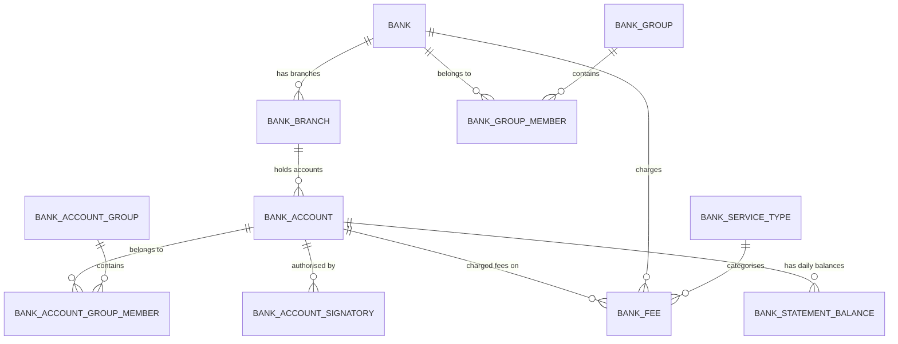

---

### Tables

#### `bank` — Reference | 14 rows

> One row represents a single banking counterparty (financial institution) with which the group holds accounts or transacts, identified by an internal code, BIC/SWIFT, and LEI.

**Columns:**

| Column | Type | Nullable | Description | Example Values / Boundaries |
|--------|------|----------|-------------|-----------------------------|
| uuid | VARCHAR(64) | Yes | Unique system-generated identifier for each bank record. | System UUID |
| code | VARCHAR(64) | Yes | Internal business code used to identify a bank. | `BANK_JPM`, `BANK_HSBC`, `BANK_CITI` |
| interface_code | VARCHAR(64) | Yes | System interface code used in external integrations; typically matches internal code. | `BANK_JPM` |
| external_code | VARCHAR(64) | Yes | External reference code assigned by a third-party system or counterparty. | Counterparty-specific code |
| description1 | VARCHAR(256) | Yes | Primary human-readable name of the bank. | `JPMorgan Chase`, `BNP Paribas` |
| description2 | VARCHAR(256) | Yes | Secondary or supplementary description providing additional naming detail. | Alternate legal name |
| bic | VARCHAR(16) | Yes | BIC/SWIFT code used internationally for payment routing. | `CHASUS33`, `MIDLGB22` |
| lei | VARCHAR(32) | Yes | Legal Entity Identifier for regulatory and compliance purposes. | 20-character alphanumeric LEI |
| url_address | VARCHAR(512) | Yes | Website URL for the bank's online portal. | `https://www.jpmorganchase.com` |
| contact | VARCHAR(256) | Yes | Contact information for the bank relationship. | Representative name or phone |
| intercompany | BOOLEAN | Yes | Flag: bank is an intercompany entity within the same corporate group. | `true` / `false` |
| internal_counterparty | BOOLEAN | Yes | Flag: bank is treated as an internal counterparty for treasury/dealing purposes. | `true` / `false` |
| counter_party_info | BOOLEAN | Yes | Flag: counterparty information is required or available for transactions. | `true` / `false` |
| intermediary_info | BOOLEAN | Yes | Flag: intermediary bank information is required for payments to this bank. | `true` / `false` |
| net_settlements | BOOLEAN | Yes | Flag: settlements are processed on a net rather than gross basis. | `true` / `false` |
| net_debit_and_credit_exposure | BOOLEAN | Yes | Flag: debit and credit exposures are netted when calculating total exposure. | `true` / `false` |
| cash_exposure_limit_amount | NUMERIC(28,6) | Yes | Maximum allowable cash exposure amount with this bank. | e.g. `500000000.000000` |
| cash_exposure_limit_currency | VARCHAR(16) | Yes | Currency of the cash exposure limit; currently USD across all records. | `USD` |
| cash_exposure_limit_pct | NUMERIC(9,4) | Yes | Maximum exposure as a percentage of a reference base. | e.g. `25.0000` |
| deal_identifier | VARCHAR(64) | Yes | Format or scheme used to identify deals with this bank counterparty. | Deal numbering convention |
| fx_confirmation_method | VARCHAR(64) | Yes | Method used to confirm FX transactions (e.g., electronic messaging, manual). | `SWIFT`, `EMAIL` |
| loan_confirmation_method | VARCHAR(64) | Yes | Method used to confirm loan transactions with this bank. | `SWIFT`, `FAX` |
| risk_tier_ref | VARCHAR(64) | Yes | Risk tier classification assigned to the bank. | `TIER_1`, `TIER_2`, `TIER_3` |
| parent_counterparty_ref | VARCHAR(64) | Yes | Reference to the parent counterparty, grouping subsidiaries under a common parent. | Parent bank code |
| default_group_ref | VARCHAR(64) | Yes | Reference to the default counterparty group for grouping or reporting. | Group code |
| third_party_ref | VARCHAR(64) | Yes | Reference to an associated third-party entity or system. | External reference |
| address | SUPER | Yes | Structured address details for the bank (JSON/semi-structured). | `{"street": "383 Madison Ave", "city": "New York"}` |
| user_zones | SUPER | Yes | User-defined zone or access control assignments (structured object). | Zone config object |

**Foreign Key Relationships:**

This table has no outbound FKs. It is referenced by `bank_branch.bank_ref`, `bank_fee.bank_ref`, and `bank_group_member.bank_code`.

---

#### `bank_branch` — Reference | 30 rows

> One row represents a single operational or legal branch of a bank in a specific country or city, holding the SWIFT/BIC code and processing cut-off time applicable to accounts at that branch.

**Columns:**

| Column | Type | Nullable | Description | Example Values / Boundaries |
|--------|------|----------|-------------|-----------------------------|
| uuid | VARCHAR(64) | Yes | Unique system-generated identifier for each bank branch record. | System UUID |
| code | VARCHAR(64) | Yes | Short alphanumeric code identifying a bank branch. | `BR_ANZ_SYD`, `BR_CITI_NY`, `BR_IHB_LDN` |
| interface_code | VARCHAR(64) | Yes | External-facing interface identifier; typically matches internal branch code. | `BR_ANZ_SYD` |
| bank_ref | VARCHAR(64) | Yes | Reference code identifying the parent bank institution. | `BANK_HSBC`, `BANK_JPM` |
| description | VARCHAR(256) | Yes | Human-readable name combining bank name and city location. | `Citi London`, `HSBC Hong Kong` |
| description2 | VARCHAR(256) | Yes | Secondary descriptive label; currently unpopulated. | (empty) |
| bic | VARCHAR(16) | Yes | BIC/SWIFT code identifying the branch in international transactions. | `CITIGB2L`, `BNPAFRPPXXX` |
| corp_id_code | VARCHAR(64) | Yes | Corporate identifier code assigned for corporate banking contexts. | Bank-assigned corp ID |
| account_location | VARCHAR(64) | Yes | Physical or operational location descriptor for accounts at this branch. | `NEW_YORK`, `LONDON` |
| time_zone | VARCHAR(64) | Yes | IANA time zone identifier for the branch's operating location. | `Europe/London`, `Asia/Singapore` |
| cut_off_time | VARCHAR(8) | Yes | Daily cut-off time (HH:MM) by which transactions must be submitted for same-day processing. | `16:00`, `17:30` |
| calendar_ref | VARCHAR(64) | Yes | Reference to the business day calendar used for settlement date calculations. | `STANDARD`, `US_FEDERAL` |
| intercompany | BOOLEAN | Yes | Flag: branch is used for intercompany transactions within the same corporate group. | `true` / `false` |
| intermediary | BOOLEAN | Yes | Flag: branch acts as an intermediary bank in payment routing. | `true` / `false` |
| main_country_branch | BOOLEAN | Yes | Flag: this is the primary branch for its country within the bank's network. | `true` / `false` |
| responder_code | VARCHAR(64) | Yes | Code identifying the system or entity designated to respond to queries for this branch. | System identifier |
| id_of_application | VARCHAR(64) | Yes | Identifier of the application or system associated with this branch for integration. | Application code |
| service_name | VARCHAR(128) | Yes | Name of the banking service or channel through which this branch processes transactions. | `SWIFT_FIN`, `HOST_TO_HOST` |
| interact_service_name | VARCHAR(128) | Yes | Name of the interactive or messaging service used for bank communications. | `SWIFT_INTERACT` |
| memo | VARCHAR(65535) | Yes | Free-text notes or remarks associated with the bank branch record. | Internal notes |
| address | SUPER | Yes | Structured JSON object containing the physical address of the bank branch. | `{"street": "1 Canada Square", "city": "London"}` |
| contact | SUPER | Yes | Structured JSON object containing contact details (phone, email) for the branch. | Contact details object |
| other_identifier | SUPER | Yes | Structured JSON object containing additional identifiers beyond primary code and BIC. | Additional identifiers |
| user_zone | SUPER | Yes | Structured JSON object containing user-defined configuration attributes. | Zone config object |
| country_code | VARCHAR(2) | Yes | ISO 2-letter country code for the branch's operating country. | `GB`, `US`, `SG` |
| region | VARCHAR(16) | Yes | Geographic region for the branch. | `EMEA`, `AMER`, `APAC` |

**Foreign Key Relationships:**

| Column | References | Join Meaning |
|--------|-----------|-------------|
| bank_ref | bank.code | Identifies which bank institution this branch belongs to |

---

#### `bank_account` — Reference | 116 rows

> One row represents a single bank account owned by a specific group legal entity, held at a specific bank branch, denominated in a single currency — the master record of the organisation's account inventory.

**Columns:**

| Column | Type | Nullable | Description | Example Values / Boundaries |
|--------|------|----------|-------------|-----------------------------|
| uuid | VARCHAR(64) | Yes | Universally unique identifier; primary key for each bank account record. | System UUID |
| code | VARCHAR(64) | Yes | Unique alphanumeric code identifying a bank account. | `GR_AE_COLLECTION_1`, `GR_AU_OPERATING_1`, `IHB_EUR_CONCENTRATION` |
| description | VARCHAR(256) | Yes | Human-readable label combining company entity and account purpose. | `GR_AE COLLECTION Account` |
| description2 | VARCHAR(256) | Yes | Secondary free-text description for additional labelling. | Supplementary notes |
| account_type | VARCHAR(32) | Yes | Classification of the account record type. | `BANK_ACCOUNT` |
| currency_ref | VARCHAR(16) | Yes | ISO 4217 currency code; native currency of the account. | `AED`, `AUD`, `EUR`, `USD` |
| company_ref | VARCHAR(64) | Yes | Code identifying the legal entity that owns the account. | `GR_AE`, `GR_AU`, `GR_TREASURY` |
| branch_ref | VARCHAR(64) | Yes | Code identifying the bank branch where the account is held. | `BR_IHB_LDN`, `BR_CITI_NY` |
| default_group_ref | VARCHAR(64) | Yes | Reference to the default grouping/pool for cash management purposes. | Pool or group code |
| bank_account_id | SUPER | Yes | Structured JSON storing one or more external bank-assigned account identifiers (IBAN, account number). | `{"IBAN": "GB29NWBK60161331926819"}` |
| bank_account_ids | SUPER | Yes | Structured JSON storing a collection of all external identifiers across payment schemes. | Multi-scheme identifier collection |
| address | SUPER | Yes | Structured JSON containing the postal address associated with the account. | Address object |
| contact | SUPER | Yes | Structured JSON containing contact details for the account relationship. | Contact object |
| calendar_ref | VARCHAR(64) | Yes | Reference to the business calendar for valid banking days. | `STANDARD` |
| time_zone | VARCHAR(64) | Yes | Time zone for cut-off time calculations and transaction processing. | `UTC`, `America/New_York` |
| cut_off_time | VARCHAR(8) | Yes | Daily deadline by which payment instructions must be submitted for same-day processing. | `15:00`, `16:30` |
| opening_date | DATE | Yes | Date on which the bank account was officially opened. | `2018-01-15` |
| closing_date | DATE | Yes | Date on which the account was or is scheduled to be closed. | `2024-12-31` (null if open) |
| closed_account | BOOLEAN | Yes | Flag: account has been closed and is no longer active. | `false` (default), `true` |
| hidden | BOOLEAN | Yes | Flag: account is hidden from standard views and reporting. | `false` (default) |
| non_resident | BOOLEAN | Yes | Flag: account held by a non-resident entity for regulatory/tax classification. | `false` (default) |
| bank_statement_layout | VARCHAR(64) | Yes | Identifier for the format/template used to parse incoming bank statement files. | `BAI2_STANDARD`, `MT940_HSBC` |
| integrate_end_of_day_statements | BOOLEAN | Yes | Flag: end-of-day statements are automatically imported and integrated. | `true` / `false` |
| integrate_intraday_statements | BOOLEAN | Yes | Flag: intraday statements are automatically imported and integrated. | `true` / `false` |
| consider_one_day_float_transactions | BOOLEAN | Yes | Flag: 1-day float transactions are included in cash position calculations. | `true` / `false` |
| consider_two_day_float_transactions | BOOLEAN | Yes | Flag: 2-day float transactions are included in cash position calculations. | `true` / `false` |
| consider_three_day_float_transactions | BOOLEAN | Yes | Flag: 3-day float transactions are included in cash position calculations. | `true` / `false` |
| consider_investment_position_transactions | BOOLEAN | Yes | Flag: investment position transactions are included in the cash position. | `true` / `false` |
| consider_bank_statements_from | DATE | Yes | Earliest date from which bank statements should be considered for reconciliation. | `2020-01-01` |
| zba_generator | BOOLEAN | Yes | Flag: this account is a master/header account that generates ZBA sweeps. | `true` / `false` |
| zba_identifier | VARCHAR(64) | Yes | Code identifying the account's role within a zero-balance accounting (ZBA) cash pooling structure. | ZBA pool code |
| generate_zba_flow | VARCHAR(64) | Yes | Configuration specifying the method/frequency for generating ZBA sweep flows. | `DAILY`, `INTRADAY` |
| settlement_account_ref | VARCHAR(64) | Yes | Reference to the account used for settling outgoing payment transactions. | Settlement account code |
| counterparty_settlement_account_ref | VARCHAR(64) | Yes | Reference to the counterparty settlement account. | Counterparty account code |
| chart_of_accounts_ref | VARCHAR(64) | Yes | Reference to the chart of accounts mapping for GL integration. | GL chart code |
| gl_account_ref | VARCHAR(64) | Yes | Reference to the general ledger account. | GL account code |
| internal_account_code | VARCHAR(64) | Yes | Internal account code for ERP or GL system mapping. | Internal code |
| include_in_gl_reconciliation | BOOLEAN | Yes | Flag: account is included in general ledger reconciliation. | `true` / `false` |
| initial_accounting_balance | NUMERIC(28,6) | Yes | Initial balance when the account was first set up in the system. | Opening balance amount |
| initial_accounting_balance_ccy | VARCHAR(16) | Yes | Currency of the initial accounting balance. | `EUR`, `USD` |
| initial_accounting_balance_date | DATE | Yes | Date of the initial accounting balance. | `2020-01-01` |
| interest_bearing | BOOLEAN | Yes | Flag: the account earns interest. | `true` / `false` |
| centrally_managed | BOOLEAN | Yes | Flag: the account is centrally managed by treasury rather than a local entity. | `true` / `false` |
| owner_name | VARCHAR(256) | Yes | Name of the individual or team responsible for managing the account. | Treasury manager name |
| reconciler_name | VARCHAR(256) | Yes | Name of the individual or team responsible for reconciling the account. | Reconciler name |
| account_available_for_payments | BOOLEAN | Yes | Flag: account is enabled for outgoing payment initiation. | `true` / `false` |
| domestic_transfer | VARCHAR(64) | Yes | Payment format/channel configured for domestic wire transfers from this account. | Format code |
| international_transfer | VARCHAR(64) | Yes | Payment format/channel configured for international wire transfers. | Format code |
| maturity_transfer | VARCHAR(64) | Yes | Payment format/channel for maturity-date transfers (e.g., investment rollovers). | Format code |
| domestic_direct_debit | VARCHAR(64) | Yes | Direct debit configuration for domestic collections. | Format code |
| international_direct_debit | VARCHAR(64) | Yes | Direct debit configuration for international collections. | Format code |
| payables_drafts | VARCHAR(64) | Yes | Configuration for payables drafts/cheques issued from this account. | Format code |
| receivables_drafts | VARCHAR(64) | Yes | Configuration for receivables drafts/cheques deposited to this account. | Format code |
| payment_reconciliation_options | SUPER | Yes | Structured JSON for payment reconciliation configuration options. | Config object |
| account_payment_instructions | SUPER | Yes | Structured JSON containing standard payment instructions for this account. | Payment instructions object |
| signatory_users | SUPER | Yes | Structured JSON snapshot of signatory users (denormalised reference). | Signatory list |
| establishments | SUPER | Yes | Structured JSON containing establishment/branch-level account details. | Establishment data |
| account_category1–10 | VARCHAR(64) | Yes | Up to 10 user-defined category fields for custom account segmentation/reporting. | Custom category codes |
| free_text1–3 | VARCHAR(256) | Yes | Free-text fields for additional account notes or labels. | Custom notes |
| free_amount1–3 | NUMERIC(28,6) | Yes | Free numeric fields for custom amounts associated with the account. | Custom amount values |
| memo | VARCHAR(65535) | Yes | Long-form free-text memo or notes field for the bank account. | Internal notes |
| user_zone | SUPER | Yes | Structured JSON for user-defined configuration attributes. | Zone config |
| account_purpose | VARCHAR(32) | Yes | Functional classification of the account's primary role. | `OPERATING`, `COLLECTION`, `PAYROLL`, `CONCENTRATION` |
| min_operating_balance | NUMERIC(28,6) | Yes | Minimum required operating balance that must be maintained in the account. | e.g. `10000.000000` |
| min_operating_balance_ccy | VARCHAR(16) | Yes | Currency of the minimum operating balance amount. | `USD`, `EUR` |

**Foreign Key Relationships:**

| Column | References | Join Meaning |
|--------|-----------|-------------|
| branch_ref | bank_branch.code | Links the account to the bank branch (and thus the parent bank) where it is held |
| company_ref | company.code | Identifies the group legal entity that owns this account |
| currency_ref | currency.code | Specifies the native denomination currency of the account |

---

#### `bank_account_group` — Reference | (no row_count)

> One row represents a single named grouping of bank accounts used to organise accounts for reporting, pooling, or operational purposes.

**Columns:**

| Column | Type | Nullable | Description | Example Values / Boundaries |
|--------|------|----------|-------------|-----------------------------|
| uuid | VARCHAR(64) | Yes | Universally unique identifier; primary key for each bank account group record. | System UUID |
| code | VARCHAR(64) | Yes | Short alphanumeric code identifying and referencing a bank account group. | `GRP_EUR_POOL`, `GRP_APAC_OPS` |
| description | VARCHAR(256) | Yes | Human-readable label or narrative describing the group's purpose. | `EUR Notional Pool`, `APAC Operating Accounts` |

**Foreign Key Relationships:**

This table has no outbound FKs. It is referenced by `bank_account_group_member.account_group_code`.

---

#### `bank_account_group_member` — Reference | (no row_count)

> One row represents the membership of a single bank account within a single bank account group (many-to-many bridge table).

**Columns:**

| Column | Type | Nullable | Description | Example Values / Boundaries |
|--------|------|----------|-------------|-----------------------------|
| account_group_code | VARCHAR(64) | Yes | The code identifying the bank account group to which the member belongs. | `GRP_EUR_POOL` |
| bank_account_code | VARCHAR(64) | Yes | The code identifying the individual bank account that is a member of the group. | `GR_DE_OPERATING_1` |

**Foreign Key Relationships:**

| Column | References | Join Meaning |
|--------|-----------|-------------|
| account_group_code | bank_account_group.code | Resolves which group this membership row belongs to |
| bank_account_code | bank_account.code | Resolves which account is the member |

---

#### `bank_account_signatory` — Reference | 440 rows

> One row represents a single signatory authorisation record defining which user or role can approve transactions on a specific bank account, up to a defined monetary limit.

**Columns:**

| Column | Type | Nullable | Description | Example Values / Boundaries |
|--------|------|----------|-------------|-----------------------------|
| uuid | VARCHAR(64) | Yes | Unique system-generated identifier for each signatory record. | System UUID |
| bank_account_ref | VARCHAR(64) | Yes | Business code of the bank account to which signatory authority is assigned. | `GR_JP_OPERATING_1`, `GR_GB_PAYROLL_1` |
| user_ref | VARCHAR(64) | Yes | Business role or user identifier granted signatory authority. | `CFO_GLOBAL`, `CASH_MANAGER_EMEA`, `RELEASER_APAC` |
| role | VARCHAR(32) | Yes | Signatory role indicating level of authorisation in the payment approval workflow. | `SIGNER_A`, `SIGNER_B`, `RELEASER` |
| authority_limit_amount | NUMERIC(28,6) | Yes | Maximum monetary amount the signatory is authorised to approve. | `500000.000000`, `5000000.000000` |
| authority_limit_currency | VARCHAR(16) | Yes | ISO currency code in which the authority limit is denominated. | `EUR`, `USD`, `JPY` |
| granted_date | DATE | Yes | Date on which signatory authority was formally granted. | `2021-03-15` |
| last_recertified_date | DATE | Yes | Most recent date the signatory authority was reviewed and confirmed. | `2024-01-10` |
| next_recertify_due_date | DATE | Yes | Upcoming date by which authority must be recertified to remain valid. | `2025-01-10` |
| status | VARCHAR(16) | Yes | Current status of the signatory authority record. | `ACTIVE` |

**Foreign Key Relationships:**

| Column | References | Join Meaning |
|--------|-----------|-------------|
| bank_account_ref | bank_account.code | Links the authority record to its bank account |
| user_ref | app_user.code | Links the authority record to the user or role granted signing rights |

---

#### `bank_fee` — Event | 12,597 rows

> One row represents a single fee line item charged by a bank against a specific account for a specific banking service during a monthly statement period.

**Columns:**

| Column | Type | Nullable | Description | Example Values / Boundaries |
|--------|------|----------|-------------|-----------------------------|
| uuid | VARCHAR(64) | Yes | Unique system-generated identifier for each bank fee record. | System UUID |
| bank_ref | VARCHAR(64) | Yes | Code identifying the bank that charged the fee. | `BANK_HSBC`, `BANK_JPM`, `BANK_CITI` |
| bank_account_ref | VARCHAR(64) | Yes | Code identifying the specific account charged. | `GR_GB_OPERATING_1`, `GR_FR_COLLECTION_1` |
| service_code | VARCHAR(64) | Yes | Numeric/alphanumeric code identifying the banking service type. | `100` (Account Maintenance), `200` (Wire Out) |
| statement_period | DATE | Yes | Last day of the monthly billing period covered by the fee statement. | `2024-07-31` (represents July 2024) |
| charge_date | DATE | Yes | Actual date on which the fee was debited from the account. | `2024-08-05` |
| units | NUMERIC(18,4) | Yes | Number of service units consumed (e.g., transaction count) on which the fee is based. | `142.0000` transactions |
| charged_amount | NUMERIC(28,6) | Yes | Actual monetary amount charged by the bank for the service. | `1250.500000` |
| currency_code | VARCHAR(16) | Yes | ISO currency code in which all fee amounts are expressed; currently always USD. | `USD` |
| cash_flow_ref | VARCHAR(64) | Yes | Unique identifier linking the fee to its corresponding cash flow record for reconciliation. | Cash flow UUID |
| rate_card_ref | VARCHAR(64) | Yes | Identifier of the negotiated rate card used to calculate the expected fee. | Rate card code |
| expected_amount | NUMERIC(28,6) | Yes | Fee amount expected based on the negotiated rate card; benchmark for comparison. | `1200.000000` |
| overage_amount | NUMERIC(28,6) | Yes | Difference between actual charged amount and expected amount (overcharge). | `50.500000` |
| flagged | BOOLEAN | Yes | Flag marking the fee record as requiring review due to a discrepancy or anomaly. | `false` (default), `true` |

**Foreign Key Relationships:**

| Column | References | Join Meaning |
|--------|-----------|-------------|
| bank_account_ref | bank_account.code | Links the fee charge to the account it was charged against |
| bank_ref | bank.code | Links the fee charge to the bank that levied it |
| service_code | bank_service_type.code | Resolves the fee category and service description |

---

#### `bank_group` — Reference | (no row_count)

> One row represents a single named grouping of banks used for organisational or analytical purposes within the liquidity and payments platform.

**Columns:**

| Column | Type | Nullable | Description | Example Values / Boundaries |
|--------|------|----------|-------------|-----------------------------|
| uuid | VARCHAR(64) | Yes | Universally unique identifier; primary key for each bank group record. | System UUID |
| code | VARCHAR(64) | Yes | Short alphanumeric code uniquely identifying and referencing the bank group. | `GRP_TIER1_BANKS`, `GRP_STRATEGIC` |
| description | VARCHAR(256) | Yes | Human-readable name or description providing the full label of the bank group. | `Tier 1 Strategic Banks`, `Core Relationship Banks` |

**Foreign Key Relationships:**

This table has no outbound FKs. It is referenced by `bank_group_member.bank_group_code`.

---

#### `bank_group_member` — Reference | (no row_count)

> One row represents the membership of a single bank within a single bank group (many-to-many bridge table).

**Columns:**

| Column | Type | Nullable | Description | Example Values / Boundaries |
|--------|------|----------|-------------|-----------------------------|
| bank_group_code | VARCHAR(64) | Yes | Code identifying the bank group to which the member bank belongs. | `GRP_TIER1_BANKS` |
| bank_code | VARCHAR(64) | Yes | Code identifying the individual bank that is a member of the bank group. | `BANK_HSBC`, `BANK_JPM` |

**Foreign Key Relationships:**

| Column | References | Join Meaning |
|--------|-----------|-------------|
| bank_group_code | bank_group.code | Resolves which group this membership row belongs to |
| bank_code | bank.code | Resolves which bank is the member |

---

#### `bank_service_type` — Reference | 25 rows

> One row represents a single banking service type in the catalogue of services that can be charged or tracked (e.g., Wire Out Domestic, ACH Credit, Account Maintenance).

**Columns:**

| Column | Type | Nullable | Description | Example Values / Boundaries |
|--------|------|----------|-------------|-----------------------------|
| code | VARCHAR(64) | Yes | Unique identifier assigned to each bank service type. | `100` (Account Maintenance), `AAA` (specialised services) |
| description | VARCHAR(256) | Yes | Human-readable name of the bank service. | `Wire Out Domestic`, `ACH Credit`, `Positive Pay Service`, `SEPA Credit Transfer` |
| category | VARCHAR(64) | Yes | Broad functional grouping of the service type. | `WIRE_OUT`, `ACH`, `FX`, `CASH_VAULT`, `ACCOUNT_MAINTENANCE` |

**Foreign Key Relationships:**

This table has no outbound FKs. It is referenced by `bank_fee.service_code`.

---

#### `bank_statement_balance` — Snapshot | 317,390 rows

> One row represents the reported balance of a specific bank account on a specific date for a specific balance type (opening, closing, or intraday), sourced from BAI-format bank statement feeds.

**Columns:**

| Column | Type | Nullable | Description | Example Values / Boundaries |
|--------|------|----------|-------------|-----------------------------|
| uuid | VARCHAR(64) | Yes | Universally unique identifier for deduplication and audit purposes (not part of PK). | System UUID |
| account_ref | VARCHAR(64) | Yes | Business code of the bank account for which the balance is reported. | `GR_AU_OPERATING_1`, `IHB_EUR_CONCENTRATION` |
| statement_date | DATE | Yes | Calendar date for which the balance is reported. | `2024-07-31` |
| balance_type | VARCHAR(16) | Yes | Whether the balance is the opening, closing, or intraday position for the statement date. | `OPENING`, `CLOSING`, `INTRADAY` |
| amount | NUMERIC(28,6) | Yes | Monetary balance of the account in its native currency. | `12500000.000000` |
| currency_code | VARCHAR(16) | Yes | ISO 4217 three-letter currency code in which the balance is denominated. | `AUD`, `EUR`, `USD` |
| source_file | VARCHAR(256) | Yes | Name of the BAI-format bank feed file from which this balance record was ingested. | `BAI2_HSBC_20240731.txt` |
| quality_status | VARCHAR(16) | Yes | Whether the balance record passed or failed automated data quality validation checks. | `VALID`, `FAILED` |

**Foreign Key Relationships:**

| Column | References | Join Meaning |
|--------|-----------|-------------|
| account_ref | bank_account.code | Links each daily balance record to its bank account master record |

---

### KPIs Computable from This Sub-domain

| KPI | Formula / Method | Tables Required |
|-----|-----------------|----------------|
| Total bank fees by bank (monthly) | `SUM(charged_amount) GROUP BY bank_ref, DATE_TRUNC('month', statement_period)` | `bank_fee` |
| Fee overage rate by account | `SUM(overage_amount) / SUM(expected_amount) * 100` grouped by `bank_account_ref` | `bank_fee` |
| Flagged fee count by bank | `COUNT(*) WHERE flagged = true GROUP BY bank_ref` | `bank_fee` |
| Closing balance trend by account | `SELECT account_ref, statement_date, amount WHERE balance_type = 'CLOSING' ORDER BY statement_date` | `bank_statement_balance` |
| Number of active accounts by company | `COUNT(*) WHERE closed_account = false GROUP BY company_ref` | `bank_account` |
| Accounts with expiring signatory recertification | `SELECT bank_account_ref, user_ref WHERE next_recertify_due_date <= CURRENT_DATE + 30` | `bank_account_signatory` |
| Fee spend by service category (annual) | `SUM(bf.charged_amount) GROUP BY bst.category, YEAR(bf.statement_period)` after joining | `bank_fee`, `bank_service_type` |
| Bank counterparty concentration (cash exposure vs. limit) | `SUM(bsb.amount) WHERE balance_type = 'CLOSING'` compared to `bank.cash_exposure_limit_amount` | `bank_statement_balance`, `bank_account`, `bank_branch`, `bank` |

---

### Common BA Questions

**Q: How do I find all bank accounts for a specific company?**
Use: `bank_account` filtered by `company_ref = 'GR_AU'`. Join `bank_branch` on `branch_ref = bank_branch.code`, then `bank` on `bank_branch.bank_ref = bank.code` to retrieve full bank details. Filter `closed_account = false` to restrict to active accounts only.

**Q: How do I identify which bank issued a specific set of fees last month?**
Use: `bank_fee` filtered by `statement_period = '2024-06-30'`. Join `bank` on `bank_ref = bank.code` for bank name. Join `bank_service_type` on `service_code = bank_service_type.code` to get the service category and description.

**Q: How do I find accounts where fees exceeded the negotiated rate card?**
Use: `bank_fee` where `overage_amount > 0` OR `flagged = true`. Group by `bank_account_ref` and `bank_ref` to see which accounts and banks have recurring overcharges. Sort by `overage_amount DESC` to prioritise investigations.

**Q: How do I get the daily closing balance for all accounts in a given currency?**
Use: `bank_statement_balance` joined to `bank_account` on `account_ref = bank_account.code`, then filter `balance_type = 'CLOSING'` and `bank_account.currency_ref = 'EUR'`. Order by `statement_date` to produce a time series.

**Q: How do I identify signatories whose authority is due for recertification?**
Use: `bank_account_signatory` where `next_recertify_due_date <= CURRENT_DATE + 30` AND `status = 'ACTIVE'`. Join `bank_account` on `bank_account_ref = bank_account.code` to identify which accounts are at risk.

**Q: How do I find all accounts in a specific bank group?**
Use: `bank_group_member` where `bank_group_code = 'GRP_TIER1_BANKS'`, then join `bank_branch` on `bank_code = bank_ref` and `bank_account` on `branch_ref = bank_branch.code`.

**Q: How do I check which accounts are ZBA generators (cash pool header accounts)?**
Use: `bank_account` where `zba_generator = true`. The `zba_identifier` field identifies the pool structure; accounts sharing the same `zba_identifier` are part of the same zero-balance cash pool.

**Q: How do I determine the full bank hierarchy for a given account code?**
Start from `bank_account`, retrieve `branch_ref`. Join `bank_branch` to get the branch details and `bank_ref`. Join `bank` to get the full bank counterparty record including BIC and risk tier. This gives you the three-level hierarchy: account → branch → bank.

---

## Sub-domain 2: Payments & Transfers

### Overview

The Payments & Transfers sub-domain records the lifecycle of outgoing payment instructions — from the batch file submitted to the bank, through to individual transaction execution and any exceptions or failures encountered along the way. For a Business Analyst new to treasury, the key conceptual shift is understanding that a corporate treasury does not send individual payments directly to a bank; instead, it batches them into payment files (ISO pain.001 XML format) and submits the files through a payment hub. This sub-domain models that entire pipeline.

The central chain in this sub-domain is: **payment_file → payment_transaction / transfer**. A payment file is a batch container holding one or more individual payment instructions for a specific company and bank account, submitted on a given day. Each line item in the file is both a `payment_transaction` record (the payment-rail-level execution detail, including status and acknowledgement codes) and a `transfer` record (the business-level view of the instruction, including remittance references and the value date). These two tables have near-identical row counts (177,898 each), indicating a close to one-to-one correspondence between the TMS transfer view and the payment network transaction view.

Three specialised extensions build on this core. **ACH returns** capture the subset of ACH payments that were initiated but subsequently returned by the receiving bank, with NACHA return reason codes (e.g., R01 for insufficient funds) and a resolution flag. **Payment exceptions** capture processing failures detected during file submission or routing — covering bank validation failures, format errors, OFAC compliance holds, and duplicate detection — and track resolution times and costs. **Cross-border payment legs** capture the FX conversion and correspondent banking details for international payments, recording send and receive currencies, applied FX rates, FX spread in basis points, and lifting/correspondent fees per leg. **Intercompany transactions** are a separate but related concept: internal fund movements between group legal entities routed via the in-house bank, used for purposes such as funding, cash pooling, dividends, and intercompany loans. Finally, **payment_hub_throughput** provides daily aggregate metrics (volume, value, STP rate) per payment rail, serving as an operational dashboard for the payment hub.

A key concept for BAs is the **payment rail**: the network or clearing mechanism used to execute a payment. Common rails in this data include WIRE (domestic and international), ACH (US batch), SEPA CT (European credit transfer), and RTP (real-time payments). The `payment_rail` field appears in `transfer`, `payment_transaction`, `payment_hub_throughput`, and `cross_border_payment_leg`, allowing analysis by rail type across the full payment stack.

---

### Key Business Entities

- **Payment File**: A batch payment submission file (ISO pain.001 XML) sent to a bank on behalf of a legal entity, containing one or more individual payment instructions. The parent record for all payments in a batch.
- **Payment Transaction**: The payment-network-level execution record for each instruction in a file, capturing the bank's acknowledgement/rejection response, amount, currency, and payment rail.
- **Transfer**: The business-level record of each outgoing payment instruction, including remittance references, value date, and the link back to the payment file.
- **ACH Return**: A record of an ACH payment that was initiated but returned by the receiving bank, with a standardised NACHA return reason code and resolution status.
- **Payment Exception**: A record of a processing anomaly detected during file or transfer processing (e.g., OFAC hold, duplicate detection, bank validation failure), tracking resolution time and cost.
- **Payment Hub Throughput**: Daily aggregate operational metrics per payment rail — volume count, value, success/rejection/repair counts, and straight-through processing (STP) rate.
- **Cross-Border Payment Leg**: The FX conversion and correspondent banking detail for each international payment, capturing send/receive currencies, FX rate, spread, and all fees.
- **Intercompany Transaction**: An internal fund movement between two group legal entities (source and target) routed via the in-house bank, covering purposes such as funding, cash pooling, and dividends.

---

### Entity Relationship Diagram

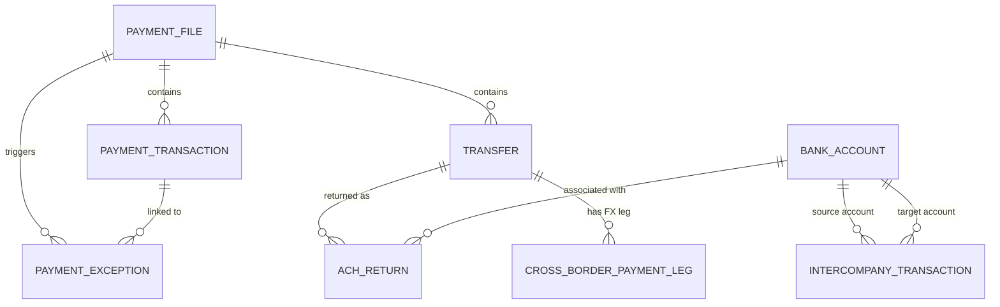

---

### Tables

#### `payment_file` — Event | 17,003 rows

> One row represents a single ISO pain.001 XML batch payment file submitted to a bank by a specific legal entity from a designated account, capturing the submission status and aggregate transaction totals.

**Columns:**

| Column | Type | Nullable | Description | Example Values / Boundaries |
|--------|------|----------|-------------|-----------------------------|
| file_uuid | VARCHAR(64) | Yes | Unique system-generated identifier for each payment file record; primary key. | System UUID |
| file_name | VARCHAR(256) | Yes | Name of the ISO pain.001 XML payment file, following the naming convention `pain001-{account}-{YYYYMMDD}.xml`. | `pain001-GR_GB_OPERATING_1-20240715.xml` |
| company_ref | VARCHAR(64) | Yes | Code identifying the legal entity or subsidiary that owns the payment file. | `GR_US_INC`, `GR_TREASURY`, `GR_DE` |
| account_ref | VARCHAR(64) | Yes | Code identifying the specific bank account from which the file was originated. | `GR_GB_OPERATING_1`, `GR_US_PAYROLL_1` |
| status | VARCHAR(32) | Yes | Current processing status of the payment file. | `SENT`, `ACKNOWLEDGED`, `NEGATIVELY_ACKNOWLEDGED` |
| routing_status | VARCHAR(32) | Yes | Status of the routing process through the payment infrastructure. | `COMPLETED`, `IN_PROGRESS` |
| total_count | INTEGER | Yes | Total number of individual payment transactions included within the file. | `1`, `250`, `1000` |
| total_amount | NUMERIC(28,6) | Yes | Aggregate monetary value of all payment transactions in the file. | `15000000.000000` |
| total_currency | VARCHAR(16) | Yes | ISO 4217 currency code in which the total amount is denominated. | `EUR`, `USD`, `GBP` |
| created_at | TIMESTAMP WITH TIME ZONE | Yes | Timestamp when the payment file record was first created. | `2024-07-15T08:30:00Z` |
| updated_at | TIMESTAMP WITH TIME ZONE | Yes | Timestamp of the most recent update (status change or correction). | `2024-07-15T09:15:00Z` |

**Foreign Key Relationships:**

| Column | References | Join Meaning |
|--------|-----------|-------------|
| company_ref | company.code | Identifies which group legal entity submitted this payment file |

---

#### `payment_transaction` — Event | 177,898 rows

> One row represents a single individual payment transaction contained within a payment file, capturing the full execution lifecycle at the payment-network level including acknowledgement status and rejection reason codes.

**Columns:**

| Column | Type | Nullable | Description | Example Values / Boundaries |
|--------|------|----------|-------------|-----------------------------|
| uuid | VARCHAR(64) | Yes | Unique system-generated identifier for each payment transaction record; primary key. | System UUID |
| file_uuid | VARCHAR(64) | Yes | Identifier of the parent payment file containing this transaction. | Parent `payment_file.file_uuid` |
| end_to_end_id | VARCHAR(64) | Yes | Industry-standard end-to-end reference tracking the payment across all parties and systems. | `E2E-0000006423` |
| transaction_date | DATE | Yes | Business date on which the payment transaction was initiated or value-dated. | `2024-07-15` |
| execution_date | DATE | Yes | Date on which the payment was actually processed or settled by the bank or payment rail. | `2024-07-17` |
| status | VARCHAR(32) | Yes | Processing outcome of the payment transaction. | `SETTLED`, `REJECTED`, `PENDING` |
| reason_code | VARCHAR(32) | Yes | Standardised rejection reason code when a payment is not successfully processed. | `AC03` (invalid creditor account number) |
| amount | NUMERIC(28,6) | Yes | Monetary value of the payment transaction. | `50000.000000` |
| currency_code | VARCHAR(16) | Yes | ISO 4217 three-letter currency code in which the amount is denominated. | `EUR`, `USD`, `GBP` |
| issuer_name | VARCHAR(256) | Yes | Internal legal entity that is the originator/payer of the payment. | `GR_FR`, `GR_US_INC` |
| issuer_account | VARCHAR(64) | Yes | Internal bank account of the issuing entity from which the payment was debited. | `GR_AU_OPERATING_1` |
| counterparty_name | VARCHAR(256) | Yes | Name or category of the external party receiving the payment. | `Vendor`, `Payroll Provider`, `Tax Authority`, `Landlord Holdings` |
| counterparty_account | VARCHAR(64) | Yes | Account identifier of the external payment recipient. | `TP_CAPEX_0001`, `TP_IT_0004` |
| reference | VARCHAR(128) | Yes | Human-readable payment reference identifying the business purpose or source document. | `AP-00055555`, `RENT-GR_DE_OP_2-202305`, `TAX-2024Q2` |
| last_ack_time | TIMESTAMP WITH TIME ZONE | Yes | Timestamp of the most recent acknowledgement received from the payment network. | `2024-07-15T14:30:00Z` |
| payment_rail | VARCHAR(16) | Yes | Payment network or method used to process the transaction. | `WIRE`, `SEPA_CT`, `ACH`, `RTP` |

**Foreign Key Relationships:**

| Column | References | Join Meaning |
|--------|-----------|-------------|
| file_uuid | payment_file.file_uuid | Links each transaction to its parent batch payment file |

---

#### `transfer` — Event | 177,898 rows

> One row represents a single outbound payment transfer instruction submitted via ISO pain.001 XML to a bank, capturing the business-level view with remittance references, value date, acknowledgement details, and payment rail.

**Columns:**

| Column | Type | Nullable | Description | Example Values / Boundaries |
|--------|------|----------|-------------|-----------------------------|
| uuid | VARCHAR(64) | Yes | Unique system-generated identifier for each transfer record; primary key. | System UUID |
| transaction_number | VARCHAR(64) | Yes | Human-readable transaction reference number assigned to each transfer. | `TX-0000001234`, `TX-0000056789` |
| reference | VARCHAR(128) | Yes | Business reference code identifying the source obligation (AP invoice, rent, tax). | `AP-00055555`, `RENT-GR_DE_OP_2-202305` |
| file_uuid | VARCHAR(64) | Yes | Unique identifier of the payment file that contained this transfer instruction. | Parent `payment_file.file_uuid` |
| file_name | VARCHAR(256) | Yes | Name of the ISO pain.001 XML payment initiation file that submitted this transfer. | `pain001-GR_GB_OPERATING_1-20240715.xml` |
| status | VARCHAR(32) | Yes | Overall processing status indicating acknowledgement, negative acknowledgement, or rejection. | `ACKNOWLEDGED`, `NACK`, `REJECTED` |
| next_action | VARCHAR(64) | Yes | Recommended or required next action to be taken after the current status is set. | `REPAIR`, `CANCEL`, `RESUBMIT` |
| ack_status | VARCHAR(32) | Yes | Detailed acknowledgement status returned by the payment network. | `ACCEPTED_IN_PROCESS`, `REJECTED`, `NACK` |
| ack_code | VARCHAR(32) | Yes | ISO standard reason code accompanying a negative acknowledgement or rejection. | `DUPL` (duplicate payment), `AC03` (invalid account) |
| ack_message | VARCHAR(512) | Yes | Human-readable description of the acknowledgement outcome. | `Payment accepted for processing`, `Invalid creditor account` |
| last_ack_time | TIMESTAMP WITH TIME ZONE | Yes | Timestamp of the most recent acknowledgement received for this transfer. | `2024-07-15T14:30:00Z` |
| remittance_identifier1 | VARCHAR(128) | Yes | Primary remittance reference linking the transfer to the underlying obligation. | Invoice number, rent reference, tax ID |
| remittance_identifier2 | VARCHAR(128) | Yes | Secondary remittance reference for additional reconciliation information. | Supplementary reference |
| remittance | SUPER | Yes | Structured remittance information payload (semi-structured document). | Remittance advice object |
| remittance2 | SUPER | Yes | Secondary structured remittance information payload. | Additional remittance advice |
| repository | SUPER | Yes | Supplementary data or metadata associated with the transfer (semi-structured). | Metadata object |
| payment_rail | VARCHAR(16) | Yes | Payment network or clearing mechanism used to execute the transfer. | `WIRE`, `SEPA_CT`, `ACH`, `RTP` |
| amount | NUMERIC(28,6) | Yes | Monetary value of the transfer in the specified currency. | `75000.000000` |
| currency_code | VARCHAR(16) | Yes | ISO 4217 three-letter currency code in which the transfer amount is denominated. | `EUR`, `USD`, `GBP` |
| value_date | DATE | Yes | Scheduled date on which funds are expected to be settled or made available to the beneficiary. | `2024-07-17` |

**Foreign Key Relationships:**

| Column | References | Join Meaning |
|--------|-----------|-------------|
| file_uuid | payment_file.file_uuid | Links each transfer to its parent batch payment file |
| file_uuid | webhook_event.entity_code | Links to webhook event tracking for real-time status updates |

---

#### `ach_return` — Event | 417 rows

> One row represents a single ACH payment return event — an ACH transaction that was successfully initiated but subsequently returned by the receiving bank, identified by a NACHA return reason code.

**Columns:**

| Column | Type | Nullable | Description | Example Values / Boundaries |
|--------|------|----------|-------------|-----------------------------|
| uuid | VARCHAR(64) | Yes | Unique system-generated identifier for each ACH return record; primary key. | System UUID |
| original_transfer_ref | VARCHAR(64) | Yes | Reference identifier of the original ACH transfer that was returned. | Transfer UUID or reference |
| company_ref | VARCHAR(64) | Yes | Code identifying the legal entity that owns the returned ACH transaction. | `GR_US_INC`, `GR_TREASURY` |
| business_unit_code | VARCHAR(32) | Yes | Code identifying the business unit responsible for the returned transaction. | `BU_TREAS`, `BU_US_IN` |
| return_date | DATE | Yes | Calendar date on which the ACH return was received or processed. | `2024-07-18` |
| return_reason_code | VARCHAR(8) | Yes | Standardised NACHA return reason code indicating why the transaction was returned. | `R01` (insufficient funds), `R29` (not authorized), `R02` (account closed) |
| return_category | VARCHAR(32) | Yes | Business grouping of the return reason. | `INSUFFICIENT_FUNDS`, `INVALID_ACCOUNT`, `UNAUTHORIZED`, `OTHER` |
| direction | VARCHAR(8) | Yes | Flow direction of the returned ACH transaction; currently only debit returns are recorded. | `DEBIT` |
| amount | NUMERIC(28,6) | Yes | Monetary value of the returned ACH transaction in the transaction's currency. | `2500.000000` |
| currency_code | VARCHAR(16) | Yes | ISO 4217 currency code of the returned transaction. | `USD` |
| bank_account_ref | VARCHAR(64) | Yes | Reference code identifying the specific bank account associated with the returned transaction. | `GR_CA_PAYROLL_1`, `IHB_AUD_CONCENTRATION` |
| resolved | BOOLEAN | Yes | Flag indicating whether the ACH return has been resolved or actioned by operations. | `false` (default), `true` |

**Foreign Key Relationships:**

| Column | References | Join Meaning |
|--------|-----------|-------------|
| bank_account_ref | bank_account.code | Links the return to the internal account from which the original ACH was initiated |
| company_ref | company.code | Links the return to the originating legal entity |
| original_transfer_ref | transfer.uuid | Links the return event back to the original payment transfer instruction |

---

#### `payment_exception` — Event | 3,560 rows

> One row represents a single payment exception — a processing anomaly detected during payment file or transfer processing — tracking the exception type, resolution time, repair cost, and responsible user role.

**Columns:**

| Column | Type | Nullable | Description | Example Values / Boundaries |
|--------|------|----------|-------------|-----------------------------|
| uuid | VARCHAR(64) | Yes | Unique identifier for each payment exception record; primary key. | System UUID |
| file_uuid | VARCHAR(64) | Yes | Unique identifier of the payment file associated with this exception. | Parent `payment_file.file_uuid` |
| transfer_uuid | VARCHAR(64) | Yes | Unique identifier of the payment transfer transaction linked to this exception. | `payment_transaction.uuid` |
| exception_type | VARCHAR(32) | Yes | Category of the exception indicating the root cause. | `BANK_VALIDATION_FAILURE`, `FILE_FORMAT_ERROR`, `BENEFICIARY_DATA_ISSUE`, `DUPLICATE_PAYMENT`, `OFAC_COMPLIANCE_HOLD` |
| detected_at | TIMESTAMP WITH TIME ZONE | Yes | Timestamp when the exception was first detected. | `2024-07-15T09:05:00Z` |
| resolved_at | TIMESTAMP WITH TIME ZONE | Yes | Timestamp when the exception was resolved and closed. | `2024-07-15T10:45:00Z` |
| resolution_time_minutes | INTEGER | Yes | Total elapsed time in minutes between detection and resolution. | `30` to `120` minutes |
| resolved_by_user | VARCHAR(64) | Yes | Role or user group responsible for resolving the exception. | `REGIONAL_CASH_MANAGER`, `AP_LEAD_EMEA` |
| resolution_action | VARCHAR(64) | Yes | Action taken to resolve the exception. | `AUTOMATED_REPAIR`, `MANUAL_CORRECTION` |
| repair_touch_count | SMALLINT | Yes | Number of manual or automated intervention attempts required to repair the exception. | `1`, `2`, `3` |
| repair_cost_amount | NUMERIC(28,6) | Yes | Monetary cost incurred to repair or resolve the exception. | `150.000000` |
| status | VARCHAR(16) | Yes | Current lifecycle status of the exception. | `RESOLVED`, `OPEN`, `IN_PROGRESS` |

**Foreign Key Relationships:**

| Column | References | Join Meaning |
|--------|-----------|-------------|
| file_uuid | payment_file.file_uuid | Links the exception to the payment file in which it was detected |
| transfer_uuid | payment_transaction.uuid | Links the exception to the specific payment transaction that triggered it |

---

#### `payment_hub_throughput` — Snapshot | 2,915 rows

> One row represents aggregated daily operational metrics for a specific payment rail on a specific calendar date, as processed through the payment hub — capturing volume, value, STP rate, and error counts.

**Columns:**

| Column | Type | Nullable | Description | Example Values / Boundaries |
|--------|------|----------|-------------|-----------------------------|
| uuid | VARCHAR(64) | Yes | Unique identifier for each throughput record; primary key. | System UUID |
| metric_date | DATE | Yes | Calendar date for which the payment throughput metrics were captured. | `2024-07-15` |
| payment_rail | VARCHAR(16) | Yes | Payment network or rail over which the transactions were processed. | `ACH`, `WIRE`, `RTP`, `SEPA_CT` |
| country | VARCHAR(2) | Yes | Country in which the payment transactions were originated or processed. | `US`, `DE`, `GB` |
| originating_system | VARCHAR(32) | Yes | Source system that originated or submitted the payment transactions. | `KYRIBA_PAYMENT_HUB` |
| volume_count | INTEGER | Yes | Total number of payment transactions submitted for processing on the metric date. | `1250` |
| value_amount | NUMERIC(28,6) | Yes | Total monetary value of all payment transactions processed on the metric date. | `45000000.000000` |
| success_count | INTEGER | Yes | Number of transactions successfully processed. | `1235` |
| rejection_count | INTEGER | Yes | Number of transactions rejected or failed. | `10` |
| repair_count | INTEGER | Yes | Number of transactions requiring manual repair or intervention. | `5` |
| stp_rate_pct | NUMERIC(6,3) | Yes | Straight-through processing rate as a percentage — share processed without manual intervention. | `98.800`, `99.500` |

**Foreign Key Relationships:**

| Column | References | Join Meaning |
|--------|-----------|-------------|
| payment_rail | cash_flow.payment_rail | Links throughput records to the payment rail dimension used across the cash flow model |

---

#### `cross_border_payment_leg` — Event | 17,962 rows

> One row represents a single leg of a cross-border payment transaction, capturing the origination and destination countries, currencies, FX conversion details (rate, spread), and all fees charged by originating and correspondent banks.

**Columns:**

| Column | Type | Nullable | Description | Example Values / Boundaries |
|--------|------|----------|-------------|-----------------------------|
| uuid | VARCHAR(64) | Yes | Unique identifier for each cross-border payment leg record; primary key. | System UUID |
| transfer_uuid | VARCHAR(64) | Yes | Identifier of the parent transfer that this payment leg belongs to. | Parent `transfer.uuid` |
| payment_transaction_uuid | VARCHAR(64) | Yes | Identifier linking this leg to an associated payment transaction. | `payment_transaction.uuid` |
| origination_country | VARCHAR(2) | Yes | ISO country code of the country from which the payment originates. | `US`, `DE`, `AE` |
| destination_country | VARCHAR(2) | Yes | ISO country code of the country where the payment is being received. | `SG`, `IN`, `CA` |
| send_currency | VARCHAR(16) | Yes | ISO 4217 currency code in which the sender initiates the payment. | `USD`, `EUR`, `GBP` |
| receive_currency | VARCHAR(16) | Yes | ISO 4217 currency code in which the recipient receives the payment after conversion. | `INR`, `SGD`, `CAD` |
| corridor | VARCHAR(16) | Yes | Named payment corridor representing the origin-to-destination route. | `US-EU`, `EU-APAC`, `AMER-APAC` |
| send_amount | NUMERIC(28,6) | Yes | Monetary amount sent by the originator in the send currency. | `100000.000000` |
| receive_amount | NUMERIC(28,6) | Yes | Monetary amount received by the beneficiary in the receive currency after conversion. | `132500.000000` (in CAD) |
| fx_rate_applied | NUMERIC(20,10) | Yes | Foreign exchange rate used to convert send currency to receive currency. | `1.3250000000` (USD/CAD) |
| fx_spread_bps | NUMERIC(9,2) | Yes | FX spread charged on this payment leg, expressed in basis points. | `41.00`, `75.00` |
| lifting_fees | NUMERIC(28,6) | Yes | Fees charged by the initiating institution to process and lift the payment. | `25.000000`, `50.000000` |
| correspondent_fees | NUMERIC(28,6) | Yes | Fees charged by correspondent or intermediary banks in the routing chain. | `10.000000`, `35.000000` |
| payment_method | VARCHAR(16) | Yes | Payment rail or method used to execute this cross-border leg. | `WIRE`, `ACH`, `SEPA_CT`, `RTP` |
| initiated_at | TIMESTAMP WITH TIME ZONE | Yes | Timestamp when this cross-border payment leg was initiated. | `2024-07-15T10:00:00Z` |
| delivered_at | TIMESTAMP WITH TIME ZONE | Yes | Timestamp when the payment leg was successfully delivered to the beneficiary. | `2024-07-16T08:30:00Z` |

**Foreign Key Relationships:**

| Column | References | Join Meaning |
|--------|-----------|-------------|
| receive_currency | currency.code | Validates/resolves the receive-side currency |
| send_currency | currency.code | Validates/resolves the send-side currency |

---

#### `intercompany_transaction` — Event | 628 rows

> One row represents a single financial transaction between two group legal entities routed through the in-house bank, covering purposes such as funding, cash pooling, loans, dividends, and royalties.

**Columns:**

| Column | Type | Nullable | Description | Example Values / Boundaries |
|--------|------|----------|-------------|-----------------------------|
| uuid | VARCHAR(64) | Yes | Unique system-generated identifier for each intercompany transaction record; primary key. | System UUID |
| reference | VARCHAR(128) | Yes | Human-readable business reference number assigned to the intercompany transaction. | `IC-0006669`, `IC-0001234` |
| transaction_date | DATE | Yes | Date on which the intercompany transaction was booked or recorded. | `2024-07-10` |
| value_date | DATE | Yes | Effective settlement date on which funds are considered available. | `2024-07-12` |
| amount | NUMERIC(28,6) | Yes | Monetary value of the transaction in the transaction currency. | `5000000.000000` |
| currency_code | VARCHAR(16) | Yes | ISO 4217 currency code of the transaction. | `EUR`, `USD`, `JPY` |
| purpose | VARCHAR(32) | Yes | Business reason or category for the intercompany transaction. | `FUNDING`, `LOAN`, `CASH_POOLING`, `ROYALTY`, `DIVIDEND`, `SERVICE_FEE` |
| source_company_ref | VARCHAR(64) | Yes | Code of the originating/sending group entity. | `GR_TREASURY` |
| source_account_ref | VARCHAR(64) | Yes | Code of the in-house bank concentration account from which the transaction is sent. | `IHB_EUR_CONCENTRATION` |
| source_cash_flow_ref | VARCHAR(64) | Yes | Unique identifier of the cash flow record on the source side. | Cash flow UUID |
| target_company_ref | VARCHAR(64) | Yes | Code of the receiving group subsidiary or entity. | `GR_FR`, `GR_JP` |
| target_account_ref | VARCHAR(64) | Yes | Code of the collection account of the target company receiving the funds. | `GR_FR_COLLECTION_1` |
| target_cash_flow_ref | VARCHAR(64) | Yes | Unique identifier of the cash flow record on the target side. | Cash flow UUID |
| status | VARCHAR(16) | Yes | Current processing state of the intercompany transaction. | `INITIATED`, `SETTLED` |

**Foreign Key Relationships:**

| Column | References | Join Meaning |
|--------|-----------|-------------|
| source_account_ref | bank_account.code | Identifies the in-house bank account from which the transaction is sent |
| source_company_ref | company.code | Identifies the sending group legal entity |
| target_account_ref | bank_account.code | Identifies the recipient collection account for the transaction |
| target_company_ref | company.code | Identifies the receiving group legal entity |

---

### KPIs Computable from This Sub-domain

| KPI | Formula / Method | Tables Required |
|-----|-----------------|----------------|
| Daily payment volume and value by rail | `SUM(volume_count)`, `SUM(value_amount)` GROUP BY `payment_rail`, `metric_date` | `payment_hub_throughput` |
| Straight-through processing (STP) rate by rail | `AVG(stp_rate_pct)` or `SUM(success_count) / SUM(volume_count) * 100` GROUP BY `payment_rail` | `payment_hub_throughput` |
| Payment rejection rate by company | `COUNT(*) WHERE status = 'REJECTED'` / `COUNT(*)` GROUP BY `issuer_name` | `payment_transaction` |
| ACH return rate by return reason code | `COUNT(*) GROUP BY return_reason_code` with `COUNT(resolved=true)` for resolution rate | `ach_return` |
| Average exception resolution time by exception type | `AVG(resolution_time_minutes) GROUP BY exception_type` | `payment_exception` |
| Total cross-border payment cost (FX spread + fees) per corridor | `SUM(fx_spread_bps * send_amount / 10000) + SUM(lifting_fees) + SUM(correspondent_fees)` GROUP BY `corridor` | `cross_border_payment_leg` |
| Intercompany funding flows by entity pair | `SUM(amount) GROUP BY source_company_ref, target_company_ref, purpose` | `intercompany_transaction` |
| Payment file NACK rate by company | `COUNT(*) WHERE status = 'NEGATIVELY_ACKNOWLEDGED'` / `COUNT(*)` GROUP BY `company_ref` | `payment_file` |

---

### Common BA Questions

**Q: How do I find all rejected payments for a specific company last month?**
Use: `payment_transaction` filtered by `issuer_name = 'GR_FR'` and `status = 'REJECTED'` and `transaction_date` within the target month. Join `payment_file` on `file_uuid` to get the file-level context. The `reason_code` field provides the ISO rejection reason (e.g., AC03 = invalid creditor account).

**Q: How do I calculate the STP rate for the ACH rail over the last quarter?**
Use: `payment_hub_throughput` filtered by `payment_rail = 'ACH'` and `metric_date` within the quarter. `AVG(stp_rate_pct)` gives the average daily STP rate; alternatively, `SUM(success_count) / SUM(volume_count) * 100` gives the weighted quarterly STP rate.

**Q: How do I identify all unresolved ACH returns?**
Use: `ach_return` where `resolved = false`. Join `bank_account` on `bank_account_ref = bank_account.code` to identify which accounts have outstanding returns. The `return_reason_code` (NACHA R-codes) tells you why each was returned; `return_category` provides a pre-grouped classification.

**Q: How do I measure the cost of cross-border payments on the US-EU corridor?**
Use: `cross_border_payment_leg` filtered by `corridor = 'US-EU'`. Compute `SUM(lifting_fees + correspondent_fees)` for total hard fees. For FX cost, multiply `fx_spread_bps / 10000 * send_amount` per row to get the implicit FX cost per transaction, then `SUM()` for the total.

**Q: How do I trace a specific payment from file submission to settlement?**
Start with `payment_file` filtered by `file_name` or `company_ref` + date. Join `transfer` on `file_uuid` to find the specific transfer using `transaction_number` or `reference`. Join `payment_transaction` on `file_uuid` and match by `end_to_end_id` or `reference` to get the execution status and acknowledgement codes. Check `payment_exception` on `transfer_uuid` for any exceptions raised.

**Q: How do I analyse intercompany funding flows between treasury and subsidiaries?**
Use: `intercompany_transaction` filtered by `source_company_ref = 'GR_TREASURY'`. Group by `target_company_ref` and `purpose` to see the distribution of funding, loans, and other intercompany flows. Filter by `status = 'SETTLED'` for completed transactions only.

**Q: How do I identify payment files that were negatively acknowledged (NACK) today?**
Use: `payment_file` where `status = 'NEGATIVELY_ACKNOWLEDGED'` and `DATE(created_at) = CURRENT_DATE`. Join `transfer` on `file_uuid` to see the individual transfers in the failed file. The `ack_code` and `ack_message` fields on `transfer` provide the specific rejection reasons.

**Q: How do I compare actual payment volumes versus prior periods by rail?**
Use: `payment_hub_throughput`. For a week-on-week comparison: `SUM(volume_count) GROUP BY payment_rail, DATE_TRUNC('week', metric_date)`. For a monthly trend: use `DATE_TRUNC('month', metric_date)` instead. The `value_amount` field gives the monetary equivalent alongside volume count.
## Sub-domain 3: Cash & Liquidity Management

### Overview

Cash and Liquidity Management is the operational heartbeat of any treasury function. It answers the most fundamental question a treasurer faces each day: does the organisation have enough cash, in the right accounts, in the right currencies, to meet its obligations — and what happens if something goes wrong? This sub-domain covers the full spectrum from raw transactional cash flows and end-of-day account balances, through the automated sweep mechanisms that centralise cash across the account structure, to the policy guardrails and stress-testing frameworks that validate resilience under adverse scenarios.

For a Business Analyst new to treasury, three concepts are essential to absorb before working with these tables. First, there is an important distinction between a **cash flow** and a **cash balance**: a cash flow is an individual movement of money (an event), while a cash balance is a snapshot of the cumulative position at a point in time. Second, cash balances are multi-dimensional — the same account on the same date can yield different reported balances depending on whether you include only settled (actual) items, or also intraday movements, confirmed-but-unsettled transactions, and forward estimates. The `date_basis` and four inclusion flags in `cash_balance` encode these perspectives. Third, **cash sweeping** is the automated process of moving surplus cash from operating accounts into concentration or pooling accounts at end-of-day, governed by standing rules (`sweep_instruction`) and recorded as discrete execution events (`sweep_execution`).

The tables in this sub-domain form a clear analytical chain. `cash_flow_code` is a small reference catalogue (40 rows) that classifies every cash movement into a business type (payroll, tax, card interchange, intercompany funding). `cash_flow` (1M+ rows) is the granular event ledger of all individual movements, each tagged with a `flow_code_ref`. `cash_balance` (865k rows) is the derived daily snapshot, aggregated across those flows. `sweep_instruction` (38 rows) configures the automated cash concentration rules, and `sweep_execution` (29k rows) records what actually happened when those rules ran each day. `liquidity_policy` (10 rows) defines the internal governance thresholds — minimum cash buffers, concentration caps — against which positions are measured. Finally, `stress_scenario` (6 rows) defines the adverse hypothetical conditions, and `stress_run_result` (432 rows) stores the outcome of running those scenarios for each entity at each month-end.

When joining across this sub-domain, the central hub is `bank_account.code`, which is referenced by both `cash_balance.account_ref` and `cash_flow.account_ref`. Sweep tables link through `sweep_instruction.code` → `sweep_execution.instruction_ref`. Stress testing links through `stress_scenario.code` → `stress_run_result.scenario_ref`. For cross-entity analysis, `liquidity_policy.company_ref` and `stress_run_result.company_ref` both reference `company.code`.

---

### Key Business Entities

- **Cash Balance**: A multi-perspective daily snapshot of the monetary position in each bank account, with configurable inclusion flags to produce different views (settled-only, intraday, forecast-inclusive).
- **Cash Flow**: An individual transaction event — either a confirmed settlement or a forward-looking forecast — moving money into or out of a bank account, classified by flow type and budget code.
- **Cash Flow Code**: A reference classification code defining the type of cash movement (e.g., payroll, tax payment, card interchange), its directional sign (IN/OUT), and its cash flow statement category (Operating, Investing, Financing).
- **Sweep Instruction**: A standing automated rule that governs when and how cash is swept from an operating/subsidiary account into a concentration or pooling account, including the sweep mechanism type, threshold, and schedule.
- **Sweep Execution**: A recorded instance of a sweep rule being triggered on a given date — the actual event — capturing pre- and post-sweep balances, amount swept, and outcome status.
- **Liquidity Policy**: An internal governance rule setting minimum cash buffers, operating floors, counterparty concentration limits, or instrument tenor caps, scoped to a specific legal entity or group.
- **Stress Scenario**: A defined hypothetical adverse condition (e.g., FX shock, customer default, AR receipts drop 20%) with structured parameters, used to test liquidity resilience.
- **Stress Run Result**: The computed outcome of running a specific stress scenario for a specific legal entity at a specific month-end, including the minimum projected cash balance, breach date, and severity.

---

### Entity Relationship Diagram

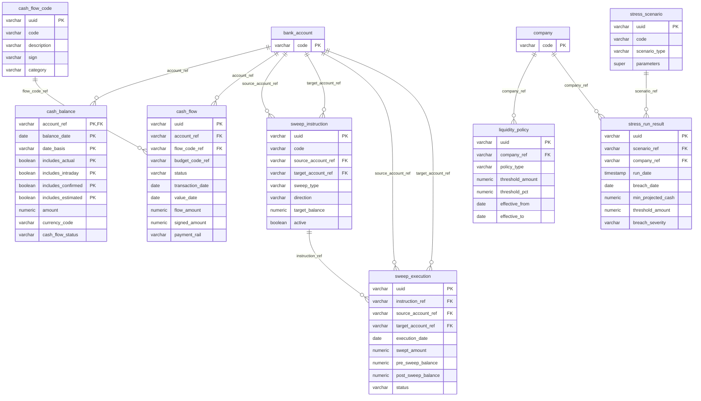

---

### Tables

#### `cash_balance` — Grain: Snapshot | 865,165 rows

> One row represents the cash balance for a specific bank account on a specific date, under a specific reporting perspective defined by the date basis and four inclusion flags.

**Columns:**

| Column | Type | Nullable | Description | Example Values / Boundaries |
|--------|------|----------|-------------|---------------------------|
| `account_ref` | varchar(64) | Yes | Unique code identifying a cash account, encoding region, country, and purpose. | `GR_HK_OP_2`, `IHB_EUR_CONCENTRATION` |
| `balance_date` | date | Yes | The calendar date for which the cash balance is reported. | `2024-03-31`, `2024-12-31` |
| `date_basis` | varchar(32) | Yes | Whether the balance is calculated using the transaction booking date or the value (settlement) date. | `BOOKING_DATE`, `VALUE_DATE` |
| `includes_actual` | boolean | Yes | Flag: whether the balance includes actual (posted/settled) transactions. | `true`, `false` |
| `includes_intraday` | boolean | Yes | Flag: whether the balance includes intraday (same-day, not yet settled) transactions. | `true`, `false` |
| `includes_confirmed` | boolean | Yes | Flag: whether the balance includes confirmed (bank-acknowledged but not yet settled) transactions. | `true`, `false` |
| `includes_estimated` | boolean | Yes | Flag: whether the balance includes estimated (forecast or projected) transactions. | `true`, `false` |
| `amount` | numeric(28,6) | Yes | The monetary cash balance for the account on the given date, in the account's native currency. | `-5234000.000000`, `12000000.500000` |
| `currency_code` | varchar(16) | Yes | ISO 4217 currency code of the balance amount. | `EUR`, `USD`, `GBP`, `JPY` |
| `cash_flow_status` | varchar(32) | Yes | Indicates whether the balance is based on confirmed transactions or estimated/forecasted cash flows. | `CONFIRMED`, `ESTIMATED` |

**Foreign Key Relationships:**

| Column | References | Join Meaning |
|--------|-----------|-------------|
| `account_ref` | `bank_account.code` | Identifies the bank account whose balance is being reported |

---

#### `cash_flow` — Grain: Event | 1,031,641 rows

> One row represents a single cash movement event — either a confirmed settlement or a forward-looking forecast — for a specific bank account, classified by flow type and counterparty.

**Columns:**

| Column | Type | Nullable | Description | Example Values / Boundaries |
|--------|------|----------|-------------|---------------------------|
| `uuid` | varchar(64) | Yes | Unique system-generated identifier for each cash flow record. | UUID string, e.g. `a1b2c3d4-...` |
| `account_ref` | varchar(64) | Yes | Coded reference identifying the bank account involved in the cash flow, encoding entity, country, and account purpose. | `GR_US_COLLECTION_1`, `IHB_EUR_CONCENTRATION` |
| `flow_code_ref` | varchar(64) | Yes | Categorical code classifying the type of cash flow transaction (e.g., payroll, tax, card interchange, intercompany funding). | `PAYROLL`, `TAX_PMT`, `CARD_INTERCHANGE` |
| `budget_code_ref` | varchar(64) | Yes | Budget classification grouping cash flows into high-level categories such as operations, treasury, tax, or capex. | `OPERATIONS`, `TREASURY`, `TAX`, `CAPEX` |
| `status` | varchar(32) | Yes | Whether the cash flow has been confirmed as settled or remains a forward-looking forecast. | `CONFIRMED`, `FORECAST` |
| `transaction_date` | date | Yes | Date on which the cash flow transaction was initiated or recorded. | `2024-03-15` |
| `value_date` | date | Yes | Date on which the funds are considered available or settled in the account. | `2024-03-17` |
| `update_date_time` | timestamptz | Yes | Timestamp recording when the cash flow record was last created or modified. | `2024-03-15 09:32:00+00` |
| `flow_amount` | numeric(28,6) | Yes | Absolute monetary amount of the cash flow in the transaction's original currency. | `150000.000000` |
| `flow_currency` | varchar(16) | Yes | ISO currency code in which the cash flow amount is denominated. | `USD`, `EUR`, `JPY` |
| `signed_amount` | numeric(28,6) | Yes | Cash flow amount with directional sign: positive = inflow, negative = outflow. | `150000.000000` (inflow), `-85000.000000` (outflow) |
| `account_amount` | numeric(28,6) | Yes | Cash flow amount converted into the denomination currency of the receiving or sending bank account. | `138500.000000` |
| `account_currency` | varchar(16) | Yes | ISO currency code of the bank account in which the cash flow is recorded. | `EUR`, `USD`, `GBP` |
| `fx_rate` | numeric(20,10) | Yes | FX rate applied to convert flow currency into account currency at the time of the transaction. | `1.0823456789` |
| `counterparty_name` | varchar(256) | Yes | Human-readable name of the external party involved in the cash flow (vendor, PSP, retail consumer). | `Macys Partner 1`, `Aggregated Retail Consumer` |
| `counterparty_ref` | varchar(64) | Yes | Unique coded reference identifying the counterparty, used for systematic matching across transactions. | `TP_CUST_0001`, `RETAIL_CONSUMER` |
| `description` | varchar(512) | Yes | Free-text narrative describing the nature or purpose of the cash flow. | `Monthly payroll disbursement`, `Quarterly tax payment` |
| `reference` | varchar(128) | Yes | Unique alphanumeric reference string (typically UUID) used to trace an individual cash flow externally. | UUID or external reference string |
| `user_zones` | super | Yes | Semi-structured data capturing user-defined zones or access control tags associated with the record. | JSON object |
| `payment_rail` | varchar(16) | Yes | Payment network or clearing mechanism used to execute the cash flow. | `WIRE`, `ACH`, `SEPA`, `RTP` |

**Foreign Key Relationships:**

| Column | References | Join Meaning |
|--------|-----------|-------------|
| `account_ref` | `bank_account.code` | Links the cash flow event to the specific bank account it affects |
| `flow_code_ref` | `cash_flow_code.code` | Joins to the reference table to get the human-readable classification and direction of the flow |

---

#### `cash_flow_code` — Grain: Reference | 40 rows

> One row represents a single standardised cash flow classification type with its business code, directional sign, and cash flow statement category.

**Columns:**

| Column | Type | Nullable | Description | Example Values / Boundaries |
|--------|------|----------|-------------|---------------------------|
| `uuid` | varchar(64) | Yes | Unique system-generated identifier for each cash flow code record. | UUID string |
| `code` | varchar(64) | Yes | Short alphanumeric code uniquely classifying a specific type of cash movement. | `PAYROLL`, `TAX_PMT`, `CARD_INTERCHANGE`, `IC_FUNDING` |
| `description` | varchar(256) | Yes | Human-readable label explaining the business purpose of the code. | `Payroll`, `Tax payments`, `Capital expenditure` |
| `sign` | varchar(8) | Yes | Direction of the cash flow: money coming into the account (IN) or going out (OUT). | `IN`, `OUT` |
| `category` | varchar(32) | Yes | Standard cash flow statement category for the code. | `OPERATING`, `INVESTING`, `FINANCING` |

> **Note:** This is a lookup/reference table with only 40 rows. It has no foreign keys itself but is referenced by `cash_flow.flow_code_ref`. Use it to filter or group cash flows by business type, direction, or cash flow statement category.

---

#### `sweep_instruction` — Grain: Reference | 38 rows

> One row represents a single standing automated rule governing cash concentration between a specific source operating account and a target concentration account.

**Columns:**

| Column | Type | Nullable | Description | Example Values / Boundaries |
|--------|------|----------|-------------|---------------------------|
| `uuid` | varchar(64) | Yes | Unique system-generated identifier for each sweep instruction record. | UUID string |
| `code` | varchar(64) | Yes | Business code uniquely identifying a sweep instruction, encoding sweep type, entity group, country, and account sequence. | `SW_GR_GB_OPERATING_1`, `SW_GR_CA_OPERATING_1` |
| `source_account_ref` | varchar(64) | Yes | Reference code of the source account from which funds are swept, encoding entity group, country, and account type. | `GR_GB_OP_1`, `GR_CA_OP_2` |
| `target_account_ref` | varchar(64) | Yes | Reference code of the destination concentration or pooling account to which swept funds are transferred. | `IHB_GBP_CONCENTRATION`, `IHB_CAD_CONCENTRATION` |
| `sweep_type` | varchar(32) | Yes | Classification of the cash sweep mechanism used. | `ZERO_BALANCE`, `TARGET_BALANCE`, `NOTIONAL_POOLING`, `THRESHOLD` |
| `direction` | varchar(16) | Yes | Whether the sweep moves funds only upward to the concentration account or operates in both directions. | `ONE_WAY`, `TWO_WAY` |
| `target_balance` | numeric(28,6) | Yes | Desired end-of-day balance the source account should maintain after a target-balance sweep. Null for zero-balance sweeps. | `0.000000`, `200000.000000` |
| `target_balance_ccy` | varchar(16) | Yes | ISO currency code denominating the target balance amount. | `EUR`, `GBP`, `USD` |
| `threshold_amount` | numeric(28,6) | Yes | Minimum balance in the source account that must be exceeded before a threshold-based sweep is triggered. | `500000.000000` |
| `schedule_cron` | varchar(64) | Yes | Scheduling expression defining when the sweep instruction is executed (observed value indicates end-of-day). | `0 23 * * MON-FRI` |
| `priority` | smallint | Yes | Numeric priority order for processing when multiple instructions are scheduled simultaneously (lower = higher priority). | `1`, `2`, `3` |
| `active` | boolean | Yes | Whether the sweep instruction is currently enabled and available for execution. | `true`, `false` |
| `effective_from` | date | Yes | Date from which the sweep instruction becomes valid and eligible for execution. | `2023-01-01` |
| `effective_to` | date | Yes | Date on which the sweep instruction expires; null indicates open-ended. | `2024-12-31`, null |

**Foreign Key Relationships:**

| Column | References | Join Meaning |
|--------|-----------|-------------|
| `source_account_ref` | `bank_account.code` | Identifies the operating account that funds are swept from |
| `target_account_ref` | `bank_account.code` | Identifies the concentration account that receives the swept funds |

---

#### `sweep_execution` — Grain: Event | 29,273 rows

> One row represents a single executed cash sweep on a specific date, capturing the actual amount moved, pre- and post-sweep balances, and the execution outcome.

**Columns:**

| Column | Type | Nullable | Description | Example Values / Boundaries |
|--------|------|----------|-------------|---------------------------|
| `uuid` | varchar(64) | Yes | Unique system-generated identifier for each sweep execution record. | UUID string |
| `instruction_ref` | varchar(64) | Yes | Reference code of the sweep instruction rule that triggered this execution. | `SW_GR_CA_OPERATING_1`, `SW_GR_GB_OPERATING_1` |
| `execution_date` | date | Yes | Calendar date on which the sweep was executed. | `2024-03-15` |
| `source_account_ref` | varchar(64) | Yes | Reference code of the account from which funds were swept (the originating account). | `GR_CA_OP_1` |
| `target_account_ref` | varchar(64) | Yes | Reference code of the concentration or investment account to which swept funds were transferred. | `IHB_CAD_CONCENTRATION` |
| `swept_amount` | numeric(28,6) | Yes | Monetary amount actually transferred from the source account to the target account during the sweep. | `1250000.000000` |
| `currency_code` | varchar(16) | Yes | ISO 4217 currency code of the account and swept amount. | `USD`, `EUR`, `GBP` |
| `pre_sweep_balance` | numeric(28,6) | Yes | Account balance in the source account immediately before the sweep was executed. | `1250000.000000` |
| `post_sweep_balance` | numeric(28,6) | Yes | Account balance in the source account immediately after the sweep was executed. | `0.000000` (for zero-balance sweep) |
| `residual_amount` | numeric(28,6) | Yes | Amount intentionally left behind in the source account after the sweep (e.g., a minimum balance threshold). | `0.000000`, `200000.000000` |
| `status` | varchar(16) | Yes | Outcome status of the sweep execution. | `COMPLETED`, `SKIPPED`, `FAILED` |
| `cash_flow_uuid` | varchar(64) | Yes | Identifier referencing the cash flow record generated for the debit leg of the sweep transaction. | UUID string |
| `counter_cash_flow_uuid` | varchar(64) | Yes | Identifier referencing the cash flow record for the credit leg (counter-entry) of the sweep transaction. | UUID string |

**Foreign Key Relationships:**

| Column | References | Join Meaning |
|--------|-----------|-------------|
| `instruction_ref` | `sweep_instruction.code` | Links the execution event back to the standing rule that triggered it |
| `source_account_ref` | `bank_account.code` | Identifies the originating account |
| `source_account_ref` | `sweep_instruction.source_account_ref` | Confirms the source account matches the instruction's configured source |
| `target_account_ref` | `bank_account.code` | Identifies the destination concentration account |
| `target_account_ref` | `sweep_instruction.target_account_ref` | Confirms the target account matches the instruction's configured target |

---

#### `liquidity_policy` — Grain: Reference | 10 rows

> One row represents a single internal treasury governance rule setting a threshold for minimum cash, concentration limits, or instrument tenor caps for a specific company or company group.

**Columns:**

| Column | Type | Nullable | Description | Example Values / Boundaries |
|--------|------|----------|-------------|---------------------------|
| `uuid` | varchar(64) | Yes | Unique system-generated identifier for each liquidity policy record. | UUID string |
| `company_ref` | varchar(64) | Yes | Reference to the specific legal entity or company to which the liquidity policy applies. | `GR_US_INC`, `GR_GB`, `GR_TREASURY` |
| `company_group_ref` | varchar(64) | Yes | Organizational group scope of the policy (global or a regional group). | `GLOBAL`, `AMERICAS`, `EMEA`, `APAC` |
| `policy_type` | varchar(32) | Yes | Category of liquidity policy rule. | `MIN_LIQUIDITY_BUFFER`, `MIN_OPERATING_CASH`, `MAX_COUNTERPARTY_PCT`, `MAX_INSTRUMENT_TENOR` |
| `threshold_amount` | numeric(28,6) | Yes | Absolute monetary threshold value set by the policy (null for percentage-based policies). | `400000000.000000` (400 million), null |
| `threshold_currency` | varchar(16) | Yes | ISO currency code in which the threshold amount is expressed. | `USD`, `EUR` |
| `threshold_pct` | numeric(9,4) | Yes | Percentage-based threshold for concentration or ratio-type limits (null for amount-based policies). | `25.0000` (25%), null |
| `effective_from` | date | Yes | Date from which the liquidity policy rule becomes active and enforceable. | `2023-01-01` |
| `effective_to` | date | Yes | Date on which the policy rule expires; null indicates currently open-ended. | `2024-12-31`, null |
| `description` | varchar(65535) | Yes | Human-readable label summarising the intent of the policy rule. | `Regional cash floors - EMEA`, `Counterparty tier cap - Tier 1 banks` |

**Foreign Key Relationships:**

| Column | References | Join Meaning |
|--------|-----------|-------------|
| `company_ref` | `company.code` | Associates the policy rule with the legal entity or subsidiary it governs |

---

#### `stress_scenario` — Grain: Reference | 6 rows

> One row represents a single defined adverse stress scenario with its code, risk type category, human-readable description, and structured quantitative parameters.

**Columns:**

| Column | Type | Nullable | Description | Example Values / Boundaries |
|--------|------|----------|-------------|---------------------------|
| `uuid` | varchar(64) | Yes | Unique system-generated identifier for each stress scenario record. | UUID string |
| `code` | varchar(64) | Yes | Short machine-readable code uniquely naming a stress scenario. | `STR_AR_DROP_20`, `STR_RATE_PLUS_200`, `STR_FX_SHOCK`, `STR_CUST_DEFAULT` |
| `description` | varchar(65535) | Yes | Human-readable narrative explaining the nature and magnitude of the stress scenario. | `AR receipts drop 20% for 30 days`, `Rates +200bp parallel shift` |
| `scenario_type` | varchar(32) | Yes | Category classifying the stress scenario into a broad risk type. | `RECEIPTS_DROP`, `FX_SHOCK`, `RATE_SHOCK`, `CUSTOMER_DEFAULT`, `BANK_DOWNGRADE` |
| `parameters` | super | Yes | Structured JSON object containing the specific quantitative and qualitative parameters defining how the scenario is applied. | `{"shock_pct": 20, "duration_days": 30, "affected_entities": ["ALL"]}` |
| `created_at` | timestamptz | Yes | Timestamp recording when the stress scenario definition was created in the system. | `2023-06-01 10:00:00+00` |

---

#### `stress_run_result` — Grain: Event | 432 rows

> One row represents the computed outcome of running a specific stress scenario for a specific legal entity at a specific month-end, capturing the minimum projected cash balance, projected breach date, and severity classification.

**Columns:**

| Column | Type | Nullable | Description | Example Values / Boundaries |
|--------|------|----------|-------------|---------------------------|
| `uuid` | varchar(64) | Yes | Unique system-generated identifier for each stress test run result record. | UUID string |
| `scenario_ref` | varchar(64) | Yes | Code identifying the stress scenario applied in this run. | `STR_AR_DROP_20`, `STR_RATE_PLUS_200`, `STR_FX_SHOCK` |
| `run_date` | timestamptz | Yes | Month-end timestamp indicating when the stress test was executed or the reporting period to which results apply. | `2024-03-31 00:00:00+00` |
| `company_ref` | varchar(64) | Yes | Code identifying the legal entity or group company for which the stress test result was computed. | `GR_US_INC`, `GR_GB`, `GR_TREASURY` |
| `breach_date` | date | Yes | Projected date on which the entity's cash position is expected to breach the minimum threshold under the stress scenario; null when no breach is projected. | `2024-04-15`, null |
| `min_projected_cash` | numeric(28,6) | Yes | Minimum projected cash balance for the entity over the stress scenario horizon, in reporting currency. | `320000000.000000`, `510000000.000000` |
| `threshold_amount` | numeric(28,6) | Yes | Minimum cash balance threshold (400 million) below which a stress breach is triggered, in reporting currency. | `400000000.000000` |
| `currency_code` | varchar(16) | Yes | ISO currency code in which monetary values are denominated; currently USD across all records. | `USD` |
| `breach_severity` | varchar(16) | Yes | Severity classification of the stress outcome. | `NO_BREACH`, `WARNING` |

**Foreign Key Relationships:**

| Column | References | Join Meaning |
|--------|-----------|-------------|
| `scenario_ref` | `stress_scenario.code` | Links the result to the scenario definition to retrieve scenario type and parameters |
| `company_ref` | `company.code` | Associates the stress result with the legal entity being tested |

---

### KPIs Computable from This Sub-domain

| KPI | Formula / Method | Tables Required |
|-----|-----------------|----------------|
| **Daily Cash Position (Confirmed)** | `SUM(amount)` WHERE `includes_actual = true AND includes_confirmed = true AND includes_estimated = false`, grouped by `account_ref` and `balance_date` | `cash_balance` |
| **Net Cash Flow by Flow Type (Period)** | `SUM(signed_amount)` grouped by `flow_code_ref` and `DATE_TRUNC('month', value_date)`, filtered by `status = 'CONFIRMED'` | `cash_flow`, `cash_flow_code` |
| **Cash Concentration Efficiency** | `SUM(swept_amount) / SUM(pre_sweep_balance)` per sweep instruction per period — measures how much of available operating cash is being swept to the concentration account | `sweep_execution`, `sweep_instruction` |
| **Sweep Success Rate** | `COUNT(*) FILTER (WHERE status = 'COMPLETED') / COUNT(*)` per `instruction_ref` per month | `sweep_execution` |
| **Liquidity Policy Compliance** | Compare `cash_balance.amount` (confirmed view) against `liquidity_policy.threshold_amount` for matching `company_ref`; flag accounts where balance < threshold | `cash_balance`, `liquidity_policy`, `bank_account`, `company` |
| **Stress Breach Rate by Scenario** | `COUNT(*) FILTER (WHERE breach_severity != 'NO_BREACH') / COUNT(*)` grouped by `scenario_ref` and `run_date` | `stress_run_result`, `stress_scenario` |
| **Average Days to Stress Breach** | `AVG(breach_date - CAST(run_date AS date))` WHERE `breach_date IS NOT NULL`, grouped by `scenario_ref` | `stress_run_result` |
| **Operating Cash Flow (Statement)** | `SUM(signed_amount)` joined to `cash_flow_code` WHERE `category = 'OPERATING'`, by entity and period | `cash_flow`, `cash_flow_code`, `bank_account` |

---

### Common BA Questions

**Q: What is the current confirmed cash position for each bank account as of today?**
Use tables: `cash_balance`. Filter on `balance_date = CURRENT_DATE`, `includes_actual = true`, `includes_confirmed = true`, `includes_intraday = false`, `includes_estimated = false`. The `date_basis` column determines whether you are looking at booking-date or value-date balances — confirm which view your stakeholder requires.

**Q: Which accounts have cash balances below their liquidity policy minimum threshold?**
Use tables: `cash_balance`, `liquidity_policy`, `bank_account`, `company`. Join `bank_account` to `company` to resolve the company for each account, then join to `liquidity_policy` on `company_ref` filtering for `policy_type = 'MIN_OPERATING_CASH'` and active policies (`effective_to IS NULL OR effective_to >= CURRENT_DATE`). Compare `cash_balance.amount` to `liquidity_policy.threshold_amount`.

**Q: What types of cash flows are driving inflows and outflows for a given entity this month?**
Use tables: `cash_flow`, `cash_flow_code`. Join on `flow_code_ref = code`, filter by `account_ref` and `DATE_TRUNC('month', value_date)` and `status = 'CONFIRMED'`. Group by `cash_flow_code.description` and `cash_flow_code.category`. Use `signed_amount` so inflows are positive and outflows negative.

**Q: Which sweep instructions are not performing as expected — i.e., frequently failing or being skipped?**
Use tables: `sweep_execution`, `sweep_instruction`. Join on `instruction_ref = code`. Group by `instruction_ref` and `status`, then compute the failure/skip rate. Filter to the last 30 days using `execution_date`. Sweeps with `status = 'SKIPPED'` may indicate the source account balance was below the sweep threshold.

**Q: Under which stress scenarios does a specific legal entity breach the minimum cash threshold, and how quickly?**
Use tables: `stress_run_result`, `stress_scenario`. Join on `scenario_ref = code`. Filter by `company_ref` and the latest `run_date`. Look at `breach_date`, `min_projected_cash`, `threshold_amount`, and `breach_severity`. `breach_date IS NOT NULL` means a breach is projected; the gap between `run_date` and `breach_date` is the runway.

**Q: How much cash does the concentration account receive from sweeps in a given month?**
Use tables: `sweep_execution`, `sweep_instruction`. Join on `instruction_ref = code`. Filter `target_account_ref` to the concentration account code and `status = 'COMPLETED'`. Sum `swept_amount` grouped by month using `DATE_TRUNC('month', execution_date)`.

**Q: What is the difference between the forecast cash balance and the confirmed balance for an account?**
Use tables: `cash_balance`. Query the same `account_ref` and `balance_date` twice — once with `includes_estimated = false` (confirmed view) and once with `includes_estimated = true` (forecast-inclusive view). The difference is the net estimated/forecasted cash not yet settled.

---

## Sub-domain 4: Accounts Payable & Receivable

### Overview

Accounts Payable (AP) and Accounts Receivable (AR) represent the two sides of the organisation's commercial credit relationships. AP covers the money the company owes to its vendors and suppliers for goods and services received; AR covers the money owed to the company by its customers for goods and services delivered. Together, these two functions directly drive working capital and liquidity — the speed at which invoices are paid out (AP) and collected (AR) determines how much cash is available at any given time.

For a Business Analyst new to treasury, the most important concepts in this sub-domain are the invoice lifecycle and the key performance metrics derived from it. Every invoice — whether AP or AR — progresses through states: it starts open, may become partially paid as partial payments are applied, and eventually reaches a paid or written-off terminal state. The three amount columns (`invoice_amount`, `paid_amount`, `open_amount`) capture this lifecycle explicitly: `open_amount = invoice_amount - paid_amount`. Payment terms (e.g., `NET_30`, `EOM_5`) define the contractual deadline, and comparing the actual `paid_date` to the `due_date` reveals whether payments were on time, early, or overdue. The canonical working capital metrics — Days Payable Outstanding (DPO) for AP and Days Sales Outstanding (DSO) for AR — are both computable from these tables.

The `third_party` table plays a critical dual role: it is simultaneously the vendor master for AP (referenced by `ap_invoice.vendor_ref`) and the customer master for AR (referenced by `ar_invoice.customer_ref`). This unified counterparty model is reflected in the `creditor` and `debtor` flags on `third_party` — a party can be both. The `third_party_bank_account` table stores payment routing details (IBAN, account numbers) for each third party, supporting outbound payment execution for AP. The `third_party_category` and `third_party_category_assignment` tables provide a flexible many-to-many taxonomy for classifying third parties into business segments (e.g., IT vendors, retail partners, strategic customers), enabling category-level spend analysis and receivables segmentation.

All joins across this sub-domain start from either `ap_invoice` or `ar_invoice` as the fact tables. Both reference `company.code` for entity-level filtering and `third_party.code` for counterparty details. To retrieve payment routing information, join `third_party` to `third_party_bank_account` on `code = third_party_code`. To segment counterparties by category, join through the `third_party_category_assignment` bridge table to `third_party_category`.

---

### Key Business Entities

- **AP Invoice**: A single payable invoice received from a vendor, capturing the full payment lifecycle — total billed, paid to date, and remaining open balance — along with payment terms and status.
- **AR Invoice**: A single receivable invoice issued to a customer, capturing the full collection lifecycle — total billed, collected to date, and outstanding balance — along with payment terms and status.
- **Third Party**: A unified counterparty master record covering both vendors (AP) and customers (AR). A third party can act as a creditor (we owe them money), a debtor (they owe us money), or both.
- **Third Party Bank Account**: The payment routing details (account number, IBAN, branch, currency) for a third party, used to execute outbound AP payments.
- **Third Party Category**: A reference lookup defining the taxonomy of classification categories used to segment third parties (e.g., IT_VENDOR, RETAIL_PARTNER, STRATEGIC_CUSTOMER).
- **Third Party Category Assignment**: A bridge/junction table recording the many-to-many assignments between third parties and their category classifications.

---

### Entity Relationship Diagram

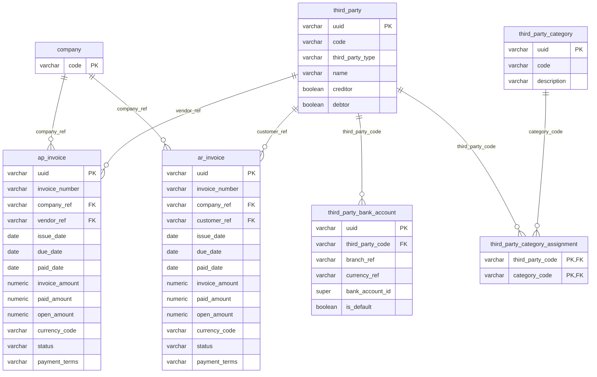

---

### Tables

#### `ap_invoice` — Grain: Event | 180,000 rows

> One row represents a single accounts payable invoice received from a vendor by a specific legal entity, tracking the full payment lifecycle from issuance through settlement.

**Columns:**

| Column | Type | Nullable | Description | Example Values / Boundaries |
|--------|------|----------|-------------|---------------------------|
| `uuid` | varchar(64) | Yes | Unique system-generated identifier for each accounts payable invoice record. | UUID string |
| `invoice_number` | varchar(64) | Yes | Human-readable business reference number assigned to each AP invoice. | `AP-00128374`, `AP-00293847` |
| `company_ref` | varchar(64) | Yes | Code identifying the legal entity or subsidiary that owns the invoice. | `GR_CA`, `GR_TREASURY`, `GR_US_INC`, `GR_DE` |
| `vendor_ref` | varchar(64) | Yes | Code identifying the supplier or vendor who issued the invoice; prefix indicates spend category. | `CAPEX_VENDOR_0012`, `IT_VENDOR_0005`, `MKTG_VENDOR_0008` |
| `issue_date` | date | Yes | The date on which the vendor issued the invoice. | `2024-02-01` |
| `due_date` | date | Yes | The date by which the invoice must be paid according to agreed payment terms. | `2024-03-02` (NET_30 from Feb 1) |
| `paid_date` | date | Yes | The date on which the invoice was fully paid; null indicates the invoice has not yet been fully paid. | `2024-03-01`, null |
| `invoice_amount` | numeric(28,6) | Yes | The total gross amount billed on the invoice in the invoice currency. | `125000.000000` |
| `paid_amount` | numeric(28,6) | Yes | The total amount that has been paid against the invoice to date in the invoice currency. | `125000.000000` (fully paid), `62500.000000` (partially paid) |
| `open_amount` | numeric(28,6) | Yes | The remaining unpaid balance on the invoice in the invoice currency (invoice_amount − paid_amount). | `0.000000` (fully paid), `62500.000000` (partially paid) |
| `currency_code` | varchar(16) | Yes | ISO 4217 currency code in which the invoice amounts are denominated. | `USD`, `EUR`, `GBP` |
| `status` | varchar(16) | Yes | The current payment status of the invoice. | `PAID`, `OPEN`, `PARTIAL`, `DISPUTED` |
| `payment_terms` | varchar(16) | Yes | The agreed payment terms specifying when the invoice is due. | `NET_30` (due in 30 days), `NET_60`, `EOM_5` (5 days after end of month) |

**Foreign Key Relationships:**

| Column | References | Join Meaning |
|--------|-----------|-------------|
| `company_ref` | `company.code` | Associates the invoice with the legal entity that received and must pay it |
| `vendor_ref` | `third_party.code` | Joins to the vendor's master record in the third_party table for name, category, and payment routing details |

---

#### `ar_invoice` — Grain: Event | 268,994 rows

> One row represents a single accounts receivable invoice issued by a group entity to a specific customer, tracking the full collection lifecycle from issuance through payment or write-off.

**Columns:**

| Column | Type | Nullable | Description | Example Values / Boundaries |
|--------|------|----------|-------------|---------------------------|
| `uuid` | varchar(64) | Yes | Unique system-generated identifier for each accounts receivable invoice record. | UUID string |
| `invoice_number` | varchar(64) | Yes | Human-readable invoice reference code encoding the sales channel, issuing entity, and invoice date. | `AR-B2C-GR_APAC_PTE-20230501`, `AR-B2B-GR_DE-20240301` |
| `company_ref` | varchar(64) | Yes | Code identifying the legal entity or subsidiary of the group that issued the invoice. | `GR_DE`, `GR_APAC_PTE`, `GR_US_INC` |
| `customer_ref` | varchar(64) | Yes | Code identifying the customer billed on the invoice, distinguishing retail consumers from named third-party customers. | `RETAIL_CONSUMER`, `TP_CUST_0015`, `TP_CUST_0001` |
| `issue_date` | date | Yes | The date on which the invoice was formally issued to the customer. | `2024-03-01` |
| `due_date` | date | Yes | The date by which payment of the invoice is expected from the customer. | `2024-03-31` (NET_30 from Mar 1) |
| `paid_date` | date | Yes | The date on which the invoice was fully paid; null if payment has not yet been received. | `2024-03-28`, null |
| `invoice_amount` | numeric(28,6) | Yes | The total monetary amount billed to the customer on the invoice in the invoice currency. | `45000.000000` |
| `paid_amount` | numeric(28,6) | Yes | The monetary amount that has been collected or paid against the invoice in the invoice currency. | `45000.000000` (fully collected), `0.000000` (unpaid) |
| `open_amount` | numeric(28,6) | Yes | The outstanding monetary balance still owed on the invoice (invoice_amount − paid_amount) in the invoice currency. | `0.000000` (collected), `45000.000000` (fully outstanding) |
| `currency_code` | varchar(16) | Yes | ISO 4217 three-letter currency code in which the invoice amounts are denominated. | `EUR`, `USD`, `JPY` |
| `status` | varchar(16) | Yes | The current collection status of the invoice. | `PAID`, `OPEN`, `WRITTEN_OFF` |
| `payment_terms` | varchar(16) | Yes | The agreed payment terms specifying the number of days from invoice issue date within which the customer must pay. | `NET_30` (due in 30 days), `NET_60`, `NET_90` |

**Foreign Key Relationships:**

| Column | References | Join Meaning |
|--------|-----------|-------------|
| `company_ref` | `company.code` | Associates the invoice with the legal entity that issued it and is entitled to collect |
| `customer_ref` | `third_party.code` | Joins to the customer's master record in the third_party table for name, category, and contact details |

---

#### `third_party` — Grain: Reference | 345 rows

> One row represents a single external counterparty entity — which may be a vendor (AP), a customer (AR), or both — with its identification details, classification flags, and transaction control settings.

**Columns:**

| Column | Type | Nullable | Description | Example Values / Boundaries |
|--------|------|----------|-------------|---------------------------|
| `uuid` | varchar(64) | Yes | Universally unique identifier serving as the primary key for each third-party record. | UUID string |
| `code` | varchar(64) | Yes | Business code assigned to each third party. | `TP_CUST_0001`, `RETAIL_CONSUMER`, `IT_VENDOR_0005`, `CAPEX_VENDOR_0012` |
| `third_party_type` | varchar(32) | Yes | Classifies the third party as an organization or another legal entity type. | `ORGANIZATION`, `INDIVIDUAL` |
| `name` | varchar(256) | Yes | Full display name of the third party. | `Macys Partner 1`, `Aggregated Retail Consumer`, `Accenture` |
| `name2` | varchar(256) | Yes | Secondary or alternative name for the third party (second legal or trading name). | `Macy's Inc.`, null |
| `first_name` | varchar(128) | Yes | First name of the individual contact associated with the third party (applicable for person-type parties). | `John`, null |
| `last_name` | varchar(128) | Yes | Last name of the individual contact associated with the third party. | `Smith`, null |
| `birth_date` | date | Yes | Date of birth of the individual associated with the record (applicable for person-type parties). | `1975-04-22`, null |
| `hidden` | boolean | Yes | Flag indicating whether the third party is hidden from standard user-facing views or lookups. | `false`, `true` |
| `closure_date` | date | Yes | Date on which the third party relationship was officially closed or deactivated. | `2023-12-31`, null |
| `creditor` | boolean | Yes | Flag indicating whether the third party acts as a creditor (the company owes money to this party — i.e., a vendor in AP context). | `true`, `false` |
| `debtor` | boolean | Yes | Flag indicating whether the third party acts as a debtor (this party owes money to the company — i.e., a customer in AR context). | `true`, `false` |
| `non_resident` | boolean | Yes | Flag indicating whether the third party is classified as a non-resident entity for regulatory or tax purposes. | `true`, `false` |
| `corp_id_code` | varchar(64) | Yes | Corporate identification code assigned to the third party (company registration or LEI). | `LEI-254900OPPU84GM83OT55` |
| `other_identifier` | super | Yes | Flexible structured field storing additional identifiers in semi-structured format. | JSON object |
| `creditor_tax_id` | varchar(64) | Yes | Tax identification number used when the third party is acting as a creditor for tax reporting purposes. | `US-EIN-12-3456789` |
| `creditor_tax_registration_id` | varchar(64) | Yes | Tax registration identifier for the third party in its creditor role. | `VAT-DE-123456789` |
| `creditor_tax_type` | varchar(64) | Yes | Classification of the tax regime or tax type applicable to the third party in its creditor role. | `VAT`, `GST`, `WITHHOLDING` |
| `creditor_agent_instruction` | varchar(256) | Yes | Special handling or payment instruction for the creditor's agent when processing transactions. | `Pay via SEPA Credit Transfer only` |
| `link_number_ref` | varchar(64) | Yes | Reference code linking the third party to an associated account or record in an external system. | `ERP_VENDOR_10042` |
| `portfolio_ref` | varchar(64) | Yes | Reference to the portfolio to which this third party is assigned for grouping or management purposes. | `APAC_PORTFOLIO`, null |
| `folder_ref` | varchar(64) | Yes | Reference to an organizational folder or category used to group third parties in the system. | `STRATEGIC_VENDORS`, null |
| `limit_currency_ref` | varchar(16) | Yes | Currency code used as the reference currency for evaluating transaction limits applied to the third party. | `EUR` (default) |
| `transaction_entry_limit` | numeric(28,6) | Yes | Maximum monetary amount allowed per individual transaction entry for this third party, in the limit currency. | `5000000.000000`, `0.000000` (unlimited) |
| `transaction_max_number` | integer | Yes | Maximum number of transactions permitted for this third party within a defined control period. | `100`, null (unlimited) |
| `company_selection` | varchar(64) | Yes | Defines the scope of companies that can access or transact with this third party record. | `ALL`, `GR_TREASURY` |
| `used_by_company_ref` | varchar(64) | Yes | Reference to the specific company that has primary usage or ownership of this third party record. | `GR_US_INC` |
| `used_by_companies` | super | Yes | Structured list of all companies permitted to use or reference this third party record. | JSON array |
| `company_ownership_ref` | varchar(64) | Yes | Reference identifying the company that owns or is legally responsible for this third party record. | `GR_TREASURY` |
| `address` | super | Yes | Structured address information (street, city, country, postal details) for the third party. | JSON object |
| `contact` | super | Yes | Structured contact details (phone numbers, email addresses) for the third party. | JSON object |
| `memo` | varchar(65535) | Yes | Free-text notes or remarks recorded against the third party for internal reference purposes. | `Key strategic supplier - do not pause payments without CFO approval` |
| `user_zones` | super | Yes | Structured field storing user-defined zone or segmentation attributes. | JSON object |

> **Dual-role note:** A single `third_party` record can have both `creditor = true` (meaning the company owes them money — vendor in AP) and `debtor = true` (meaning they owe the company money — customer in AR). To filter vendors for AP analysis, use `creditor = true`; for customers in AR analysis, use `debtor = true`.

---

#### `third_party_bank_account` — Grain: Reference | row_count not specified

> One row represents a single bank account belonging to an external third party, used for routing outbound payments to vendors and suppliers.

**Columns:**

| Column | Type | Nullable | Description | Example Values / Boundaries |
|--------|------|----------|-------------|---------------------------|
| `uuid` | varchar(64) | Yes | Unique system-generated identifier for each third-party bank account record. | UUID string |
| `third_party_code` | varchar(64) | Yes | Code identifying the external third party (vendor, supplier, or counterparty) associated with this bank account. | `IT_VENDOR_0005`, `CAPEX_VENDOR_0012` |
| `branch_ref` | varchar(64) | Yes | Reference code identifying the bank branch associated with the third-party bank account. | `BARCGB22`, `DEUTDEDB` |
| `currency_ref` | varchar(16) | Yes | Currency code indicating the denomination in which the third-party bank account operates. | `EUR`, `GBP`, `USD` |
| `bank_account_id` | super | Yes | Structured composite identifier containing the details of the bank account (account number, IBAN, routing information). | JSON: `{"iban": "GB29NWBK60161331926819"}` |
| `is_default` | boolean | Yes | Flag indicating whether this bank account is the default account used for payments to the associated third party. | `true`, `false` |

**Foreign Key Relationships:**

| Column | References | Join Meaning |
|--------|-----------|-------------|
| `third_party_code` | `third_party.code` | Links the bank account record to the owning third party (vendor/supplier) |

---

#### `third_party_category` — Grain: Reference | row_count not specified

> One row represents a single category classification used to segment third-party entities, providing a human-readable taxonomy for vendors and customers.

**Columns:**

| Column | Type | Nullable | Description | Example Values / Boundaries |
|--------|------|----------|-------------|---------------------------|
| `uuid` | varchar(64) | Yes | Unique identifier for each third-party category record. | UUID string |
| `code` | varchar(64) | Yes | Short alphanumeric code representing a specific third-party category classification. | `IT_VENDOR`, `RETAIL_PARTNER`, `STRATEGIC_CUSTOMER`, `CAPEX_SUPPLIER` |
| `description` | varchar(256) | Yes | Human-readable text describing the nature or purpose of the third-party category. | `IT & Technology Vendors`, `Retail Distribution Partners`, `Capital Expenditure Suppliers` |

---

#### `third_party_category_assignment` — Grain: Reference (bridge) | row_count not specified

> One row represents a single assignment of a category code to a third-party code, enabling many-to-many classification of vendors and customers.

**Columns:**

| Column | Type | Nullable | Description | Example Values / Boundaries |
|--------|------|----------|-------------|---------------------------|
| `third_party_code` | varchar(64) | Yes | Unique code identifying the third-party entity being assigned to a category. | `IT_VENDOR_0005`, `TP_CUST_0001` |
| `category_code` | varchar(64) | Yes | Code representing the business category being assigned to the third party. | `IT_VENDOR`, `STRATEGIC_CUSTOMER` |

> **Note:** The composite primary key is (`third_party_code`, `category_code`). A single third party can belong to multiple categories (e.g., a vendor who is also a strategic partner). Always join this table through `third_party_category` to get the category description.

**Foreign Key Relationships:**

| Column | References | Join Meaning |
|--------|-----------|-------------|
| `category_code` | `third_party_category.code` | Resolves the category code to its human-readable description |
| `third_party_code` | `third_party.code` | Links the assignment back to the full counterparty master record |

---

### KPIs Computable from This Sub-domain

| KPI | Formula / Method | Tables Required |
|-----|-----------------|----------------|
| **Days Payable Outstanding (DPO)** | `(SUM(open_amount) / SUM(invoice_amount)) * AVG(payment_terms_days)` — more precisely: average number of days between `issue_date` and `paid_date` for paid invoices, by `company_ref`. Proxy: `AVG(paid_date - issue_date)` WHERE `status = 'PAID'` | `ap_invoice` |
| **Days Sales Outstanding (DSO)** | `AVG(paid_date - issue_date)` WHERE `status = 'PAID'`, grouped by `company_ref` and month. For open invoices use `CURRENT_DATE - issue_date` as the accruing age. | `ar_invoice` |
| **Total AP Overdue Amount** | `SUM(open_amount)` WHERE `status IN ('OPEN','PARTIAL') AND due_date < CURRENT_DATE`, grouped by `company_ref` | `ap_invoice` |
| **Total AR Overdue Amount** | `SUM(open_amount)` WHERE `status IN ('OPEN') AND due_date < CURRENT_DATE`, grouped by `company_ref` | `ar_invoice` |
| **AP Aging Buckets** | `SUM(open_amount)` bucketed by `(CURRENT_DATE - due_date)` into 0–30, 31–60, 61–90, 90+ day bands, WHERE `status != 'PAID'` | `ap_invoice` |
| **AR Aging Buckets** | `SUM(open_amount)` bucketed by `(CURRENT_DATE - due_date)` into 0–30, 31–60, 61–90, 90+ day bands, WHERE `status != 'PAID'` | `ar_invoice` |
| **AP Spend by Vendor Category** | `SUM(invoice_amount)` grouped by `category_code` joined through `third_party_category_assignment` and `third_party_category`, by period | `ap_invoice`, `third_party`, `third_party_category_assignment`, `third_party_category` |
| **On-Time Payment Rate (AP)** | `COUNT(*) FILTER (WHERE paid_date <= due_date) / COUNT(*) FILTER (WHERE status = 'PAID')` per `company_ref` | `ap_invoice` |

---

### Common BA Questions

**Q: Which AP invoices are currently overdue and by how many days?**
Use tables: `ap_invoice`, `third_party`. Filter `status IN ('OPEN', 'PARTIAL') AND due_date < CURRENT_DATE`. Compute `CURRENT_DATE - due_date` as `days_overdue`. Join to `third_party` on `vendor_ref = code` to get the vendor name. Order by `open_amount DESC` to prioritise by value.

**Q: What is the total outstanding AR balance by customer, and which customers are most overdue?**
Use tables: `ar_invoice`, `third_party`. Filter `status != 'PAID'`. Join to `third_party` on `customer_ref = code` for the customer name. Group by `customer_ref`, `third_party.name`. Separate analysis for `due_date < CURRENT_DATE` (overdue) vs. `due_date >= CURRENT_DATE` (not yet due). Use `SUM(open_amount)` for total exposure.

**Q: What are the payment terms being used across AP invoices, and what proportion of invoices are paid on time vs. late?**
Use tables: `ap_invoice`. Group by `payment_terms`. For each group, compute `COUNT(*) FILTER (WHERE paid_date <= due_date)` as on-time count and `COUNT(*) FILTER (WHERE paid_date > due_date)` as late count. Filter to `status = 'PAID'` for closed invoices only.

**Q: Which vendors should be set up with a default bank account for payment, but currently have no bank account on file?**
Use tables: `third_party`, `third_party_bank_account`, `ap_invoice`. Start with distinct `vendor_ref` from `ap_invoice` with `status IN ('OPEN','PARTIAL')`. Left join to `third_party_bank_account` on `third_party_code = vendor_ref`. Filter to records where `third_party_bank_account.uuid IS NULL` — these vendors have open invoices but no payment routing configured.

**Q: What is the AR collection performance by company and by customer category this quarter?**
Use tables: `ar_invoice`, `third_party`, `third_party_category_assignment`, `third_party_category`. Join `ar_invoice` to `third_party` on `customer_ref = code`, then join to `third_party_category_assignment` on `third_party_code = code`, then to `third_party_category` on `category_code = code`. Filter by `issue_date` in the current quarter. Group by `company_ref` and `third_party_category.description`. Compute `SUM(invoice_amount)`, `SUM(paid_amount)`, `SUM(open_amount)`, and average `(paid_date - issue_date)` for paid invoices.

**Q: How does AP spend break down by vendor spend category (IT, CAPEX, MKTG) across legal entities?**
Use tables: `ap_invoice`, `third_party`, `third_party_category_assignment`, `third_party_category`. Join on `vendor_ref = third_party.code`, then through the category assignment bridge. Group by `company_ref` and `third_party_category.description`. Sum `invoice_amount` to get total committed spend, `open_amount` for still-to-be-paid.

**Q: Are there any third parties acting as both vendor (creditor) and customer (debtor) — i.e., net settlement candidates?**
Use tables: `third_party`, `ap_invoice`, `ar_invoice`. Filter `third_party` WHERE `creditor = true AND debtor = true`. For each such party, sum `ap_invoice.open_amount` (what we owe them) and `ar_invoice.open_amount` (what they owe us). The net position (`AR open − AP open`) determines whether there is an opportunity to net-settle.
## Sub-domain 5: Card Payments & Acquiring

### Overview

Card payments acquiring is the process by which a business (acting as the merchant) receives funds from customer card transactions through a chain of financial intermediaries. When a customer presents a card at a point-of-sale terminal, the transaction flows through a **card network** (Visa, Mastercard, Amex) to an **acquiring bank or processor** — the acquirer — who requests authorization from the cardholder's issuing bank. The issuing bank approves or declines the transaction, and the acquirer relays that decision back to the merchant in near real-time. From a treasury perspective, the acquirer is the company's primary counterparty for card revenues: they collect gross sales, deduct interchange fees (paid to the issuing bank), network assessment fees (paid to Visa/Mastercard), and their own processor margin, then remit the net proceeds to the merchant's bank account on a contracted settlement cycle.

The settlement cycle is a key area of treasury focus. After a batch of transactions closes, the acquirer processes it and deposits net funds into the merchant's designated bank account, typically within 1–3 business days. Each batch is tracked in `card_settlement_batch` at the aggregate level; `card_settlement_line` holds the per-transaction fee breakdown — interchange amount in basis points, network assessment, processor margin, and net amount — making it the most granular source for interchange cost analytics. The lag between `batch_close_ts` and `bank_deposit_ts` directly affects the company's working capital position and is governed by the `settlement_sla_business_days` term in `acquirer_contract`.

The chargeback process represents the reversal mechanism in card payments. When a cardholder disputes a transaction, the issuing bank initiates a chargeback against the merchant via the card network. The merchant can respond with a representment (evidence package disputing the claim). Chargeback rates above card network thresholds trigger financial penalties, and sustained high rates can result in termination of acquirer relationships. From a treasury standpoint, chargebacks depress net settlement amounts and represent operational credit losses. The `chargeback` table tracks the full lifecycle from initiation through resolution, including the classification of root cause (fraud, merchant error, friendly fraud).

Corporate card rebate programs are a revenue item for treasury. Large companies negotiate rebate arrangements with issuing banks: when the company's employees spend above a contracted threshold on corporate cards, the issuing bank remits a rebate (expressed in basis points of eligible spend) back to the company. The `card_rebate_program` table holds the contracted terms; `card_rebate_earning` holds the quarterly actuals. The retail loyalty context (Costco-style warehouse membership) adds a further dimension: `membership_fee` records annual fees collected from members, and those members' in-store spending is captured in `pos_transaction` — the entry point to the entire acquiring chain.

---

### Key Business Entities

- **Acquirer**: A bank or payment processor (e.g., Adyen, Stripe, Fiserv) that contracts with the merchant to process card transactions, handle authorization routing, and remit net settlement funds.
- **Card Network**: The scheme (Visa, Mastercard, Amex, UnionPay) that sets interchange rates, operates the authorization network between acquirers and issuers, and charges network assessment fees.
- **Card Authorization**: A real-time approval/decline decision returned by the issuing bank for a specific card transaction; the event that initiates the acquiring chain.
- **Settlement Batch**: A grouped submission of authorized transactions sent by the merchant to the acquirer at end-of-day (or on a defined schedule) for net-settlement processing.
- **Settlement Line**: A single transaction's item within a settlement batch, recording the full fee waterfall from gross amount down to net amount.
- **Chargeback**: A dispute initiated by a cardholder's issuing bank, reversing a prior settlement and debiting the merchant's account unless the merchant wins representment.
- **Card Rebate Program**: A bilateral agreement with an issuing bank awarding the company a spend-based cash rebate on corporate card usage.
- **BIN Range**: A lookup table mapping the first 6 digits of a card number to the issuing bank, network, country, and product type — used for fraud analysis and interchange category routing.
- **POS Transaction**: A customer sale event at any channel (in-warehouse, e-commerce, kiosk, mobile app), which may trigger a card authorization.
- **Membership Fee**: An annual fee charged to warehouse-club members, collected through card payments and linked to member spend via `member_id`.

---

### Entity Relationship Diagram

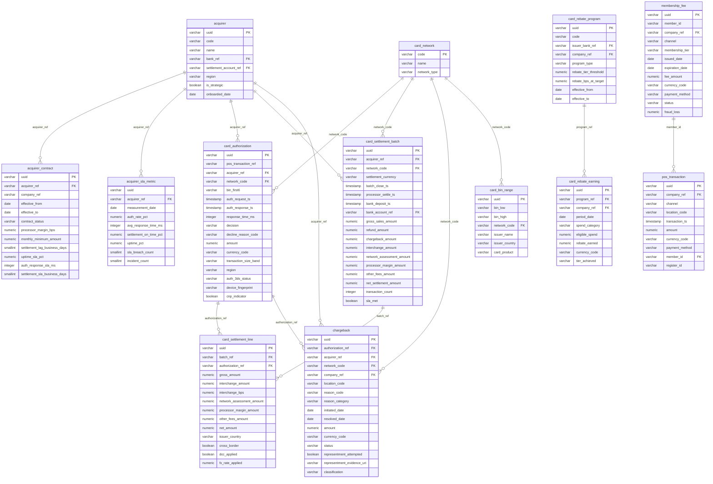

---

### Tables

#### `acquirer` — Grain: Reference | 8 rows

> One row represents a single payment acquirer entity (e.g., Adyen, Stripe, Fiserv) that the business has contracted with to process card payments.

**Columns:**

| Column | Type | Nullable | Description | Example Values / Boundaries |
|--------|------|----------|-------------|---------------------------|
| uuid | varchar(64) | Yes | Unique system-generated identifier for each acquirer record. | System UUID |
| code | varchar(32) | Yes | Short internal code used to identify a payment acquirer. | `ADYEN`, `STRIPE`, `FIS_WORLDPAY` |
| name | varchar(256) | Yes | Full legal or trading name of the payment acquirer. | `Adyen NV`, `JPMorgan Chase Merchant Services` |
| bank_ref | varchar(64) | Yes | Reference code identifying the sponsoring or partner bank; present only for bank-affiliated acquirers. | `BANK_JPM`, `BANK_BNP` |
| settlement_account_ref | varchar(64) | Yes | Reference code identifying the internal operating account into which settlement funds from this acquirer are deposited. | `USA_RGNL_OPERATING` |
| region | varchar(16) | Yes | Geographic region in which the acquirer primarily operates. | `AMER`, `EMEA`, `APAC` |
| is_strategic | boolean | Yes | Flag indicating whether this acquirer is classified as a strategic partner. | `true`, `false` |
| onboarded_date | date | Yes | Date on which the acquirer was formally onboarded and activated. | `2019-03-01` |

**Foreign Key Relationships:**

| Column | References | Join Meaning |
|--------|-----------|-------------|
| bank_ref | bank.code | Identifies the sponsoring bank behind a bank-affiliated acquirer |
| settlement_account_ref | bank_account.code | Links to the internal bank account that receives net settlement deposits from this acquirer |

---

#### `acquirer_contract` — Grain: Reference | 12 rows

> One row represents a single bilateral contract between a specific company legal entity and an acquirer, governing commercial terms such as fees, settlement timing, and SLA obligations.

**Columns:**

| Column | Type | Nullable | Description | Example Values / Boundaries |
|--------|------|----------|-------------|---------------------------|
| uuid | varchar(64) | Yes | Unique system-generated identifier for each acquirer contract record. | System UUID |
| acquirer_ref | varchar(32) | Yes | Code identifying the payment acquirer or processor party to the contract. | `ADYEN`, `STRIPE`, `FIS_WORLDPAY` |
| company_ref | varchar(64) | Yes | Code identifying the legal entity of the company that holds the acquirer contract. | `GR_US_INC`, `GR_EU_BV` |
| effective_from | date | Yes | Date on which the acquirer contract becomes effective. | `2022-01-01` |
| effective_to | date | Yes | Date on which the acquirer contract expires; null indicates an open-ended contract. | `2025-12-31`, null |
| contract_status | varchar(16) | Yes | Current lifecycle status of the acquirer contract. | `ACTIVE`, `EXPIRED`, `PENDING` |
| processor_margin_bps | numeric(9,2) | Yes | The acquirer's processing margin charged to the merchant, expressed in basis points. | `25.00`, `35.00` |
| monthly_minimum_amount | numeric(28,6) | Yes | Minimum monthly fee amount committed to the acquirer under the contract terms. | `5000.000000` |
| monthly_minimum_currency | varchar(16) | Yes | ISO currency code in which the monthly minimum fee amount is denominated. | `USD`, `EUR`, `GBP` |
| settlement_lag_business_days | smallint | Yes | Number of business days between transaction processing and funds receipt from the acquirer. | `1`, `2`, `3` |
| uptime_sla_pct | numeric(6,3) | Yes | Contractually guaranteed minimum uptime percentage for the acquirer's payment processing service. | `99.900`, `99.500` |
| auth_response_sla_ms | integer | Yes | Maximum authorization response time in milliseconds guaranteed by the acquirer under the contract SLA. | `300`, `500` |
| settlement_sla_business_days | smallint | Yes | Maximum number of business days within which the acquirer is contractually obligated to settle funds. | `1`, `2` |
| renewal_notice_days | smallint | Yes | Number of days advance notice required before contract expiry to trigger or prevent renewal. | `90`, `60` |
| auto_renew | boolean | Yes | Flag indicating whether the acquirer contract automatically renews at the end of its term. | `true`, `false` |

**Foreign Key Relationships:**

| Column | References | Join Meaning |
|--------|-----------|-------------|
| acquirer_ref | acquirer.code | Links to the acquirer entity holding this contract |

---

#### `acquirer_sla_metric` — Grain: Snapshot (daily per acquirer) | 6,240 rows

> One row represents the daily operational performance of a single acquirer on a single calendar date, measuring actual service levels against contractual SLA commitments.

**Columns:**

| Column | Type | Nullable | Description | Example Values / Boundaries |
|--------|------|----------|-------------|---------------------------|
| uuid | varchar(64) | Yes | Universally unique identifier assigned to each SLA metric record. | System UUID |
| acquirer_ref | varchar(32) | Yes (PK) | Standardized code identifying the payment acquirer whose SLA performance is being measured. | `STRIPE`, `ADYEN`, `FISERV` |
| measurement_date | date | Yes (PK) | The calendar date on which the SLA metrics were recorded or evaluated. | `2024-03-15` |
| auth_rate_pct | numeric(6,3) | Yes | Percentage of payment authorization attempts that were successfully approved by the acquirer on this date. | `98.500`, `99.200` |
| avg_response_time_ms | integer | Yes | Average time in milliseconds taken by the acquirer to respond to transaction authorization requests. | `185`, `320` |
| settlement_on_time_pct | numeric(6,3) | Yes | Percentage of settlements completed within the contractually agreed timeframe on this date. | `100.000`, `97.800` |
| uptime_pct | numeric(6,3) | Yes | Percentage of time the acquirer's payment processing systems were operational and available. | `99.980`, `99.500` |
| sla_breach_count | smallint | Yes | Number of SLA contractual violations recorded for the acquirer on this date. | `0`, `1`, `2` |
| incident_count | smallint | Yes | Number of operational incidents or service disruptions recorded for the acquirer on this date. | `0`, `1` |

**Foreign Key Relationships:**

| Column | References | Join Meaning |
|--------|-----------|-------------|
| acquirer_ref | acquirer.code | Links daily SLA performance back to the acquirer entity; join to acquirer_contract to compare actuals vs. SLA targets |

---

#### `card_authorization` — Grain: Event | 66,493 rows

> One row represents a single card payment authorization attempt, capturing the acquirer routing, card network, decision outcome, and timing from a specific point-of-sale transaction.

**Columns:**

| Column | Type | Nullable | Description | Example Values / Boundaries |
|--------|------|----------|-------------|---------------------------|
| uuid | varchar(64) | Yes (PK) | Unique system-generated identifier for each card authorization record. | System UUID |
| pos_transaction_ref | varchar(64) | Yes | Unique reference identifier assigned by the point-of-sale system to the originating transaction. | `POS-0001234` |
| acquirer_ref | varchar(32) | Yes | Code identifying the acquiring bank or payment processor that handled the authorization request. | `STRIPE`, `ADYEN`, `FISERV` |
| network_code | varchar(16) | Yes | Card payment network over which the authorization was processed. | `VISA`, `MASTERCARD`, `AMEX` |
| bin_first6 | varchar(8) | Yes | First six digits of the card number (BIN), used to identify the card issuer and product. | `411111`, `555555` |
| auth_request_ts | timestamptz | Yes | Timestamp indicating when the authorization request was sent to the acquirer or network. | `2024-03-15 14:23:01+00` |
| auth_response_ts | timestamptz | Yes | Timestamp indicating when the authorization response was received from the acquirer or network. | `2024-03-15 14:23:01.285+00` |
| response_time_ms | integer | Yes | Elapsed time in milliseconds between the authorization request and response. | `285`, `420`, `1200` |
| decision | varchar(16) | Yes | Outcome of the authorization request. | `APPROVED`, `DECLINED`, `ERROR`, `TIMEOUT` |
| decline_reason_code | varchar(16) | Yes | Issuer-returned reason code explaining why an authorization was declined; null for approved transactions. | `51` (insufficient funds), `14` (invalid card) |
| amount | numeric(28,6) | Yes | Monetary value of the transaction submitted for authorization. | `49.990000`, `1250.000000` |
| currency_code | varchar(16) | Yes | ISO 4217 currency code of the transaction amount. | `USD`, `EUR`, `GBP` |
| transaction_size_band | varchar(16) | Yes | Categorical band grouping the transaction amount into predefined ranges. | `<$25`, `$25-$100`, `$100-$500`, `$500-$5000`, `>$5000` |
| region | varchar(16) | Yes | Geographic region where the transaction originated. | `AMER`, `EMEA`, `APAC`, `LATAM` |
| auth_3ds_status | varchar(16) | Yes | Outcome of the 3D Secure authentication step during the authorization flow. | `FRICTIONLESS`, `CHALLENGED`, `FAILED`, `NOT_ATTEMPTED` |
| device_fingerprint | varchar(128) | Yes | Unique identifier representing the device used to initiate the transaction, for fraud detection. | Hashed device attribute string |
| cnp_indicator | boolean | Yes | Flag indicating whether the transaction was card-not-present (true) as opposed to card-present (false). | `true` (e-commerce), `false` (in-store) |

**Foreign Key Relationships:**

| Column | References | Join Meaning |
|--------|-----------|-------------|
| acquirer_ref | acquirer.code | Identifies which acquirer processed the authorization |
| network_code | card_network.code | Identifies the card scheme used for the authorization |

---

#### `card_bin_range` — Grain: Reference | 22 rows

> One row represents a contiguous range of 6-digit BIN prefixes assigned to a specific card-issuing institution, enabling lookup of issuer identity, country, and card product from a card's first 6 digits.

**Columns:**

| Column | Type | Nullable | Description | Example Values / Boundaries |
|--------|------|----------|-------------|---------------------------|
| uuid | varchar(64) | Yes (PK) | Unique system-generated identifier for each card BIN range record. | System UUID |
| bin_low | varchar(8) | Yes | The lowest 6-digit BIN in a range (starting prefix of cards assigned to this issuer). | `411111`, `510000` |
| bin_high | varchar(8) | Yes | The highest 6-digit BIN in a range (ending prefix of cards assigned to this issuer). | `411199`, `510999` |
| network_code | varchar(16) | Yes | The payment card network or scheme associated with the BIN range. | `VISA`, `MASTERCARD`, `AMEX` |
| issuer_name | varchar(256) | Yes | The name of the financial institution that issued the card associated with this BIN range. | `Chase Issuer`, `RBC Debit` |
| issuer_country | varchar(2) | Yes | ISO 2-letter country code of the card-issuing institution's country. | `US`, `GB`, `JP` |
| card_product | varchar(32) | Yes | The type of card product associated with this BIN range. | `CONSUMER_CREDIT`, `DEBIT`, `COMMERCIAL`, `CHARGE`, `PRIVATE_LABEL`, `PURCHASING` |

**Foreign Key Relationships:**

| Column | References | Join Meaning |
|--------|-----------|-------------|
| network_code | card_network.code | Links BIN ranges to their card network scheme |

---

#### `card_network` — Grain: Reference | 11 rows

> One row represents a distinct card payment network or scheme supported by the platform, identified by a short code.

**Columns:**

| Column | Type | Nullable | Description | Example Values / Boundaries |
|--------|------|----------|-------------|---------------------------|
| code | varchar(16) | Yes (PK) | Unique short-code identifier for a card network. | `VISA`, `MASTERCARD`, `AMEX`, `UNIONPAY` |
| name | varchar(64) | Yes | Human-readable display name of the card network. | `American Express`, `Costco Private Label` |
| network_type | varchar(16) | Yes | Category of the card network indicating its operational scheme type. | `CREDIT`, `DEBIT_PIN`, `CHARGE`, `PRIVATE_LABEL` |

---

#### `card_rebate_earning` — Grain: Event (quarterly per program-company-category) | 220 rows

> One row represents the actual rebate earned by a specific company legal entity from a specific rebate program for a specific spend category in a specific quarterly period.

**Columns:**

| Column | Type | Nullable | Description | Example Values / Boundaries |
|--------|------|----------|-------------|---------------------------|
| uuid | varchar(64) | Yes (PK) | Unique system-generated identifier for each card rebate earning record. | System UUID |
| program_ref | varchar(64) | Yes | Code identifying the card rebate program (e.g., JPMorgan Visa, BNP Purchasing Card, Amex Business). | `REB_JPM_VCARD`, `REB_AMEX_BIZ` |
| company_ref | varchar(64) | Yes | Code identifying the legal entity for which the rebate earning is recorded. | `GR_US_INC`, `GR_EU_BV` |
| period_date | date | Yes | Quarter-end date representing the reporting period for which the rebate earning is calculated. | `2024-03-31`, `2024-06-30` |
| spend_category | varchar(32) | Yes | Classification of the type of business expenditure that generated eligible card spend for rebate purposes. | `Travel`, `Logistics`, `Utilities` |
| eligible_spend | numeric(28,6) | Yes | Total monetary amount of card spend that qualifies for rebate calculation within the reporting period. | `2500000.000000` |
| rebate_earned | numeric(28,6) | Yes | Monetary amount of rebate earned from the card program based on eligible spend for the reporting period. | `6250.000000` |
| currency_code | varchar(16) | Yes | ISO currency code in which the eligible spend and rebate amounts are denominated. | `USD`, `EUR` |
| tier_achieved | varchar(16) | Yes | Rebate tier level attained during the period based on spend volume, determining the applicable rebate rate. | `Base`, `Tier 1`, `Tier 2` |

**Foreign Key Relationships:**

| Column | References | Join Meaning |
|--------|-----------|-------------|
| program_ref | card_rebate_program.code | Links earnings back to the contracted rebate program terms |
| company_ref | company.code | Identifies the legal entity receiving the rebate |

---

#### `card_rebate_program` — Grain: Reference | 4 rows

> One row represents a distinct corporate card rebate program negotiated between a company legal entity and an issuing bank, including the contracted spend threshold, rebate rate, and effective date range.

**Columns:**

| Column | Type | Nullable | Description | Example Values / Boundaries |
|--------|------|----------|-------------|---------------------------|
| uuid | varchar(64) | Yes (PK) | Unique system-generated identifier for each card rebate program record. | System UUID |
| code | varchar(64) | Yes | Short alphanumeric code uniquely identifying a card rebate program. | `REB_JPM_VCARD`, `REB_BNP_PCARD`, `REB_AMEX_BIZ`, `REB_CITI_COMM` |
| issuer_bank_ref | varchar(64) | Yes | Reference code identifying the bank that issues the card associated with the rebate program. | `BANK_JPM`, `BANK_BNP`, `BANK_AMEX`, `BANK_CITI` |
| company_ref | varchar(64) | Yes | Reference code identifying the corporate entity enrolled in the card rebate program. | `GR_HOLDINGS`, `GR_US_INC` |
| program_type | varchar(16) | Yes | Classification of the card rebate program by corporate card type. | `PURCHASING`, `VIRTUAL`, `COMMERCIAL` |
| rebate_tier_threshold | numeric(28,6) | Yes | Minimum spend amount required to qualify for the rebate tier and earn the associated rebate rate. | `1000000.000000`, `5000000.000000` |
| rebate_bps_at_target | numeric(9,2) | Yes | Rebate rate expressed in basis points awarded when the spend target threshold is met. | `25.00`, `50.00`, `75.00` |
| effective_from | date | Yes | Calendar date from which the card rebate program terms become active. | `2023-01-01` |
| effective_to | date | Yes | Calendar date on which the card rebate program terms expire. | `2025-12-31` |

**Foreign Key Relationships:**

| Column | References | Join Meaning |
|--------|-----------|-------------|
| issuer_bank_ref | bank.code | Identifies the issuing bank negotiating the rebate program |
| company_ref | company.code | Identifies the legal entity enrolled in the program |

---

#### `card_settlement_batch` — Grain: Event | 34,745 rows

> One row represents a single settlement batch submitted by the merchant through an acquirer, capturing the aggregate financial outcome including gross sales, deductions, all fee components, and the net deposit to the merchant's bank account.

**Columns:**

| Column | Type | Nullable | Description | Example Values / Boundaries |
|--------|------|----------|-------------|---------------------------|
| uuid | varchar(64) | Yes (PK) | Unique system-generated identifier for each card settlement batch record. | System UUID |
| acquirer_ref | varchar(32) | Yes | Code identifying the acquiring bank or payment processor responsible for settling the batch. | `FISERV`, `STRIPE`, `BANK_OF_AMERICA_MS` |
| network_code | varchar(16) | Yes | Card network over which the transactions in the batch were processed. | `VISA`, `MASTERCARD`, `AMEX` |
| settlement_currency | varchar(16) | Yes | ISO 4217 currency code in which the batch was settled. | `USD`, `CAD`, `GBP` |
| batch_close_ts | timestamptz | Yes | Timestamp indicating when the settlement batch was officially closed by the merchant or POS system. | `2024-03-15 23:59:00+00` |
| processor_settle_ts | timestamptz | Yes | Timestamp indicating when the acquiring processor completed settlement of the batch on their end. | `2024-03-17 08:30:00+00` |
| bank_deposit_ts | timestamptz | Yes | Timestamp indicating when the net settlement funds were deposited into the merchant's bank account. | `2024-03-17 12:00:00+00` |
| bank_account_ref | varchar(64) | Yes | Reference code identifying the merchant bank account into which the settlement funds were deposited. | `USA_RGNL_OPERATING` |
| gross_sales_amount | numeric(28,6) | Yes | Total value of all sales transactions included in the settlement batch before any deductions. | `485230.450000` |
| refund_amount | numeric(28,6) | Yes | Total monetary value of customer refunds or credits included in the settlement batch. | `3250.000000` |
| chargeback_amount | numeric(28,6) | Yes | Total monetary value of chargebacks or disputed transactions deducted within the settlement batch. | `1500.000000` |
| interchange_amount | numeric(28,6) | Yes | Total interchange fees charged by card networks and paid to issuing banks within the settlement batch. | `9704.609000` |
| network_assessment_amount | numeric(28,6) | Yes | Total fees assessed by the card network (e.g., Visa, Mastercard) on top of interchange for the batch. | `1940.921800` |
| processor_margin_amount | numeric(28,6) | Yes | Fee amount retained by the acquiring processor as their margin or markup on the settlement batch. | `1212.076125` |
| other_fees_amount | numeric(28,6) | Yes | Total of any additional miscellaneous fees deducted from the settlement batch. | `250.000000` |
| net_settlement_amount | numeric(28,6) | Yes | Final amount deposited to the merchant after all deductions (refunds, chargebacks, interchange, and fees) have been applied. | `469372.843075` |
| transaction_count | integer | Yes | Number of individual card transactions included in the settlement batch. | `1250`, `3400` |
| sla_met | boolean | Yes | Flag indicating whether the settlement batch was processed within the agreed SLA timeframe. | `true`, `false` |

**Foreign Key Relationships:**

| Column | References | Join Meaning |
|--------|-----------|-------------|
| acquirer_ref | acquirer.code | Identifies which acquirer processed and settled this batch |
| network_code | card_network.code | Identifies which card scheme the batch belongs to |
| bank_account_ref | bank_account.code | Identifies the merchant bank account that received the net settlement deposit |
| bank_account_ref | cash_balance.account_ref | Enables correlation of settlement deposits with observed cash balance changes |

---

#### `card_settlement_line` — Grain: Event (per settled transaction) | 63,237 rows

> One row represents a single settled card transaction within a settlement batch, recording the complete fee waterfall from gross amount down to net amount for that individual transaction.

**Columns:**

| Column | Type | Nullable | Description | Example Values / Boundaries |
|--------|------|----------|-------------|---------------------------|
| uuid | varchar(64) | Yes (PK) | Unique system-generated identifier for each card settlement line record. | System UUID |
| batch_ref | varchar(64) | Yes | Reference identifier grouping multiple settlement line items into a single processing batch. | Links to card_settlement_batch.uuid |
| authorization_ref | varchar(64) | Yes | Reference identifier linking a settlement line to its originating card authorization event. | Links to card_authorization.uuid |
| gross_amount | numeric(28,6) | Yes | Total transaction amount before any fees or deductions are applied at settlement. | `149.990000` |
| interchange_amount | numeric(28,6) | Yes | Monetary amount charged as interchange fee by the card-issuing network for processing the transaction. | `3.149790` |
| interchange_bps | numeric(9,2) | Yes | Interchange fee expressed in basis points; the rate applied to the transaction amount. | `210.00`, `160.00`, `350.00` |
| network_assessment_amount | numeric(28,6) | Yes | Fee assessed by the card network (Visa, Mastercard) on top of interchange for each settled transaction. | `0.629958` |
| processor_margin_amount | numeric(28,6) | Yes | Monetary amount representing the payment processor's margin or markup charged on the settlement line. | `0.374975` |
| other_fees_amount | numeric(28,6) | Yes | Catch-all monetary amount for miscellaneous fees applied to the settlement line not categorized elsewhere. | `0.000000`, `0.100000` |
| net_amount | numeric(28,6) | Yes | Final settled amount after all fees (interchange, network assessment, processor margin, and other fees) have been deducted from the gross amount. | `145.835277` |
| issuer_country | varchar(2) | Yes | ISO 3166-1 alpha-2 country code indicating the country where the card-issuing bank is based. | `US`, `DE`, `JP` |
| cross_border | boolean | Yes | Flag indicating whether the transaction was processed across national borders (merchant and issuer countries differ). | `true`, `false` |
| dcc_applied | boolean | Yes | Flag indicating whether Dynamic Currency Conversion was applied, allowing the cardholder to pay in their home currency. | `true`, `false` |
| fx_rate_applied | numeric(20,10) | Yes | Foreign exchange rate used to convert the transaction amount between currencies at settlement; null if no conversion occurred. | `1.0823456789` |

**Foreign Key Relationships:**

| Column | References | Join Meaning |
|--------|-----------|-------------|
| authorization_ref | card_authorization.uuid | Links each settled line to its originating authorization event; enables full transaction traceability |
| batch_ref | card_settlement_batch.uuid | Groups lines into their parent settlement batch |
| issuer_country | fraud_loss.issuer_country | Enables correlation of cross-border settlement lines with fraud loss data by issuer country |

---

#### `chargeback` — Grain: Event | 906 rows

> One row represents a single chargeback case raised against the merchant by an issuing bank, tracking the full lifecycle from initiation through resolution including reason, outcome, and representment evidence.

**Columns:**

| Column | Type | Nullable | Description | Example Values / Boundaries |
|--------|------|----------|-------------|---------------------------|
| uuid | varchar(64) | Yes (PK) | Unique system-generated identifier for each chargeback record. | System UUID |
| authorization_ref | varchar(64) | Yes | UUID reference to the original payment authorization that is subject to the chargeback. | Links to card_authorization.uuid |
| acquirer_ref | varchar(32) | Yes | Code identifying the acquiring bank or payment processor that handled the original transaction. | `STRIPE`, `ADYEN`, `CHASE_PAYTECH` |
| network_code | varchar(16) | Yes | The card network over which the chargeback was filed. | `VISA`, `MASTERCARD`, `AMEX` |
| company_ref | varchar(64) | Yes | Code identifying the legal entity or regional subsidiary of the merchant against which the chargeback was raised. | `GR_US_INC`, `GR_GB` |
| location_code | varchar(64) | Yes | Code identifying the warehouse or fulfilment location associated with the disputed transaction. | `WH_US_0004`, `WH_GB_0007` |
| reason_code | varchar(16) | Yes | Card-network-specific numeric reason code assigned to the chargeback. | `10.4` (Visa fraud), `4855` (MC goods not received) |
| reason_category | varchar(32) | Yes | High-level business category grouping the chargeback reason. | `FRAUD`, `NON_RECEIPT`, `NOT_AS_DESCRIBED` |
| initiated_date | date | Yes | Calendar date on which the chargeback was formally initiated by the issuing bank. | `2024-03-20` |
| resolved_date | date | Yes | Calendar date on which the chargeback case was closed or resolved; null for open cases. | `2024-05-10`, null |
| amount | numeric(28,6) | Yes | Monetary value of the chargeback disputed by the cardholder. | `149.990000` |
| currency_code | varchar(16) | Yes | ISO 4217 currency code in which the chargeback amount is denominated. | `USD`, `GBP`, `EUR` |
| status | varchar(16) | Yes | Current lifecycle status of the chargeback case. | `WON`, `LOST`, `REPRESENTED`, `INITIATED` |
| representment_attempted | boolean | Yes | Flag indicating whether the merchant submitted a representment (dispute rebuttal) in response to the chargeback. | `true`, `false` |
| representment_evidence_uri | varchar(1024) | Yes | Storage URI pointing to the PDF document containing the evidence package submitted during representment. | `s3://chargebacks/evidence/CB-001234.pdf` |
| classification | varchar(16) | Yes | Internal classification of the root cause of the chargeback. | `MERCHANT_ERROR`, `TRUE_FRAUD`, `FRIENDLY_FRAUD` |

**Foreign Key Relationships:**

| Column | References | Join Meaning |
|--------|-----------|-------------|
| authorization_ref | card_authorization.uuid | Links the chargeback back to the original transaction that was disputed |
| acquirer_ref | acquirer.code | Identifies the acquirer through which the original transaction was processed |
| network_code | card_network.code | Identifies the card network that administered the chargeback |
| company_ref | company.code | Identifies the merchant legal entity bearing the chargeback liability |

---

#### `pos_transaction` — Grain: Event | 80,000 rows

> One row represents a single customer sale transaction at any channel (in-warehouse, e-commerce, kiosk, mobile app, membership renewal), including the payment method used and optionally the member account linked to the sale.

**Columns:**

| Column | Type | Nullable | Description | Example Values / Boundaries |
|--------|------|----------|-------------|---------------------------|
| uuid | varchar(64) | Yes (PK) | Unique system-generated identifier for each point-of-sale transaction record. | System UUID |
| company_ref | varchar(64) | Yes | Code identifying the legal entity or country-specific subsidiary under which the transaction was recorded. | `GR_MX`, `GR_US_INC` |
| channel | varchar(32) | Yes | The sales channel through which the transaction was completed. | `in-warehouse`, `e-commerce`, `kiosk`, `mobile-app`, `membership-renewal` |
| location_code | varchar(64) | Yes | Identifier for the physical warehouse or store location where the transaction took place. | `WH_US_0039`, `WH_GB_0007` |
| transaction_ts | timestamptz | Yes | The exact date and time at which the point-of-sale transaction occurred. | `2024-03-15 14:22:58+00` |
| amount | numeric(28,6) | Yes | The monetary value of the transaction in the applicable currency. | `49.990000`, `1250.000000` |
| currency_code | varchar(16) | Yes | The ISO 4217 currency code in which the transaction amount is denominated. | `USD`, `EUR`, `JPY` |
| payment_method | varchar(16) | Yes | The method of payment used by the customer to complete the transaction. | `card`, `cash`, `mobile-wallet`, `gift-card`, `check` |
| member_id | varchar(64) | Yes | The unique identifier of the membership account associated with the transaction; null when not linked to a member. | `MBR-001234`, null |
| register_id | varchar(32) | Yes | The identifier of the physical or virtual register terminal that processed the transaction. | `REG-06`, `REG-12` |

**Foreign Key Relationships:**

| Column | References | Join Meaning |
|--------|-----------|-------------|
| company_ref | company.code | Identifies the legal entity recording the transaction |
| member_id | membership_fee.member_id | Links the transaction to the member's membership record for loyalty analysis |

---

#### `membership_fee` — Grain: Event | 30,000 rows

> One row represents a single membership fee transaction issued to a member, capturing the tier, channel, fee amount, payment method, and collection outcome for each annual membership renewal or new sign-up.

**Columns:**

| Column | Type | Nullable | Description | Example Values / Boundaries |
|--------|------|----------|-------------|---------------------------|
| uuid | varchar(64) | Yes (PK) | Unique system-generated identifier for each membership fee record. | System UUID |
| member_id | varchar(64) | Yes | Unique identifier for the member associated with the fee. | `MBR-001234`, `MBR-099999` |
| company_ref | varchar(64) | Yes | Code identifying the regional or national company entity that collected the membership fee. | `GR_US_INC`, `GR_GB` |
| channel | varchar(16) | Yes | The sales or renewal channel through which the membership fee was collected. | `in-warehouse`, `e-commerce`, `auto-renewal`, `mail-renewal`, `new-sign-up` |
| membership_tier | varchar(32) | Yes | The tier level of the membership for which the fee was charged. | `Gold`, `Executive`, `Business` |
| issued_date | date | Yes | The date on which the membership fee was issued or the membership period began. | `2024-01-15` |
| expiration_date | date | Yes | The date on which the membership associated with this fee expires or is due for renewal. | `2025-01-14` |
| fee_amount | numeric(28,6) | Yes | The monetary amount charged for the membership fee. | `65.000000`, `120.000000`, `130.000000` |
| currency_code | varchar(16) | Yes | The ISO currency code in which the membership fee amount is denominated; currently always USD. | `USD` |
| payment_method | varchar(16) | Yes | The method used by the member to pay the membership fee; currently always card-based payment. | `card` |
| status | varchar(16) | Yes | The current collection status of the membership fee. | `collected`, `failed`, `chargeback`, `refunded` |
| fraud_loss | numeric(28,6) | Yes | The monetary amount lost due to fraudulent activity on the membership fee transaction; 0 when no fraud confirmed. | `0.000000`, `65.000000`, `120.000000` |

**Foreign Key Relationships:**

| Column | References | Join Meaning |
|--------|-----------|-------------|
| company_ref | company.code | Identifies the legal entity that collected the membership fee |

---

### KPIs Computable from This Sub-domain

| KPI | Formula / Method | Tables Required |
|-----|-----------------|----------------|
| Authorization Rate | `COUNT(*) FILTER (WHERE decision = 'APPROVED') / COUNT(*) * 100` grouped by acquirer_ref, date | `card_authorization` |
| Chargeback Rate (by volume) | `COUNT(chargeback) / COUNT(card_settlement_line) * 100` for matching period | `chargeback`, `card_settlement_line` |
| Chargeback Rate (by value) | `SUM(chargeback.amount) / SUM(card_settlement_batch.gross_sales_amount) * 100` | `chargeback`, `card_settlement_batch` |
| Effective Interchange Rate (bps) | `SUM(interchange_amount) / SUM(gross_amount) * 10000` by acquirer or network | `card_settlement_line` |
| Total Card Acceptance Cost (bps) | `SUM(interchange_amount + network_assessment_amount + processor_margin_amount + other_fees_amount) / SUM(gross_amount) * 10000` | `card_settlement_line` |
| Settlement SLA Compliance Rate | `COUNT(*) FILTER (WHERE sla_met = true) / COUNT(*) * 100` by acquirer | `card_settlement_batch` |
| Acquirer Uptime vs. Contracted SLA | Compare `acquirer_sla_metric.uptime_pct` against `acquirer_contract.uptime_sla_pct` per acquirer | `acquirer_sla_metric`, `acquirer_contract` |
| Card Rebate Yield (bps) | `SUM(rebate_earned) / SUM(eligible_spend) * 10000` per program or company | `card_rebate_earning` |
| Representment Win Rate | `COUNT(*) FILTER (WHERE status = 'WON' AND representment_attempted = true) / COUNT(*) FILTER (WHERE representment_attempted = true) * 100` | `chargeback` |
| Membership Fee Fraud Loss Rate | `SUM(fraud_loss) / SUM(fee_amount) * 100` by company or tier | `membership_fee` |

---

### Common BA Questions

**Q: Which acquirer has the highest chargeback rate this quarter, and is it breaching card network thresholds (typically 1% by volume)?**
Join `chargeback` to `card_settlement_batch` on `acquirer_ref`, group by acquirer and quarter, compute chargeback count divided by settled transaction count. Cross-reference with `acquirer_contract` to identify whether the acquirer has escalation clauses.

**Q: What is our blended interchange cost in basis points across Visa vs. Mastercard for the last 12 months?**
Aggregate `card_settlement_line.interchange_amount` and `card_settlement_line.gross_amount` grouped by `card_settlement_batch.network_code`, then compute bps as `SUM(interchange_amount) / SUM(gross_amount) * 10000`. Join `card_settlement_line` to `card_settlement_batch` via `batch_ref`.

**Q: Is Adyen meeting its authorization response time SLA of 300ms on a daily basis?**
Select from `acquirer_sla_metric` where `acquirer_ref = 'ADYEN'`, compare `avg_response_time_ms` against `acquirer_contract.auth_response_sla_ms`. Flag days where the metric exceeds the contract term.

**Q: How much card rebate revenue did we earn last year, and which company entity achieved the highest rebate tier?**
Aggregate `card_rebate_earning.rebate_earned` by `company_ref` and `period_date` for the relevant year. Group by `tier_achieved` to identify tier attainment patterns. Join to `card_rebate_program` to see the contracted bps rate and whether actual earnings align.

**Q: What percentage of chargebacks were caused by fraud versus merchant error versus friendly fraud, and what is our representment win rate for fraud chargebacks?**
Group `chargeback` by `classification` and compute counts and amounts. For fraud chargebacks specifically, compute `COUNT(*) FILTER (WHERE status = 'WON' AND representment_attempted = true) / COUNT(*) FILTER (WHERE representment_attempted = true)`.

**Q: Which card product types (credit vs. debit, consumer vs. commercial) drive the highest interchange rates?**
Join `card_settlement_line` to `card_authorization` on `authorization_ref`, then join `card_authorization.bin_first6` to `card_bin_range` using a range lookup (`bin_first6 BETWEEN bin_low AND bin_high`). Group by `card_bin_range.card_product` and compute `AVG(interchange_bps)`.

**Q: How many days did it take to deposit settlement funds into our bank account for each acquirer last month (i.e., actual settlement lag)?**
Compute `DATE_DIFF(bank_deposit_ts::date, batch_close_ts::date)` from `card_settlement_batch`, group by `acquirer_ref`, and compare to `acquirer_contract.settlement_lag_business_days`.

---

## Sub-domain 6: FX & Derivatives

### Overview

Foreign exchange (FX) risk is one of the primary financial risks for a multinational corporation. It arises whenever a legal entity holds assets, liabilities, revenues, or costs denominated in a currency other than its functional (home) currency. A U.S. entity that owes EUR-denominated invoices to European suppliers, for example, is exposed to EUR/USD rate movements between the time the obligation is incurred and the time payment is made. If EUR strengthens against USD in that interval, the company pays more in USD terms than anticipated — a translation loss. Treasury's role is to identify, quantify, and hedge these exposures using derivative instruments.

The FX forward is the primary hedging instrument in this domain. In an FX forward, the company contracts with a bank counterparty today to exchange a fixed amount of one currency for another at a pre-agreed rate (`forward_rate`) on a specific future settlement date (`value_date`). By locking in the rate, treasury eliminates the uncertainty of spot rate movements. The `fx_forward` table records each deal from inception through its lifecycle (`active`, `settled`, or `cancelled`), capturing the buy and sell currencies, notional amounts, contracted forward rate, and the spot rate prevailing at the time of trade. The difference between the contracted forward rate and the prevailing spot rate represents the forward points — a function of interest rate differentials between the two currency zones.

Mark-to-market (MTM) valuation is the daily accounting process of revaluing outstanding derivative contracts at current market prices rather than their original contracted rates. If the spot rate moves favorably after a forward is executed, the contract has a positive MTM value (an asset); if it moves adversely, the MTM is negative (a liability). The `derivative_mtm` table stores these daily fair value snapshots — one row per instrument per valuation date — standardized in USD. Treasury uses MTM positions for hedge accounting (IFRS 9 or ASC 815 effectiveness testing), for counterparty credit exposure monitoring, and for reporting to the CFO on the fair value of the hedging portfolio.

FX exposure forecasting is the upstream process that drives hedging decisions. Before a forward is placed, treasury must estimate the company's future FX cash flows by currency, entity, and tenor — accounts receivable in foreign currencies, intercompany loan repayments, anticipated purchase orders. The `fx_exposure_forecast` table holds these forward-looking estimates with vintage tracking via `snapshot_date`, allowing treasury to compare successive forecast versions and measure forecast accuracy. The `benchmark_rate` table completes the picture by providing the risk-free rates (SOFR, SONIA, ESTR, TIIE) used to compute forward points, discount cash flows for MTM calculations, and benchmark the cost of carry on hedging positions.

---

### Key Business Entities

- **FX Forward**: A derivative contract obligating the company to buy one currency and sell another at a locked-in rate on a future settlement date; the primary instrument used to hedge FX exposure.
- **FX Rate**: Daily spot and closing exchange rates between currency pairs sourced from Bloomberg, ECB, and internal systems; used for currency translation, revaluation, and settlement.
- **FX Exposure Forecast**: A forward-looking estimate of a legal entity's net FX cash flow exposure by currency pair, tenor bucket, and business source; drives hedging program sizing.
- **Derivative MTM**: A daily mark-to-market snapshot of the fair value of each outstanding FX forward contract, used for hedge accounting, P&L reporting, and counterparty credit exposure.
- **Benchmark Rate**: Published risk-free interest rates (SOFR, SONIA, ESTR, EURIBOR, TIIE) by tenor, sourced from central banks; used to compute forward points and discount rates.

---

### Entity Relationship Diagram

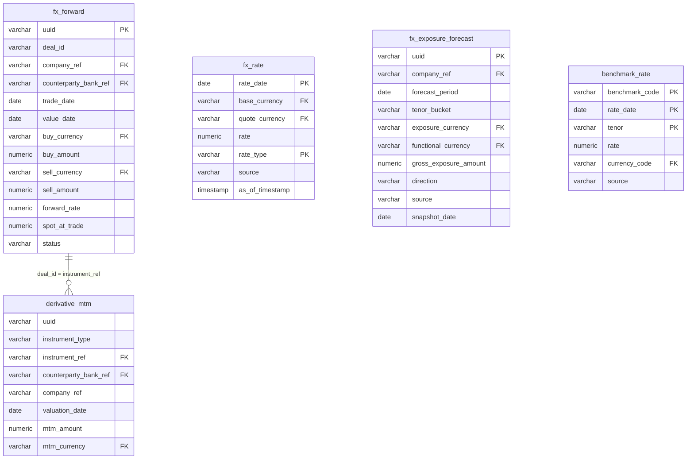

---

### Tables

#### `fx_forward` — Grain: Event (per deal) | 1,800 rows

> One row represents a single FX forward contract entered into by a group legal entity with a bank counterparty, locking in an exchange rate for a future currency delivery date.

**Columns:**

| Column | Type | Nullable | Description | Example Values / Boundaries |
|--------|------|----------|-------------|---------------------------|
| uuid | varchar(64) | Yes (PK) | Unique system-generated identifier for each FX forward contract record. | System UUID |
| deal_id | varchar(64) | Yes | Human-readable business identifier assigned to each FX forward deal. | `FXF-0001653`, `FXF-0001248` |
| company_ref | varchar(64) | Yes | Code identifying the internal legal entity or subsidiary that entered into the FX forward contract. | `GR_US_INC`, `GR_EU_BV`, `GR_GB` |
| counterparty_bank_ref | varchar(64) | Yes | Code identifying the external bank counterparty with whom the FX forward contract was executed. | `BANK_JPM`, `BANK_HSBC`, `BANK_CITI` |
| trade_date | date | Yes | The date on which the FX forward contract was agreed and executed. | `2024-01-15` |
| value_date | date | Yes | The future settlement date on which the currency exchange under the FX forward contract is due to occur. | `2024-04-15` |
| buy_currency | varchar(16) | Yes | The ISO currency code of the currency that the company is purchasing under the FX forward contract. | `EUR`, `GBP`, `JPY`, `AUD` |
| buy_amount | numeric(28,6) | Yes | The notional amount of the buy currency to be received by the company at settlement. | `5000000.000000`, `2500000.000000` |
| sell_currency | varchar(16) | Yes | The ISO currency code of the currency the company is selling under the FX forward; consistently USD across all records. | `USD` |
| sell_amount | numeric(28,6) | Yes | The notional amount of the sell currency to be paid by the company at settlement. | `5412500.000000` |
| forward_rate | numeric(20,10) | Yes | The contracted exchange rate agreed at inception for the future delivery of the buy currency against the sell currency. | `1.0825000000` |
| spot_at_trade | numeric(20,10) | Yes | The prevailing spot exchange rate of the currency pair at the time the FX forward was traded. | `1.0750000000` |
| status | varchar(16) | Yes | The current lifecycle status of the FX forward contract. | `ACTIVE`, `SETTLED`, `CANCELLED` |

**Foreign Key Relationships:**

| Column | References | Join Meaning |
|--------|-----------|-------------|
| buy_currency | currency.code | Identifies the purchased currency |
| sell_currency | currency.code | Identifies the sold currency (USD) |
| company_ref | company.code | Identifies the group legal entity holding the forward contract |
| counterparty_bank_ref | bank.code | Identifies the bank counterparty on the deal |

---

#### `fx_rate` — Grain: Snapshot (daily per currency pair and rate type) | 730,475 rows

> One row represents the exchange rate for a specific base-to-quote currency pair on a given calendar date and rate type (spot, daily close, or average), sourced from Bloomberg, ECB, or internal systems.

**Columns:**

| Column | Type | Nullable | Description | Example Values / Boundaries |
|--------|------|----------|-------------|---------------------------|
| rate_date | date | Yes (PK) | The calendar date for which the foreign exchange rate is valid or effective. | `2024-03-15` |
| base_currency | varchar(16) | Yes (PK) | The ISO 4217 currency code of the base (from) currency in the exchange rate pair. | `USD`, `EUR`, `GBP` |
| quote_currency | varchar(16) | Yes (PK) | The ISO 4217 currency code of the quote (to) currency in the exchange rate pair. | `EUR`, `GBP`, `JPY` |
| rate | numeric(20,10) | Yes | The numeric exchange rate representing how many units of the quote currency equal one unit of the base currency. | `0.9215000000` (USD/EUR), `152.3500000000` (USD/JPY) |
| rate_type | varchar(16) | Yes (PK) | The type of exchange rate recorded, indicating whether it is a spot, daily closing, or average rate. | `SPOT`, `CLOSE`, `AVERAGE` |
| source | varchar(64) | Yes | The data provider or origin of the exchange rate. | `Bloomberg`, `ECB`, internal system |
| as_of_timestamp | timestamptz | Yes | The exact date and time at which the exchange rate record was last updated or loaded into the system. | `2024-03-15 16:00:00+00` |

**Foreign Key Relationships:**

| Column | References | Join Meaning |
|--------|-----------|-------------|
| base_currency | currency.code | Identifies the base currency of the rate pair |
| quote_currency | currency.code | Identifies the quote currency of the rate pair |

---

#### `fx_exposure_forecast` — Grain: Snapshot (monthly per entity-currency-tenor-source) | 1,500 rows

> One row represents the gross FX exposure forecast for a specific company entity, exposure currency, tenor bucket, and business source for a future forecast period, captured as of a specific snapshot date to enable vintage tracking.

**Columns:**

| Column | Type | Nullable | Description | Example Values / Boundaries |
|--------|------|----------|-------------|---------------------------|
| uuid | varchar(64) | Yes (PK) | Unique system-generated identifier for each FX exposure forecast record. | System UUID |
| company_ref | varchar(64) | Yes | Code identifying the legal entity or subsidiary within the group that holds the FX exposure. | `GR_US_INC`, `GR_EU_BV`, `GR_JP` |
| forecast_period | date | Yes | Month-end date representing the future period for which the FX exposure is being forecast. | `2024-06-30`, `2024-09-30` |
| tenor_bucket | varchar(8) | Yes | Time-horizon bucket classifying the forecast exposure by maturity range. | `<1M`, `1-3M`, `3-6M` |
| exposure_currency | varchar(16) | Yes | ISO currency code of the foreign currency in which the exposure is denominated. | `EUR`, `GBP`, `JPY` |
| functional_currency | varchar(16) | Yes | ISO currency code of the reporting entity's functional (home) currency against which the FX exposure is measured. | `USD`, `GBP`, `EUR` |
| gross_exposure_amount | numeric(28,6) | Yes | Total gross monetary value of the forecasted FX exposure in the exposure currency before any netting or hedging. | `8500000.000000` |
| direction | varchar(8) | Yes | Indicates whether the exposure represents a long (receivable/asset) or short (payable/liability) position in the foreign currency. | `LONG`, `SHORT` |
| source | varchar(32) | Yes | Business origin or category of the FX exposure. | `AP`, `AR`, `INTERCOMPANY_LOAN`, `COMMERCIAL_CASHFLOW` |
| snapshot_date | date | Yes | Month-end date on which the FX exposure forecast data was captured or refreshed, used to track forecast vintages over time. | `2024-03-31` |

**Foreign Key Relationships:**

| Column | References | Join Meaning |
|--------|-----------|-------------|
| company_ref | company.code | Identifies the legal entity holding the FX exposure |
| exposure_currency | currency.code | Identifies the foreign currency of the exposure |
| functional_currency | currency.code | Identifies the entity's home currency against which the exposure is measured |

---

#### `derivative_mtm` — Grain: Snapshot (daily per instrument) | 36,569 rows

> One row represents the mark-to-market fair value of a specific FX forward contract on a specific valuation date, expressed in USD, used for daily P&L reporting and hedge accounting.

**Columns:**

| Column | Type | Nullable | Description | Example Values / Boundaries |
|--------|------|----------|-------------|---------------------------|
| uuid | varchar(64) | Yes | Universally unique identifier assigned to each mark-to-market record for deduplication and system tracking. | System UUID |
| instrument_type | varchar(32) | Yes | Classification of the derivative instrument being valued; all current records represent FX forward contracts. | `FX_FORWARD` |
| instrument_ref | varchar(64) | Yes (PK) | Unique business reference code identifying a specific derivative instrument. | `FXF-0001248`, `FXF-0001653` |
| counterparty_bank_ref | varchar(64) | Yes | Reference code identifying the external bank acting as the counterparty on the derivative contract. | `BANK_JPM`, `BANK_HSBC` |
| company_ref | varchar(64) | Yes | Reference code identifying the internal group legal entity that holds the derivative instrument. | `GR_US_INC`, `GR_EU_BV` |
| valuation_date | date | Yes (PK) | The date on which the derivative instrument was marked to market and the MTM value was calculated. | `2024-03-15` |
| mtm_amount | numeric(28,6) | Yes | The mark-to-market fair value of the derivative instrument expressed in the reporting currency as of the valuation date. Positive = asset (favorable rate movement); negative = liability (adverse movement). | `125000.000000`, `-43500.000000` |
| mtm_currency | varchar(16) | Yes | The currency in which the mark-to-market amount is denominated; currently standardized to USD across all records. | `USD` |

**Foreign Key Relationships:**

| Column | References | Join Meaning |
|--------|-----------|-------------|
| instrument_ref | fx_forward.deal_id | Links the MTM valuation to the underlying FX forward contract details (notional, rate, maturity) |
| counterparty_bank_ref | bank.code | Identifies the bank counterparty for credit exposure monitoring |
| mtm_currency | currency.code | Identifies the reporting currency of the MTM amount |

---

#### `benchmark_rate` — Grain: Snapshot (daily per benchmark-tenor) | 20,225 rows

> One row represents the annualised published benchmark interest rate for a specific benchmark code (e.g., SOFR, SONIA, ESTR), observation date, and maturity tenor, sourced from central banks.

**Columns:**

| Column | Type | Nullable | Description | Example Values / Boundaries |
|--------|------|----------|-------------|---------------------------|
| benchmark_code | varchar(32) | Yes (PK) | Unique code identifying the interest rate benchmark. | `SOFR`, `SONIA`, `ESTR`, `EURIBOR_3M`, `TIIE` |
| rate_date | date | Yes (PK) | The calendar date on which the benchmark interest rate was published or observed. | `2024-03-15` |
| tenor | varchar(8) | Yes (PK) | The maturity or term of the benchmark rate, indicating the time horizon for which the rate applies. | `ON` (overnight), `1M`, `3M` |
| rate | numeric(9,6) | Yes | The annualised benchmark interest rate value expressed as a percentage. | `5.330000` (SOFR overnight), `5.196000` (SONIA) |
| currency_code | varchar(16) | Yes | The ISO 4217 currency code indicating the currency in which the benchmark rate is denominated. | `USD` (SOFR), `GBP` (SONIA), `EUR` (ESTR/EURIBOR) |
| source | varchar(64) | Yes | The data provider or origin from which the benchmark rate was sourced; currently always a central bank. | `Federal Reserve`, `Bank of England`, `ECB` |

**Foreign Key Relationships:**

| Column | References | Join Meaning |
|--------|-----------|-------------|
| currency_code | bank_account.currency_ref | Links benchmark rates to currencies used in bank accounts; enables interest accrual calculations on cash balances and floating-rate borrowings denominated in those currencies |

---

### KPIs Computable from This Sub-domain

| KPI | Formula / Method | Tables Required |
|-----|-----------------|----------------|
| Hedge Ratio (by currency) | `SUM(fx_forward.buy_amount) FILTER (WHERE status = 'ACTIVE') / SUM(fx_exposure_forecast.gross_exposure_amount)` per exposure_currency, matched by period | `fx_forward`, `fx_exposure_forecast` |
| Total Portfolio MTM (net fair value) | `SUM(mtm_amount)` across all active instruments as of the latest `valuation_date` | `derivative_mtm` |
| MTM Change (daily P&L on hedging portfolio) | `SUM(mtm_amount) WHERE valuation_date = T` minus `SUM(mtm_amount) WHERE valuation_date = T-1` | `derivative_mtm` |
| Forward Points (cost of hedging) | `(fx_forward.forward_rate - fx_forward.spot_at_trade) / fx_forward.spot_at_trade * 10000` expressed in bps per deal, aggregated by currency | `fx_forward` |
| FX Translation Gain/Loss (unrealized) | `SUM(gross_exposure_amount * (spot_rate_today - spot_rate_at_inception))` for unhedged exposures; requires joining `fx_exposure_forecast` with `fx_rate` | `fx_exposure_forecast`, `fx_rate` |
| Counterparty Credit Exposure (by bank) | `SUM(mtm_amount) FILTER (WHERE mtm_amount > 0)` grouped by `counterparty_bank_ref` — positive MTM represents credit risk to the counterparty | `derivative_mtm` |
| Forecast Accuracy (exposure vs. actuals) | Compare `gross_exposure_amount` at snapshot date T against actuals realized at `forecast_period`; requires a realized exposure source | `fx_exposure_forecast` |
| Benchmark Rate Trend (SOFR/SONIA) | `SELECT rate_date, rate FROM benchmark_rate WHERE benchmark_code = 'SOFR' AND tenor = 'ON' ORDER BY rate_date` | `benchmark_rate` |

---

### Common BA Questions

**Q: What is the current total mark-to-market value of our FX hedging portfolio, and which individual deals have the largest negative MTM (i.e., the most adverse)?**
Select from `derivative_mtm` for the latest `valuation_date`, join to `fx_forward` on `instrument_ref = deal_id` for deal details. Order by `mtm_amount` ascending to identify the most adverse positions.

**Q: For EUR/USD exposure, what percentage of our forecast exposure for the next quarter is currently hedged with active FX forwards?**
Compute `SUM(fx_forward.buy_amount) WHERE buy_currency = 'EUR' AND status = 'ACTIVE' AND value_date BETWEEN [quarter_start] AND [quarter_end]` divided by `SUM(fx_exposure_forecast.gross_exposure_amount) WHERE exposure_currency = 'EUR' AND forecast_period BETWEEN [quarter_start] AND [quarter_end] AND snapshot_date = [latest_snapshot]`.

**Q: How has the SOFR overnight rate moved over the last 6 months, and what is the implied impact on our floating-rate borrowing costs?**
Query `benchmark_rate` where `benchmark_code = 'SOFR'` and `tenor = 'ON'` for the trailing 6 months. Rate movements in SOFR flow directly through to floating-rate borrowings — join to the `borrowing` table (outside this sub-domain) to quantify the interest cost impact.

**Q: Which bank counterparties carry the highest positive MTM exposure (counterparty credit risk) in our derivatives portfolio?**
Aggregate `derivative_mtm.mtm_amount` by `counterparty_bank_ref` where `mtm_amount > 0` and `valuation_date = [latest]`. Positive MTM means the company is owed money by the counterparty — this is the credit exposure.

**Q: How accurate were our FX exposure forecasts? Did the forecasted EUR/USD exposure for Q2 match what actually settled?**
Compare `fx_exposure_forecast` records for `forecast_period = [Q2 end]` captured at different `snapshot_date` vintages. This requires a realized exposure table (from actual AP/AR transactions) to measure forecast miss. Within this sub-domain, compare successive vintages to assess forecast revision patterns.

**Q: What is the average forward points spread the treasury desk is paying on EUR/USD forwards vs. the current benchmark rate differential?**
Compute `(forward_rate - spot_at_trade)` for each `fx_forward` where `buy_currency = 'EUR'`, then join `benchmark_rate` to retrieve the USD SOFR and EUR ESTR rates at `trade_date` to compare the observed spread to the theoretical interest rate parity-implied forward points.

**Q: Are any FX forward contracts maturing in the next 30 days without a corresponding replacement hedge being in place?**
Filter `fx_forward` where `status = 'ACTIVE'` and `value_date BETWEEN CURRENT_DATE AND CURRENT_DATE + 30`. Cross-reference against `fx_exposure_forecast` for the same period and currency to identify gaps in hedging coverage.
## Sub-domain 7: Investments

### Overview

Corporate treasury invests excess cash that is not needed for immediate operational purposes. Rather than leaving idle cash in low-yield current accounts, treasury teams deploy it into a range of short-to-medium-term financial instruments that balance liquidity, safety, and yield. The governing principle is the "Safety–Liquidity–Yield" hierarchy: capital preservation comes first, same-day or next-day access to funds comes second, and return maximization comes last. This priority ordering distinguishes treasury investment from asset management or fund management activities.

The instruments available to a corporate treasury span a spectrum of tenor and credit risk. At the safest and most liquid end sit **Money Market Funds (MMFs)** — pooled vehicles managed by asset managers such as BlackRock or Fidelity that hold diversified short-duration government and agency paper; MMFs have no fixed maturity and can be redeemed daily. Moving along the spectrum are **Treasury Bills (T-Bills)** and other sovereign instruments, **Certificates of Deposit (CDs)** and **Time Deposits** placed directly with banks for fixed tenors (overnight to twelve months), **Commercial Paper (CP)** issued by highly-rated corporates, **Repurchase Agreements (Repos)** where cash is lent against a security collateral, and at the longer end **Bonds** which carry coupon payments and defined maturities. Each instrument type carries different liquidity profiles, credit counterparty risk, and accounting treatment, which is why treasury investment policy sets per-instrument and per-counterparty concentration limits.

Position tracking is the mechanism by which treasury records how much of each instrument it holds on any given day. A **position** is a daily snapshot: for each investment instrument held in a specific bank account as at a reporting date, treasury records the face value (par), the market value (mark-to-market), the carrying book value, accumulated accrued interest not yet received, the denomination currency, the yield-to-maturity, and a duration measure. This snapshot structure lets treasury generate a portfolio report for any historical date without needing to replay every transaction. Positions change because transactions occur: treasury books a **purchase** when it first deploys cash into an instrument, receives **coupon** payments periodically for interest-bearing instruments, and records a **maturity** event when the instrument reaches its scheduled end date and principal is returned.

**Interest accrual** is the accounting mechanism that recognises income earned day-by-day on investments, even though cash payment arrives only at coupon dates or maturity. Every business day the system calculates the fraction of annual coupon (or discount) attributable to that day and records it as an accrual entry with direction = "income". The accrual entry references the originating investment position via `source_uuid` and `source_type`. This ensures that the P&L correctly reflects investment income in the period in which it is earned rather than only when cash is received — a requirement under both IFRS and US GAAP accrual accounting.

---

### Key Business Entities

- **Investment Instrument**: The reference master for a specific tradeable security or deposit product; captures issuer, type, currency, coupon rate, issue and maturity dates, and credit rating. This is a slowly-changing reference table — one row per unique product, not per position held.
- **Investment Position**: A daily snapshot of how much of a given instrument is held in a given bank account; carries face value, market value, book value, accrued interest, yield-to-maturity, and duration. The grain is instrument × bank account × date.
- **Investment Transaction**: An event record capturing each purchase, coupon receipt, or maturity against an instrument; drives changes to the position snapshot over time.
- **Interest Accrual**: A daily P&L entry recording interest income earned (from investments) or interest expense incurred (from borrowings and facility fees); links back to the source instrument via `source_uuid`.

---

### Entity Relationship Diagram

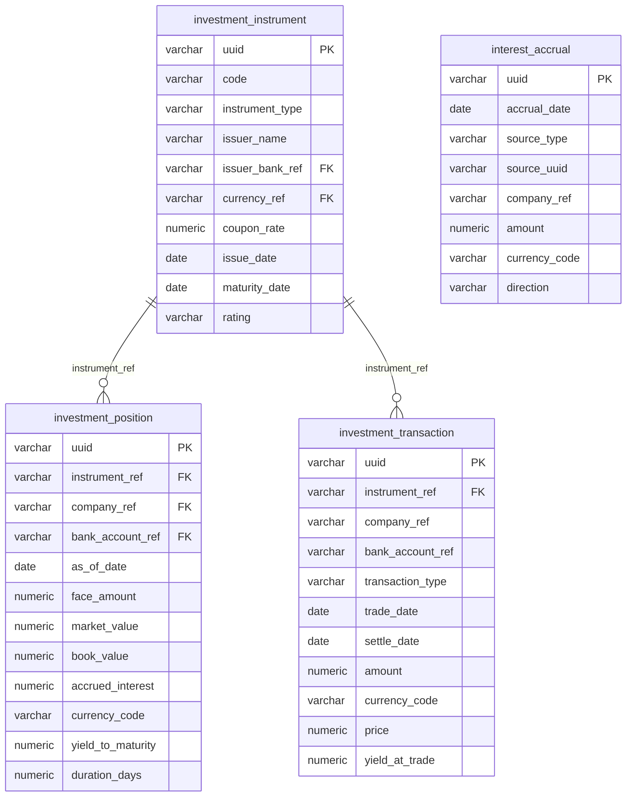

---

### Tables

#### `investment_instrument` — Reference | 120 rows

> One row per unique investment instrument (money market fund, time deposit, CD, treasury bill, commercial paper, repo, bond) available in the treasury portfolio. This is a master reference table; it does not change with daily market moves.

**Columns:**

| Column | Type | Nullable | Description | Example Values / Boundaries |
|--------|------|----------|-------------|---------------------------|
| uuid | character varying(64) | YES | Universally unique identifier serving as the primary key for each investment instrument record. | System-generated UUID; e.g. `a3f1c9...` |
| code | character varying(64) | YES | Human-readable business code uniquely identifying each investment instrument, following a structured naming convention such as INV_MMF_0014. | `INV_MMF_0014`, `INV_CD_0032`, `INV_TBILL_0007` |
| instrument_type | character varying(32) | YES | Category of the investment instrument, such as Money Market Fund, Time Deposit, Treasury, Certificate of Deposit, Commercial Paper, Repo, or Bond. | `Money Market Fund`, `Time Deposit`, `Treasury`, `Certificate of Deposit`, `Commercial Paper`, `Repo`, `Bond` |
| issuer_name | character varying(256) | YES | Name of the entity that issued the investment instrument, such as a bank, government, or asset manager (e.g., BlackRock MMF, US Treasury, Bundesrepublik Deutschland). | `BlackRock MMF`, `US Treasury`, `JPMorgan Chase`, `Bundesrepublik Deutschland` |
| issuer_bank_ref | character varying(64) | YES | Reference code identifying the bank that issued the instrument; applicable primarily to bank-issued products such as time deposits and certificates of deposit; nullable for non-bank issuers. | `BANK_JPM`, `BANK_HSBC`, `BANK_CITI`; null for sovereign instruments |
| currency_ref | character varying(16) | YES | ISO currency code denoting the denomination currency of the investment instrument. | `USD`, `EUR`, `GBP`, `SGD` |
| coupon_rate | numeric(9,6) | YES | Annual interest rate paid by the instrument to its holder, expressed as a percentage; null for instruments that do not pay a coupon. | `4.100000`, `5.250000`; null for T-Bills (discount instruments) |
| issue_date | date | YES | Calendar date on which the investment instrument was originally issued or created. | `2024-01-15`, `2023-06-01` |
| maturity_date | date | YES | Calendar date on which the investment instrument is scheduled to mature and principal is repaid; null for open-ended instruments such as money market funds. | `2024-07-15`, `2025-03-31`; null for MMFs |
| rating | character varying(16) | YES | Credit rating assigned to the investment instrument by a recognised rating agency, reflecting its creditworthiness. | `AAA`, `AA+`, `A-1+`, `Aaa` |

**Foreign Key Relationships:**

| Column | References | Join Meaning |
|--------|-----------|-------------|
| currency_ref | currency.code | Resolves ISO currency code to full currency name and metadata |
| issuer_bank_ref | bank.code | Identifies the issuing bank entity (for bank-issued instruments) |

---

#### `investment_position` — Snapshot (daily) | 9,547 rows

> One row per investment instrument held in a specific bank account on a given reporting date. Represents the state of the treasury's investment portfolio as-at each day. Use `as_of_date` to scope to a specific reporting period.

**Columns:**

| Column | Type | Nullable | Description | Example Values / Boundaries |
|--------|------|----------|-------------|---------------------------|
| uuid | character varying(64) | YES | Unique system-generated identifier for each investment position record. | System-generated UUID |
| instrument_ref | character varying(64) | YES | Reference code identifying the specific financial instrument (e.g., money market fund) held in the investment position. | `INV_MMF_0014`, `INV_CD_0032` |
| company_ref | character varying(64) | YES | Reference code identifying the company or treasury entity that owns the investment position; currently always the group treasury. | `GR_TREASURY` |
| bank_account_ref | character varying(64) | YES | Reference code identifying the investment bank account used to hold the position; segmented by currency (USD, EUR, GBP, SGD). | `INV_ACCT_USD_01`, `INV_ACCT_EUR_01` |
| as_of_date | date | YES | The valuation or reporting date for which the investment position snapshot is recorded. | `2024-06-30`, `2025-01-31` |
| face_amount | numeric(28,6) | YES | The nominal or par value of the investment instrument held in the position, expressed in the position currency. | `10000000.000000`, `50000000.000000` |
| market_value | numeric(28,6) | YES | The current fair market value of the investment position as of the reporting date, expressed in the position currency. | `9994320.000000`; may be slightly above or below face for bonds/CDs |
| book_value | numeric(28,6) | YES | The carrying or cost value of the investment position as recorded in the accounting books, expressed in the position currency. | `10000000.000000`; often equals face for held-to-maturity |
| accrued_interest | numeric(28,6) | YES | The interest income earned on the investment position but not yet received as of the reporting date. | `41250.000000`; grows daily until coupon payment date |
| currency_code | character varying(16) | YES | The ISO currency code of the investment position, indicating the denomination currency. | `USD`, `EUR`, `GBP`, `SGD` |
| yield_to_maturity | numeric(9,6) | YES | The annualised yield to maturity of the investment instrument as a percentage; approximately half of records have no value. | `4.850000`, `5.120000`; null for MMFs (no fixed maturity) |
| duration_days | numeric(9,2) | YES | The interest rate sensitivity or time-weighted duration of the investment position expressed in days. | `30.00`, `90.50`, `182.25` |

**Foreign Key Relationships:**

| Column | References | Join Meaning |
|--------|-----------|-------------|
| instrument_ref | investment_instrument.code | Joins to instrument master for type, issuer, currency, coupon, and rating |
| company_ref | company.code | Identifies the legal entity that owns the position |
| bank_account_ref | bank_account.code | Resolves which bank account holds the position |
| as_of_date | counterparty_exposure.as_of_date | Aligns investment position snapshots with counterparty exposure snapshots for the same date |

---

#### `investment_transaction` — Event | 325 rows

> One row per investment transaction event executed by the group treasury. Transaction types are: Purchase (initial deployment of cash into an instrument), Coupon (periodic interest cash receipt), and Maturity (return of principal at instrument end date).

**Columns:**

| Column | Type | Nullable | Description | Example Values / Boundaries |
|--------|------|----------|-------------|---------------------------|
| uuid | character varying(64) | YES | Unique system-generated identifier for each investment transaction record. | System-generated UUID |
| instrument_ref | character varying(64) | YES | Reference code identifying the specific investment instrument involved in the transaction. | `INV_CD_0032`, `INV_MMF_0014`, `INV_BOND_0005` |
| company_ref | character varying(64) | YES | Reference code identifying the company or treasury entity on whose behalf the transaction is recorded. | `GR_TREASURY` |
| bank_account_ref | character varying(64) | YES | Reference code identifying the investment bank account used to fund or receive proceeds from the transaction. | `INV_ACCT_USD_01`, `INV_ACCT_EUR_01` |
| transaction_type | character varying(32) | YES | Categorises the nature of the investment transaction: initial purchase, coupon interest payment, or instrument maturity event. | `Purchase`, `Coupon`, `Maturity` |
| trade_date | date | YES | The date on which the investment transaction was executed or agreed upon. | `2024-03-01` |
| settle_date | date | YES | The date on which the investment transaction was financially settled and funds were exchanged. | `2024-03-03` (T+2 for most instruments) |
| amount | numeric(28,6) | YES | The monetary value of the investment transaction expressed in the transaction currency. | `25000000.000000` (purchase); `104166.666667` (coupon) |
| currency_code | character varying(16) | YES | The ISO currency code representing the denomination of the investment transaction. | `USD`, `EUR`, `GBP`, `SGD` |
| price | numeric(20,10) | YES | The purchase or settlement price of the investment instrument per unit at the time of the transaction; expressed as a decimal close to par. | `0.9943000000`, `1.0000000000` |
| yield_at_trade | numeric(9,6) | YES | The annualised yield of the investment instrument at the time the transaction was executed, expressed as a percentage. | Range approximately 2.9% to 5.4% |

**Foreign Key Relationships:**

| Column | References | Join Meaning |
|--------|-----------|-------------|
| instrument_ref | investment_instrument.code | Links transaction event to instrument master for type and issuer context |

---

#### `interest_accrual` — Event (daily accrual entries) | 31,702 rows

> One row per daily interest accrual entry. Records both income (earned on investments) and expense (charged on borrowings and credit facility fees) accruals across all group entities. The `source_uuid` links back to the originating instrument or agreement. The high row count reflects daily generation across all active instruments and borrowings over the data history.

**Columns:**

| Column | Type | Nullable | Description | Example Values / Boundaries |
|--------|------|----------|-------------|---------------------------|
| uuid | character varying(64) | YES | Unique identifier for each interest accrual record. | System-generated UUID |
| accrual_date | date | YES | The calendar date on which the interest accrual was recorded. | `2024-06-15`, `2025-01-31` |
| source_type | character varying(32) | YES | The type of financial instrument or obligation that generated the interest accrual, such as a borrowing, an investment position, or a credit facility fee. | `borrowing`, `investment_position`, `credit_facility` |
| source_uuid | character varying(64) | YES | Unique identifier of the specific financial instrument or agreement that originated the interest accrual; joins to the appropriate source table based on `source_type`. | UUID matching borrowing.uuid, investment_position.uuid, etc. |
| company_ref | character varying(64) | YES | A short code identifying the legal entity or subsidiary within the group for which the interest accrual applies. | `GR_TREASURY`, `GR_GB`, `GR_FR` |
| amount | numeric(28,6) | YES | The monetary value of the interest accrual for the given period, expressed in the local currency of the record. | `1369.863014` (daily accrual on a $50M position at 1% p.a.) |
| currency_code | character varying(16) | YES | The ISO 4217 currency code in which the interest accrual amount is denominated. | `USD`, `EUR`, `GBP`, `SGD` |
| direction | character varying(16) | YES | Indicates whether the interest accrual represents a cost to the company (expense) or earnings received (income). | `income`, `expense` |

---

### KPIs Computable from This Sub-domain

| KPI | Formula / Method | Tables Required |
|-----|-----------------|----------------|
| Total Investment Portfolio Value (Market) | `SUM(market_value)` filtered to latest `as_of_date`, grouped by `currency_code` | `investment_position` |
| Weighted Average Yield to Maturity | `SUM(market_value * yield_to_maturity) / SUM(market_value)` where `yield_to_maturity IS NOT NULL` | `investment_position` |
| Weighted Average Duration (days) | `SUM(market_value * duration_days) / SUM(market_value)` | `investment_position` |
| Portfolio Composition by Instrument Type | `SUM(market_value)` grouped by `instrument_type`, joined to `investment_instrument` | `investment_position`, `investment_instrument` |
| Total Accrued Interest Receivable | `SUM(accrued_interest)` on latest `as_of_date` snapshot | `investment_position` |
| Daily Investment Income Accrued | `SUM(amount)` filtered to `direction = 'income'` and `source_type = 'investment_position'`, grouped by `accrual_date` | `interest_accrual` |
| Unrealised Gain / Loss | `SUM(market_value - book_value)` grouped by `instrument_ref` or `currency_code` | `investment_position` |
| Yield at Purchase vs Current YTM Spread | `yield_at_trade` (transaction) vs `yield_to_maturity` (position), joined on `instrument_ref` | `investment_transaction`, `investment_position` |
| Maturity Ladder / Upcoming Maturities | Count and face amount by `maturity_date` bucket (30d, 60d, 90d, 180d) | `investment_instrument`, `investment_position` |
| Investment Income YTD | `SUM(amount)` filtered to `direction = 'income'`, `accrual_date` within year, grouped by `company_ref` | `interest_accrual` |

---

### Common BA Questions

**Q: What is the total market value of the investment portfolio as at today, broken down by instrument type?**
Join `investment_position` (latest `as_of_date`) to `investment_instrument` on `instrument_ref = code`. Group by `instrument_type` and sum `market_value`. Convert currencies to a common base (USD) if a multi-currency summary is needed.

**Q: Which investments are maturing in the next 90 days and what is their combined face value?**
Join `investment_position` to `investment_instrument` on `instrument_ref = code`. Filter `maturity_date` between today and today + 90. Sum `face_amount` grouped by `maturity_date` and `instrument_type`. Note: MMFs will have null `maturity_date` and should be excluded or handled separately.

**Q: What is the weighted average yield to maturity of the current portfolio by currency?**
Use `investment_position` filtered to the latest snapshot date. For each `currency_code`, compute `SUM(market_value * yield_to_maturity) / SUM(market_value)` where `yield_to_maturity IS NOT NULL`.

**Q: How much interest income has the treasury earned on investments month-to-date?**
Use `interest_accrual` filtered to `direction = 'income'` and `source_type = 'investment_position'`. Filter `accrual_date` to the current month. Sum `amount` grouped by `currency_code` and `company_ref`.

**Q: Which instruments have a negative unrealised P&L (market value below book value)?**
From `investment_position` at the latest `as_of_date`, calculate `market_value - book_value` per row. Filter where this is negative. Join to `investment_instrument` for issuer name and type context. A negative value indicates fair-value losses, relevant for mark-to-market reporting.

**Q: How has the portfolio duration changed over the last 12 months?**
Use `investment_position` grouped by `as_of_date` (monthly snapshots). Compute weighted average `duration_days` (`SUM(market_value * duration_days) / SUM(market_value)`) for each month-end date. Trend over time indicates whether treasury is extending or shortening the portfolio in response to rate expectations.

**Q: Which banks are acting as issuers for the current investment positions and what is the concentration?**
Join `investment_position` to `investment_instrument` (via `instrument_ref`) and then to `bank` (via `issuer_bank_ref`). Sum `market_value` by `issuer_name` or `issuer_bank_ref`. This supports counterparty concentration limit monitoring.

---

## Sub-domain 8: Hedge Accounting

### Overview

Hedge accounting is a special accounting treatment under IFRS 9 (International Financial Reporting Standard 9) and ASC 815 (US GAAP) that allows companies to offset the P&L impact of a financial instrument used as a hedge against the P&L impact of the underlying exposure being hedged. Without hedge accounting, derivatives such as FX forward contracts are marked-to-market each period, creating P&L volatility even when the economic purpose of the derivative is to reduce risk. With hedge accounting, gains and losses on the hedging instrument are deferred or matched in the same period as the losses or gains on the hedged item, producing a cleaner economic picture in the financial statements.

There are three types of hedge relationships under accounting standards. A **cash flow hedge** protects against variability in future cash flows arising from a recognised asset or liability, or a highly probable forecast transaction — for example, hedging the EUR purchase price of a forecasted inventory import. A **fair value hedge** offsets changes in the fair value of a recognised asset or liability — for example, hedging the USD value of a fixed-rate bond. A **net investment hedge** protects against FX translation differences arising from the consolidation of a foreign subsidiary whose functional currency differs from the group reporting currency. In practice, corporate treasury teams predominantly use cash flow hedges and net investment hedges implemented through FX forward contracts.

To qualify for hedge accounting, a hedge relationship must be formally **designated** at inception: the company documents the hedged item (e.g., a specific forecast transaction for USD 5M in six months), the hedging instrument (e.g., a specific FX forward contract referenced as FXF-0001234), the hedge type, and the effectiveness testing methodology. The most common effectiveness method is the **dollar-offset method**, which compares the change in fair value of the hedging instrument to the change in fair value of the hedged item and checks that the ratio falls within an 80–125% band. Designation is recorded with a `designation_date` and the hedge is classified as Active.

A **de-designation** event occurs when a previously active hedge relationship is discontinued before its natural expiry. This can happen because the hedged item no longer exists (e.g., the forecasted transaction was cancelled), because the hedge has become ineffective (ratio falls outside the 80–125% band), or because of a corporate restructuring. Upon de-designation, the hedging instrument continues to be marked-to-market through P&L, and any deferred gains/losses in OCI (Other Comprehensive Income) are recycled into P&L. The `hedge_dedesignation` table captures the formal record of each such discontinuation event, including the reason, date, and the notional amount affected.

---

### Key Business Entities

- **Hedge Relationship**: The master record for a formally designated hedge accounting relationship, capturing the hedging instrument, hedged item type, hedge type (cash flow / fair value / net investment), designation date, effectiveness method, notional amount, status, and any de-designation date.
- **Hedge De-designation**: An event record capturing the formal discontinuation of a previously active hedge relationship, including the date, the notional amount de-designated, and the reason for discontinuation.

---

### Entity Relationship Diagram

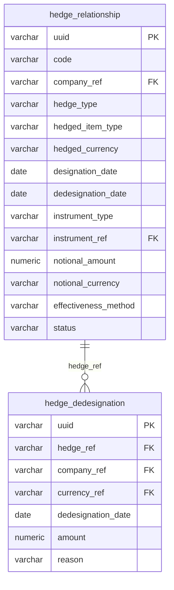

---

### Tables

#### `hedge_relationship` — Reference / Lifecycle | 606 rows

> One row per formally designated hedge accounting relationship, from its designation date through its full lifecycle (active, terminated, or de-designated). The `status` column reflects the current state. The `dedesignation_date` is populated only when the hedge has been discontinued.

**Columns:**

| Column | Type | Nullable | Description | Example Values / Boundaries |
|--------|------|----------|-------------|---------------------------|
| uuid | character varying(64) | YES | Unique system-generated identifier for each hedge relationship record. | System-generated UUID |
| code | character varying(64) | YES | Human-readable business code assigned to each hedge relationship. | `HR-0001532`, `HR-0000781` |
| company_ref | character varying(64) | YES | Code identifying the legal entity or subsidiary within the group that owns the hedge relationship. | `GR_US_INC`, `GR_TREASURY`, `GR_GB` |
| hedge_type | character varying(32) | YES | Classification of the hedge relationship according to accounting standards. | `Cash Flow`, `Fair Value`, `Net Investment` |
| hedged_item_type | character varying(32) | YES | Type of underlying exposure being hedged. | `Forecasted Transaction`, `Recognised Receivable`, `Recognised Payable`, `Net Investment` |
| hedged_currency | character varying(16) | YES | ISO currency code of the foreign currency exposure being hedged in the relationship. | `AUD`, `SGD`, `BRL`, `JPY`, `EUR` |
| designation_date | date | YES | Date on which the hedge relationship was formally designated and hedge accounting commenced. | `2023-04-01`, `2024-01-15` |
| dedesignation_date | date | YES | Date on which the hedge relationship was de-designated and hedge accounting was discontinued; null for active hedges. | `2024-06-30`; null for active relationships |
| instrument_type | character varying(32) | YES | Type of financial instrument used as the hedging instrument; currently exclusively FX forward contracts. | `FX Forward` |
| instrument_ref | character varying(64) | YES | Business reference code identifying the specific hedging instrument. | `FXF-0001234`, `FXF-0005678` |
| notional_amount | numeric(28,6) | YES | Notional principal amount of the hedging instrument representing the size of the hedged exposure. | `5000000.000000`, `10000000.000000` |
| notional_currency | character varying(16) | YES | ISO currency code in which the notional amount of the hedging instrument is denominated. | `USD`, `EUR`, `AUD` |
| effectiveness_method | character varying(32) | YES | Methodology used to assess and measure hedge effectiveness; currently exclusively the dollar-offset method. | `Dollar-Offset` |
| status | character varying(16) | YES | Current lifecycle status of the hedge relationship. | `Active`, `Terminated`, `De-designated` |

**Foreign Key Relationships:**

| Column | References | Join Meaning |
|--------|-----------|-------------|
| company_ref | company.code | Identifies the legal entity that designated the hedge |
| instrument_ref | investment_instrument.code | Links to the FX forward instrument used as the hedging instrument |

---

#### `hedge_dedesignation` — Event | 4 rows

> One row per formal de-designation event, recording when and why a specific hedge relationship was discontinued. The very low row count (4) reflects that de-designation is an unusual, exception-driven event in a well-managed hedge program. Each de-designation event links back to its parent `hedge_relationship` record via `hedge_ref`.

**Columns:**

| Column | Type | Nullable | Description | Example Values / Boundaries |
|--------|------|----------|-------------|---------------------------|
| uuid | character varying(64) | YES | Unique system-generated identifier for each hedge de-designation record. | System-generated UUID |
| hedge_ref | character varying(64) | YES | Business reference code identifying the hedge relationship that is being de-designated. | `HR-0001532`, `HR-0000781` |
| company_ref | character varying(64) | YES | Code identifying the legal entity or company within the group that owns the hedge being de-designated. | `GR_US_INC`, `GR_TREASURY` |
| currency_ref | character varying(16) | YES | ISO 4217 currency code of the notional amount associated with the de-designated hedge. | `AUD`, `SGD`, `BRL` |
| dedesignation_date | date | YES | The calendar date on which the hedge relationship was formally de-designated. | `2024-06-30`, `2024-09-15` |
| amount | numeric(28,6) | YES | The notional or financial amount associated with the de-designated portion of the hedge relationship. | `5000000.000000` |
| reason | character varying(512) | YES | Descriptive explanation for why the hedge was de-designated. | `"Restructuring of underlying instrument"`, `"Forecasted transaction no longer highly probable"` |

**Foreign Key Relationships:**

| Column | References | Join Meaning |
|--------|-----------|-------------|
| hedge_ref | hedge_relationship.code | Links de-designation event to the parent hedge relationship record |
| company_ref | hedge_relationship.company_ref | Confirms the owning entity; consistent with the parent hedge relationship |
| currency_ref | gl_account.currency_ref | Aligns notional currency to GL account currency reference for accounting entries |

---

### KPIs Computable from This Sub-domain

| KPI | Formula / Method | Tables Required |
|-----|-----------------|----------------|
| Total Active Hedges by Type | `COUNT(*)` filtered to `status = 'Active'`, grouped by `hedge_type` | `hedge_relationship` |
| Total Notional Under Active Hedges | `SUM(notional_amount)` filtered to `status = 'Active'`, grouped by `notional_currency` and `hedge_type` | `hedge_relationship` |
| Active Hedges by Hedged Currency | `SUM(notional_amount)` filtered to `status = 'Active'`, grouped by `hedged_currency` | `hedge_relationship` |
| Hedge De-designation Rate | `COUNT(de-designations) / COUNT(all designations started in period)` | `hedge_relationship`, `hedge_dedesignation` |
| De-designated Notional Exposure Released to P&L | `SUM(amount)` from `hedge_dedesignation` grouped by `dedesignation_date` year/quarter | `hedge_dedesignation` |
| Average Hedge Tenor (days) | `AVG(dedesignation_date - designation_date)` for terminated/de-designated, or expected maturity for active | `hedge_relationship` |
| Hedges Maturing in Next 90 Days | Count and `SUM(notional_amount)` where `dedesignation_date` is null and maturity of `instrument_ref` is within 90 days | `hedge_relationship`, `investment_instrument` |
| Hedge Coverage Ratio by Currency | Active hedge notional / total FX exposure by `hedged_currency` (requires FX exposure data) | `hedge_relationship` + FX exposure tables |

---

### Common BA Questions

**Q: How many active hedge relationships does the company currently have, and what is the total notional exposure by hedge type?**
Filter `hedge_relationship` to `status = 'Active'`. Group by `hedge_type` and compute `COUNT(*)` and `SUM(notional_amount)`, along with `notional_currency`. This gives the board-level hedge portfolio summary.

**Q: Which hedge relationships have been de-designated in the current financial year, and why?**
Join `hedge_dedesignation` to `hedge_relationship` on `hedge_ref = code`. Filter `dedesignation_date` to the current year. Return `hedge_ref`, `company_ref`, `currency_ref`, `amount`, `reason`, and `dedesignation_date`. This is typically an audit or finance team query.

**Q: What currencies does the company currently hedge and what is the total notional amount per currency?**
Filter `hedge_relationship` to `status = 'Active'`. Group by `hedged_currency`. Sum `notional_amount` (converting to a common base if `notional_currency` varies). This supports FX risk reporting.

**Q: How long do hedge relationships typically remain active before termination or de-designation?**
For rows where `status` is `Terminated` or `De-designated`, compute `dedesignation_date - designation_date` (or the `hedge_dedesignation.dedesignation_date` if using that table). Aggregate with `AVG`, `MIN`, `MAX`, grouped by `hedge_type`. Useful for programme efficiency analysis.

**Q: Are there any hedge relationships where the hedged currency and notional currency differ (cross-currency hedges)?**
Select rows from `hedge_relationship` where `hedged_currency != notional_currency`. This identifies complex cross-currency structures that may require additional review under effectiveness testing documentation.

**Q: Which companies within the group use hedge accounting and how many hedges does each own?**
Group `hedge_relationship` by `company_ref`. Count active and total hedges, sum notional amounts. Join to `company` for full entity names. This supports consolidated disclosure note preparation.

---

## Sub-domain 9: Credit & Debt Management

### Overview

Credit and debt management encompasses the corporate treasury's activities related to borrowing money from banks (debt), maintaining access to committed credit lines (facilities), using contingent credit instruments for trade and guarantee purposes (letters of credit), monitoring the credit risk the company bears on its banking counterparties (counterparty exposure), and tracking the company's own creditworthiness as assessed by external agencies (credit ratings). Together, these five areas cover both sides of the credit relationship: the company as borrower, and the company as a creditor of its banking relationships.

A **revolving credit facility (RCF)** is the cornerstone instrument of corporate liquidity management. Under an RCF agreement, a bank or syndicate of banks commits to make up to a maximum amount available to the company at any time during the facility's life. The company pays a **commitment fee** (expressed in basis points) on the undrawn portion simply for having the line available, and an **all-in rate** (benchmark rate + credit spread, also in basis points) on amounts actually drawn. A **drawdown** — or **borrowing** — is the act of converting committed availability into actual outstanding debt. Borrowings can be repaid and redrawn (hence "revolving"), giving treasury precise control over the amount of external debt outstanding at any time. Term loans differ in that they are drawn once and amortise over time. Overdraft facilities are operational lines allowing the current account to go briefly negative.

A **letter of credit (LC)** is a bank's written undertaking to pay a specified beneficiary up to a stated amount, provided the beneficiary presents compliant documents. A **commercial LC** facilitates trade: when a company imports goods, the issuing bank guarantees payment to the exporter upon presentation of shipping documents — this shifts payment risk from the importer to the bank and enables the exporter to ship with confidence. A **standby LC** functions as a financial guarantee of last resort: it is issued but not expected to be drawn; examples include utility security deposits, customs duty deferment bonds, and workers' compensation insurance retentions. Standby LCs are off-balance-sheet contingent liabilities that reduce available capacity under the linked credit facility.

**Counterparty exposure** is the credit risk the company bears on each of its banking counterparties — specifically, the total amount of value that would be lost if a bank were to fail. For treasury, this includes cash deposits placed with the bank, investment securities issued by that bank (CDs, time deposits) held in the portfolio, and the positive mark-to-market of derivative contracts outstanding with the bank. Treasury policy sets concentration limits per counterparty (expressed as a percentage of total liquidity or as an absolute dollar cap), and the `counterparty_exposure` table captures daily snapshots to monitor compliance. **Credit ratings** from Moody's, S&P, and Fitch assess the company's own creditworthiness — these ratings affect borrowing costs (a lower rating means a higher credit spread demanded by lenders), the company's ability to access commercial paper markets, and covenants in existing credit facilities.

---

### Key Business Entities

- **Credit Facility**: A formal credit agreement between the company and a lending bank, defining the type (RCF, term loan, overdraft), total commitment amount, pricing (spread + fees), tenor, benchmark rate, and status. The facility is the umbrella; borrowings are specific drawdowns under it.
- **Borrowing**: An individual drawdown event under a credit facility. Records the specific entity that borrowed, the amount, currency, drawdown date, repayment date, all-in interest rate, and repayment status.
- **Letter of Credit**: A bank-issued payment undertaking on behalf of a group entity. Distinguishes commercial LCs (trade finance) from standby LCs (financial guarantees), tracks face and drawn amounts, associated facility, and expiry date.
- **Counterparty Exposure**: A daily snapshot of the company's total credit exposure (deposits + investments + derivative MTM) to each banking counterparty, all expressed in USD equivalents.
- **Credit Rating**: A point-in-time record of the credit rating assigned to a group entity by Moody's, S&P, or Fitch, including outlook and rating action; `is_current = true` identifies the live rating.

---

### Entity Relationship Diagram

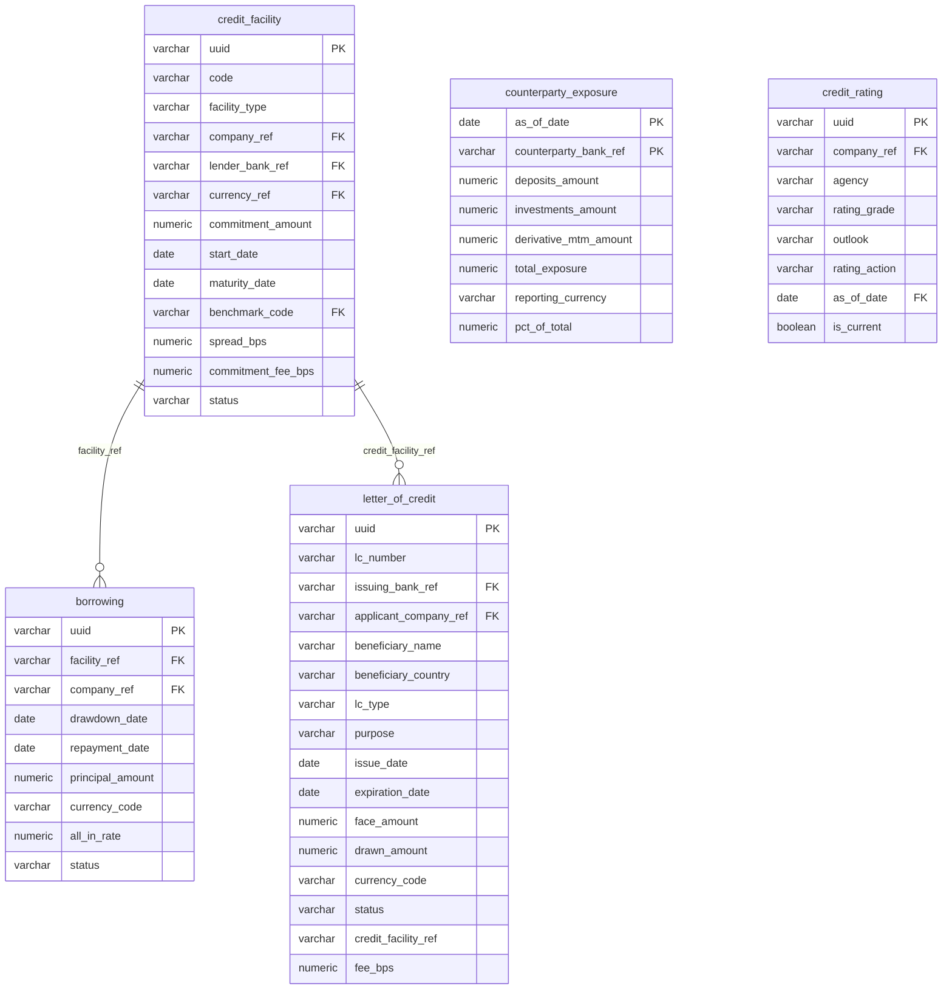

---

### Tables

#### `credit_facility` — Reference | 17 rows

> One row per credit facility agreement between the group and a lending bank. The very low row count (17) reflects that credit facilities are significant bilateral or syndicated agreements negotiated infrequently. The `code` field encodes type, currency, and size (e.g., `CF_RCF_EUR_500M`).

**Columns:**

| Column | Type | Nullable | Description | Example Values / Boundaries |
|--------|------|----------|-------------|---------------------------|
| uuid | character varying(64) | YES | Unique system-generated identifier for each credit facility record. | System-generated UUID |
| code | character varying(64) | YES | Human-readable business code identifying the credit facility, encoding type, currency, and counterparty. | `CF_RCF_USD_2B`, `CF_RCF_EUR_500M`, `CF_TL_GBP_300M` |
| facility_type | character varying(32) | YES | Classification of the credit facility by its structural type. | `Revolving Credit`, `Term Loan`, `Overdraft`, `Commercial Paper`, `Intercompany` |
| company_ref | character varying(64) | YES | Reference code identifying the legal entity or subsidiary that is the borrower or owner of the credit facility. | `GR_HOLDINGS`, `GR_GB`, `GR_TREASURY` |
| lender_bank_ref | character varying(64) | YES | Reference code identifying the bank or financial institution providing the credit facility. | `BANK_JPM`, `BANK_HSBC`, `BANK_BARC` |
| currency_ref | character varying(16) | YES | ISO currency code denoting the denomination in which the credit facility is drawn and repaid. | `USD`, `EUR`, `GBP` |
| commitment_amount | numeric(28,6) | YES | Total maximum amount the lender has committed to make available under the credit facility, expressed in the facility currency. | `2000000000.000000` (USD 2B RCF), `500000000.000000` (EUR 500M) |
| start_date | date | YES | The date on which the credit facility became effective and available for drawing. | `2022-06-01`, `2023-01-15` |
| maturity_date | date | YES | The date on which the credit facility expires and all outstanding amounts must be repaid. | `2027-06-01`, `2028-01-15` |
| benchmark_code | character varying(32) | YES | The interest rate benchmark index used to calculate the floating rate on the facility. | `SOFR`, `ESTR`, `SONIA` |
| spread_bps | numeric(9,2) | YES | The credit margin added above the benchmark rate for the facility, expressed in basis points. | `95.00` (95 bps = 0.95%), `120.00` |
| commitment_fee_bps | numeric(9,2) | YES | The annualised fee charged on the undrawn portion of the credit facility, expressed in basis points. | `35.00`, `40.00`; applicable to revolving and term facilities |
| status | character varying(16) | YES | Current lifecycle status of the credit facility. | `Active`, `Expired`, `Cancelled` |

**Foreign Key Relationships:**

| Column | References | Join Meaning |
|--------|-----------|-------------|
| company_ref | company.code | Identifies the borrowing legal entity |
| lender_bank_ref | bank.code | Resolves the lending bank's full name and details |
| currency_ref | currency.code | Resolves facility currency to full name |
| benchmark_code | benchmark_rate.benchmark_code | Resolves the floating rate benchmark (SOFR, ESTR, SONIA) to current rate levels |

---

#### `borrowing` — Event | 651 rows

> One row per individual drawdown (borrowing) under a credit facility. Each borrowing has a fixed drawdown date, repayment date, principal amount, and all-in interest rate. Link to the parent facility via `facility_ref`. Status reflects whether the borrowing is still outstanding or has been repaid.

**Columns:**

| Column | Type | Nullable | Description | Example Values / Boundaries |
|--------|------|----------|-------------|---------------------------|
| uuid | character varying(64) | YES | Unique system-generated identifier for each individual borrowing record. | System-generated UUID |
| facility_ref | character varying(64) | YES | Business code identifying the credit facility under which the borrowing was drawn; encodes facility type, currency, and size. | `CF_RCF_EUR_500M`, `CF_RCF_USD_2B`, `CF_TL_GBP_300M` |
| company_ref | character varying(64) | YES | Business code identifying the legal entity or subsidiary that borrowed the funds. | `GR_GB`, `GR_HOLDINGS`, `GR_FR` |
| drawdown_date | date | YES | The calendar date on which the borrowing was drawn down from the facility. | `2024-03-01`, `2024-07-15` |
| repayment_date | date | YES | The scheduled or actual calendar date on which the borrowing principal is due to be or was repaid. | `2024-06-01`, `2025-03-01` |
| principal_amount | numeric(28,6) | YES | The face value of the borrowing in the denomination currency at the time of drawdown. | `50000000.000000`, `100000000.000000` |
| currency_code | character varying(16) | YES | ISO 4217 three-letter currency code denoting the denomination of the borrowing. | `USD`, `EUR`, `GBP` |
| all_in_rate | numeric(9,6) | YES | The total annualised interest rate applicable to the borrowing, inclusive of margin and any reference rate, expressed as a percentage. | `6.750000` (6.75%), `5.200000` |
| status | character varying(16) | YES | Current lifecycle status of the borrowing. | `Outstanding`, `Repaid` |

**Foreign Key Relationships:**

| Column | References | Join Meaning |
|--------|-----------|-------------|
| facility_ref | credit_facility.code | Joins borrowing drawdown to the parent credit facility for limit and pricing context |
| company_ref | company.code | Identifies the specific subsidiary that drew the borrowing |

---

#### `letter_of_credit` — Reference | 15 rows

> One row per letter of credit instrument issued by a bank on behalf of a group entity. Distinguishes commercial LCs (used for trade finance, e.g., apparel imports) from standby LCs (financial guarantees, e.g., utility deposits, customs bonds, insurance retentions). The `drawn_amount` tracks how much has been called by the beneficiary; for standby LCs this is typically zero unless a guarantee event has been triggered.

**Columns:**

| Column | Type | Nullable | Description | Example Values / Boundaries |
|--------|------|----------|-------------|---------------------------|
| uuid | character varying(64) | YES | Unique system-generated identifier for each letter of credit record. | System-generated UUID |
| lc_number | character varying(64) | YES | Human-readable reference number assigned to a letter of credit. | `LC-2024-00020`, `LC-2023-00005` |
| issuing_bank_ref | character varying(64) | YES | Code identifying the bank that issued the letter of credit. | `BANK_HSBC`, `BANK_JPM`, `BANK_CITI` |
| applicant_company_ref | character varying(64) | YES | Code identifying the group legal entity that applied for the letter of credit. | `GR_US_INC`, `GR_GB`, `GR_TREASURY` |
| beneficiary_name | character varying(256) | YES | Full legal name of the party entitled to draw on the letter of credit. | `"Shanghai Textile Co Ltd"`, `"National Grid Electricity"`, `"US Customs & Border Protection"` |
| beneficiary_country | character varying(2) | YES | ISO 2-letter country code indicating the country where the beneficiary is located. | `US`, `GB`, `CN`, `DE` |
| lc_type | character varying(16) | YES | Categorises the letter of credit as either a standby LC (guarantee) or a commercial LC (trade payment). | `Standby`, `Commercial` |
| purpose | character varying(64) | YES | Business rationale or intended use for the letter of credit. | `Apparel imports`, `Utility deposit`, `Customs duty deferment`, `Workers compensation insurance` |
| issue_date | date | YES | Calendar date on which the letter of credit was formally issued by the issuing bank. | `2024-01-10`, `2023-09-01` |
| expiration_date | date | YES | Calendar date after which the letter of credit is no longer valid for presentation or drawing. | `2024-12-31`, `2025-06-30` |
| face_amount | numeric(28,6) | YES | The total nominal value of the letter of credit as stated at issuance, denominated in the associated currency. | `5000000.000000`, `250000.000000` |
| drawn_amount | numeric(28,6) | YES | The cumulative amount that has been drawn or called against the letter of credit by the beneficiary; defaults to 0. | `0.000000` (standby, not triggered); `4500000.000000` (commercial, partially drawn) |
| currency_code | character varying(16) | YES | ISO 3-letter currency code in which the letter of credit face and drawn amounts are denominated. | `USD`, `EUR`, `JPY` |
| status | character varying(16) | YES | Current lifecycle status of the letter of credit. | `Active`, `Drawn`, `Expired` |
| credit_facility_ref | character varying(64) | YES | Code identifying the credit facility under which this letter of credit was issued; LCs reduce available drawing capacity on the linked facility. | `CF_RCF_USD_2B`, `CF_RCF_EUR_500M` |
| fee_bps | numeric(9,2) | YES | Annual fee charged by the issuing bank for the letter of credit, expressed in basis points of the face amount. | `75.00`, `100.00` |

**Foreign Key Relationships:**

| Column | References | Join Meaning |
|--------|-----------|-------------|
| applicant_company_ref | company.code | Identifies the group entity on whose behalf the LC is issued |
| issuing_bank_ref | bank.code | Resolves the issuing bank's full details |

---

#### `counterparty_exposure` — Snapshot (daily) | 1,961 rows

> One row per counterparty bank per reporting date. Records the total credit exposure to each bank — the sum of deposits placed, investments issued by that bank, and positive derivative MTM — expressed in USD. The composite primary key is (`as_of_date`, `counterparty_bank_ref`). Used to monitor compliance with treasury policy counterparty concentration limits.

**Columns:**

| Column | Type | Nullable | Description | Example Values / Boundaries |
|--------|------|----------|-------------|---------------------------|
| as_of_date | date | YES | The reporting date as of which the counterparty exposure snapshot was calculated. PK component. | `2024-06-30`, `2025-01-31` |
| counterparty_bank_ref | character varying(64) | YES | Internal reference code identifying the counterparty bank institution to which exposure is measured. PK component. | `BANK_JPM`, `BANK_CITI`, `BANK_HSBC`, `BANK_BARC` |
| deposits_amount | numeric(28,6) | YES | The total value of cash deposits placed with the counterparty bank as of the reporting date, expressed in the reporting currency (USD). | `150000000.000000`, `0.000000` |
| investments_amount | numeric(28,6) | YES | The total market or book value of investment securities held with or issued by the counterparty bank as of the reporting date. | `75000000.000000`, `0.000000` |
| derivative_mtm_amount | numeric(28,6) | YES | The mark-to-market value of derivative contracts outstanding with the counterparty bank as of the reporting date; represents positive replacement cost exposure. | `1250000.000000`; negative values excluded (they represent liabilities, not credit exposure) |
| total_exposure | numeric(28,6) | YES | The aggregate credit exposure to the counterparty bank across all instruments (deposits + investments + derivatives) as of the reporting date. | `226250000.000000` |
| reporting_currency | character varying(16) | YES | The currency in which all exposure amounts are denominated; currently standardised to USD. | `USD` |
| pct_of_total | numeric(9,4) | YES | The counterparty's total exposure expressed as a percentage of the overall portfolio counterparty exposure as of the reporting date. | `18.5000`, `5.2300` |

**Foreign Key Relationships:**

| Column | References | Join Meaning |
|--------|-----------|-------------|
| counterparty_bank_ref | bank.code | Resolves bank reference code to full bank name and country |
| as_of_date | investment_position.as_of_date | Aligns counterparty exposure snapshots with investment position snapshots on the same date |
| as_of_date | credit_rating.as_of_date | Aligns counterparty exposure snapshots with credit rating effective dates |
| as_of_date | macro_indicator.as_of_date | Aligns exposure snapshots with macroeconomic indicators for context |

---

#### `credit_rating` — Reference / Slowly Changing | 13 rows

> One row per credit rating event for a specific company-agency combination. The `is_current = true` flag identifies the most recent active rating for each company and agency. The low row count (13) reflects that the group has ratings from three agencies (Moody's, S&P, Fitch) for a small number of legal entities, and ratings change infrequently.

**Columns:**

| Column | Type | Nullable | Description | Example Values / Boundaries |
|--------|------|----------|-------------|---------------------------|
| uuid | character varying(64) | YES | Unique system-generated identifier for each credit rating record. | System-generated UUID |
| company_ref | character varying(64) | YES | Internal code identifying the legal entity or subsidiary to which the credit rating applies. | `GR_HOLDINGS`, `GR_US_INC` |
| agency | character varying(16) | YES | The credit rating agency that issued the rating. | `Moody's`, `S&P`, `Fitch` |
| rating_grade | character varying(16) | YES | The alphanumeric credit rating grade assigned by the agency, reflecting the assessed creditworthiness of the entity. | `A1`, `AA-`, `BBB+`, `Baa1`, `A+` |
| outlook | character varying(16) | YES | The agency's forward-looking assessment of the likely direction of the credit rating. | `Stable`, `Positive`, `Negative`, `Developing` |
| rating_action | character varying(16) | YES | The action taken by the rating agency at the time of the rating event. | `Affirmed`, `Upgraded`, `Downgraded`, `Assigned` |
| as_of_date | date | YES | The effective date on which the credit rating was assigned or last updated by the agency. | `2024-09-15`, `2023-11-01` |
| is_current | boolean | YES | Flag indicating whether this rating record represents the most current active rating for the entity and agency combination. Defaults to true. | `true` (current rating), `false` (historical) |

**Foreign Key Relationships:**

| Column | References | Join Meaning |
|--------|-----------|-------------|
| company_ref | company.code | Identifies the rated legal entity |
| as_of_date | counterparty_exposure.as_of_date | Aligns rating effective date with counterparty exposure snapshots |
| as_of_date | macro_indicator.as_of_date | Correlates rating events with macroeconomic context at the time of the rating action |

---

### KPIs Computable from This Sub-domain

| KPI | Formula / Method | Tables Required |
|-----|-----------------|----------------|
| Total Committed Credit Capacity | `SUM(commitment_amount)` filtered to `status = 'Active'`, grouped by `currency_ref` | `credit_facility` |
| Total Outstanding Borrowings | `SUM(principal_amount)` filtered to `status = 'Outstanding'`, grouped by `currency_code` | `borrowing` |
| Available Headroom on Credit Facilities | Committed amount minus outstanding borrowings minus LC face amounts, joined by `facility_ref` / `credit_facility_ref` | `credit_facility`, `borrowing`, `letter_of_credit` |
| Weighted Average Cost of Debt | `SUM(principal_amount * all_in_rate) / SUM(principal_amount)` filtered to `status = 'Outstanding'` | `borrowing` |
| Total LC Contingent Exposure | `SUM(face_amount - drawn_amount)` filtered to `status = 'Active'` | `letter_of_credit` |
| LC Exposure by Type | `SUM(face_amount)` grouped by `lc_type` (`Standby` vs `Commercial`) | `letter_of_credit` |
| Top Counterparty Exposure (USD equivalent) | `total_exposure` ranked by `counterparty_bank_ref` at latest `as_of_date` | `counterparty_exposure` |
| Counterparty Concentration (% of portfolio) | `pct_of_total` at latest `as_of_date` sorted descending | `counterparty_exposure` |
| Exposure Trend per Counterparty | `total_exposure` for a specific `counterparty_bank_ref` over time (series of `as_of_date`) | `counterparty_exposure` |
| Current Credit Rating by Agency | `rating_grade`, `outlook` filtered to `is_current = true`, grouped by `company_ref` and `agency` | `credit_rating` |
| Debt Maturity Ladder | `SUM(principal_amount)` grouped by `repayment_date` bucket (within 1y, 1–3y, 3–5y, 5y+) filtered to `status = 'Outstanding'` | `borrowing` |
| Annual Interest Expense on Borrowings | `SUM(principal_amount * all_in_rate / 100)` for outstanding borrowings, or use `interest_accrual` filtered to `source_type = 'borrowing'` and `direction = 'expense'` | `borrowing` or `interest_accrual` |
| Commitment Fee Cost | `SUM((commitment_amount - utilised_amount) * commitment_fee_bps / 10000)` — requires calculating utilised amount from borrowings | `credit_facility`, `borrowing` |

---

### Common BA Questions

**Q: What is the total available liquidity headroom under active credit facilities today?**
Take `SUM(commitment_amount)` from `credit_facility` where `status = 'Active'`. Subtract `SUM(principal_amount)` from `borrowing` where `status = 'Outstanding'` joined by `facility_ref = code`. Then subtract `SUM(face_amount)` from `letter_of_credit` where `status = 'Active'` joined by `credit_facility_ref = code`. The result is the undrawn, uncommitted headroom available to treasury.

**Q: What is the weighted average all-in interest rate on current outstanding borrowings, by currency?**
Filter `borrowing` to `status = 'Outstanding'`. Group by `currency_code`. Compute `SUM(principal_amount * all_in_rate) / SUM(principal_amount)` per group. This gives the effective cost of debt by currency — useful for treasury reporting and hedge programme sizing.

**Q: Which credit facilities are maturing in the next 12 months and what is the total commitment at risk?**
Filter `credit_facility` to `status = 'Active'` and `maturity_date` between today and today + 365. List the `code`, `facility_type`, `lender_bank_ref`, `currency_ref`, `commitment_amount`, and `maturity_date`. This is critical for liquidity risk reporting and refinancing planning.

**Q: Which counterparty banks represent more than 15% of total treasury exposure today?**
Filter `counterparty_exposure` to the latest `as_of_date`. Filter `pct_of_total > 15`. Join to `bank` on `counterparty_bank_ref` for full bank names. This directly tests compliance with a concentration limit of 15% per counterparty in the investment policy.

**Q: What is the current credit rating of the holding company from each of the three major agencies?**
Filter `credit_rating` to `is_current = true` and `company_ref = 'GR_HOLDINGS'` (or the relevant holding entity code). Return `agency`, `rating_grade`, `outlook`, `rating_action`, and `as_of_date`. Use `is_current = true` rather than `MAX(as_of_date)` to ensure the correct current-state record is selected.

**Q: How many letters of credit are expiring in the next 60 days and what is their combined face value?**
Filter `letter_of_credit` to `status = 'Active'` and `expiration_date` between today and today + 60. Sum `face_amount` and count by `lc_type`. This flags near-term renewals needed to maintain trade and guarantee coverage.

**Q: What is the total annual interest expense and commitment fee cost for each credit facility?**
For interest expense: join `credit_facility` to `borrowing` on `code = facility_ref`. Compute `SUM(principal_amount * all_in_rate / 100)` for outstanding borrowings per facility.
For commitment fee: compute `(commitment_amount - SUM(outstanding_principal)) * commitment_fee_bps / 10000` per facility.
Alternatively, aggregate `interest_accrual` filtered to `source_type IN ('borrowing', 'credit_facility')` and `direction = 'expense'` grouped by `company_ref` to get the actual accrued cost.

**Q: Has the company's credit rating changed in the past two years, and with what outlook?**
Query `credit_rating` filtered to `as_of_date >= CURRENT_DATE - INTERVAL '2 years'`. Order by `company_ref`, `agency`, `as_of_date`. The sequence of `rating_grade` values per company-agency pair shows rating progression. Compare with `rating_action` column to see whether each change was an upgrade, downgrade, or affirmation.
## Sub-domain 10: General Ledger & Accounting

### Overview

The General Ledger (GL) is the central accounting record of a company — every financial transaction that flows through a legal entity ultimately lands in the GL as a debit or credit on an account. In a multi-entity corporate group, each subsidiary or operating company typically maintains its own GL, often in different ERP systems. This group runs three ERPs simultaneously: **SAP** (used by the larger European and holding entities), **NetSuite** (used by mid-size and newer subsidiaries), and **Oracle** (used by some Asia-Pacific entities). Each ERP has its own chart of accounts structure, meaning account numbering conventions and hierarchies can differ across systems. The `gl_account` table solves this by acting as a group-level master reference that standardises all accounts under a unified coding convention regardless of source system.

Every GL account belongs to a high-level **account class**: ASSET (cash, receivables, inventory), LIABILITY (payables, loans), EQUITY, REVENUE, or EXPENSE. Cash accounts have a special property — they are linked one-to-one with a physical bank account via `bank_account_ref`. This linkage is the foundation for the bank-to-GL reconciliation process. At each month end, the actual balance reported by the bank must equal the balance recorded in the ledger for the corresponding cash GL account. Any difference is a **reconciling item** that the treasury or finance team must investigate and resolve.

The `gl_balance` table stores period snapshots (exclusively month-end CLOSING balances) for every GL account across all entities and source systems. Think of it as the ledger's "photograph" at the last day of each month. When analysts track how a company's cash, debt, or revenue has moved over time, they query `gl_balance` joined to `gl_account` to retrieve a time series of amounts per account class. The `source_system` field on `gl_balance` is critical — it tells analysts which ERP the number originated from, enabling them to filter or reconcile between systems during a consolidation.

Budget codes provide a lightweight classification layer sitting above the GL. While individual GL accounts encode fine-grained accounting detail, a `budget_code` groups cash flows into broad operational categories (e.g., CAPEX, OPEX, TAX, TREASURY). The `cash_flow` table references `budget_code.code` to allow filtered views of the company's cash movements by high-level purpose. For a BA, understanding that a single budget code can span many GL accounts — and that a single GL account always maps to exactly one account class — is essential for building correct aggregations.

---

### Key Business Entities

- **gl_account**: Master reference of all GL accounts defined across the group's ERP systems. The "account master" — defines what each account code means, who owns it, and what class it belongs to.
- **gl_balance**: Monthly CLOSING balance snapshots per GL account. The transactional fact table for balance sheet and P&L reporting.
- **gl_reconciliation**: Monthly bank-to-GL reconciliation snapshots. Captures bank balance, GL balance, and the variance for every cash account each month.
- **budget_code**: Small lookup table (4 rows) defining the group's high-level budget categories. Referenced by cash_flow records to classify movements.

---

### Entity Relationship Diagram

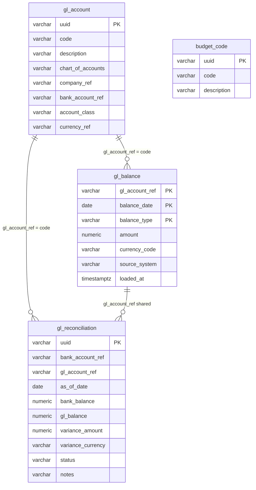

---

### Tables

#### `gl_account` — Grain: Reference (ERP master data) | 451 rows

> One row represents a single general ledger account for a specific legal entity, as defined in one of the group's ERP systems (SAP, NetSuite, or Oracle).

**Columns:**

| Column | Type | Nullable | Description | Example Values / Boundaries |
|--------|------|----------|-------------|---------------------------|
| uuid | character varying(64) | Yes | Unique system-generated identifier for each general ledger account record. | System-generated UUID |
| code | character varying(64) | Yes | Structured account code combining a numeric GL account number with a company and bank account type identifier. | `1110-GR_AE_COLLECTION_1`, `2200-GR_KR` |
| description | character varying(256) | Yes | Human-readable label for the GL account. | `Cash - GR_AU OPERATING Account`, `Accounts Payable` |
| chart_of_accounts | character varying(64) | Yes | The ERP system or chart of accounts framework under which the GL account is defined. | `SAP`, `NetSuite`, `Oracle` |
| company_ref | character varying(64) | Yes | Code identifying the legal entity or subsidiary that owns the GL account. | `GR_AE`, `GR_AU`, `GR_US_INC` |
| bank_account_ref | character varying(64) | Yes | Reference code linking the GL account to a specific physical bank account; null for non-cash GL accounts. | `GR_AU_PAYROLL_1`; null for non-cash |
| account_class | character varying(16) | Yes | High-level classification within the balance sheet or income statement. | `ASSET`, `LIABILITY`, `EQUITY`, `REVENUE`, `EXPENSE` |
| currency_ref | character varying(16) | Yes | ISO 4217 currency code in which the GL account is denominated. | `USD`, `EUR`, `AUD`, `GBP` |

**Foreign Key Relationships:**

| Column | References | Join Meaning |
|--------|-----------|-------------|
| company_ref | hedge_relationship.company_ref | GL accounts are linked to companies that also appear in hedge relationships; use for cross-referencing FX hedging entity context |

---

#### `gl_balance` — Grain: Snapshot (month-end) | 11,275 rows

> One row represents the closing balance of a specific GL account as of a particular month-end date, in the account's native currency.

**Columns:**

| Column | Type | Nullable | Description | Example Values / Boundaries |
|--------|------|----------|-------------|---------------------------|
| gl_account_ref | character varying(64) | Yes | Unique composite reference identifying a GL account combined with an entity or region code; composite primary key component. | `2200-GR_KR`, `1110-IHB_CHF_INVESTMENT` |
| balance_date | date | Yes | The month-end date as of which the GL balance is reported; always falls on the last day of the month. | `2024-01-31`, `2024-02-29` |
| balance_type | character varying(16) | Yes | Type of balance snapshot recorded; currently only `CLOSING` balances are stored. | `CLOSING` |
| amount | numeric(28,6) | Yes | The monetary value of the GL account balance as of the reporting date. | Positive or negative; 6 decimal places |
| currency_code | character varying(16) | Yes | ISO 4217 currency code in which the balance amount is denominated. | `EUR`, `USD`, `GBP` |
| source_system | character varying(32) | Yes | The ERP or accounting system from which the GL balance data was extracted. | `SAP`, `NetSuite`, `Oracle` |
| loaded_at | timestamp with time zone | Yes | Timestamp indicating when the GL balance record was loaded into the data warehouse. | Aligned to month-end boundaries |

**Foreign Key Relationships:**

| Column | References | Join Meaning |
|--------|-----------|-------------|
| gl_account_ref | gl_account.code | Join to gl_account to get account class, company ownership, currency denomination, and ERP description |

---

#### `gl_reconciliation` — Grain: Snapshot (monthly per bank account) | 2,878 rows

> One row captures the bank statement balance, the corresponding GL balance, and the variance for a specific bank account at a specific month-end date.

**Columns:**

| Column | Type | Nullable | Description | Example Values / Boundaries |
|--------|------|----------|-------------|---------------------------|
| uuid | character varying(64) | Yes | Unique system-generated identifier for each GL reconciliation record. | System-generated UUID |
| bank_account_ref | character varying(64) | Yes | Coded reference label identifying the specific bank account being reconciled, encoding region, entity, currency, and account purpose. | `GR_AU_OPERATING_1`, `GR_DE_PAYROLL_EUR` |
| gl_account_ref | character varying(64) | Yes | Coded reference label identifying the general ledger account corresponding to the bank account. | `1110-GR_AU_OPERATING_1` |
| as_of_date | date | Yes | The month-end date as of which the bank-to-GL reconciliation snapshot was taken. | `2024-01-31`, `2024-06-30` |
| bank_balance | numeric(28,6) | Yes | The closing balance reported by the bank for the account as of the reconciliation date. | Expressed in the account's native currency |
| gl_balance | numeric(28,6) | Yes | The closing balance recorded in the general ledger for the account as of the reconciliation date. | Expressed in the account's native currency |
| variance_amount | numeric(28,6) | Yes | The monetary difference between bank_balance and gl_balance; zero indicates a fully matched reconciliation. | Zero = matched; non-zero = open item |
| variance_currency | character varying(16) | Yes | The ISO currency code in which the variance amount is expressed. | `USD`, `EUR`, `AUD` |
| status | character varying(32) | Yes | The current reconciliation outcome indicating whether balances agree or are under investigation. | `MATCHED`, `IN_REVIEW`, `OPEN` |
| notes | character varying(65535) | Yes | Free-text annotations describing the nature of any variance, root cause findings, or resolution details. | Uncapped narrative text |

**Foreign Key Relationships:**

| Column | References | Join Meaning |
|--------|-----------|-------------|
| bank_account_ref | bank_account.code | Join to bank_account master to get bank name, IBAN, and account type |
| bank_account_ref | gl_account.bank_account_ref | Cross-reference to identify the GL account that maps to this bank account |
| gl_account_ref | gl_account.code | Join to gl_account to get account class and ERP system of record |
| gl_account_ref | gl_balance.gl_account_ref | Join to gl_balance to retrieve the GL-side balance independently for cross-checking |
| as_of_date | counterparty_exposure.as_of_date | Date alignment with counterparty exposure snapshots for holistic month-end views |

---

#### `budget_code` — Grain: Reference (lookup) | 4 rows

> One row represents a single high-level budget category used to classify cash flow movements across the organisation.

**Columns:**

| Column | Type | Nullable | Description | Example Values / Boundaries |
|--------|------|----------|-------------|---------------------------|
| uuid | character varying(64) | Yes | Unique system-generated identifier for each budget code record. | System-generated UUID |
| code | character varying(64) | Yes | Short alphanumeric code representing a high-level budget category. | `BC_CAPEX`, `BC_OPEX`, `BC_TAX`, `BC_TREASURY` |
| description | character varying(256) | Yes | Human-readable label explaining the purpose of the budget code. | `Capital expenditure`, `Operating budget`, `Tax payments` |

**Foreign Key Relationships:**

| Column | References | Join Meaning |
|--------|-----------|-------------|
| code | cash_flow.budget_code_ref | budget_code is the parent lookup; cash_flow records reference it to indicate which budget category a cash movement belongs to |

---

### KPIs Computable from This Sub-domain

| KPI | Formula / Method | Tables Required |
|-----|-----------------|----------------|
| Total cash on the GL (by entity) | `SUM(amount) WHERE account_class = 'ASSET' AND bank_account_ref IS NOT NULL AND balance_type = 'CLOSING'` for a given balance_date | gl_balance, gl_account |
| Total liabilities (by entity, month-end) | `SUM(amount) WHERE account_class = 'LIABILITY' AND balance_type = 'CLOSING'` grouped by company_ref and balance_date | gl_balance, gl_account |
| Reconciliation break rate | `COUNT(*) WHERE status != 'MATCHED' / COUNT(*)` for a given as_of_date | gl_reconciliation |
| Total unreconciled variance (absolute) | `SUM(ABS(variance_amount)) WHERE status != 'MATCHED'` | gl_reconciliation |
| Average reconciliation variance per account | `AVG(ABS(variance_amount))` grouped by bank_account_ref | gl_reconciliation |
| Month-over-month GL balance change | Compare `amount` at two consecutive `balance_date` values for same `gl_account_ref` | gl_balance |
| CAPEX cash flows by period | Join cash_flow to budget_code WHERE code = 'BC_CAPEX', sum amounts by period | budget_code (lookup only) |
| Accounts by ERP system | `COUNT(DISTINCT code) GROUP BY chart_of_accounts` | gl_account |

---

### Common BA Questions

**Q: How do I get the month-end cash balance for a specific entity (e.g., GR_AU) from the GL?**
Join `gl_balance` to `gl_account` on `gl_account_ref = code`. Filter `gl_account.company_ref = 'GR_AU'`, `gl_account.account_class = 'ASSET'`, `gl_account.bank_account_ref IS NOT NULL` (cash accounts only), and `gl_balance.balance_type = 'CLOSING'`. Sum `gl_balance.amount` for the desired `balance_date`.

**Q: Which bank accounts are currently showing a reconciliation break?**
Query `gl_reconciliation` where `status != 'MATCHED'` for the latest `as_of_date`. Join to `gl_account` via `gl_account_ref` to get the account description, and to `bank_account` via `bank_account_ref` to get bank details. The `variance_amount` column shows the magnitude of the break.

**Q: Which ERP systems feed GL data for a given entity?**
Query `gl_balance` joined to `gl_account` (on `gl_account_ref = code`), filtering by `company_ref`. Select `DISTINCT source_system`. Different entities may use different ERPs, and some entities may have accounts in multiple systems (e.g., during a migration).

**Q: How do I build a time-series of total liabilities across the group?**
Query `gl_balance` joined to `gl_account` where `account_class = 'LIABILITY'`. Group by `balance_date` and sum `amount`. Use `currency_code` to flag that you need FX conversion before aggregating across currencies (liability amounts are in each account's native currency).

**Q: What is the difference between `gl_balance.gl_account_ref` and `gl_account.code`?**
They are the same identifier and are the join key. `gl_account.code` is the canonical account code defined in the master table (e.g., `1110-GR_AU_OPERATING_1`). `gl_balance.gl_account_ref` references that same code in the balance fact table. Always join on equality between these two fields.

**Q: Can a single bank account appear in multiple GL reconciliation rows for the same month?**
No. The reconciliation is one row per `bank_account_ref` per `as_of_date`. However, the same bank account will appear in multiple rows across different months. Use `as_of_date` to filter to the period you need.

**Q: What do the four budget codes represent, and where are they used?**
The four rows in `budget_code` represent the group's top-level cash flow classifications. The `cash_flow` table's `budget_code_ref` column references `budget_code.code` to tag individual cash movements. For example, a capital expenditure payment would carry `BC_CAPEX`, while a supplier payment under normal operations would carry `BC_OPEX`.

---

## Sub-domain 11: Cash Flow Forecasting

### Overview

Cash flow forecasting is one of the most operationally critical functions in treasury. The goal is to predict — weeks or months in advance — what cash will come in and go out of each legal entity, so that the treasurer can ensure there is always enough liquidity and can optimise excess balances. In this data model, forecasting is structured around a **snapshot/version** concept: each time the treasury team runs a forecast cycle, a new `forecast_snapshot` record is created that defines the cycle's metadata (when it was taken, the horizon it covers, the model version used). All forecast lines for that cycle reference the snapshot via `snapshot_id`.

The `forecast_cash_flow` table contains the individual forecast line items: for each snapshot, entity, bank account, and future calendar period, there is a row projecting the expected inflow or outflow amount for a particular `flow_category` (e.g., AR collections, AP disbursements, payroll, tax, CAPEX, intercompany). The `direction` column explicitly marks whether a line is an inflow or outflow. The `confidence` column allows forecasters to tag each line with a qualitative certainty rating, which matters when treasury must decide how much of a forecast to rely on for liquidity planning. The `seasonality_factor` column captures adjustments applied by the model to account for predictable seasonal patterns (e.g., higher collections in December for a retailer).

After a forecast period has closed — meaning the actual cash flows have been recorded — the `forecast_vs_actual` table captures the post-period variance analysis. This table holds, side by side, the forecast amount and the actual realised amount for each entity, period, and flow category. The pre-computed `variance_amount` and `variance_pct` columns allow teams to quickly identify which categories or entities consistently over- or under-forecast. This feedback loop is critical for improving model accuracy over time. Observed variance percentages run roughly from -24% to +19%, indicating that the model is not perfectly accurate and that certain flow categories may be systematically biased.

For a new BA, the key conceptual shift is that **forecast accuracy is measured at the snapshot level**: the same period (e.g., March 2025) may have been forecast across multiple snapshots (monthly cycles in October, November, December, January, February, March). Each forecast version for that period is stored separately. The `snapshot_id` on `forecast_vs_actual` identifies which forecast version is being compared against actuals. Teams typically track both the "most recent forecast vs actual" and the "earliest forecast vs actual" to understand both accuracy and how estimates converged over time.

---

### Key Business Entities

- **forecast_snapshot**: The forecast cycle master — one row per forecast run, defining the snapshot date, horizon, granularity, and model version. The "version header" for every forecast.
- **forecast_cash_flow**: The forecast line items — one row per entity/account/period/category within a snapshot. Contains the projected amounts, direction, confidence, and seasonality factor.
- **forecast_vs_actual**: Post-period variance comparison — one row per entity/period/flow_category, storing both the forecast and actual amounts and the pre-computed variance.

---

### Entity Relationship Diagram

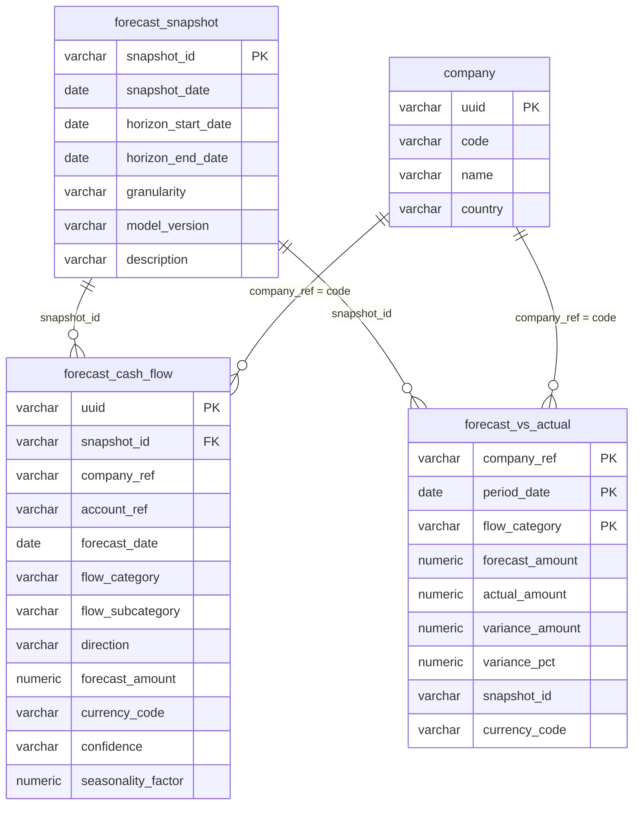

---

### Tables

#### `forecast_snapshot` — Grain: Reference (forecast cycle version) | 38 rows

> One row defines a unique forecast cycle, identified by the date the snapshot was taken, the time horizon it covers, and the model version used to generate it.

**Columns:**

| Column | Type | Nullable | Description | Example Values / Boundaries |
|--------|------|----------|-------------|---------------------------|
| snapshot_id | character varying(64) | Yes | Unique identifier for a forecast snapshot, encoded as a combination of a prefix, the snapshot date (YYYYMMDD), and a frequency suffix (M = monthly, Q = quarterly). Primary key. | `FC_20250801_M`, `FC_20241001_Q` |
| snapshot_date | date | Yes | The calendar date on which the forecast snapshot was taken or published. | `2025-08-01`, `2024-10-01` |
| horizon_start_date | date | Yes | The first calendar date of the forecast horizon covered by this snapshot. | `2025-08-01` |
| horizon_end_date | date | Yes | The last calendar date of the forecast horizon covered by this snapshot. | `2025-08-31` (monthly), `2027-03-31` (18-month quarterly) |
| granularity | character varying(16) | Yes | The time granularity at which forecast data points are expressed within this snapshot. | `DAILY`, `MONTHLY` |
| model_version | character varying(64) | Yes | The version identifier of the forecasting model used to generate this snapshot. | `v1.3`, `v2.0` |
| description | character varying(256) | Yes | Human-readable label describing the forecast methodology and horizon. | `Monthly 13-week direct forecast`, `Quarterly 18-month indirect forecast` |

**Foreign Key Relationships:**

| Column | References | Join Meaning |
|--------|-----------|-------------|
| snapshot_id | forecast_cash_flow.snapshot_id | One snapshot has many forecast line items; join to retrieve all projected flows for a given cycle |
| snapshot_id | forecast_vs_actual.snapshot_id | Identifies which forecast version is being compared against actuals in the variance table |

---

#### `forecast_cash_flow` — Grain: Transaction (one forecast line per snapshot / entity / account / period / category) | 2,660 rows

> One row represents a single forecast line item for a specific legal entity, bank account, future period, and flow category within a named snapshot version.

**Columns:**

| Column | Type | Nullable | Description | Example Values / Boundaries |
|--------|------|----------|-------------|---------------------------|
| uuid | character varying(64) | Yes | Unique system-generated identifier for each forecast cash flow record. | System-generated UUID |
| snapshot_id | character varying(64) | Yes | Identifier for the forecast snapshot version this line belongs to. | `FC_20240101_M`, `FC_20241001_Q` |
| company_ref | character varying(64) | Yes | Code identifying the legal entity for which the cash flow is forecast. | `GR_AU`, `GR_DE`, `GR_US_INC` |
| account_ref | character varying(64) | Yes | Reference code identifying the bank or financial account associated with this forecast flow. | `GR_AU_OPERATING_1` |
| forecast_date | date | Yes | The calendar date (month start) for which the cash flow amount is forecast, representing the expected period of occurrence. | `2025-03-01`, `2025-04-01` |
| flow_category | character varying(32) | Yes | High-level business classification of the cash flow type. | `AR_COLLECTION`, `AP_DISBURSEMENT`, `PAYROLL`, `TAX`, `CAPEX`, `INTERCOMPANY` |
| flow_subcategory | character varying(64) | Yes | Finer-grained classification of the cash flow within its parent category. | `TRADE_RECEIVABLES`, `DOMESTIC_SUPPLIER` |
| direction | character varying(8) | Yes | Indicates whether the forecast cash flow is an inflow, outflow, or net. | `INFLOW`, `OUTFLOW`, `NET` |
| forecast_amount | numeric(28,6) | Yes | The projected monetary value of the cash flow for the forecast period. | Positive value; 6 decimal places |
| currency_code | character varying(16) | Yes | ISO 4217 currency code in which the forecast amount is expressed. | `USD`, `EUR`, `AUD` |
| confidence | character varying(8) | Yes | Qualitative rating indicating the forecaster's level of certainty in the projected amount. | `LOW`, `MEDIUM`, `HIGH` |
| seasonality_factor | numeric(9,4) | Yes | Multiplicative adjustment factor for seasonal variation; 1.0 = no adjustment, <1.0 = suppression, >1.0 = uplift. | `0.8500`, `1.0000`, `1.2000` |

**Foreign Key Relationships:**

| Column | References | Join Meaning |
|--------|-----------|-------------|
| snapshot_id | forecast_snapshot.snapshot_id | Join to retrieve forecast cycle metadata (date, horizon, model version) |
| company_ref | company.code | Join to company master to get entity name, country, and LEI |
| currency_code | currency.code | Join to currency reference for FX conversion |

---

#### `forecast_vs_actual` — Grain: Snapshot (one comparison row per company / period / flow_category) | 3,750 rows

> One row records the forecast amount, actual amount, absolute variance, and percentage deviation for a specific company, month-end period, and cash flow type after the period has closed.

**Columns:**

| Column | Type | Nullable | Description | Example Values / Boundaries |
|--------|------|----------|-------------|---------------------------|
| company_ref | character varying(64) | Yes | Short code identifying the legal entity within the group. Composite primary key component. | `GR_ES`, `GR_DE`, `GR_AU` |
| period_date | date | Yes | The last calendar day of the reporting month for which forecast and actual cash flow amounts are compared. Composite primary key component. | `2024-03-31`, `2024-06-30` |
| flow_category | character varying(32) | Yes | The type of cash flow activity being tracked. Composite primary key component. | `CAPEX`, `AR_COLLECTION`, `AP_DISBURSEMENT`, `PAYROLL`, `TAX`, `FX_REVALUATION` |
| forecast_amount | numeric(28,6) | Yes | The projected cash flow amount in USD as captured at forecast time. | Positive or negative |
| actual_amount | numeric(28,6) | Yes | The realised cash flow amount in USD as recorded after the period closed. | Positive or negative |
| variance_amount | numeric(28,6) | Yes | The absolute difference in USD between actual and forecast (actual − forecast). | Positive = beat forecast; negative = missed |
| variance_pct | numeric(9,4) | Yes | The percentage deviation of actual from forecast; observed range approximately -24% to +19%. | `-0.2400` to `+0.1900` |
| snapshot_id | character varying(64) | Yes | Identifier for the forecast run being compared; encodes the date and frequency of the forecast cycle. | `FC_20230501_M` |
| currency_code | character varying(16) | Yes | ISO 4217 currency code in which all monetary amounts in this table are denominated; consistently USD. | `USD` |

**Foreign Key Relationships:**

| Column | References | Join Meaning |
|--------|-----------|-------------|
| snapshot_id | forecast_snapshot.snapshot_id | Join to get cycle metadata — which model version, when the forecast was made, and the horizon |
| company_ref | company.code | Join to company master for entity name, country, and regional grouping |
| currency_code | currency.code | Currency reference lookup; note all records are in USD |

---

### KPIs Computable from This Sub-domain

| KPI | Formula / Method | Tables Required |
|-----|-----------------|----------------|
| Forecast accuracy by flow_category | `1 - AVG(ABS(variance_pct))` grouped by flow_category and period | forecast_vs_actual |
| Mean absolute percentage error (MAPE) | `AVG(ABS(variance_pct))` for a given snapshot_id | forecast_vs_actual |
| Total net forecast cash position (entity, month) | `SUM(CASE WHEN direction = 'INFLOW' THEN forecast_amount ELSE -forecast_amount END)` grouped by company_ref and forecast_date | forecast_cash_flow |
| Worst-performing forecast categories | Rank flow_categories by `AVG(ABS(variance_pct))` descending | forecast_vs_actual |
| Forecast convergence over cycles | For a fixed period_date, track `forecast_amount` across multiple snapshot_ids (ordered by snapshot_date) to see how estimate changed over time | forecast_vs_actual, forecast_snapshot |
| High-confidence vs low-confidence forecast volume | `SUM(forecast_amount)` grouped by `confidence` | forecast_cash_flow |
| Forecast horizon length | `DATEDIFF(horizon_end_date, horizon_start_date)` | forecast_snapshot |
| Seasonality-adjusted vs unadjusted variance | Compare `forecast_amount / seasonality_factor` vs actual_amount | forecast_cash_flow, forecast_vs_actual |

---

### Common BA Questions

**Q: How do I get all forecast lines for the latest forecast cycle?**
Find the latest `snapshot_id` from `forecast_snapshot` by selecting `MAX(snapshot_date)`. Then query `forecast_cash_flow` filtered to that `snapshot_id`. Join back to `forecast_snapshot` to confirm the horizon and model version.

**Q: What is the difference between forecast_cash_flow and forecast_vs_actual?**
`forecast_cash_flow` is forward-looking — it stores the projected amounts before the period has occurred. `forecast_vs_actual` is retrospective — it is only populated after a period closes and actuals are available. They both contain `snapshot_id`, `company_ref`, and `flow_category`, but `forecast_vs_actual` stores USD-normalised amounts and pre-computed variances for analytical convenience.

**Q: Can the same period appear in multiple snapshot_id values in forecast_vs_actual?**
Yes. If March 2025 was forecast in snapshots from October 2024, November 2024, December 2024, January 2025, and February 2025, each of those snapshots will produce a row for March 2025 in `forecast_vs_actual`. You must filter by `snapshot_id` to isolate a specific forecast vintage. To see "the earliest forecast vs actual", join `forecast_vs_actual` to `forecast_snapshot` and filter to the earliest `snapshot_date` that covers your target period.

**Q: How is the variance_pct calculated in forecast_vs_actual?**
It is `(actual_amount - forecast_amount) / ABS(forecast_amount) * 100`. A positive value means the actual was higher than forecast (over-collection or under-payment). A negative value means the actual was lower (under-collection or over-payment). Division by zero should be guarded when `forecast_amount = 0`.

**Q: How do I identify which entities have the most unreliable forecasts?**
Query `forecast_vs_actual`, compute `AVG(ABS(variance_pct))` grouped by `company_ref`. Rank by this MAPE descending. You can further filter by `flow_category` to identify whether the inaccuracy is systematic (e.g., AR collections always off) or broad across all categories.

**Q: What does the seasonality_factor in forecast_cash_flow mean practically?**
A value of 1.2 means the model has inflated the base forecast by 20% to account for a seasonal peak (e.g., a retailer's December collections boost). A value of 0.85 means a 15% downward adjustment for a seasonal trough. A value of 1.0 means no seasonal adjustment was applied. When comparing forecast lines across months, be aware that raw `forecast_amount` already includes the seasonal factor; you would need to divide by `seasonality_factor` to see the underlying base estimate.

**Q: How many forecast cycles (snapshots) are there and over what time range?**
`forecast_snapshot` has 38 rows. Query `MIN(snapshot_date)` and `MAX(snapshot_date)` to find the date range covered. The granularity field distinguishes monthly (13-week direct) from quarterly (18-month indirect) cycles.

---

## Sub-domain 12: Corporate Structure

### Overview

Corporate structure data defines the legal and organisational hierarchy of the group — which legal entities exist, where they are incorporated, how they are clustered into reporting groups, and what financial metrics characterise each entity. For a BA new to treasury, understanding corporate structure is foundational: almost every other sub-domain references `company.code` as a foreign key. If you see `company_ref` or `buyer_company` or `company_code` in any table, it almost certainly points back to `company.code`.

The `company` table is the master entity table for the group's legal entities (24 in total). Each row is a distinct subsidiary or holding company, identified by a short internal code (e.g., `GR_AU` for the Australia entity, `GR_US_INC` for the US incorporated entity). The `company` table holds the entity's formal identifiers: its ISO country code, its Legal Entity Identifier (LEI — a globally standardised 20-character code required for financial transactions under regulations like EMIR and MiFID II), its SEPA Creditor Identifier for direct debits in the Eurozone, and tax IDs stored as a JSON structure. It also holds address and contact information as JSON blobs (`address`, `contact`, `user_zones`), which are useful for operational but not analytical queries.

The `company_group` table defines named groupings of legal entities used for consolidation and reporting. With 6 groups, these typically represent regional clusters: a global group, and sub-groups for Americas (AMER), Europe/Middle East/Africa (EMEA), Asia-Pacific (APAC), Latin America (LATAM), and Middle East/North Africa (MENA). The `company_group_member` table resolves the many-to-many relationship between groups and entities — an entity can belong to multiple groups (e.g., GR_DE might be a member of both the EMEA group and the global group). This join table is the essential bridge when you need to produce a consolidated view for a specific region.

The `gen_company_region` table is a compact but highly useful reference: it maps each company code to a geographic region label and a functional currency. For treasury analysis, the functional currency is particularly important because it defines in which currency a legal entity primarily operates and reports. When translating cash flows or balances across entities to a group reporting currency (typically USD or GBP), `gen_company_region.functional_ccy` provides the source currency denominator. The `company_financial_metric` table extends the corporate structure picture with periodic financial performance data — income statement items (revenue, EBITDA, net income), cash flow metrics (operating cash flow, CAPEX, free cash flow), balance sheet items (debt, equity, cash), and capital structure ratios (debt/EBITDA, interest coverage, WACC). Each row covers one entity for one period (quarterly or full-year).

---

### Key Business Entities

- **company**: The master entity reference for all legal entities (24 rows). The single source of truth for entity codes, names, country of incorporation, and formal identifiers (LEI, SEPA).
- **company_group**: Named groupings (6 rows) used for regional or consolidated reporting — e.g., EMEA, APAC, GLOBAL.
- **company_group_member**: Many-to-many bridge table (71 rows) linking each entity to the group(s) it belongs to.
- **gen_company_region**: Compact lookup (24 rows) providing region label and functional currency per company. Critical for FX reporting.
- **company_financial_metric**: Periodic financial performance snapshot (136 rows) per entity, covering income statement, cash flow, balance sheet, and capital ratios.

---

### Entity Relationship Diagram

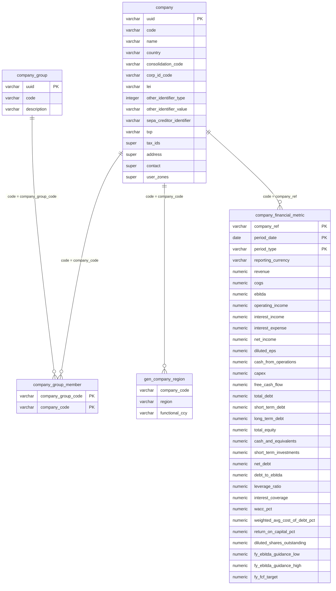

---

### Tables

#### `company` — Grain: Reference (legal entity master) | 24 rows

> One row corresponds to a single legal entity within the corporate group, such as a country-level subsidiary or holding company.

**Columns:**

| Column | Type | Nullable | Description | Example Values / Boundaries |
|--------|------|----------|-------------|---------------------------|
| uuid | character varying(64) | Yes | Universally unique identifier serving as the primary key for each company record. | System-generated UUID |
| code | character varying(64) | Yes | Short internal alphanumeric code uniquely identifying each legal entity within the corporate group. | `GR_AU`, `GR_US_INC`, `GR_DE`, `GR_FR` |
| name | character varying(256) | Yes | Full registered legal name of the company entity. | `GlobalRetail Australia Pty Ltd`, `GlobalRetail France SAS` |
| country | character varying(2) | Yes | ISO 3166-1 alpha-2 country code indicating the country of incorporation or primary operation. | `AU`, `US`, `DE`, `GB`, `FR` |
| consolidation_code | character varying(64) | Yes | Code used to group or map the company into the appropriate financial consolidation structure for reporting. | Internal consolidation hierarchy codes |
| corp_id_code | character varying(64) | Yes | Corporate identifier code used for internal or intercompany identification across systems. | Internal cross-system IDs |
| lei | character varying(32) | Yes | Legal Entity Identifier — globally recognised 20-character alphanumeric code for financial transactions. | `LEI-GRAU`, `LEI-GRFR` |
| other_identifier_type | integer(32) | Yes | Numeric code indicating the type of an additional or alternative identifier for the company beyond LEI. | Numeric type codes |
| other_identifier_value | character varying(64) | Yes | The actual value of the alternative or supplementary identifier. | CRN, ABN, or other national registry codes |
| sepa_creditor_identifier | character varying(64) | Yes | SEPA Creditor Identifier (SCI) for SEPA Direct Debit transactions; applicable to Eurozone entities. | Eurozone entities only; null for non-SEPA |
| txp | character varying(64) | Yes | Tax payment reference or taxpayer identifier code for tax remittance purposes. | Jurisdiction-specific tax codes |
| tax_ids | super | Yes | Structured JSON object storing one or more tax identification numbers across different jurisdictions. | JSON; keys by jurisdiction |
| address | super | Yes | Structured JSON object containing the registered or principal business address of the company. | JSON with street, city, postcode, country |
| contact | super | Yes | Structured JSON object holding contact information (phone, email, contact person) for the company. | JSON with contact fields |
| user_zones | super | Yes | Structured JSON object defining the access zones or organisational segments for users associated with this company. | JSON with zone assignments |

**Foreign Key Relationships:**

| Column | References | Join Meaning |
|--------|-----------|-------------|
| country | pension_plan.country | Countries can be joined to pension_plan records for entities with pension obligations |
| code | company_group_member.company_code | One company can be a member of multiple groups; join via company_group_member |
| code | company_financial_metric.company_ref | Join to retrieve financial performance data for the entity |
| code | forecast_cash_flow.company_ref | Join to retrieve forecasted cash flows for the entity |
| code | working_capital_metric.company_ref | Join to retrieve DSO/DPO/DIO/CCC metrics for the entity |
| code | wcf_document.buyer_company | Join to retrieve supply chain finance documents where the entity is the buyer |

---

#### `company_group` — Grain: Reference (group definition) | 6 rows

> One row represents a single named company group used for consolidation and reporting purposes.

**Columns:**

| Column | Type | Nullable | Description | Example Values / Boundaries |
|--------|------|----------|-------------|---------------------------|
| uuid | character varying(64) | Yes | Universally unique identifier serving as the primary key for each company group record. | System-generated UUID |
| code | character varying(64) | Yes | Short alphanumeric code representing a defined company group. | `GROUP_AMER`, `GROUP_EMEA`, `GROUP_APAC`, `GROUP_LATAM`, `GROUP_GLOBAL` |
| description | character varying(256) | Yes | Human-readable label explaining the scope or purpose of the company group. | `Americas`, `Europe/Middle East/Africa`, `Store-operating companies only` |

**Foreign Key Relationships:**

| Column | References | Join Meaning |
|--------|-----------|-------------|
| code | company_group_member.company_group_code | One group has many member entities; join via company_group_member to enumerate all entities in a region |

---

#### `company_group_member` — Grain: Reference (many-to-many bridge) | 71 rows

> One row represents the membership of a single legal entity within a single company group, resolving the many-to-many relationship between entities and groups.

**Columns:**

| Column | Type | Nullable | Description | Example Values / Boundaries |
|--------|------|----------|-------------|---------------------------|
| company_group_code | character varying(64) | Yes | Identifies the regional or structural company group to which a member belongs. Composite primary key component. | `GROUP_AMER`, `GROUP_EMEA`, `GROUP_APAC`, `GROUP_LATAM`, `GROUP_GLOBAL` |
| company_code | character varying(64) | Yes | Identifies the individual legal entity that is a member of a company group. Composite primary key component. | `GR_AU`, `GR_US_INC`, `GR_DE` |

**Foreign Key Relationships:**

| Column | References | Join Meaning |
|--------|-----------|-------------|
| company_code | company.code | Join to company master to get entity name, country, and LEI |
| company_group_code | company_group.code | Join to company_group to get the group description |

---

#### `gen_company_region` — Grain: Reference (entity-to-region mapping) | 24 rows

> One row represents one legal entity within the corporate group, providing its geographic region label and functional (local reporting) currency.

**Columns:**

| Column | Type | Nullable | Description | Example Values / Boundaries |
|--------|------|----------|-------------|---------------------------|
| company_code | character varying(64) | Yes | Unique alphanumeric code identifying a legal entity within the group. | `GR_DE`, `GR_APAC_PTE`, `GR_US_INC` |
| region | character varying(5) | Yes | High-level geographic region to which the company entity belongs. | `EMEA`, `APAC`, `LATAM`, `AMER`, `MENA` |
| functional_ccy | character varying(3) | Yes | ISO 4217 currency code representing the functional (local reporting) currency of the company entity. | `EUR`, `BRL`, `USD`, `AUD`, `GBP` |

**Foreign Key Relationships:**

| Column | References | Join Meaning |
|--------|-----------|-------------|
| company_code | company.code (implied) | Used as a dimension enrichment lookup; join to any table containing company_ref to append region and functional currency context |

---

#### `company_financial_metric` — Grain: Snapshot (one row per company / period / period_type) | 136 rows

> One row represents a single legal entity's financial snapshot for a specific reporting period and period type (quarterly or full-year), covering income statement, cash flow, balance sheet, and capital structure data.

**Columns:**

| Column | Type | Nullable | Description | Example Values / Boundaries |
|--------|------|----------|-------------|---------------------------|
| company_ref | character varying(64) | Yes | Code identifying the legal entity for which metrics are reported. Composite primary key component. | `GR_AU`, `GR_HOLDINGS`, `GR_EU_BV` |
| period_date | date | Yes | The period-end date for which the financial metrics are reported. Composite primary key component. | Quarter-end or year-end dates |
| period_type | character varying(8) | Yes | Indicates whether the row represents a quarterly or full-year reporting period. Composite primary key component. | `Q`, `FY` |
| reporting_currency | character varying(16) | Yes | The currency in which all financial metrics for this row are expressed. | `USD`, `GBP`, `EUR` |
| revenue | numeric(28,6) | Yes | Total revenue for the entity in the reporting period. | Large positive values |
| cogs | numeric(28,6) | Yes | Cost of goods sold — direct costs attributable to the production of goods sold. | Typically negative or expressed as a cost |
| ebitda | numeric(28,6) | Yes | Earnings Before Interest, Taxes, Depreciation, and Amortisation — a proxy for operating cash generation. | Positive for profitable entities |
| operating_income | numeric(28,6) | Yes | Operating income (EBIT) — earnings after COGS and operating expenses but before interest and tax. | |
| interest_income | numeric(28,6) | Yes | Income earned from interest on deposits, investments, or intercompany loans. | |
| interest_expense | numeric(28,6) | Yes | Cost of debt — interest paid on borrowings. | Typically presented as a positive cost |
| net_income | numeric(28,6) | Yes | Bottom-line profit after all costs, interest, and tax. | Positive or negative |
| diluted_eps | numeric(12,4) | Yes | Diluted Earnings Per Share — net income divided by diluted shares outstanding. | 4 decimal places |
| cash_from_operations | numeric(28,6) | Yes | Operating cash flow — net cash generated from normal business operations. | |
| capex | numeric(28,6) | Yes | Capital Expenditure — cash spent on acquiring or maintaining long-term assets. | Typically negative (outflow) |
| free_cash_flow | numeric(28,6) | Yes | Free Cash Flow — cash_from_operations minus capex. | |
| total_debt | numeric(28,6) | Yes | Total financial debt outstanding (short-term + long-term). | |
| short_term_debt | numeric(28,6) | Yes | Debt maturing within 12 months. | |
| long_term_debt | numeric(28,6) | Yes | Debt maturing beyond 12 months. | |
| total_equity | numeric(28,6) | Yes | Shareholders' equity — total assets minus total liabilities. | |
| cash_and_equivalents | numeric(28,6) | Yes | Cash and highly liquid assets on the balance sheet. | |
| short_term_investments | numeric(28,6) | Yes | Short-term investment securities (maturity < 1 year). | |
| net_debt | numeric(28,6) | Yes | Net Debt — total_debt minus cash_and_equivalents and short_term_investments. | Positive = net borrower; negative = net cash |
| debt_to_ebitda | numeric(9,4) | Yes | Leverage ratio expressed as total_debt / ebitda; common covenant metric. | Typically 1x–5x range |
| leverage_ratio | numeric(9,4) | Yes | Alternative leverage measure (may represent net_debt / ebitda or total_debt / total_equity depending on convention). | |
| interest_coverage | numeric(9,4) | Yes | Interest Coverage Ratio — ebitda / interest_expense; measures ability to service debt. | Higher = safer |
| wacc_pct | numeric(9,4) | Yes | Weighted Average Cost of Capital as a percentage — the blended rate of return required by all capital providers. | Expressed as decimal, e.g. 0.0850 = 8.5% |
| weighted_avg_cost_of_debt_pct | numeric(9,4) | Yes | Weighted average interest rate across all debt obligations. | |
| return_on_capital_pct | numeric(9,4) | Yes | Return on Capital — operating_income / (total_debt + total_equity). | |
| diluted_shares_outstanding | numeric(28,2) | Yes | Total diluted shares outstanding at the period end. | Large integer-scale values |
| fy_ebitda_guidance_low | numeric(28,6) | Yes | Lower bound of the full-year EBITDA guidance range issued by management. | |
| fy_ebitda_guidance_high | numeric(28,6) | Yes | Upper bound of the full-year EBITDA guidance range issued by management. | |
| fy_fcf_target | numeric(28,6) | Yes | Full-year free cash flow target as set by management or the board. | |

**Foreign Key Relationships:**

| Column | References | Join Meaning |
|--------|-----------|-------------|
| company_ref | company.code | Join to company master to get entity name, country, LEI, and consolidation code |

---

### KPIs Computable from This Sub-domain

| KPI | Formula / Method | Tables Required |
|-----|-----------------|----------------|
| Group-level EBITDA (consolidated) | `SUM(ebitda)` for all entities in `company_group_member` where `company_group_code = 'GROUP_GLOBAL'`, filtered by period_date and period_type | company_financial_metric, company_group_member |
| Net Debt / EBITDA (group or entity) | `SUM(net_debt) / SUM(ebitda)` for a given period | company_financial_metric |
| Free Cash Flow margin | `free_cash_flow / revenue` per entity per period | company_financial_metric |
| Entities in a given region | Join `gen_company_region` to `company` on `company_code = code`, filter by `region` | gen_company_region, company |
| Entities using EUR as functional currency | `SELECT company_code FROM gen_company_region WHERE functional_ccy = 'EUR'` | gen_company_region |
| EBITDA vs guidance mid-point | `ebitda - (fy_ebitda_guidance_low + fy_ebitda_guidance_high) / 2` | company_financial_metric |
| FCF vs target | `free_cash_flow - fy_fcf_target` | company_financial_metric |
| Total group entity count by region | `COUNT(*) GROUP BY region` | gen_company_region |
| Interest coverage trend | Track `interest_coverage` per entity across multiple `period_date` values | company_financial_metric |

---

### Common BA Questions

**Q: How do I get all entities in the EMEA region?**
Query `gen_company_region` filtered by `region = 'EMEA'`. Alternatively, query `company_group_member` where `company_group_code = 'GROUP_EMEA'` and join to `company` on `company_code = code`. Note that `gen_company_region` is a direct flat lookup (one row per entity) while `company_group_member` is based on the explicitly defined group membership and may differ if group boundaries differ from geographic regions.

**Q: What is the difference between company_group_member and gen_company_region for regional filtering?**
`gen_company_region` assigns each entity a region label directly (EMEA, APAC, etc.) based on a fixed mapping — it is the simpler approach for ad hoc regional filtering. `company_group_member` is the official reporting group membership and may have overlapping groups (e.g., an entity belonging to both GROUP_EMEA and GROUP_GLOBAL). For P&L consolidation, use `company_group_member`. For FX and currency-based analysis, use `gen_company_region` because it also provides `functional_ccy`.

**Q: How do I find the functional currency for a specific entity?**
Query `gen_company_region` where `company_code = 'GR_AU'`. The `functional_ccy` field returns the ISO currency code (e.g., `AUD`). This is essential when converting GL balances or cash flows to a common reporting currency — you use `functional_ccy` as the FROM currency in your FX rate lookup.

**Q: What does the consolidation_code on company represent?**
It is an internal code used to slot the entity into the correct position within the group's financial consolidation hierarchy. Different entities may share the same `consolidation_code` if they consolidate into the same reporting segment. This is typically used by the group finance function, not by treasury directly.

**Q: Where does the LEI field get used in practice?**
The LEI is required on financial transaction reporting under EMIR (for derivatives) and MiFID II (for securities). When treasury files regulatory reports for hedging instruments, the entity's LEI on `company.lei` is stamped onto the trade report. BAs building regulatory reporting queries will join trade tables back to `company` on `company_ref = code` to retrieve the LEI.

**Q: Can one company belong to more than one company_group?**
Yes. The `company_group_member` table has a composite primary key of `(company_group_code, company_code)`, meaning the same company can appear in multiple rows with different group codes. For example, `GR_DE` may be a member of both `GROUP_EMEA` and `GROUP_GLOBAL`.

**Q: The company_financial_metric columns all have empty descriptions in the YAML — how do I interpret them?**
The YAML descriptions are blank for this table, but the column names are self-describing and follow standard financial statement conventions. `revenue`, `cogs`, `ebitda`, `operating_income`, `interest_income`, `interest_expense`, `net_income` are income statement lines. `cash_from_operations`, `capex`, `free_cash_flow` are cash flow statement items. `total_debt`, `total_equity`, `cash_and_equivalents`, `net_debt` are balance sheet items. Ratio fields (`debt_to_ebitda`, `leverage_ratio`, `interest_coverage`, `wacc_pct`) are pre-computed and should be used directly rather than recalculated to avoid inconsistencies.

---

## Sub-domain 13: Working Capital Finance

### Overview

Working capital finance (WCF), often called supply chain finance (SCF) or reverse factoring, is a financing arrangement where a buyer company and its bank create a programme that allows the buyer's suppliers to receive early payment on approved invoices. Under a standard WCF programme, the sequence works like this: (1) the buyer company approves a supplier invoice, (2) the buyer notifies the financing bank that the invoice is approved, (3) the supplier can choose to receive an early payment from the bank at a small discount, and (4) the buyer repays the bank on the original due date. From a treasury perspective, WCF allows the buyer to extend its payment terms (increasing DPO and improving working capital) while simultaneously giving suppliers access to cheaper financing than they could obtain independently.

The `wcf_document` table represents individual WCF instruments — each row is one approved invoice or payable that has been submitted into the programme. The document links a `buyer_company` (an internal legal entity) to a `supplier_ref` (a third-party trading partner), with a monetary amount, currency, `issue_date`, `due_date`, and a lifecycle `status`. The `status` field tracks where in the process each document sits: issued, submitted to the bank, approved, early-paid by the bank, or settled by the buyer. The `early_payment_terms_ref` field captures any special early payment discount terms that apply.

Working capital efficiency is measured through a set of standard KPIs known as the **Cash Conversion Cycle (CCC)** components. The `working_capital_metric` table stores these per entity per period: **Days Sales Outstanding (DSO)** — how long it takes to collect receivables; **Days Payable Outstanding (DPO)** — how long the entity takes to pay suppliers; **Days Inventory Outstanding (DIO)** — how long inventory sits before being sold; and **CCC** itself, calculated as `DSO + DIO - DPO`. A lower (or more negative) CCC means the business collects cash from customers faster than it pays suppliers, which is a cash flow advantage. Retailers and large consumer goods companies often achieve negative CCC by collecting from customers at point of sale while paying suppliers on long credit terms.

The underlying drivers for these KPIs are stored alongside them: `ar_balance` (accounts receivable), `ap_balance` (accounts payable), `revenue_ttm` (trailing twelve-month revenue, used as DSO denominator), and `cogs_ttm` (trailing twelve-month COGS, used as DPO and DIO denominator). Having the balance and the denominator in the same row allows analysts to reconstruct or cross-check the ratio computations. For a BA, understanding the interplay between these KPIs and the WCF programme is key: WCF directly extends `dpo_days` (the buyer pays later) and reduces the supplier's effective DSO. Monitoring whether DPO is improving as the WCF programme scales is a core treasury performance question.

---

### Key Business Entities

- **wcf_document**: Individual supply chain finance instruments (2,500 rows). Each row is one approved payable linking a buyer entity to a supplier.
- **working_capital_metric**: Periodic working capital KPI snapshots (806 rows). One row per entity per period, storing DSO, DPO, DIO, CCC, and the underlying balances and revenue/COGS figures.

---

### Entity Relationship Diagram

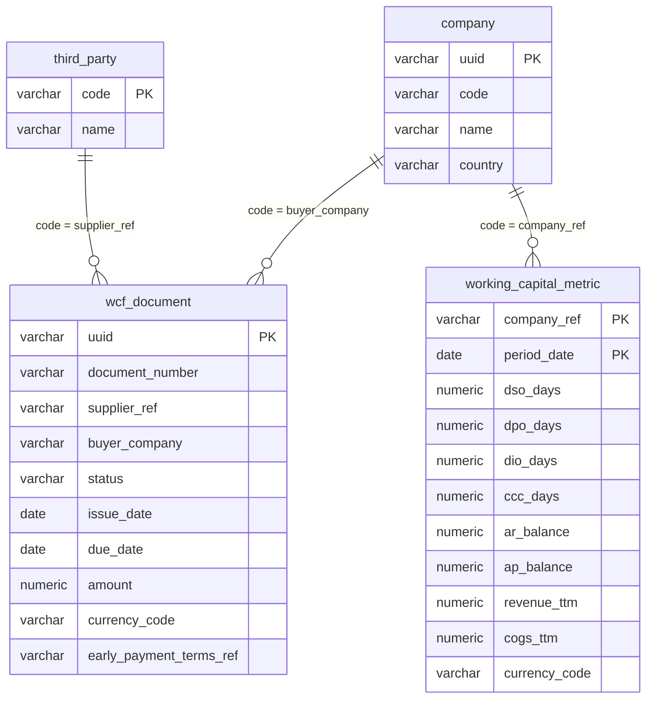

---

### Tables

#### `wcf_document` — Grain: Transaction (one WCF instrument per row) | 2,500 rows

> One row corresponds to a single working capital finance document linking a buyer company to a supplier, representing an approved invoice or payable submitted into the supply chain finance programme.

**Columns:**

| Column | Type | Nullable | Description | Example Values / Boundaries |
|--------|------|----------|-------------|---------------------------|
| uuid | character varying(64) | Yes | Universally unique identifier serving as the primary key for each WCF document record. | System-generated UUID |
| document_number | character varying(64) | Yes | Human-readable sequential reference number assigned to each WCF document. | `WCF-0001423`, `WCF-0000001` |
| supplier_ref | character varying(64) | Yes | Reference code identifying the supplier (trading partner) associated with the WCF document. | Third-party supplier codes |
| buyer_company | character varying(64) | Yes | Internal legal entity code identifying the buying company within the group that originated the document. | `GR_AU`, `GR_DE`, `GR_US_INC` |
| status | character varying(32) | Yes | Current processing status of the WCF document, indicating where it is in the approval and payment lifecycle. | `ISSUED`, `SUBMITTED`, `APPROVED`, `EARLY_PAID`, `SETTLED`, `CANCELLED` |
| issue_date | date | Yes | The calendar date on which the WCF document was formally issued. | Document origination date |
| due_date | date | Yes | The calendar date by which payment of the WCF document is expected. | Typically 30–120 days after issue_date |
| amount | numeric(28,6) | Yes | The total monetary value of the WCF document in the specified currency. | Positive; 6 decimal places |
| currency_code | character varying(16) | Yes | ISO currency code denoting the currency in which the document amount is denominated; currently always USD. | `USD` |
| early_payment_terms_ref | character varying(64) | Yes | Reference identifier for any early payment discount or accelerated payment terms applicable to the document. | Discount terms reference codes; null if standard terms |

**Foreign Key Relationships:**

| Column | References | Join Meaning |
|--------|-----------|-------------|
| buyer_company | company.code | Join to company master to get buyer entity name, country, LEI, and regional grouping |
| supplier_ref | third_party.code | Join to third_party master to get supplier name, country, and counterparty details |

---

#### `working_capital_metric` — Grain: Snapshot (one row per company / period) | 806 rows

> One row represents a single legal entity's working capital efficiency metrics for a specific period-end date, including DSO, DPO, DIO, CCC, and the underlying AR/AP balances and trailing revenue and COGS.

**Columns:**

| Column | Type | Nullable | Description | Example Values / Boundaries |
|--------|------|----------|-------------|---------------------------|
| company_ref | character varying(64) | Yes | Unique internal code identifying each legal entity within the group. Composite primary key component. | `GR_CA`, `GR_FR`, `GR_TREASURY` |
| period_date | date | Yes | The month-end or quarter-end date for which the working capital metrics are reported; ranges from early 2023 through late 2025. Composite primary key component. | `2023-03-31`, `2025-09-30` |
| dso_days | numeric(9,2) | Yes | Days Sales Outstanding — the average number of days it takes the entity to collect payment after a sale has been made. | Typically 20–90 days |
| dpo_days | numeric(9,2) | Yes | Days Payable Outstanding — the average number of days the entity takes to pay its suppliers after receiving goods or services. | Typically 30–120 days |
| dio_days | numeric(9,2) | Yes | Days Inventory Outstanding — the average number of days inventory is held before being sold; typically ranging from 70 to 112 days in the sample. | 70–112 days observed |
| ccc_days | numeric(9,2) | Yes | Cash Conversion Cycle — the net number of days between spending cash on inventory and receiving cash from customers; calculated as DSO + DIO - DPO. | Positive = cash tied up; negative = cash advantage |
| ar_balance | numeric(28,6) | Yes | Total outstanding accounts receivable balance for the entity at the end of the reporting period. | Expressed in reporting currency |
| ap_balance | numeric(28,6) | Yes | Total outstanding accounts payable balance for the entity at the end of the reporting period. | Expressed in reporting currency |
| revenue_ttm | numeric(28,6) | Yes | Trailing twelve-month total revenue for the entity, used as the denominator in DSO and other sales-based working capital calculations. | Large positive values |
| cogs_ttm | numeric(28,6) | Yes | Trailing twelve-month cost of goods sold for the entity, used as the basis for calculating DPO and DIO metrics. | Large positive values |
| currency_code | character varying(16) | Yes | ISO 4217 currency code in which all monetary amounts in the record are denominated; all records in the sample are reported in USD. | `USD` |

**Foreign Key Relationships:**

| Column | References | Join Meaning |
|--------|-----------|-------------|
| company_ref | company.code | Join to company master to get entity name, country, LEI, and to cross-reference with gen_company_region for regional groupings |

---

### KPIs Computable from This Sub-domain

| KPI | Formula / Method | Tables Required |
|-----|-----------------|----------------|
| Cash Conversion Cycle (pre-computed) | `ccc_days` directly from table (already = DSO + DIO - DPO) | working_capital_metric |
| CCC cross-check | `dso_days + dio_days - dpo_days` — should equal `ccc_days` | working_capital_metric |
| DSO (independent calculation) | `ar_balance / (revenue_ttm / 365)` | working_capital_metric |
| DPO (independent calculation) | `ap_balance / (cogs_ttm / 365)` | working_capital_metric |
| DIO (independent calculation) | `inventory_balance / (cogs_ttm / 365)` — note: inventory balance is not stored in this table; DIO must be taken from the pre-computed field | working_capital_metric |
| Total WCF programme volume (by buyer entity) | `SUM(amount) GROUP BY buyer_company` | wcf_document |
| WCF programme volume by status | `SUM(amount) GROUP BY status` | wcf_document |
| Average DPO improvement over time (entity) | Track `dpo_days` per entity across multiple `period_date` values to measure payables extension trend | working_capital_metric |
| WCF utilisation rate | `SUM(amount WHERE status = 'EARLY_PAID') / SUM(amount)` — proportion of eligible payables that suppliers chose to accelerate | wcf_document |
| Average days between issue and due date (WCF) | `AVG(due_date - issue_date)` — proxy for buyer payment terms | wcf_document |
| CCC trend (group level) | `AVG(ccc_days) GROUP BY period_date` across all entities | working_capital_metric |
| Entities with improving DPO | Filter WHERE `dpo_days` at latest period > `dpo_days` at prior period for the same `company_ref` | working_capital_metric |

---

### Common BA Questions

**Q: What is the Cash Conversion Cycle and why does treasury care about it?**
The CCC measures how long it takes for a company to convert its investments in inventory and other resources into cash flows from sales. It is calculated as `DSO + DIO - DPO`. A lower (or negative) CCC means the business operates with minimal working capital tied up, which reduces the need for external financing. Treasury monitors CCC because it directly drives cash flow: if DSO rises (customers pay slower), the company needs more cash to fund operations. If DPO rises (company pays suppliers later), it retains cash longer. WCF programmes are a tool to extend DPO without straining supplier relationships.

**Q: How is the wcf_document table related to the working_capital_metric table?**
They are not directly joined in the schema, but they are causally related. The volume and activity of WCF documents (specifically how many invoices enter the programme and how aggressively suppliers early-pay) influences the `ap_balance` and therefore `dpo_days` in `working_capital_metric`. If the WCF programme grows, the buyer's effective payment terms extend, raising `dpo_days` and lowering `ccc_days`. BAs can monitor both tables together to validate whether WCF programme growth correlates with DPO improvement.

**Q: All WCF documents show currency_code = USD — does this mean all supplier financing is done in USD?**
Based on the current data, yes — the `currency_code` field is documented as "currently always USD." This likely reflects a programme structure where all WCF instruments are converted to USD for the financing bank's convenience, even if the underlying supplier invoice was in another currency. When building reports, you can safely aggregate `amount` across all wcf_documents without FX conversion, but be aware this may change if multi-currency WCF programmes are introduced.

**Q: How do I identify which buyer entities have the highest WCF programme exposure?**
Query `wcf_document` where `status` is in the active states (e.g., `APPROVED`, `EARLY_PAID`, `SUBMITTED`). Group by `buyer_company` and sum `amount`. Join to `company` on `buyer_company = code` to get entity names. This gives total outstanding WCF exposure per entity.

**Q: Can I verify the pre-computed dso_days by recalculating from ar_balance and revenue_ttm?**
Yes. The formula is `ar_balance / (revenue_ttm / 365)`. If the result closely matches `dso_days` in the table, the computation is consistent. Small differences may exist due to rounding or the use of a 360-day vs 365-day year convention. If you see large discrepancies, it may indicate that the pre-computed field uses a different averaging methodology (e.g., average of beginning and ending AR balance rather than period-end AR balance).

**Q: What does the early_payment_terms_ref field on wcf_document represent?**
It is a reference to a terms record (not stored in this sub-domain) that defines the discount rate or accelerated payment schedule applicable when a supplier requests early payment through the programme. A null value means the document operates under standard WCF terms with no special rate. This field allows different suppliers or programmes to have different discount rates while keeping the wcf_document table normalised.

**Q: How do I analyse DPO trend for a specific entity over the past 12 months?**
Query `working_capital_metric` filtered by `company_ref = 'GR_AU'` and `period_date >= DATEADD(month, -12, CURRENT_DATE)`. Select `period_date` and `dpo_days`, ordered by `period_date`. This gives a 12-month rolling view of payables days. If `dpo_days` is increasing over time, the entity is successfully extending supplier payment terms. Overlay this with `wcf_document` volume by `buyer_company` for the same period to see whether WCF programme growth correlates with the DPO extension.
## Sub-domain 14: Fraud & Risk

### Overview

Fraud detection in a treasury and payments context is a multi-stage pipeline that evaluates every payment or file submission in near real-time before funds move. When a transfer is initiated — whether a domestic ACH, an international wire, or a card-present transaction — the platform passes it to a scoring engine that analyses dozens of signals simultaneously: transaction size and velocity, device fingerprint, geolocation delta, BIN (Bank Identification Number) country versus cardholder country, prior chargeback history, and behavioural anomalies against a learned baseline. The output is a numeric risk score and a set of human-readable reason codes that explain which signals fired. Based on the score relative to configured thresholds, the engine renders a decision: allow the transaction to proceed, hold it for manual review by a risk analyst, or block it outright.

The `fraud_detection_event` table is the raw ledger of those real-time evaluations. Each row is one evaluation moment — it captures the UUID of the payment or file that triggered it, the score that came back, the decision rendered, and the structured list of reason codes. Importantly, a single payment may generate multiple detection events if it is re-evaluated after additional authentication steps or analyst overrides, so analysts should always understand the timeline dimension when aggregating scores.

Not every detected event becomes a realized financial loss. Many flagged transactions are blocked before settlement, and some blocked transactions turn out to be legitimate (false positives). The `fraud_loss` table records only confirmed losses — situations where fraudulent activity actually resulted in money leaving or being irrecoverably charged. A key analytical distinction in this table is the `loss_category` field, which separates **third-party true fraud** (an unauthorized actor using stolen credentials or a compromised card) from **first-party friendly fraud** (a genuine member disputing a charge they actually made, commonly seen in membership renewals). The two categories require entirely different remediation strategies: true fraud is addressed through stronger authentication and real-time blocking, while friendly fraud is tackled through dispute evidence packaging and membership verification.

The `auth_method` and `fraud_vector` columns in `fraud_loss` are particularly important for root-cause analysis. `auth_method` records whether 3D Secure (3DS) was applied — and whether the cardholder completed a challenge, passed frictionless flow, or had no 3DS at all — directly influencing which party (merchant or issuer) bears liability under card network rules. `fraud_vector` captures the attack method (card-not-present, social engineering, account takeover, etc.), enabling trend analysis and targeted control improvements. Recovery amounts represent funds clawed back through chargebacks and dispute wins; the net loss is `loss_amount - recovered_amount`.

---

### Key Business Entities

- **Fraud Detection Event** — An automated risk-score evaluation attached to a payment transfer or uploaded payment file. Each event has a score, a decision (allow / review / block), and a set of reason codes.
- **Fraud Loss** — A confirmed realized financial loss following fraudulent activity. Linked back to the detection event (if one was raised) and to the underlying payment authorization. Classified by category, channel, fraud vector, and authentication method.
- **Transfer / Cross-Border Payment Leg** — The upstream payment records that a detection event evaluates. Not in this sub-domain but linked by FK.
- **Company (Legal Entity)** — Each fraud loss is attributed to the legal entity that bore the loss (e.g., GR_US_INC, GR_FR), enabling entity-level fraud P&L tracking.
- **Currency** — Denominator for loss and recovery amounts; USD is dominant but losses can be in any supported currency.
- **Channel** — The sales channel where fraud occurred (in-warehouse, e-commerce, membership renewal), which determines both fraud vector likelihood and dispute handling rules.

---

### Entity Relationship Diagram

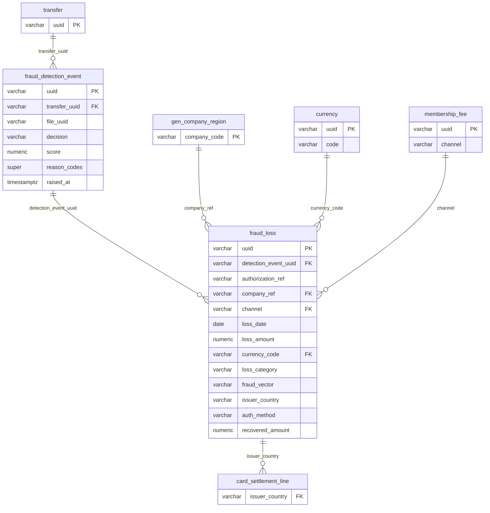

---

### Tables

#### `fraud_detection_event` — Event | 121 rows

> One row represents a single automated fraud risk evaluation raised by the scoring system against a payment transfer or file submission, capturing the score, decision, and contributing reason codes at the moment of assessment.

**Columns:**

| Column | Type | Nullable | Description | Example Values / Boundaries |
|--------|------|----------|-------------|-----------------------------|
| `uuid` | varchar(64) | Yes | Unique identifier for each fraud detection event record. PK. | UUID string; system-generated |
| `transfer_uuid` | varchar(64) | Yes | Unique identifier of the payment transfer associated with this fraud detection event, when applicable. FK to `transfer.uuid`. | UUID string; null if event is file-based |
| `file_uuid` | varchar(64) | Yes | Unique identifier of the file associated with this fraud detection event, when applicable. | UUID string; null if event is transfer-based |
| `decision` | varchar(16) | Yes | The outcome of the fraud assessment, indicating whether the transaction was allowed, flagged for manual review, or blocked. | `ALLOW`, `REVIEW`, `BLOCK` |
| `score` | numeric(6,3) | Yes | Numerical fraud risk score assigned to the event, where higher values indicate greater likelihood of fraudulent activity. | 0.000 – 999.999; threshold for block typically configured at a policy-defined cutoff |
| `reason_codes` | super | Yes | Structured list of codes explaining the factors that contributed to the fraud detection decision. | JSON array, e.g. `["VELOCITY_BREACH","GEO_MISMATCH"]` |
| `raised_at` | timestamptz | Yes | Timestamp indicating when the fraud detection event was triggered. | ISO 8601 datetime with timezone |

**Foreign Key Relationships:**

| Column | References | Join Meaning |
|--------|-----------|-------------|
| `transfer_uuid` | `transfer.uuid` | Links the fraud evaluation to the specific payment transfer that triggered it |
| `transfer_uuid` | `cross_border_payment_leg.transfer_uuid` | Enables correlation with cross-border payment details when the transfer is an international payment |

---

#### `fraud_loss` — Event | 32 rows

> One row represents a confirmed, realized fraud loss incident at the legal entity level, tied to a specific payment authorization, classified by fraud type and attack vector, with amounts for the loss incurred and any recovery achieved.

**Columns:**

| Column | Type | Nullable | Description | Example Values / Boundaries |
|--------|------|----------|-------------|-----------------------------|
| `uuid` | varchar(64) | Yes | Unique system-generated identifier for each fraud loss record. PK. | UUID string |
| `detection_event_uuid` | varchar(64) | Yes | Unique identifier referencing the fraud detection event that triggered this loss record. FK to `fraud_detection_event.uuid`. | UUID string; may be null if loss was identified post-hoc |
| `authorization_ref` | varchar(64) | Yes | Unique reference identifier for the payment authorization associated with the fraudulent transaction. | e.g., `AUTH-00123456`; links to card authorization system |
| `company_ref` | varchar(64) | Yes | Code identifying the legal entity or country-specific subsidiary where the fraud loss was incurred. FK to `gen_company_region.company_code`. | `GR_US_INC`, `GR_FR`, `GR_GB` |
| `channel` | varchar(32) | Yes | Sales or transaction channel through which the fraudulent activity occurred. FK to `membership_fee.channel`. | `in-warehouse`, `e-commerce`, `membership_renewal` |
| `loss_date` | date | Yes | Calendar date on which the fraud loss was recognized or incurred. | `YYYY-MM-DD` |
| `loss_amount` | numeric(28,6) | Yes | Monetary value of the fraud loss incurred, expressed in the transaction currency. | Positive number; represents gross loss before recovery |
| `currency_code` | varchar(16) | Yes | ISO 4217 currency code denoting the currency in which the loss and recovered amounts are denominated. FK to `currency.code`. | `USD`, `EUR`, `GBP` |
| `loss_category` | varchar(32) | Yes | Classification of the fraud loss type, distinguishing between first-party friendly fraud and third-party true fraud. | `friendly_fraud`, `true_fraud` |
| `fraud_vector` | varchar(32) | Yes | Method or attack vector used to commit the fraud, such as card-not-present or social engineering. | `card_not_present`, `social_engineering`, `account_takeover`, `counterfeit_card` |
| `issuer_country` | varchar(2) | Yes | Country code of the card-issuing bank associated with the fraudulent transaction. Referenced by `card_settlement_line.issuer_country`. | ISO 2-letter code: `US`, `GB`, `CN` |
| `auth_method` | varchar(32) | Yes | Authentication method used at the time of the transaction, indicating whether 3D Secure challenge, frictionless flow, no 3DS, or no authentication was applied. | `3DS_CHALLENGE`, `3DS_FRICTIONLESS`, `NO_3DS`, `NO_AUTH` |
| `recovered_amount` | numeric(28,6) | Yes | Monetary amount recovered from the fraud loss through chargebacks, disputes, or other recovery processes. Default 0. | 0.000000 – loss_amount; 0 if no recovery achieved |

**Foreign Key Relationships:**

| Column | References | Join Meaning |
|--------|-----------|-------------|
| `detection_event_uuid` | `fraud_detection_event.uuid` | Joins the confirmed loss back to the original scoring event that detected or missed it |
| `company_ref` | `gen_company_region.company_code` | Identifies which legal entity bore the loss for P&L attribution |
| `currency_code` | `currency.code` | Resolves the ISO currency code to full currency name and decimal precision |
| `channel` | `membership_fee.channel` | Shared channel dimension; enables fraud rate calculation per channel |

---

### KPIs Computable from This Sub-domain

| KPI | Formula / Method | Tables Required |
|-----|-----------------|----------------|
| **Fraud Detection Rate** | `COUNT(DISTINCT fl.uuid) / COUNT(DISTINCT fde.uuid)` where fde.decision = 'BLOCK' or 'REVIEW' | `fraud_detection_event`, `fraud_loss` |
| **Net Fraud Loss** | `SUM(loss_amount - recovered_amount)` grouped by period | `fraud_loss` |
| **Recovery Rate** | `SUM(recovered_amount) / SUM(loss_amount)` | `fraud_loss` |
| **Fraud Loss by Category** | `SUM(loss_amount)` grouped by `loss_category` (true_fraud vs friendly_fraud) | `fraud_loss` |
| **Fraud Loss by Channel** | `SUM(loss_amount)` grouped by `channel` | `fraud_loss` |
| **Fraud Loss by Auth Method** | `SUM(loss_amount)` grouped by `auth_method` — highlights 3DS liability shift effectiveness | `fraud_loss` |
| **Fraud Loss in Basis Points** | `SUM(loss_amount) / total_payment_volume * 10000` — normalized fraud rate vs revenue | `fraud_loss`, payment volume table |
| **Score-to-Loss Conversion Rate** | `COUNT(fl) / COUNT(fde)` per score band — measures model precision | `fraud_detection_event`, `fraud_loss` |
| **Top Fraud Vectors** | `COUNT(*), SUM(loss_amount)` grouped by `fraud_vector` | `fraud_loss` |
| **False Positive Rate** | Events with decision BLOCK where no loss materialized / total BLOCK decisions | `fraud_detection_event`, `fraud_loss` |

---

### Common BA Questions

**Q: What is the difference between a fraud detection event and a fraud loss, and how do they relate?**
A fraud detection event is the automated scoring system's evaluation of a transaction — it fires for every payment assessed, regardless of outcome. A fraud loss is a confirmed financial outcome: money was lost to fraud. They are connected by `fraud_loss.detection_event_uuid`, but the relationship is not one-to-one. Many detection events never become losses (the block prevented them, or the score was low). Some losses may have no matching event if the fraud was identified post-settlement through a chargeback. When analysing whether the model is working, join both tables on the UUID and look at losses where no event was raised (missed detections) and events where a loss occurred despite a ALLOW decision (false negatives).

**Q: How do I calculate the net fraud loss rate as a percentage of payment volume?**
Join `fraud_loss` to the payments volume source (e.g., `pos_transaction` or `card_settlement_line`), sum `loss_amount - recovered_amount` from `fraud_loss` for the period, then divide by total payment volume from the payments table. Multiply by 100 for percentage, or by 10,000 for basis points. Always use the same currency — either convert all amounts to a reporting currency via `fx_rate` or restrict to a single `currency_code`. Group by `company_ref` to get entity-level rates.

**Q: What does the `auth_method` field tell me about liability, and why does it matter for treasury?**
Under card network rules (Visa/Mastercard), if a transaction authenticated via 3DS (challenge or frictionless), the issuing bank bears chargeback liability — not the merchant. If `auth_method` is `NO_3DS` or `NO_AUTH`, the merchant (the company) typically bears liability. Analysing `SUM(loss_amount)` grouped by `auth_method` directly quantifies how much fraud loss is merchant-liable vs issuer-liable. Treasury uses this to prioritize 3DS adoption, negotiate acquirer contracts, and model the financial benefit of authentication improvement programmes.

**Q: How do I identify which fraud vectors are driving the most losses, and has the pattern shifted over time?**
Query `fraud_loss` with `GROUP BY fraud_vector, DATE_TRUNC('quarter', loss_date)` and `SUM(loss_amount - recovered_amount)`. Order by amount descending. Plot the time series to see whether vectors like `card_not_present` are growing relative to `social_engineering` or `account_takeover`. This informs which controls to invest in — for example, card-not-present growth would warrant stronger CVV/AVS checking or 3DS, while social engineering growth would call for member education and call-centre controls.

**Q: How do I distinguish friendly fraud from true fraud in reporting, and does it matter for remediation?**
Filter `fraud_loss.loss_category` for `friendly_fraud` vs `true_fraud`. Friendly fraud (also called first-party fraud) is where the actual cardholder disputes a charge they made — common in membership renewals where members claim non-receipt or unauthorized renewal. True fraud is a genuinely unauthorized third party. The distinction matters because: (1) chargeback dispute evidence is different — for friendly fraud you submit purchase proof and membership activity; for true fraud you accept the loss and focus on prevention; (2) recovery rates differ significantly; (3) channel patterns differ — friendly fraud is heavily concentrated in `membership_renewal` and `e-commerce`, while true fraud is higher in `in-warehouse`.

**Q: How do I identify countries with the highest fraud exposure using the issuer_country field?**
`GROUP BY issuer_country, DATE_TRUNC('month', loss_date)` on `fraud_loss` with `SUM(loss_amount)` and `COUNT(*)`. Join to `currency` via `currency_code` if you need to normalize to a single currency. The `issuer_country` reflects where the fraudulent card was issued — high-loss issuer countries often indicate compromised card batches from specific geographies or correlate with cross-border card-not-present attacks. This is also the field used to join to `card_settlement_line` for reconciliation.

---

## Sub-domain 15: Corporate Actions & Pensions

### Overview

Corporate actions are deliberate capital allocation decisions by the holding company that directly change the equity structure or return capital to shareholders. In a treasury context the two most common types are **share buybacks** (the company repurchases its own shares from the open market, reducing share count and increasing EPS) and **dividends** (the company distributes a portion of earnings to shareholders, either as a regular quarterly/annual dividend or as a one-time special dividend). The `equity_action` table is the event ledger for these decisions — each row records one execution of a corporate action program: the date, the share count involved, the price paid or dividend per share, and the remaining authorization headroom under the board-approved program.

Capital allocation is the broader strategic discipline of deciding how to deploy free cash flow across competing uses. For a large retail treasury, the main buckets are capital expenditure (new warehouses, technology, fleet), mergers and acquisitions, dividends and buybacks (shareholder returns), debt repayment, and working capital management. The `capital_allocation_actual` table records, at a quarterly snapshot grain, how much cash was actually deployed into each bucket per legal entity, alongside the framework target percentage that the board set for each bucket. This allows treasury and finance to track whether actual deployment is on-strategy — for example, if the framework says 30% of free cash flow should go to CAPEX but actual CAPEX is running at 18%, that is a signal to accelerate investment.

Defined-benefit (DB) pension plans are a significant but often overlooked treasury risk. Under a DB scheme the company promises to pay retirees a benefit based on their final salary and years of service, regardless of investment returns — the company bears all the investment and longevity risk. The `pension_plan` table is the reference catalogue of those plans: which legal entity sponsors them, which country they operate in, whether they are open to new members, and the plan code (e.g., `PP_US_DB`, `PP_UK_DB`). Most large retailers have legacy DB plans in the US, UK, and Japan that were closed to new entrants years ago but continue to accumulate obligations for existing members.

The `pension_valuation` table records the annual actuarial snapshots of each plan's financial position. The two central concepts are the **Projected Benefit Obligation (PBO)** — the present value of all benefits already earned by employees, discounted at the corporate bond rate — and **Plan Assets at Fair Value** — the investment portfolio held in trust to pay those benefits. The difference is the **funded status**: positive means overfunded (assets exceed obligations), negative means underfunded and the company has a balance sheet liability. The `discount_rate_pct` assumption is particularly sensitive: a 50 basis point decrease in discount rate can increase the PBO by hundreds of millions for large plans. Changes in actuarial assumptions create OCI (Other Comprehensive Income) impacts that flow through the balance sheet but bypass the income statement. Projected contributions for years 1–3 represent the expected cash calls on the company to maintain regulatory minimum funding levels — a direct treasury cash flow planning input.

---

### Key Business Entities

- **Equity Action** — A single execution of a corporate buyback or dividend program, recording shares, price, and total cash deployed.
- **Capital Allocation Actual** — A quarterly snapshot of actual cash deployed per legal entity per allocation bucket (CAPEX, M&A, dividends, debt, buybacks) versus framework targets.
- **Pension Plan** — Reference record for each sponsored defined-benefit (or hybrid) pension plan, identified by country and plan type.
- **Pension Valuation** — Annual actuarial snapshot of a plan's funded status, PBO, plan assets, discount rate, and projected future contributions.
- **Company** — Legal entity that sponsors pension plans and performs equity actions (referenced by `company_ref`).
- **Currency** — Denomination of financial amounts across all four tables.

---

### Entity Relationship Diagram

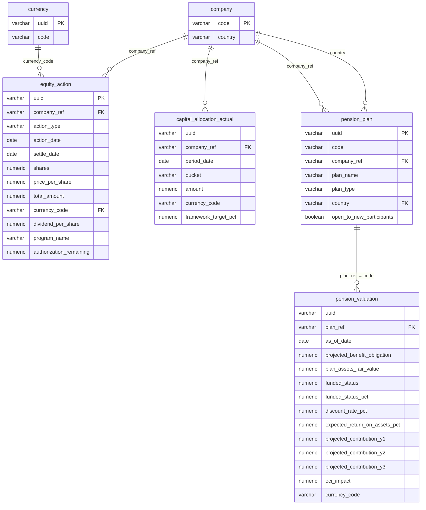

---

### Tables

#### `equity_action` — Event | 23 rows

> One row represents a single corporate equity action event — a share buyback execution or dividend payment — executed by a holding company, capturing the shares involved, price, total cash deployed, and remaining board authorization.

**Columns:**

| Column | Type | Nullable | Description | Example Values / Boundaries |
|--------|------|----------|-------------|-----------------------------|
| `uuid` | varchar(64) | Yes | Unique system-generated identifier for each equity action record. PK. | UUID string |
| `company_ref` | varchar(64) | Yes | Internal code identifying the company that performed the equity action. FK to `company.code`. | `GR_HOLDINGS`, `GR_US_INC` |
| `action_type` | varchar(16) | Yes | Category of equity action taken by the company, such as a share buyback, regular dividend, or special dividend. | `BUYBACK`, `DIVIDEND`, `SPECIAL_DIVIDEND` |
| `action_date` | date | Yes | The calendar date on which the equity action (e.g., dividend declaration or buyback execution) occurred. | `YYYY-MM-DD`; declaration date for dividends, trade date for buybacks |
| `settle_date` | date | Yes | The date on which the equity action financially settles and funds or shares are transferred. | Typically T+2 for buybacks; payment date for dividends |
| `shares` | numeric(28,2) | Yes | Number of shares involved in the equity action, such as shares repurchased in a buyback or shares eligible for a dividend. | Positive integer-like value; null for cash-only dividend events |
| `price_per_share` | numeric(12,4) | Yes | The monetary price paid per share in the equity action, typically applicable for buyback transactions. | Market price at time of repurchase; null for dividend-only events |
| `total_amount` | numeric(28,6) | Yes | The total monetary value of the equity action, representing the aggregate cash outlay for buybacks or total dividend paid. | Large positive number; = shares × price_per_share for buybacks |
| `currency_code` | varchar(16) | Yes | ISO currency code in which the equity action amounts are denominated. FK to `currency.code`. | `USD` predominantly |
| `dividend_per_share` | numeric(12,4) | Yes | The cash dividend amount distributed per share, applicable for regular or special dividend actions. | e.g., 1.02 USD per share; null for buybacks |
| `program_name` | varchar(128) | Yes | The name of the specific corporate program under which the equity action was executed, such as a named buyback or dividend program. | e.g., `FY24 Buyback Program`, `Q3 2024 Regular Dividend` |
| `authorization_remaining` | numeric(28,6) | Yes | The remaining monetary amount authorized but not yet utilized under the equity action program, typically applicable to share buyback authorizations. | Decreases with each buyback; null or 0 when program exhausted |

**Foreign Key Relationships:**

| Column | References | Join Meaning |
|--------|-----------|-------------|
| `company_ref` | `company.code` | Identifies which holding entity executed the equity action |
| `currency_code` | `currency.code` | Resolves ISO currency code to full name and decimal precision |

---

#### `capital_allocation_actual` — Snapshot (quarterly) | 165 rows

> One row represents the actual capital amount deployed by a specific legal entity into a specific allocation bucket (e.g., CAPEX, M&A, dividends) for a single quarter, alongside the framework target percentage for that bucket.

**Columns:**

| Column | Type | Nullable | Description | Example Values / Boundaries |
|--------|------|----------|-------------|-----------------------------|
| `uuid` | varchar(64) | Yes | Universally unique identifier for each capital allocation actual record. Not in composite PK. | UUID string |
| `company_ref` | varchar(64) | Yes | Code identifying the legal entity or subsidiary within the group for which capital allocation is recorded. PK (composite). FK to `company.code`. | `GR_HOLDINGS`, `GR_US_INC`, `GR_EU_BV` |
| `period_date` | date | Yes | The quarter-end date representing the reporting period for the capital allocation actual figures. PK (composite). | `2024-03-31`, `2024-06-30`, `2024-09-30`, `2024-12-31` |
| `bucket` | varchar(16) | Yes | Category of capital allocation use, such as capital expenditure, mergers and acquisitions, dividends, debt repayment, or share buybacks. PK (composite). | `CAPEX`, `M_AND_A`, `DIVIDENDS`, `DEBT_PAYDOWN`, `BUYBACKS` |
| `amount` | numeric(28,6) | Yes | Actual monetary amount allocated to the given capital bucket for the reporting period, expressed in the associated currency. | Large positive number |
| `currency_code` | varchar(16) | Yes | ISO 4217 currency code in which the capital allocation amount is denominated. | `GBP`, `USD`, `EUR` |
| `framework_target_pct` | numeric(9,4) | Yes | The capital allocation framework's target percentage share assigned to this bucket, representing the intended proportion of total capital to be deployed. | 0.0000 – 1.0000; e.g., 0.2000 = 20% |

**Foreign Key Relationships:**

| Column | References | Join Meaning |
|--------|-----------|-------------|
| `company_ref` | `company.code` | Links the allocation record to the sponsoring legal entity |

---

#### `pension_plan` — Reference | 3 rows

> One row represents a single sponsored defined-benefit (or hybrid) pension plan, identified by plan code, sponsoring entity, country of operation, and enrolment status. This is a slowly-changing reference table — one row per distinct plan.

**Columns:**

| Column | Type | Nullable | Description | Example Values / Boundaries |
|--------|------|----------|-------------|-----------------------------|
| `uuid` | varchar(64) | Yes | Unique system-generated identifier for each pension plan record. PK. | UUID string |
| `code` | varchar(64) | Yes | Short alphanumeric business code identifying a pension plan, encoding country and plan type. Referenced as FK by `pension_valuation.plan_ref`. | `PP_US_DB`, `PP_UK_DB`, `PP_JP_DB` |
| `company_ref` | varchar(64) | Yes | Business code identifying the legal entity or subsidiary company that sponsors the pension plan. FK to `company.code`. | `GR_US_INC`, `GR_GB`, `GR_JP` |
| `plan_name` | varchar(256) | Yes | Full human-readable name of the pension plan as used in official plan documentation. | `GlobalRetail UK Pension Scheme`, `GlobalRetail US Retirement Plan` |
| `plan_type` | varchar(16) | Yes | Classification of the pension plan structure, indicating whether it is a defined benefit, hybrid, or other arrangement. | `DEFINED_BENEFIT`, `HYBRID` |
| `country` | varchar(2) | Yes | ISO 2-letter country code indicating the jurisdiction in which the pension plan operates. FK to `company.country`. | `US`, `GB`, `JP` |
| `open_to_new_participants` | boolean | Yes | Flag indicating whether the pension plan is currently accepting new member enrolments. | `true` (open), `false` (closed to new entrants — common for legacy DB plans) |

**Foreign Key Relationships:**

| Column | References | Join Meaning |
|--------|-----------|-------------|
| `company_ref` | `company.code` | Identifies the sponsoring legal entity for regulatory and P&L attribution |
| `country` | `company.country` | Links plan jurisdiction to the company's country dimension |

---

#### `pension_valuation` — Snapshot (annual actuarial) | 11 rows

> One row represents the full actuarial valuation of a single defined-benefit pension plan as of a specific valuation date, capturing funded status, obligation, plan assets, actuarial assumptions, projected cash contributions for three years forward, and OCI impact.

**Columns:**

| Column | Type | Nullable | Description | Example Values / Boundaries |
|--------|------|----------|-------------|-----------------------------|
| `uuid` | varchar(64) | Yes | Universally unique identifier assigned to each pension valuation record for system-level tracking. Not in composite PK. | UUID string |
| `plan_ref` | varchar(64) | Yes | Alphanumeric code identifying the specific defined-benefit pension plan by country and type. PK (composite). FK to `pension_plan.code`. | `PP_UK_DB`, `PP_US_DB`, `PP_JP_DB` |
| `as_of_date` | date | Yes | The valuation date as of which the pension plan's financial position and actuarial assumptions are measured. PK (composite). | Typically `YYYY-12-31` (year-end) |
| `projected_benefit_obligation` | numeric(28,6) | Yes | The actuarial present value of all future pension benefits earned by employees to date, projected using estimated future salary levels. | Large positive number; increases with lower discount rates |
| `plan_assets_fair_value` | numeric(28,6) | Yes | The fair market value of assets held in trust by the pension plan to fund future benefit payments. | Large positive number; varies with investment market returns |
| `funded_status` | numeric(28,6) | Yes | The net difference between plan assets at fair value and the projected benefit obligation, indicating whether the plan is overfunded (positive) or underfunded (negative). | Negative = underfunded (balance sheet liability); Positive = overfunded |
| `funded_status_pct` | numeric(9,4) | Yes | The ratio of plan assets to the projected benefit obligation expressed as a percentage, indicating the degree to which the plan is funded. | e.g., 0.9500 = 95% funded; 1.0000 = fully funded |
| `discount_rate_pct` | numeric(9,4) | Yes | The interest rate used to discount projected future benefit payments to their present value in the actuarial valuation. | e.g., 0.0480 = 4.80%; based on high-quality corporate bond yields |
| `expected_return_on_assets_pct` | numeric(9,4) | Yes | The actuarially assumed long-term annual rate of return expected to be earned on pension plan assets. | e.g., 0.0650 = 6.50%; set by actuary and trustees annually |
| `projected_contribution_y1` | numeric(28,6) | Yes | The estimated employer cash contribution to the pension plan projected for the first year following the valuation date. | Direct treasury cash outflow planning input |
| `projected_contribution_y2` | numeric(28,6) | Yes | The estimated employer cash contribution to the pension plan projected for the second year following the valuation date. | Direct treasury cash outflow planning input |
| `projected_contribution_y3` | numeric(28,6) | Yes | The estimated employer cash contribution to the pension plan projected for the third year following the valuation date. | Direct treasury cash outflow planning input |
| `oci_impact` | numeric(28,6) | Yes | The net actuarial gain or loss and prior service cost recognized in Other Comprehensive Income resulting from changes in pension valuation assumptions or experience. | Negative = actuarial loss (charge to OCI); Positive = actuarial gain |
| `currency_code` | varchar(16) | Yes | The ISO 4217 currency code in which the pension plan's financial values are denominated. | `USD` (US plan), `GBP` (UK plan), `JPY` (Japan plan) |

**Foreign Key Relationships:**

| Column | References | Join Meaning |
|--------|-----------|-------------|
| `plan_ref` | `pension_plan.code` | Links the valuation snapshot to the plan's reference record (type, country, sponsor) |

---

### KPIs Computable from This Sub-domain

| KPI | Formula / Method | Tables Required |
|-----|-----------------|----------------|
| **Total Shareholder Return (Capital)** | `SUM(total_amount)` where `action_type IN ('BUYBACK','DIVIDEND','SPECIAL_DIVIDEND')` grouped by period | `equity_action` |
| **Buyback Authorization Utilization** | `(original_authorization - MIN(authorization_remaining)) / original_authorization` per program | `equity_action` |
| **Capital Allocation vs Framework** | `SUM(amount) / SUM(total_amount_per_period)` vs `framework_target_pct` per bucket — variance shows over/under-deployment | `capital_allocation_actual` |
| **Total CAPEX Deployed (Quarter)** | `SUM(amount) WHERE bucket = 'CAPEX' GROUP BY period_date, company_ref` | `capital_allocation_actual` |
| **Pension Funded Status** | `funded_status` or `funded_status_pct` per plan per `as_of_date` | `pension_valuation` |
| **Pension Underfunding Liability** | `SUM(GREATEST(0, projected_benefit_obligation - plan_assets_fair_value))` across plans | `pension_valuation` |
| **Projected 3-Year Pension Cash Calls** | `SUM(projected_contribution_y1 + projected_contribution_y2 + projected_contribution_y3)` per plan | `pension_valuation` |
| **OCI Actuarial Impact** | `SUM(oci_impact)` per period — net charge/(gain) flowing through balance sheet | `pension_valuation` |
| **Pension Sensitivity to Discount Rate** | Compare PBO at different `discount_rate_pct` values across valuation dates to approximate sensitivity | `pension_valuation` |
| **Dividends Per Share Over Time** | `SUM(dividend_per_share)` grouped by `DATE_TRUNC('year', action_date)` and `program_name` | `equity_action` |

---

### Common BA Questions

**Q: How do I track whether the company is executing its board-approved share buyback program on schedule?**
Query `equity_action` filtered to `action_type = 'BUYBACK'` and the relevant `program_name`. Sum `total_amount` by month and compare against the authorized program size. Use `authorization_remaining` on the latest event for each program to see how much headroom remains. If the most recent row shows `authorization_remaining` close to zero, the program is nearly exhausted and a new board authorization will be needed.

**Q: How do I assess whether the capital allocation framework is being followed in practice?**
Query `capital_allocation_actual` and for each `company_ref` / `period_date`, calculate the actual percentage per bucket: `amount / SUM(amount) OVER (PARTITION BY company_ref, period_date)`. Compare this derived percentage against `framework_target_pct`. Buckets with a large positive variance are over-deployed; negative variance means under-deployed. This analysis is central to quarterly CFO reporting and board strategy reviews.

**Q: Which pension plans are underfunded, and by how much?**
Filter `pension_valuation` to the most recent `as_of_date` per `plan_ref` and check `funded_status < 0` or `funded_status_pct < 1.0`. Join to `pension_plan` on `plan_ref = code` to get the plan name and sponsoring country. The `funded_status` column already computes `plan_assets_fair_value - projected_benefit_obligation`, so a negative value is the underfunding amount. Sum across plans to get the aggregate balance sheet pension liability.

**Q: How do I project the total pension cash contributions the company will need to make over the next three years?**
Sum `projected_contribution_y1`, `projected_contribution_y2`, and `projected_contribution_y3` from `pension_valuation` for the most recent `as_of_date` per plan. These represent the actuary's estimate of minimum regulatory funding contributions. Note that each plan is valued in its local currency (`currency_code`), so you will need to convert to the group reporting currency via `fx_rate` before aggregating across plans for a consolidated treasury cash flow forecast.

**Q: What is the OCI impact of pension valuations, and why does it matter for treasury?**
The `oci_impact` column captures the net actuarial gains and losses that arise when actual experience (investment returns, mortality rates) or assumption changes (discount rate revisions) deviate from prior estimates. These flows bypass the income statement but directly affect equity and balance sheet gearing ratios, which in turn can affect debt covenant compliance. Treasury monitors OCI impacts because a large negative OCI (actuarial loss) reduces net equity, potentially breaching a leverage covenant expressed as Debt / Equity.

**Q: How do I reconcile equity actions to capital allocation actuals for the dividends bucket?**
Join `equity_action` (filtered to `action_type IN ('DIVIDEND','SPECIAL_DIVIDEND')`) to `capital_allocation_actual` (filtered to `bucket = 'DIVIDENDS'`) on `company_ref` and the matching period. The `equity_action.total_amount` is the transaction-level event; `capital_allocation_actual.amount` is the quarterly aggregated view. Differences may arise from timing (declaration vs settlement date) or currency conversion. This reconciliation confirms that what was actually paid to shareholders agrees with what the allocation framework reported.

---

## Sub-domain 16: Reference Data

### Overview

Reference data tables — sometimes called dimension or lookup tables — underpin nearly every analytical query in the data model. Unlike transactional tables that grow row-by-row with every payment or event, reference data changes rarely and serves as the stable definitional backbone that gives meaning to codes stored throughout the warehouse. When a payment record stores `currency_code = 'JPY'`, it is the `currency` table that tells the system that JPY is the Japanese Yen with 0 decimal places and a 2-day delivery float. Understanding which tables are reference data and how they join is one of the first skills a new BA should develop, because omitting a reference join is a common source of incomplete or misinterpreted results.

The `currency` table is the most pervasively referenced lookup in the entire model. Practically every table that stores a monetary amount also stores a `currency_code` column, and `currency.code` is the join key. Beyond just the name, the table stores `number_of_decimals` (critical for JPY = 0, USD = 2) and `delivery_float` (settlement days, relevant for FX risk and value-dating calculations). The `macro_indicator` table serves a different purpose: it is a time-series store of external economic benchmarks — Fed Funds Rate, 3-Month SOFR, US CPI, EUR/USD implied volatility, Geopolitical Risk Index, Brent crude — published daily. Treasury uses these to contextualize why cash balances, FX costs, or borrowing costs moved: a spike in SOFR explains why floating-rate debt service increased, and a CPI print explains inflationary pressure on operating costs.

Peer benchmarking relies on two tables: `peer_company` (the reference list of competitors — Walmart, Amazon, Home Depot, Target, etc.) and `peer_company_metric` (their published financial metrics per quarter and year). The metrics table is rich: revenue, EBITDA, free cash flow, net debt, leverage ratio, debt-to-EBITDA, WACC, dividend yield, buyback yield, and — critically for this domain — `fraud_loss_bps` (fraud losses in basis points) and `interchange_pct`. These peer benchmarks allow treasury to answer questions like "Is our fraud loss rate above industry average?" or "Is our shareholder return yield competitive with peers?"

Banking fee management uses `fee_rate_card` to store the negotiated contractual rates agreed with each bank for each service category. This is importantly different from the `bank_fee` table (which records actual charges invoiced) — the rate card is the contract; actual fees are what was billed. Comparing actual to contracted rates is a key treasury audit activity to catch billing errors. Finally, the `mapping_table` and `mapping_entry` pair implement a flexible key-value cross-reference system for code translations that do not warrant their own dedicated tables: payment rails to AFP service codes, company codes to functional currencies, bank identifiers to BIC/SWIFT codes, and cash flow types to GL accounts. Any time a BA needs to translate an internal system code to an external standard or vice versa, these tables are the first place to look.

---

### Key Business Entities

- **Currency** — Master list of all supported currencies with ISO codes, decimal precision, and settlement float. Referenced by every monetary table.
- **Macro Indicator** — Daily time series of key external economic benchmarks (rates, inflation, commodity prices, volatility indices) sourced from authoritative providers (FRED, BLS, CME, ICE).
- **Peer Company** — Reference list of publicly traded competitor companies used for financial benchmarking.
- **Peer Company Metric** — Quarterly and annual financial and operational metrics for each peer company, including fraud loss and interchange benchmarks.
- **Fee Rate Card** — Negotiated banking service fee rates per bank, per service, per legal entity, with validity date ranges.
- **Mapping Table** — Registry of available code-translation mapping sets (e.g., "Payment Rail to AFP Code").
- **Mapping Entry** — Individual source-to-target translation entries within each named mapping set.

---

### Entity Relationship Diagram

```mermaid
erDiagram
    currency {
        varchar uuid PK
        varchar code
        varchar description
        smallint number_of_decimals
        smallint delivery_float
        boolean is_reference
        boolean hide_in_list
    }

    macro_indicator {
        varchar indicator_code PK
        varchar region PK
        date as_of_date PK
        numeric value
        varchar unit
        varchar source
    }

    peer_company {
        varchar code PK
        varchar name
        varchar ticker
        varchar sector
        varchar peer_group
        varchar country
    }

    peer_company_metric {
        varchar peer_code PK FK
        date period_date PK
        varchar period_type PK
        varchar reporting_currency
        numeric revenue
        numeric ebitda
        numeric free_cash_flow
        numeric net_debt
        numeric leverage_ratio
        numeric debt_to_ebitda
        numeric return_on_capital_pct
        numeric dividend_yield_pct
        numeric buyback_yield_pct
        numeric shareholder_return_yield_pct
        numeric wacc_pct
        numeric payments_cost_pct_revenue
        numeric fraud_loss_bps
        numeric interchange_pct
    }

    fee_rate_card {
        varchar uuid PK
        varchar bank_ref FK
        varchar service_code
        varchar company_ref FK
        numeric negotiated_rate
        varchar rate_unit
        varchar currency_code FK
        date effective_from
        date effective_to
    }

    mapping_table {
        varchar uuid PK
        varchar code
        varchar description
        varchar scope
    }

    mapping_entry {
        varchar mapping_table_code PK FK
        varchar source_value PK
        varchar target_value
    }

    bank {
        varchar code PK
    }

    gen_company_region {
        varchar company_code PK
    }

    bank_branch {
        varchar region
    }

    fx_rate {
        varchar base_currency FK
    }

    peer_company ||--o{ peer_company_metric : "code → peer_code"
    mapping_table ||--o{ mapping_entry : "code → mapping_table_code"
    bank ||--o{ fee_rate_card : "bank_ref"
    gen_company_region ||--o{ fee_rate_card : "company_ref"
    currency ||--o{ fee_rate_card : "currency_code"
    currency ||--o{ fx_rate : "base_currency"
    bank_branch ||--o{ macro_indicator : "region"
```

---

### Tables

#### `currency` — Reference | 18 rows

> One row represents a single supported currency, identified by its ISO 4217 three-letter code, with attributes for display, decimal precision, and settlement float. This table is joined by virtually every monetary table in the model via `currency_code`.

**Columns:**

| Column | Type | Nullable | Description | Example Values / Boundaries |
|--------|------|----------|-------------|-----------------------------|
| `uuid` | varchar(64) | Yes | Unique system-generated identifier for each currency record. PK. | UUID string |
| `code` | varchar(16) | Yes | ISO 4217 three-letter currency code identifying the currency. This is the join key used throughout the model. | `USD`, `EUR`, `GBP`, `JPY`, `AUD`, `CAD`, `MXN` |
| `description` | varchar(256) | Yes | Full human-readable name of the currency. | `US Dollar`, `Euro`, `Pound Sterling`, `Japanese Yen` |
| `number_of_decimals` | smallint(16) | Yes | The number of decimal places used when expressing monetary amounts in this currency. | `2` (USD, EUR, GBP), `0` (JPY), `3` (KWD) |
| `delivery_float` | smallint(16) | Yes | The number of business days allowed for settlement or delivery of transactions in this currency. | `2` (standard T+2 for most currencies); relevant for FX value-dating |
| `is_reference` | boolean | Yes | Flag indicating whether this currency serves as the reference or base currency for exchange rate calculations. Default false. | `true` for the group's base reporting currency (typically USD or GBP) |
| `hide_in_list` | boolean | Yes | Flag indicating whether this currency should be hidden from user-facing currency selection lists or dropdowns. Default false. | `true` for deprecated or non-standard currencies |

**Foreign Key Relationships:**

| Column | References | Join Meaning |
|--------|-----------|-------------|
| `code` | Referenced by `fx_rate.base_currency` and `currency_code` columns throughout the model | Provides full currency name, decimal precision, and float to any table storing a currency code |

---

#### `macro_indicator` — Time Series | 777 rows

> One row represents the observed value of a specific macroeconomic indicator for a specific geographic region on a given calendar date, sourced from an authoritative provider. Composite PK is (indicator_code, region, as_of_date).

**Columns:**

| Column | Type | Nullable | Description | Example Values / Boundaries |
|--------|------|----------|-------------|-----------------------------|
| `indicator_code` | varchar(64) | Yes | Unique short code identifying the macroeconomic indicator being tracked. PK (composite). | `FED_FUNDS_RATE`, `SOFR_3M`, `US_CPI_YOY`, `EURUSD_VOL`, `GEOPOLITICAL_RISK`, `BRENT_CRUDE` |
| `region` | varchar(16) | Yes | Geographic scope of the macroeconomic indicator, distinguishing between US-specific and globally applicable measures. PK (composite). FK shared with `bank_branch.region`. | `US`, `GLOBAL`, `EU`, `APAC` |
| `as_of_date` | date | Yes | The calendar date as of which the macroeconomic indicator value was recorded or published. PK (composite). | Daily observation dates; `YYYY-MM-DD` |
| `value` | numeric(20,6) | Yes | The numeric reading of the macroeconomic indicator as of the observation date, expressed in the unit specified for that indicator. | e.g., 5.33 (Fed Funds %), 3.21 (SOFR %), 312.50 (Brent crude USD/barrel) |
| `unit` | varchar(32) | Yes | The unit of measurement for the indicator value, such as percentage, index points, year-over-year percentage change, or US dollars per barrel. | `percent`, `index_points`, `yoy_pct_change`, `usd_per_barrel` |
| `source` | varchar(64) | Yes | The originating data provider or institution from which the macroeconomic indicator value was sourced. | `FRED`, `FRBNY`, `BLS`, `CME`, `ICE` |

**Foreign Key Relationships:**

| Column | References | Join Meaning |
|--------|-----------|-------------|
| `region` | `bank_branch.region` | Shared region dimension; allows macro indicators to be contextualized against banking activity in the same geography |

---

#### `peer_company` — Reference | 7 rows

> One row represents a single publicly traded peer or competitor company used for benchmarking, identified by its stock ticker and classified by sector and peer group. This is a static reference list.

**Columns:**

| Column | Type | Nullable | Description | Example Values / Boundaries |
|--------|------|----------|-------------|-----------------------------|
| `code` | varchar(32) | Yes | Unique internal code identifying a peer company, typically matching its stock ticker symbol. PK. Referenced as FK by `peer_company_metric.peer_code`. | `WMT`, `TGT`, `AMZN`, `HD`, `COST` |
| `name` | varchar(256) | Yes | Full legal or registered business name of the peer company. | `Walmart Inc.`, `Amazon.com Inc.`, `The Home Depot Inc.` |
| `ticker` | varchar(16) | Yes | Stock exchange ticker symbol used to publicly identify the peer company. | `WMT`, `HD`, `AMZN`; same as `code` in most cases |
| `sector` | varchar(64) | Yes | Broad industry sector classification of the peer company. | `Consumer Staples Retail`, `Consumer Discretionary / Cloud` |
| `peer_group` | varchar(64) | Yes | Competitive peer group category to which the company belongs, used to group similar retail business models. | `BIG_BOX_RETAIL`, `GROCERY`, `ECOMMERCE` |
| `country` | varchar(2) | Yes | Country of domicile or primary operations for the peer company, represented as an ISO country code. | `US` (all current peers) |

**Foreign Key Relationships:**

| Column | References | Join Meaning |
|--------|-----------|-------------|
| `code` | Referenced by `peer_company_metric.peer_code` | Master record for each competitor; join to get company name, sector, and peer group when presenting metric data |

---

#### `peer_company_metric` — Time Series | 154 rows

> One row represents a single peer company's reported financial and operational metrics for a specific reporting period (quarterly or annual), identified by the composite PK of (peer_code, period_date, period_type).

**Columns:**

| Column | Type | Nullable | Description | Example Values / Boundaries |
|--------|------|----------|-------------|-----------------------------|
| `peer_code` | varchar(32) | Yes | Stock ticker symbol identifying the peer company. PK (composite). FK to `peer_company.code`. | `WMT`, `AMZN`, `TGT`, `HD`, `COST` |
| `period_date` | date | Yes | The start or end date of the financial reporting period to which the metrics apply. PK (composite). | Quarter-end or fiscal year-end date |
| `period_type` | varchar(8) | Yes | Indicates whether the reported metrics cover a single quarter or a full fiscal year. PK (composite). | `Q` (quarterly), `FY` (full year) |
| `reporting_currency` | varchar(16) | Yes | The currency in which all monetary metrics for the peer company are reported (currently USD for all records). | `USD` |
| `revenue` | numeric(28,6) | Yes | Total net revenue or net sales reported by the peer company for the period. | Billions USD; e.g., 161,000,000,000 for Walmart annual |
| `ebitda` | numeric(28,6) | Yes | Earnings before interest, taxes, depreciation, and amortization reported by the peer company for the period. | Large positive number in USD |
| `free_cash_flow` | numeric(28,6) | Yes | Cash generated by the peer company's operations after capital expenditures for the period. | Can be positive or negative |
| `net_debt` | numeric(28,6) | Yes | Total debt minus cash and cash equivalents on the peer company's balance sheet at the end of the period. | Negative = net cash position |
| `leverage_ratio` | numeric(9,4) | Yes | A measure of the peer company's financial leverage, typically total debt relative to equity or earnings. | e.g., 2.3000 |
| `debt_to_ebitda` | numeric(9,4) | Yes | Ratio of the peer company's net debt to EBITDA, indicating how many years of earnings would be needed to repay debt. | e.g., 1.8000; higher = more leveraged |
| `return_on_capital_pct` | numeric(9,4) | Yes | The peer company's return on invested capital expressed as a percentage, measuring capital efficiency. | e.g., 0.1450 = 14.50% |
| `dividend_yield_pct` | numeric(9,4) | Yes | Annual dividends paid by the peer company as a percentage of its share price. | e.g., 0.0145 = 1.45% |
| `buyback_yield_pct` | numeric(9,4) | Yes | Value of shares repurchased by the peer company expressed as a percentage of its market capitalization. | e.g., 0.0200 = 2.00% |
| `shareholder_return_yield_pct` | numeric(9,4) | Yes | Combined return to shareholders through dividends and share buybacks expressed as a percentage of market capitalization. | = dividend_yield_pct + buyback_yield_pct |
| `wacc_pct` | numeric(9,4) | Yes | The peer company's weighted average cost of capital expressed as a percentage, reflecting the blended cost of debt and equity financing. | e.g., 0.0820 = 8.20% |
| `payments_cost_pct_revenue` | numeric(9,4) | Yes | The peer company's total payments processing costs expressed as a percentage of revenue. | e.g., 0.0045 = 45 bps |
| `fraud_loss_bps` | numeric(9,2) | Yes | The peer company's fraud-related losses measured in basis points, indicating the rate of fraud relative to transaction volume or revenue. | e.g., 4.50 bps; compare to own fraud_loss table |
| `interchange_pct` | numeric(9,4) | Yes | The interchange fees incurred or earned by the peer company expressed as a percentage of payment transaction volume. | e.g., 0.0180 = 1.80% |

**Foreign Key Relationships:**

| Column | References | Join Meaning |
|--------|-----------|-------------|
| `peer_code` | `peer_company.code` | Joins to the peer company reference record to get full name, sector, and peer group |

---

#### `fee_rate_card` — Reference | 650 rows

> One row represents a single negotiated fee rate applicable to a specific bank, service code, and legal entity combination, valid between an effective_from and effective_to date. This is the contracted rate — compare against `bank_fee` actuals to detect billing discrepancies.

**Columns:**

| Column | Type | Nullable | Description | Example Values / Boundaries |
|--------|------|----------|-------------|-----------------------------|
| `uuid` | varchar(64) | Yes | Unique system-generated identifier for each fee rate card record. PK. | UUID string |
| `bank_ref` | varchar(64) | Yes | Coded reference identifying the bank or financial institution to which the fee rate applies. FK to `bank.code`. | `BANK_ANZ`, `BANK_JPM`, `BANK_HSBC`, `BANK_CITI` |
| `service_code` | varchar(64) | Yes | Standardised code identifying the type of banking service or product to which the negotiated fee rate applies. | `WIRE_OUTGOING`, `ACH_CREDIT`, `ACCOUNT_MAINT`, `SEPA_CREDIT_TRANSFER` |
| `company_ref` | varchar(64) | Yes | Reference identifying the internal company or legal entity for which the fee rate card is applicable. FK to `gen_company_region.company_code`. | `GR_US_INC`, `GR_EU_BV`, `GR_GB` |
| `negotiated_rate` | numeric(28,6) | Yes | The contractually agreed fee rate charged by the bank for the given service, expressed in the unit defined by `rate_unit`. | e.g., 12.500000 (per transaction), 0.850000 (per $1,000) |
| `rate_unit` | varchar(32) | Yes | Indicates the basis on which the negotiated rate is charged, such as per transaction, per month, or per USD 1,000 of value. | `per_transaction`, `per_month`, `per_1000_usd` |
| `currency_code` | varchar(16) | Yes | ISO currency code in which the negotiated fee rate is denominated (currently USD only). FK to `currency.code`. | `USD` |
| `effective_from` | date | Yes | The calendar date from which the negotiated fee rate becomes valid and applicable. | `YYYY-MM-DD`; start of contract period |
| `effective_to` | date | Yes | The calendar date on which the negotiated fee rate expires; null indicates currently active with no defined end date. | `YYYY-MM-DD` or null (open-ended) |

**Foreign Key Relationships:**

| Column | References | Join Meaning |
|--------|-----------|-------------|
| `bank_ref` | `bank.code` | Identifies which bank this rate was negotiated with |
| `company_ref` | `gen_company_region.company_code` | Restricts the rate to a specific legal entity — rates may differ by entity |
| `currency_code` | `currency.code` | Resolves the fee denomination currency |

---

#### `mapping_table` — Reference | 4 rows

> One row represents a single named mapping set definition — the catalogue entry for a type of code translation (e.g., "Payment Rail to AFP Service Code"). Acts as the parent in a parent-child relationship with `mapping_entry`.

**Columns:**

| Column | Type | Nullable | Description | Example Values / Boundaries |
|--------|------|----------|-------------|-----------------------------|
| `uuid` | varchar(64) | Yes | Universally unique identifier that serves as the primary key for each mapping table record. PK. | UUID string |
| `code` | varchar(64) | Yes | Short machine-readable code identifying the type of business mapping being defined. Referenced as FK by `mapping_entry.mapping_table_code`. | `RAIL_TO_AFP`, `FLOW_TO_GL`, `BANK_TO_BIC`, `COMPANY_TO_CCY` |
| `description` | varchar(256) | Yes | Human-readable explanation of the mapping, describing the source concept and its target business entity. | `Payment rail → AFP service code`, `Company code → Functional currency` |
| `scope` | varchar(64) | Yes | The applicability scope of the mapping, indicating whether it applies globally across all entities or is restricted to a specific region or entity. | `GLOBAL`, `US_ONLY`, `EU_ONLY` |

**Foreign Key Relationships:**

| Column | References | Join Meaning |
|--------|-----------|-------------|
| `code` | Referenced by `mapping_entry.mapping_table_code` | Parent record; join to get the human-readable description of what a mapping set does |

---

#### `mapping_entry` — Reference | 55 rows

> One row represents a single source-to-target code translation within a named mapping set. The composite PK is (mapping_table_code, source_value). Join to `mapping_table` on `mapping_table_code = code` to understand the context of each translation.

**Columns:**

| Column | Type | Nullable | Description | Example Values / Boundaries |
|--------|------|----------|-------------|-----------------------------|
| `mapping_table_code` | varchar(64) | Yes | Identifies the specific cross-reference mapping table being used, such as converting payment rails to AFP codes, flow types to GL accounts, bank identifiers to BIC codes, or company codes to functional currencies. PK (composite). FK to `mapping_table.code`. | `RAIL_TO_AFP`, `FLOW_TO_GL`, `BANK_TO_BIC`, `COMPANY_TO_CCY` |
| `source_value` | varchar(256) | Yes | The input value in the mapping, representing the originating code or identifier to be translated, such as a payment rail type, bank identifier, or cash flow category. PK (composite). | `WIRE`, `ACH`, `SEPA_CT`, `GR_US_INC`, `BANK_JPM` |
| `target_value` | varchar(256) | Yes | The output value produced by the mapping, representing the translated result such as a GL account number, BIC/SWIFT code, or ISO currency code corresponding to the source value. | `JPMORGAN CHASE`, `CHASUS33`, `USD`, `4110-RECEIVABLES` |

**Foreign Key Relationships:**

| Column | References | Join Meaning |
|--------|-----------|-------------|
| `mapping_table_code` | `mapping_table.code` | Links each translation entry to its parent mapping set definition, providing context for what the translation represents |

---

### KPIs Computable from This Sub-domain

| KPI | Formula / Method | Tables Required |
|-----|-----------------|----------------|
| **Currency Coverage** | `COUNT(DISTINCT code)` — number of supported currencies | `currency` |
| **Active Currencies** | `COUNT(*) WHERE hide_in_list = false` | `currency` |
| **Fed Funds Rate Trend** | `value` over `as_of_date` WHERE `indicator_code = 'FED_FUNDS_RATE'` — time-series of base rate | `macro_indicator` |
| **SOFR vs Fed Funds Spread** | JOIN on `as_of_date`; `sofr.value - fed.value` — benchmark spread | `macro_indicator` (self-join) |
| **Peer Fraud Loss Benchmark** | `AVG(fraud_loss_bps)` across peer group for latest period — benchmark for own fraud rate | `peer_company_metric`, `peer_company` |
| **Peer Shareholder Return Comparison** | `shareholder_return_yield_pct` per peer for latest FY — compare to own equity_action yield | `peer_company_metric`, `peer_company` |
| **Negotiated vs Actual Fee Variance** | Join `fee_rate_card` to `bank_fee` on bank + service + date range; `actual - (negotiated_rate × volume)` — billing accuracy | `fee_rate_card`, `bank_fee` |
| **Active Rate Cards per Bank** | `COUNT(*) WHERE effective_to IS NULL OR effective_to >= CURRENT_DATE GROUP BY bank_ref` | `fee_rate_card` |
| **Mapping Coverage** | `COUNT(DISTINCT source_value) GROUP BY mapping_table_code` — completeness of code translation tables | `mapping_entry` |
| **Peer WACC vs Own WACC** | `AVG(wacc_pct)` across peers vs internal WACC — competitiveness of capital cost | `peer_company_metric` |

---

### Common BA Questions

**Q: Why do I need to join to the `currency` table — can I just use the currency_code string directly?**
You can use `currency_code` as a filter or grouping key without joining, and for most summary reports that is fine. You need the join when you require the full currency name for display, the `number_of_decimals` for amount formatting (JPY has 0 decimals — storing 1000.50 JPY is an error), or `delivery_float` for value-dating calculations. The `is_reference` flag also identifies which currency is the group's base reporting currency, needed for multi-currency aggregation rules. As a convention: any output that shows currency to an end-user should join to `currency` to get the description.

**Q: How do I use macro_indicator to contextualise a rise in floating-rate interest expense?**
Query `macro_indicator` where `indicator_code = 'SOFR_3M'` (or `FED_FUNDS_RATE`) and filter to the relevant period. Join the result to your interest expense data by date range. A sharp increase in `value` over the period directly explains rising floating-rate costs on SOFR-linked facilities. You can also join on `as_of_date` to a debt schedule to calculate expected interest at the prevailing rate and compare to actual invoiced interest — the delta indicates whether hedges are working or whether there are unhedged floating exposures.

**Q: How do I compare our company's fraud loss rate to industry peers?**
Query `peer_company_metric` for the most recent period with `period_type = 'FY'` and select `peer_code`, `fraud_loss_bps`. Join to `peer_company` on `peer_code = code` to get company names and filter by `peer_group`. Calculate your own fraud loss in basis points from `fraud_loss` divided by total payment volume, then compare. If your own rate is above the peer median, it is a red flag for the risk committee. If below, it may still be above best-in-class if the range is wide.

**Q: How do I find what fee rate was contracted for a specific bank and service, and check if it was active at a given date?**
Query `fee_rate_card` with `WHERE bank_ref = 'BANK_JPM' AND service_code = 'WIRE_OUTGOING' AND company_ref = 'GR_US_INC' AND effective_from <= :check_date AND (effective_to IS NULL OR effective_to >= :check_date)`. This returns the rate in effect on the target date. If multiple rows match, you have an overlapping rate period — a data quality issue to flag. Always filter by `company_ref` because the same bank may have different negotiated rates for different legal entities.

**Q: How do the mapping_table and mapping_entry tables work together, and when would I use them?**
`mapping_table` is the registry — it defines what each mapping set is for (e.g., "Payment Rail to AFP Code"). `mapping_entry` holds the actual translations. To use them: join `mapping_entry` on `mapping_table_code` to the code from `mapping_table` for the mapping type you need, then join your source data on `source_value` to get the `target_value`. For example, to translate a payment rail code to an AFP service code in a cash flow report: `SELECT me.target_value AS afp_code FROM mapping_entry me WHERE me.mapping_table_code = 'RAIL_TO_AFP' AND me.source_value = your_rail_column`. This pattern is used when the platform needs to normalise internal codes to industry-standard codes for bank reporting or GL posting.

**Q: How do I filter peer_company_metric to only retail peers (excluding cloud/e-commerce), and what period should I use for comparison?**
Join `peer_company_metric` to `peer_company` on `peer_code = code`. Filter `peer_company.peer_group = 'BIG_BOX_RETAIL'` or `'GROCERY'` to exclude e-commerce pure-plays if the comparison is retail-specific. For financial ratios (WACC, leverage, ROIC), use `period_type = 'FY'` and the most recently completed fiscal year-end `period_date` for each peer. For operational metrics like fraud loss bps or interchange, quarterly data (`period_type = 'Q'`) may be more current. Note that different peers may have different fiscal year-end dates — `period_date` captures the actual reporting date, so rank by date per peer to get the latest.
## Sub-domain 17: System Administration

### Overview

The System Administration sub-domain governs how treasury platform users are created, organised into functional groups, and granted access to business data. At its core is a three-layer identity model: `app_user` holds the identity record for every registered individual (only 15 rows — this is a small treasury team), `user_group` organises users into functional departments such as Treasury, Accounts Payable, or Internal Audit, and `user_group_member` maps each user to their group. Because a treasury platform serves people with fundamentally different jobs — an FX Trader needs deal entry rights, a CFO needs global read access, an Internal Auditor needs read-only history — group membership is the first control layer.

The second control layer is data scoping via permission profiles. `data_permission_profile` defines named profiles (e.g., `PROF_GLOBAL_FULL`, `PROF_EMEA_RW`) representing different combinations of entity access. `data_permission` then enumerates exactly which companies or bank accounts each profile is permitted to see. Finally, `user_profile_assignment` links each user code to one or more profiles. This is why a Business Analyst logged in as a regional cash manager might query the system and only see EMEA companies — the data returned by every SQL query is filtered server-side according to their assigned permission profile. If a BA ever sees unexpected gaps in data, the first place to investigate is these three tables.

The `audit_trail` table records a full before/after event log of every create, update, and approve action taken on key business entities (bank accounts, hedge relationships, liquidity policies, transfers, and others). Each row stores the actor's user code, the entity type and code that was changed, the exact timestamp, and JSON snapshots of the entity state before and after the action. With only 127 rows in the sample dataset, this is a curated log of significant treasury operations rather than a row-level change data capture feed. For compliance and internal audit purposes, the audit trail is the authoritative record of who changed what and when.

`webhook_event` is the system's inbound integration event store. It captures real-time notifications delivered by external systems (such as payment banks or ERP platforms) when business state changes occur — for example, a payment file moving from "submitted" to "confirmed" at the bank. Each webhook event carries the full payload delivered by the sender. With 500 rows in the sample, this table is queried by integration support teams to diagnose failed or delayed external notifications, and by BAs building reconciliation reports between the treasury system and bank confirmations.

---

### Key Business Entities

| Entity | Role in Sub-domain |
|---|---|
| `app_user` | The 15 registered treasury platform users; the source of identity for all access control and audit attribution |
| `user_group` | Six functional groups (Treasury, AP, AR, Financial Control, Internal Audit, Platform Admin) that categorise users by business function |
| `user_group_member` | Bridge table linking each user to their group; one row per user-group membership |
| `user_profile_assignment` | Links each user to a named data permission profile; controls which entities they can see in query results |
| `data_permission_profile` | Seven named profiles defining access scope (e.g., global full, EMEA read-write, APAC operations) |
| `data_permission` | 350 individual permission grants — each row says "profile X can see company/account Y" |
| `audit_trail` | Immutable event log of all create/update/approve operations; before and after state captured as JSON |
| `webhook_event` | Inbound integration events received from external systems; records payload and processing timestamps |

---

### Entity Relationship Diagram

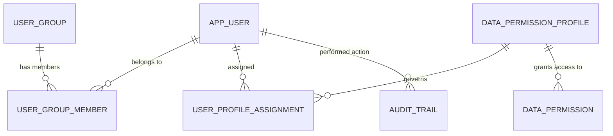

---

### Tables

#### `app_user` — Reference | 15 rows
> One row represents one registered treasury platform user account.

**Columns:**

| Column | Type | Nullable | PK | Description | Example Values / Boundaries |
|--------|------|----------|----|-------------|---------------------------|
| `uuid` | varchar(64) | Yes | Yes | System-generated unique identifier for the user record | UUID string, e.g. `a1b2c3d4-...` |
| `code` | varchar(64) | Yes | No | Functional role code representing the user's job function and access profile | `TREAS_FRONT`, `CFO_GLOBAL`, `FX_TRADER`, `CASH_MANAGER_EMEA` |
| `first_name` | varchar(128) | Yes | No | Given name of the user | `Jane` |
| `last_name` | varchar(128) | Yes | No | Family name / surname of the user | `Smith` |
| `email` | varchar(256) | Yes | No | Corporate email address; format `firstname.lastname@globalretail.com` | `jane.smith@globalretail.com` |
| `active` | boolean | Yes | No | Whether the account is currently enabled; default `true` | `true`, `false` |

**Foreign Key Relationships:**

| Column | References | Join Meaning |
|--------|-----------|-------------|
| `code` | `audit_trail.actor_user` (reverse) | All audit events attributed to this user |

---

#### `user_group` — Reference | 6 rows
> One row represents one functional department group within the platform.

**Columns:**

| Column | Type | Nullable | PK | Description | Example Values / Boundaries |
|--------|------|----------|----|-------------|---------------------------|
| `uuid` | varchar(64) | Yes | Yes | System-generated unique identifier for the user group | UUID string |
| `code` | varchar(64) | Yes | No | Short alphanumeric business key for the group | `GRP_TREASURY`, `GRP_AP`, `GRP_AUDIT`, `GRP_ADMIN` |
| `description` | varchar(256) | Yes | No | Human-readable description of the group's business function | `Accounts Payable`, `Internal Audit`, `Platform Administration` |

**Foreign Key Relationships:**

| Column | References | Join Meaning |
|--------|-----------|-------------|
| `code` | `user_group_member.user_group_code` (reverse) | Members belonging to this group |

---

#### `user_group_member` — Reference | 15 rows
> One row represents one user's membership in one functional group (many-to-many bridge between users and groups).

**Columns:**

| Column | Type | Nullable | PK | Description | Example Values / Boundaries |
|--------|------|----------|----|-------------|---------------------------|
| `user_group_code` | varchar(64) | Yes | Yes (composite) | Code of the group the user belongs to — FK to `user_group.code` | `GRP_TREASURY`, `GRP_AP` |
| `user_code` | varchar(64) | Yes | Yes (composite) | Code identifying the individual user — FK to `app_user.code` | `TREAS_FRONT`, `CASH_MANAGER_EMEA` |

**Foreign Key Relationships:**

| Column | References | Join Meaning |
|--------|-----------|-------------|
| `user_group_code` | `user_group.code` | Resolves the group name and description |
| `user_code` | `app_user.code` (via `user_profile_assignment`) | Resolves to the full user identity |

---

#### `user_profile_assignment` — Reference | 15 rows
> One row represents one access profile granted to one user (controls which data entities that user can see).

**Columns:**

| Column | Type | Nullable | PK | Description | Example Values / Boundaries |
|--------|------|----------|----|-------------|---------------------------|
| `user_code` | varchar(64) | Yes | Yes (composite) | Business identifier of the user receiving the profile | `CFO_GLOBAL`, `FX_TRADER`, `CASH_MANAGER_EMEA` |
| `profile_code` | varchar(64) | Yes | Yes (composite) | Code of the data permission profile assigned | `PROF_GLOBAL_FULL`, `PROF_EMEA_RW`, `PROF_APAC_OPS` |

**Foreign Key Relationships:**

| Column | References | Join Meaning |
|--------|-----------|-------------|
| `user_code` | `user_group_member.user_code` | Links to group membership for the user |
| `profile_code` | `data_permission_profile.code` | Resolves the full profile definition and scope |

---

#### `data_permission_profile` — Reference | 7 rows
> One row represents one named data access permission profile (e.g., "EMEA read-write", "global full access").

**Columns:**

| Column | Type | Nullable | PK | Description | Example Values / Boundaries |
|--------|------|----------|----|-------------|---------------------------|
| `uuid` | varchar(64) | Yes | Yes | System-generated unique identifier for the profile | UUID string |
| `code` | varchar(64) | Yes | No | Machine-readable short code for the profile | `PROF_GLOBAL_FULL`, `PROF_EMEA_RW`, `PROF_APAC_OPS` |
| `description` | varchar(256) | Yes | No | Human-readable explanation of the profile's access scope | `Global full access — all entities`, `EMEA regional read/write` |

**Foreign Key Relationships:**

| Column | References | Join Meaning |
|--------|-----------|-------------|
| `code` | `data_permission.profile_code` (reverse) | All entity-level permission grants under this profile |
| `code` | `user_profile_assignment.profile_code` (reverse) | Users assigned this profile |

---

#### `data_permission` — Transaction | 350 rows
> One row represents one permission grant: a specific named profile is allowed to access a specific company or bank account entity.

**Columns:**

| Column | Type | Nullable | PK | Description | Example Values / Boundaries |
|--------|------|----------|----|-------------|---------------------------|
| `uuid` | varchar(64) | Yes | Yes | System-generated unique identifier for the permission grant | UUID string |
| `profile_code` | varchar(64) | Yes | No | The access profile to which this grant belongs — FK to `data_permission_profile.code` | `PROF_GLOBAL_FULL`, `PROF_EMEA_RW` |
| `entity_type` | varchar(32) | Yes | No | Whether the granted entity is a company or bank account | `company`, `bank_account` |
| `entity_code` | varchar(64) | Yes | No | Business code of the specific company or bank account the profile may access; FK to `gen_company_region.company_code` when type is `company` | `GR_DE`, `GR_APAC_PTE`, `ACC_JPM_EUR_001` |

**Foreign Key Relationships:**

| Column | References | Join Meaning |
|--------|-----------|-------------|
| `profile_code` | `data_permission_profile.code` | Resolves the profile name and scope description |
| `entity_code` | `gen_company_region.company_code` (when `entity_type = 'company'`) | Resolves to the legal entity master |

---

#### `audit_trail` — Event | 127 rows
> One row represents one auditable action (create, update, or approve) performed by a user on a specific business entity at a specific point in time.

**Columns:**

| Column | Type | Nullable | PK | Description | Example Values / Boundaries |
|--------|------|----------|----|-------------|---------------------------|
| `uuid` | varchar(64) | Yes | Yes | Unique identifier for the audit event record | UUID string |
| `entity_type` | varchar(32) | Yes | No | Category of the business entity that was acted upon | `bank_account`, `hedge_relationship`, `liquidity_policy`, `transfer` |
| `entity_code` | varchar(64) | Yes | No | Business code of the specific entity instance that was changed | `ACC_JPM_EUR_001`, `HR-2024-0034` |
| `action` | varchar(32) | Yes | No | The type of operation performed | `CREATE`, `UPDATE`, `APPROVE` |
| `actor_user` | varchar(64) | Yes | No | The user or role code that performed the action — FK to `app_user.code` | `TREAS_FRONT`, `CFO_GLOBAL` |
| `occurred_at` | timestamp with time zone | Yes | No | Exact date and time (with timezone) the event occurred | `2024-03-15 09:22:14+00` |
| `before_image` | super (JSON) | Yes | No | Full structured snapshot of the entity's state immediately before the action | JSON object of prior field values |
| `after_image` | super (JSON) | Yes | No | Full structured snapshot of the entity's state immediately after the action | JSON object of updated field values |

**Foreign Key Relationships:**

| Column | References | Join Meaning |
|--------|-----------|-------------|
| `actor_user` | `app_user.code` | Resolves the full name and email of the user who performed the action |

---

#### `webhook_event` — Event | 500 rows
> One row represents one inbound webhook notification received from an external system (typically a bank or payment platform) recording a business state change.

**Columns:**

| Column | Type | Nullable | PK | Description | Example Values / Boundaries |
|--------|------|----------|----|-------------|---------------------------|
| `uuid` | varchar(64) | Yes | Yes | Unique identifier for the webhook event | UUID string |
| `event_type` | varchar(64) | Yes | No | Category of business event that triggered the webhook | `batch_status_change`, `entity_change`, `execution_complete`, `routing_status_change`, `document_approval` |
| `entity_type` | varchar(32) | Yes | No | Type of business object associated with the event; currently always a payment file | `payment_file` |
| `entity_code` | varchar(64) | Yes | No | Identifier of the specific entity (e.g., payment file reference) the event concerns | `PF-2024-00341` |
| `payload` | super (JSON) | Yes | No | Full structured data payload delivered with the webhook; contains all event-specific details | JSON object |
| `received_at` | timestamp with time zone | Yes | No | Timestamp when the system received the webhook | `2024-06-01 14:03:22+00` |
| `processed_at` | timestamp with time zone | Yes | No | Timestamp when the system finished processing the event; null if not yet processed | `2024-06-01 14:03:25+00`, or `null` |

**Foreign Key Relationships:**

None — `webhook_event` is self-contained. Entity references within the record are loose (not enforced FK) pointing to payment file records in other sub-domains.

---

### KPIs / Use Cases for This Sub-domain

| Use Case | Description | Tables Required |
|----------|-------------|----------------|
| User access audit | List all users, their group memberships, and the data profiles they hold — used by Internal Audit to verify segregation of duties | `app_user`, `user_group_member`, `user_group`, `user_profile_assignment`, `data_permission_profile` |
| Data scope investigation | Determine exactly which companies and accounts a given user can see in queries — useful when a BA reports missing data | `user_profile_assignment`, `data_permission_profile`, `data_permission` |
| Entity change history | Reconstruct the full change history for a specific bank account or policy, including what changed and who approved | `audit_trail` |
| Approval compliance check | Verify that all hedge relationships or transfers created in a period were subsequently approved by the required role | `audit_trail` |
| Webhook processing lag | Calculate average time between `received_at` and `processed_at` per event type to detect integration performance issues | `webhook_event` |
| Unprocessed event detection | Find webhook events received but not yet processed (i.e., `processed_at IS NULL`) — critical for payment reconciliation | `webhook_event` |
| Active user count by group | Report how many active users exist per functional group — a governance metric for access reviews | `app_user`, `user_group_member`, `user_group` |

---

### Common BA Questions

**Q: Why does my query return data for only some companies when I know there are more?**
Your user profile assignment determines which company codes and bank account codes are visible to you. Each query runs through a data permission filter. Join `user_profile_assignment` on your `user_code`, then join to `data_permission_profile` and `data_permission` to see the complete list of entities your profile is scoped to. If you need access to additional entities, raise a request to the Platform Administration group to assign a broader profile.

**Q: How do I find out who approved a specific bank account change and when?**
Query `audit_trail` where `entity_type = 'bank_account'` and `entity_code` equals the account code you are investigating, then filter `action = 'APPROVE'`. The `actor_user` column holds the user code of the approver and `occurred_at` holds the precise timestamp. Join `actor_user` to `app_user.code` to retrieve the approver's full name and email.

**Q: What is the difference between `user_group` and `data_permission_profile`?**
`user_group` describes what business function a person performs (e.g., "Treasury" or "Internal Audit") — it is an organisational classification. `data_permission_profile` describes what data entities a person is allowed to see (e.g., "EMEA companies and accounts only") — it is a data access control. The same person can be in the Treasury group but hold either a global or regional data profile depending on their seniority and geographic remit.

**Q: A webhook event was received yesterday but the payment status in the system has not updated — where do I look?**
In `webhook_event`, find the row where `entity_code` matches the payment file reference and `received_at` falls in the expected window. If `processed_at` is `NULL`, the event was received but never processed — this indicates a processing failure. If `processed_at` is populated, check the `payload` field for the status value delivered by the bank, then compare against the payment file's current status in the relevant payment sub-domain table to identify a discrepancy.

**Q: How do I identify all actions performed by a specific user during an internal audit investigation?**
Query `audit_trail` where `actor_user = '<user_code>'` and restrict `occurred_at` to the investigation window. Order by `occurred_at` to reconstruct the timeline. The `before_image` and `after_image` JSON columns contain the complete field-level before and after state, enabling you to see exactly what data values were in place before the user's action and what they became afterward.

**Q: Can a single user hold multiple data permission profiles?**
Yes. `user_profile_assignment` is a many-to-many table (user_code + profile_code composite key). A user may hold multiple profiles, in which case their effective data access is the union of all entity grants across all assigned profiles. To compute a user's full entity visibility, join all their `profile_code` values from `user_profile_assignment` and aggregate all matching rows from `data_permission`.

**Q: How many webhook events are failing to process, and which event types are most affected?**
Query `webhook_event` grouping by `event_type`, counting total rows and rows where `processed_at IS NULL`. This gives a per-event-type failure rate. Also calculate `AVG(processed_at - received_at)` as a processing latency metric. Sort by unprocessed count descending to identify the highest-priority integration issues.

---

## Sub-domain 18: Knowledge & AI

### Overview

The Knowledge & AI sub-domain stores and organises the institutional memory that powers the treasury platform's AI analytics system. At its centre is `tribal_knowledge_fact` — a structured repository of undocumented business rules, approved policies, management decisions, known limits, and contextual insights that exist in the minds of treasury professionals but are not recorded in formal transaction data. Each fact has a full narrative text, a validity window (`effective_from` / `effective_to`), a confidence rating, a lifecycle status (active, retired, under review), and a pointer to its vector embedding in OpenSearch. When a user asks the AI "what is our hedging policy for APAC entities?" or "what is the counterparty credit limit for BANK_JPM?", the AI retrieves relevant facts from this table via semantic similarity search and uses them as context before generating a SQL query or narrative answer.

`tribal_knowledge_entity_link` is the bridge table that tags each fact with one or more business entities — a fact about BANK_HSBC's credit limit is linked to that bank's code; a policy about GR_APAC_PTE's cash concentration is linked to that company. The `entity_type` discriminator determines which master table the `entity_code` resolves to (bank, bank_account, company, credit_facility, fx_forward, or third_party). `kg_relationship` complements this by storing directed graph edges between pairs of entities, capturing structural knowledge such as ownership hierarchies, management relationships, or operational dependencies — this feeds the knowledge graph traversal that the AI uses during multi-hop reasoning. `sme_feedback_session` and `sme_transcript_chunk` record the raw source material: structured interview sessions conducted with Subject Matter Experts, with transcripts segmented into ordered chunks for vector search (Retrieval Augmented Generation — RAG). When the AI cannot find a pre-structured fact, it can fall back to semantic search over these transcript segments to surface relevant expert commentary.

`brain_evaluation` tracks the AI reasoning engine's query execution sessions. Each row captures a natural language query, the seed facts the engine started from, the knowledge graph edges it traversed, any conflicting facts it flagged, and the final answer summary it produced. This table is platform monitoring infrastructure — it logs how the AI reasoned about each query, which is essential for debugging incorrect AI responses and for identifying gaps in the knowledge base.

The two views in this sub-domain — `v_sme_transcript_chunk_indexable` and `v_tribal_fact_indexable` — are not base tables and should not be treated as primary data sources for business analysis. They are pre-processed projections used by the platform's vector indexing pipeline (OpenSearch) to select and format the text that gets embedded. BAs should be aware these views exist to understand why the AI system gives context-aware, institution-specific answers, but should direct their own analysis queries to the base tables `tribal_knowledge_fact` and `sme_transcript_chunk`. Do not attempt to build business reports on top of these views — query the underlying base tables instead.

---

### Key Business Entities

| Entity | Role in Sub-domain |
|---|---|
| `tribal_knowledge_fact` | Core knowledge base — each row is one institutional fact, rule, decision, or limit with validity period and confidence score |
| `tribal_knowledge_entity_link` | Tags each fact to one or more business entities (bank, company, account, deal, etc.); enables entity-scoped retrieval |
| `kg_relationship` | Directed graph edges between business entity pairs; powers knowledge graph traversal for multi-hop AI reasoning |
| `sme_feedback_session` | Metadata for structured SME interview sessions used to capture domain knowledge |
| `sme_transcript_chunk` | Ordered text segments of SME session transcripts; the raw source for RAG-based AI retrieval |
| `brain_evaluation` | AI reasoning session log — records seed facts, graph edges traversed, conflicts, and answer summaries per query |
| `v_sme_transcript_chunk_indexable` | VIEW (not base table) — formats transcript chunks for OpenSearch embedding pipeline |
| `v_tribal_fact_indexable` | VIEW (not base table) — formats tribal facts with linked entity context for OpenSearch embedding pipeline |

---

### Entity Relationship Diagram

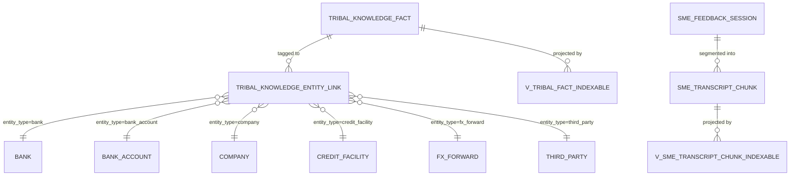

---

### Tables

#### `tribal_knowledge_fact` — Reference / Knowledge Base | row count not published
> One row represents one institutional knowledge fact: a business rule, policy, management decision, operational limit, or contextual insight captured from treasury professionals.

**Columns:**

| Column | Type | Nullable | PK | Description | Example Values / Boundaries |
|--------|------|----------|----|-------------|---------------------------|
| `uuid` | varchar(64) | Yes | Yes | Unique identifier for the knowledge fact | UUID string |
| `fact_type` | varchar(32) | Yes | No | Category classifying what kind of business insight the fact represents | `POLICY`, `LIMIT`, `DECISION`, `COMMITMENT`, `WATCHLIST`, `CONTEXT` |
| `title` | varchar(512) | Yes | No | Short descriptive title summarising the fact | `JPM credit limit for FX forwards`, `APAC cash concentration policy` |
| `narrative` | varchar(65535) | Yes | No | Full detailed text capturing the content and context of the fact | Long-form paragraph; may contain figures, dates, conditions |
| `effective_from` | date | Yes | No | Date from which the fact is valid and applicable | `2024-01-01` |
| `effective_to` | date | Yes | No | Date on which the fact expires; `null` if open-ended | `2025-12-31`, or `null` |
| `trigger_condition` | varchar(65535) | Yes | No | Business condition or context specifying when the fact should be surfaced by the AI | `When querying FX exposure for APAC > USD 10M` |
| `captured_by_user` | varchar(64) | Yes | No | User code of the person who recorded the fact | `TREAS_FRONT`, `CFO_GLOBAL` |
| `captured_at` | timestamp with time zone | Yes | No | Timestamp when the fact was first entered into the system | `2024-03-10 11:15:00+00` |
| `source_session` | varchar(64) | Yes | No | UUID or reference of the SME session from which this fact was extracted | Session UUID string |
| `confidence` | varchar(8) | Yes | No | Assessed reliability level of the fact | `HIGH`, `MED`, `LOW` |
| `status` | varchar(16) | Yes | No | Current lifecycle state of the fact | `ACTIVE`, `RETIRED`, `REVIEW` |
| `superseded_by` | varchar(64) | Yes | No | UUID of a newer fact that has replaced this record; `null` if still current | UUID string, or `null` |
| `opensearch_doc_id` | varchar(64) | Yes | No | Document ID used to locate this fact's vector in the OpenSearch index | OS document ID string |
| `embedding_model` | varchar(64) | Yes | No | Name/version of the model used to generate the vector embedding | `cohere-embed-v4`, `amazon.titan-embed-text-v1` |
| `embedded_at` | timestamp with time zone | Yes | No | Timestamp when the vector embedding was last generated or refreshed | `2024-03-10 11:20:00+00` |

**Foreign Key Relationships:**

| Column | References | Join Meaning |
|--------|-----------|-------------|
| `uuid` | `tribal_knowledge_entity_link.fact_uuid` (reverse) | All entity links tagging this fact |
| `uuid` | `v_tribal_fact_indexable.fact_uuid` (reverse) | The view projection used by the indexing pipeline |

---

#### `tribal_knowledge_entity_link` — Reference / Bridge | row count not published
> One row represents one business entity linked to one tribal knowledge fact, along with the role that entity plays in the context of that fact. The composite primary key is (fact_uuid, entity_type, entity_code, role).

**Columns:**

| Column | Type | Nullable | PK | Description | Example Values / Boundaries |
|--------|------|----------|----|-------------|---------------------------|
| `fact_uuid` | varchar(64) | Yes | Yes (composite) | UUID of the tribal knowledge fact this entity link belongs to — FK to `tribal_knowledge_fact.uuid` | UUID string |
| `entity_type` | varchar(32) | Yes | Yes (composite) | Classification of the linked entity; determines which master table `entity_code` resolves to | `bank`, `bank_account`, `company`, `credit_facility`, `fx_forward`, `third_party` |
| `entity_code` | varchar(64) | Yes | Yes (composite) | Business code of the specific entity instance linked to this fact | `BANK_JPM`, `ACC_HSBC_USD_001`, `GR_APAC_PTE`, `CF-2024-001` |
| `role` | varchar(32) | Yes | Yes (composite) | The functional role this entity plays in the context of the fact | `subject`, `counterparty`, `issuer`, `applicant`, `reference` |

**Foreign Key Relationships:**

| Column | References | Join Meaning |
|--------|-----------|-------------|
| `fact_uuid` | `tribal_knowledge_fact.uuid` | Resolves the full fact content and metadata |
| `entity_code` | `bank.code` (when `entity_type = 'bank'`) | Resolves to bank master |
| `entity_code` | `bank_account.code` (when `entity_type = 'bank_account'`) | Resolves to bank account master |
| `entity_code` | `company.code` (when `entity_type = 'company'`) | Resolves to legal entity master |
| `entity_code` | `credit_facility.code` (when `entity_type = 'credit_facility'`) | Resolves to credit facility master |
| `entity_code` | `fx_forward.deal_id` (when `entity_type = 'fx_forward'`) | Resolves to FX forward deal record |
| `entity_code` | `third_party.code` (when `entity_type = 'third_party'`) | Resolves to third-party / counterparty master |

---

#### `kg_relationship` — Reference / Knowledge Graph | row count not published
> One row represents one directed relationship between two business entities in the knowledge graph (e.g., "company A owns company B", "bank X manages facility Y").

**Columns:**

| Column | Type | Nullable | PK | Description | Example Values / Boundaries |
|--------|------|----------|----|-------------|---------------------------|
| `uuid` | varchar(64) | Yes | Yes | System-generated unique identifier for the relationship | UUID string |
| `relationship_type` | varchar(64) | Yes | No | Nature of the connection between the two entities | `owns`, `manages`, `belongs_to`, `guarantees`, `counterparty_of` |
| `from_entity_type` | varchar(32) | Yes | No | Category/class of the source entity | `company`, `bank`, `person`, `credit_facility` |
| `from_entity_code` | varchar(64) | Yes | No | Business code identifying the specific source entity | `GR_TREASURY`, `BANK_JPM` |
| `to_entity_type` | varchar(32) | Yes | No | Category/class of the target entity | `company`, `bank_account`, `credit_facility` |
| `to_entity_code` | varchar(64) | Yes | No | Business code identifying the specific target entity | `GR_DE`, `CF-2024-001` |
| `properties` | super (JSON) | Yes | No | Additional semi-structured attributes describing the relationship | JSON object; e.g. `{"since": "2020-01-01", "ownership_pct": 100}` |
| `captured_by_user` | varchar(64) | Yes | No | Username or code of the user who recorded this relationship | `TREAS_FRONT`, `ADMIN` |
| `captured_at` | timestamp with time zone | Yes | No | Timestamp when this relationship was recorded | `2024-02-14 10:00:00+00` |
| `source_session` | varchar(64) | Yes | No | Session reference during which this relationship was identified or imported | Session UUID or batch reference |
| `confidence` | varchar(8) | Yes | No | Reliability level of the relationship as assessed at capture | `HIGH`, `MED`, `LOW` |
| `status` | varchar(16) | Yes | No | Lifecycle state of the relationship record | `active`, `pending`, `archived` |

**Foreign Key Relationships:**

`kg_relationship` uses loose entity references (`from_entity_type`/`from_entity_code` and `to_entity_type`/`to_entity_code`) — there are no enforced FK constraints. Entity resolution depends on the `entity_type` discriminator and requires joining to the appropriate master table per type, analogous to `tribal_knowledge_entity_link`.

---

#### `sme_feedback_session` — Reference | row count not published
> One row represents one structured interview session conducted with a Subject Matter Expert, capturing who participated, when, what topic was covered, and where the transcript is stored.

**Columns:**

| Column | Type | Nullable | PK | Description | Example Values / Boundaries |
|--------|------|----------|----|-------------|---------------------------|
| `uuid` | varchar(64) | Yes | Yes | Unique identifier for the SME session | UUID string |
| `sme_user` | varchar(64) | Yes | No | Identifier of the subject matter expert who participated | `CFO_GLOBAL`, `TREAS_FRONT`, `FX_TRADER` |
| `interviewer_user` | varchar(64) | Yes | No | Identifier of the interviewer or facilitator who conducted the session | `ADMIN`, `TREAS_FRONT` |
| `started_at` | timestamp with time zone | Yes | No | Timestamp when the session began | `2024-01-15 09:00:00+00` |
| `ended_at` | timestamp with time zone | Yes | No | Timestamp when the session concluded | `2024-01-15 10:30:00+00` |
| `topic` | varchar(256) | Yes | No | Subject area covered during the session | `FX hedging policy`, `Bank counterparty limits`, `APAC cash pooling` |
| `transcript_uri` | varchar(1024) | Yes | No | URI or file path pointing to the stored full transcript | S3 URI or filesystem path |

**Foreign Key Relationships:**

| Column | References | Join Meaning |
|--------|-----------|-------------|
| `uuid` | `sme_transcript_chunk.session_uuid` (reverse) | All transcript chunks belonging to this session |

---

#### `sme_transcript_chunk` — Event / Content | row count not published
> One row represents one ordered text segment extracted from an SME session transcript, prepared for vector embedding and semantic search in the RAG pipeline.

**Columns:**

| Column | Type | Nullable | PK | Description | Example Values / Boundaries |
|--------|------|----------|----|-------------|---------------------------|
| `uuid` | varchar(64) | Yes | Yes | Unique identifier for this transcript chunk | UUID string |
| `session_uuid` | varchar(64) | Yes | No | UUID of the parent SME session — FK to `sme_feedback_session.uuid` | UUID string |
| `chunk_index` | integer(32) | Yes | No | Sequential position of this chunk within its parent session | `0`, `1`, `2`, ... (0-based or 1-based ordering) |
| `text` | varchar(65535) | Yes | No | The actual transcript text of this segment (a portion of the session dialogue) | Free text up to 65,535 characters |
| `opensearch_doc_id` | varchar(64) | Yes | No | Document ID referencing this chunk in the OpenSearch vector index | OS document ID string |
| `embedding_model` | varchar(64) | Yes | No | Name/version of the model used to generate the vector embedding for this chunk | `cohere-embed-v4`, `amazon.titan-embed-text-v1` |
| `embedded_at` | timestamp with time zone | Yes | No | Timestamp when the embedding was generated for this chunk | `2024-01-15 11:00:00+00` |

**Foreign Key Relationships:**

| Column | References | Join Meaning |
|--------|-----------|-------------|
| `session_uuid` | `sme_feedback_session.uuid` | Resolves session metadata (participants, topic, timing) |

---

#### `brain_evaluation` — Event / Platform Monitoring | row count not published
> One row represents one AI reasoning engine evaluation session — a single natural language query evaluated against the knowledge graph, recording what facts were used, what edges were traversed, what conflicts were found, and what answer was produced.

**Columns:**

| Column | Type | Nullable | PK | Description | Example Values / Boundaries |
|--------|------|----------|----|-------------|---------------------------|
| `uuid` | varchar(64) | Yes | Yes | Unique identifier for this evaluation session | UUID string |
| `user_code` | varchar(64) | Yes | No | Code of the user who submitted the query | `CFO_GLOBAL`, `CASH_MANAGER_EMEA` |
| `query_text` | varchar(65535) | Yes | No | The raw natural language or structured query submitted for evaluation | `What is our total FX exposure for APAC this quarter?` |
| `evaluated_at` | timestamp with time zone | Yes | No | Timestamp when the evaluation was performed | `2024-06-10 08:45:00+00` |
| `facts_applied` | super (JSON) | Yes | No | Structured collection of knowledge facts that were applied during reasoning | JSON array of fact UUIDs / summaries |
| `edges_traversed` | super (JSON) | Yes | No | Knowledge graph edges traversed during reasoning | JSON array of edge descriptors |
| `flagged_conflicts` | super (JSON) | Yes | No | Contradictions or conflicts identified in the knowledge base during evaluation | JSON array of conflict records; `null` if none |
| `answer_summary` | varchar(65535) | Yes | No | Human-readable summary of the answer or conclusion produced by the reasoning engine | Free text narrative |
| `seed_facts` | super (JSON) | Yes | No | Initial facts used as the starting point for the reasoning chain | JSON array of seed fact references |
| `retrieval_scores` | super (JSON) | Yes | No | Relevance / confidence scores assigned to facts retrieved during evaluation | JSON object mapping fact UUIDs to scores |
| `expansion_hops` | smallint(16) | Yes | No | Number of reasoning hops taken from seed facts during evaluation | Small integer, typically 1–5 |

**Foreign Key Relationships:**

No enforced FK constraints. `user_code` loosely references `app_user.code`. `facts_applied`, `seed_facts`, and `edges_traversed` contain embedded references to `tribal_knowledge_fact.uuid` within the JSON payload.

---

#### `v_sme_transcript_chunk_indexable` — VIEW (not a base table) | row count not published
> **This is a database view, not a base table.** It is part of the AI platform's vector indexing pipeline. One row corresponds to one SME transcript chunk formatted for semantic embedding. BAs should query `sme_transcript_chunk` and `sme_feedback_session` directly for business analysis; this view exists solely to feed the OpenSearch indexer.

**Columns:**

| Column | Type | Nullable | Description | Example Values / Boundaries |
|--------|------|----------|-------------|---------------------------|
| `chunk_uuid` | varchar(64) | Yes | Unique identifier for the transcript chunk segment | UUID string |
| `session_uuid` | varchar(64) | Yes | UUID of the parent SME session | UUID string |
| `chunk_index` | integer(32) | Yes | Sequential position of the chunk within the session | `0`, `1`, `2`, ... |
| `embed_text` | varchar(65535) | Yes | Plain text content of the chunk, prepared for embedding | Formatted text combining topic context and transcript segment |
| `topic` | varchar(256) | Yes | Subject or thematic category of the session that produced this chunk | `FX hedging policy`, `Bank limits` |
| `sme_user` | varchar(64) | Yes | Identifier of the SME who participated in the recorded session | `CFO_GLOBAL`, `TREAS_FRONT` |
| `started_at` | timestamp with time zone | Yes | Start time of the session that produced this chunk | `2024-01-15 09:00:00+00` |

**Foreign Key Relationships (view-level):**

| Column | References | Join Meaning |
|--------|-----------|-------------|
| `chunk_uuid` | `tribal_knowledge_fact.uuid` (noted in schema) | Cross-reference used by the indexing pipeline |

---

#### `v_tribal_fact_indexable` — VIEW (not a base table) | row count not published
> **This is a database view, not a base table.** It is part of the AI platform's vector indexing pipeline. One row corresponds to one tribal knowledge fact formatted with its linked entities for semantic embedding. BAs should query `tribal_knowledge_fact` and `tribal_knowledge_entity_link` directly; this view exists solely to feed the OpenSearch indexer.

**Columns:**

| Column | Type | Nullable | Description | Example Values / Boundaries |
|--------|------|----------|-------------|---------------------------|
| `fact_uuid` | varchar(64) | Yes | Unique identifier of the tribal fact | UUID string |
| `fact_type` | varchar(32) | Yes | Classification of the tribal fact | `POLICY`, `LIMIT`, `DECISION`, `COMMITMENT` |
| `status` | varchar(16) | Yes | Current lifecycle status | `ACTIVE`, `RETIRED`, `REVIEW` |
| `effective_from` | date | Yes | Date from which the fact is valid | `2024-01-01` |
| `effective_to` | date | Yes | Date on which the fact expires | `2025-12-31`, or `null` |
| `confidence` | varchar(8) | Yes | Reliability indicator for the fact | `HIGH`, `MED`, `LOW` |
| `captured_at` | timestamp with time zone | Yes | When the fact was originally entered | `2024-03-10 11:15:00+00` |
| `title` | varchar(512) | Yes | Short title summarising the fact | `JPM credit limit for FX forwards` |
| `narrative` | varchar(65535) | Yes | Full detailed explanation of the fact | Long-form paragraph |
| `trigger_condition` | varchar(65535) | Yes | Condition specifying when the AI should surface this fact | `When FX exposure > USD 10M` |
| `embed_text` | text | Yes | Concatenated text of title + narrative + trigger, prepared for embedding | Formatted composite text |
| `linked_entities` | super (JSON) | Yes | Structured collection of all business entities associated with this fact | JSON array of entity type/code/role objects |

**Foreign Key Relationships (view-level):**

| Column | References | Join Meaning |
|--------|-----------|-------------|
| `fact_uuid` | `tribal_knowledge_fact.uuid` | Source base table for this view |

---

### KPIs / Use Cases for This Sub-domain

| Use Case | Description | Tables Required |
|----------|-------------|----------------|
| Knowledge base health check | Count active vs. retired vs. under-review facts by fact_type; identify facts approaching expiry (`effective_to` within 30 days) | `tribal_knowledge_fact` |
| Entity coverage analysis | Determine which business entities (banks, companies) have the most associated knowledge facts — identifies well-documented vs. under-documented entities | `tribal_knowledge_fact`, `tribal_knowledge_entity_link` |
| SME knowledge contribution | Count facts captured per user and per session — useful for knowledge management teams tracking contribution levels | `tribal_knowledge_fact`, `sme_feedback_session` |
| Stale embedding detection | Find facts or transcript chunks where `embedded_at` is older than a defined threshold or `opensearch_doc_id` is null — indicates the AI index may be out of date | `tribal_knowledge_fact`, `sme_transcript_chunk` |
| AI reasoning audit | For a given query, retrieve the `brain_evaluation` record to see which facts were used, how many reasoning hops were taken, and whether conflicts were flagged — used to explain or debug an AI response | `brain_evaluation` |
| Knowledge gap identification | Find entity types or specific entity codes that appear in business transactions (e.g., banks with FX forwards) but have zero entries in `tribal_knowledge_entity_link` — signals missing institutional knowledge | `tribal_knowledge_entity_link`, cross-domain transaction tables |
| Conflicting fact detection | Query `brain_evaluation` rows where `flagged_conflicts` is not null — surfaces recurring knowledge conflicts that need resolution | `brain_evaluation` |

---

### Common BA Questions

**Q: What is a "tribal knowledge fact" and why does it matter for treasury analytics?**
A tribal knowledge fact is a piece of institutional knowledge that treasury professionals hold in their heads but that is not captured in any formal transaction or policy document — for example, "JPMorgan's credit limit for FX forwards was informally capped at USD 50M by the CFO following the March 2023 counterparty review" or "APAC entities always consolidate cash at month-end regardless of the pooling agreement". These facts are critical context for interpreting treasury data correctly. The AI uses them to add nuance to query responses that raw SQL alone cannot provide. If the AI gives a response that seems to know internal context the data alone doesn't show, it is drawing on a row in `tribal_knowledge_fact`.

**Q: Why should I not query `v_tribal_fact_indexable` or `v_sme_transcript_chunk_indexable` for my analysis?**
These are views designed for the OpenSearch indexing pipeline, not for business analysis. They may apply filters (e.g., only `status = 'ACTIVE'` facts), concatenate fields in ways that are useful for embedding but not for reporting, and embed JSON denormalisation that makes column-level filtering unreliable. For any business analysis — counting facts, finding entity coverage, reviewing knowledge content — always go to the underlying base tables `tribal_knowledge_fact`, `tribal_knowledge_entity_link`, `sme_feedback_session`, and `sme_transcript_chunk`.

**Q: How does the AI know which facts are relevant to my query?**
When you submit a query, the AI pipeline performs a vector similarity search against the OpenSearch index (fed by the two indexable views) to retrieve the top-N most semantically similar facts and transcript chunks. It also traverses `kg_relationship` edges to find structurally related entities. The retrieved content is passed as context into the language model alongside the SQL schema. You can audit which facts were retrieved and used for any given query by looking up the corresponding `brain_evaluation` row and inspecting `facts_applied` and `retrieval_scores`.

**Q: A fact about a bank's credit limit has become outdated — what is the correct process for updating it?**
Do not edit the existing row in `tribal_knowledge_fact` directly. The correct process is to retire the old fact by setting `status = 'RETIRED'` and populating `superseded_by` with the UUID of the new fact, then insert the replacement as a new row with the correct `effective_from` date and `status = 'ACTIVE'`. This preserves the full history of the knowledge base and ensures the AI cannot use an outdated fact once it is retired.

**Q: How are SME sessions connected to the knowledge facts the AI uses?**
An SME interview session is recorded in `sme_feedback_session`. The transcript is segmented into chunks stored in `sme_transcript_chunk`. A knowledge engineer or automated process reviews the transcript chunks and extracts discrete facts, inserting them as rows in `tribal_knowledge_fact` with the `source_session` field pointing back to the originating session UUID. Additionally, the transcript chunks themselves are vector-indexed independently, so the AI can retrieve raw expert commentary even when no structured fact has yet been extracted from it.

**Q: Why might the AI give a different answer to the same question on two different dates?**
Several factors in this sub-domain can cause this. First, facts expire — a fact with `effective_to` in the past will no longer be retrieved. Second, new facts may have been added that are more relevant to the query. Third, a previously active fact may have been retired and superseded by a new one with updated content. Fourth, the vector index may have been refreshed with a newer embedding model (`embedding_model` column), changing similarity rankings. To diagnose a change in AI behaviour, compare the `brain_evaluation` rows for the two query instances, paying attention to `facts_applied` and `retrieval_scores`.

**Q: How do I find all knowledge facts related to a specific bank or company?**
Query `tribal_knowledge_entity_link` where `entity_code = '<your_entity_code>'` and `entity_type = '<bank|company|etc>'`. This returns all `fact_uuid` values associated with that entity. Then join to `tribal_knowledge_fact` on `uuid` to retrieve the full fact content, filtering to `status = 'ACTIVE'` and `(effective_to IS NULL OR effective_to >= CURRENT_DATE)` to ensure you only see currently valid facts.

**Q: What does `expansion_hops` in `brain_evaluation` tell me?**
It records how many steps the AI's knowledge graph reasoning engine traversed from the initial seed facts. A value of 1 means the AI answered using only directly retrieved facts. A higher value (e.g., 3 or 4) means the AI followed relationships through `kg_relationship` edges to reach indirectly connected context — for example, starting from a fact about a bank's credit limit, then traversing to the companies that bank accounts belong to, then to the FX forwards those companies hold. Higher hop counts indicate more complex multi-entity reasoning and may warrant closer review of the answer summary for accuracy.

---

## 5. Cross-domain Data Flow Narratives

These end-to-end flows show how data moves across sub-domains for common treasury operations. Use them to understand how tables connect and which joins to write.

---

### Flow 1: Card Payment — POS to Cash Balance

```
pos_transaction          Customer swipes card at point of sale
       ↓
card_authorization       Acquirer requests authorization from card network
       ↓
card_settlement_batch    End-of-day: acquirer batches authorized transactions
       ↓
card_settlement_line     Each transaction becomes a line item with fee breakdown
       ↓
bank_account             Net settlement deposited to merchant's bank account
       ↓
cash_flow                Cash movement recorded as CARD_SETTLEMENT inflow
       ↓
cash_balance             End-of-day balance updated
       ↓
gl_reconciliation        Bank balance vs GL balance reconciled monthly
```

**Key joins:**
- `pos_transaction.uuid` ← `card_authorization.pos_transaction_ref`
- `card_authorization.uuid` ← `card_settlement_line.authorization_ref`
- `card_settlement_line.batch_ref` → `card_settlement_batch.uuid`
- `card_settlement_batch.bank_account_ref` → `bank_account.code`
- `bank_account.code` → `cash_flow.account_ref`

**If a chargeback occurs:** `card_authorization.uuid` ← `chargeback.authorization_ref` → tracks the dispute lifecycle.

---

### Flow 2: Vendor Payment — AP Invoice to Cash Flow

```
ap_invoice               Vendor invoice recorded with due date and open amount
       ↓
payment_file             Treasury creates a payment batch (ISO pain.001 XML)
       ↓
payment_transaction      Each invoice payment is a line in the file
       ↓
transfer                 Individual wire/ACH instruction submitted to bank
       ↓
cash_flow                Outbound cash movement recorded
       ↓
cash_balance             Balance reduced on value date
       ↓
gl_reconciliation        GL AP account cleared against bank statement
```

**Key joins:**
- `ap_invoice.uuid` → `payment_transaction` (via file/vendor matching)
- `payment_transaction.file_uuid` → `payment_file.file_uuid`
- `transfer.file_uuid` → `payment_file.file_uuid`
- `transfer.uuid` ← `cash_flow.reference`

**If the ACH is returned:** `transfer.uuid` ← `ach_return.original_transfer_ref` — creates a return record with reason code.

---

### Flow 3: FX Hedging — Exposure to Settlement

```
fx_exposure_forecast     Treasury forecasts FX exposure by currency/tenor
       ↓
fx_forward               FX forward deal agreed with counterparty bank
       ↓
derivative_mtm           Daily fair value (MTM) computed for accounting
       ↓
hedge_relationship        Deal formally designated as hedge under ASC 815/IFRS 9
       ↓
gl_account               Hedging gains/losses flow to GL (P&L or OCI)
       ↓
transfer                 On maturity, FX forward settles via bank transfer
       ↓
cash_flow                Settlement cash movement recorded
```

**Key joins:**
- `fx_forward.deal_id` ← `derivative_mtm.instrument_ref`
- `fx_forward.deal_id` ← `tribal_knowledge_entity_link.entity_code` (AI knowledge linkage)
- `hedge_relationship.instrument_ref` → `investment_instrument.code` (or `fx_forward.deal_id` via derivative type)

---

### Flow 4: Cash Management — Sweeps and Concentration

```
bank_account             Operating account receives customer receipts throughout day
       ↓
sweep_instruction        Standing rule: sweep excess above target balance nightly
       ↓
sweep_execution          Actual sweep executed — source to target account
       ↓
cash_flow (×2)           Outbound from source, inbound to concentration account
       ↓
cash_balance             Both accounts' end-of-day balances updated
       ↓
liquidity_policy         Policy checked: minimum cash buffer maintained?
       ↓
stress_run_result        Stress test run: if a scenario is triggered, breach flagged
```

**Key joins:**
- `sweep_execution.instruction_ref` → `sweep_instruction.code`
- `sweep_execution.source_account_ref` → `bank_account.code`
- `sweep_execution.target_account_ref` → `bank_account.code`
- `cash_flow.account_ref` → `bank_account.code`

---

### Flow 5: Cash Flow Forecast — Projection to Variance

```
forecast_snapshot        Treasury creates a new forecast version/cycle (e.g., FC_20250801_M)
       ↓
forecast_cash_flow       Lines populated by flow category (AR, AP, Payroll, Tax, CAPEX...)
       ↓
[Month end passes]
       ↓
cash_flow                Actual cash movements recorded during the period
       ↓
forecast_vs_actual       System compares forecast to actual by company/period/category
       ↓
working_capital_metric   DPO/DSO/CCC KPIs computed from AP/AR actual data
```

**Key joins:**
- `forecast_cash_flow.snapshot_id` → `forecast_snapshot.snapshot_id`
- `forecast_vs_actual.snapshot_id` → `forecast_snapshot.snapshot_id`
- `forecast_vs_actual.company_ref` = `forecast_cash_flow.company_ref`

---

### Flow 6: Corporate Treasury Investments

```
investment_instrument    Reference: define eligible instruments (MMF, T-Bill, CD...)
       ↓
investment_transaction   Buy: treasury places excess cash into an instrument
       ↓
investment_position      Daily snapshot: current holdings at market/book value
       ↓
interest_accrual         Daily: interest income accrued (income type = INCOME)
       ↓
counterparty_exposure    Bank risk monitored: deposits + investments + derivatives
       ↓
credit_rating            Rating agencies' current view of issuer creditworthiness
       ↓
investment_transaction   Sell/Mature: proceeds returned to bank account
       ↓
cash_flow                Cash inflow recorded on settlement
```

---

## 6. Complete Table Index

All 105 tables and views in the `lpp` schema, alphabetically ordered.

| Table | Sub-domain | Grain | Row Count | One-line Description |
|-------|-----------|-------|-----------|---------------------|
| `ach_return` | Payments & Transfers | Event | 417 | ACH payment returns — reason code, company, account, resolved flag |
| `acquirer` | Card Payments | Reference | 8 | Payment acquirers/processors (Adyen, Stripe, FIS Worldpay) |
| `acquirer_contract` | Card Payments | Reference | 12 | Commercial terms between company entities and acquirers |
| `acquirer_sla_metric` | Card Payments | Snapshot | 6,240 | Daily SLA performance metrics per acquirer (auth rate, uptime, response time) |
| `ap_invoice` | AP & Receivable | Event | 180,000 | Vendor invoices — lifecycle from issuance to payment |
| `app_user` | System Admin | Reference | 15 | Treasury application users with role codes and email |
| `ar_invoice` | AP & Receivable | Event | 268,994 | Customer invoices issued by group entities |
| `audit_trail` | System Admin | Event | 127 | Log of all create/update/approve actions on business entities |
| `bank` | Banking | Reference | 14 | Counterparty banks with BIC, LEI, and risk tier |
| `bank_account` | Banking | Reference | — | All bank accounts held by group entities |
| `bank_account_group` | Banking | Reference | — | Named groupings of accounts for pooling/reporting |
| `bank_account_group_member` | Banking | Reference | — | Many-to-many bridge: account ↔ account group |
| `bank_account_signatory` | Banking | Reference | — | Users/roles with signing authority on accounts, with limits |
| `bank_branch` | Banking | Reference | — | Bank branch master with SWIFT BIC and processing cut-offs |
| `bank_fee` | Banking | Event | — | Individual bank fee charges vs expected rate-card amounts |
| `bank_group` | Banking | Reference | — | Named groupings of banks |
| `bank_group_member` | Banking | Reference | — | Many-to-many bridge: bank ↔ bank group |
| `bank_service_type` | Banking | Reference | — | Catalogue of chargeable banking services (wire, ACH, SEPA...) |
| `bank_statement_balance` | Banking | Snapshot | — | Daily bank-reported balances from BAI statement feeds |
| `benchmark_rate` | FX & Derivatives | Snapshot | — | Published benchmark rates (SOFR, SONIA, ESTR, TIIE) by tenor |
| `borrowing` | Credit & Debt | Event | 651 | Individual drawdown events under credit facilities |
| `brain_evaluation` | Knowledge & AI | Event | — | AI reasoning engine session records |
| `budget_code` | GL & Accounting | Reference | 4 | High-level budget classification codes (OPEX, CAPEX, TAX, TREAS) |
| `capital_allocation_actual` | Corp. Actions | Snapshot | — | Actual capital deployed by bucket (CAPEX, M&A, dividends...) vs target |
| `card_authorization` | Card Payments | Event | — | Individual card authorization attempts and outcomes |
| `card_bin_range` | Card Payments | Reference | — | BIN range lookup: issuer + network + card product |
| `card_network` | Card Payments | Reference | — | Card networks/schemes (Visa, Mastercard, Amex, UnionPay) |
| `card_rebate_earning` | Card Payments | Snapshot | — | Quarterly corporate card rebates earned by company/program/category |
| `card_rebate_program` | Card Payments | Reference | — | Corporate card rebate program terms with issuer bank |
| `card_settlement_batch` | Card Payments | Event | — | Daily settlement batch from acquirer — gross/net amounts and fees |
| `card_settlement_line` | Card Payments | Event | — | Individual settled transaction line with full fee breakdown |
| `cash_balance` | Cash & Liquidity | Snapshot | 865,000 | End-of-day account balances across multiple reporting views |
| `cash_flow` | Cash & Liquidity | Event | 1,030,000 | Individual cash movements (actual and forecast) with flow classification |
| `cash_flow_code` | Cash & Liquidity | Reference | 40 | Cash flow type classification (code, direction, statement category) |
| `chargeback` | Card Payments | Event | — | Card chargeback cases from initiation through resolution |
| `company` | Corporate Structure | Reference | 24 | Legal entity master with LEI, SEPA, tax identifiers |
| `company_financial_metric` | Corporate Structure | Snapshot | 136 | Periodic P&L, cash flow, balance sheet, and capital structure metrics |
| `company_group` | Corporate Structure | Reference | 6 | Named consolidation groups (EMEA, APAC, LATAM, etc.) |
| `company_group_member` | Corporate Structure | Reference | 71 | Many-to-many bridge: legal entity ↔ consolidation group |
| `counterparty_exposure` | Credit & Debt | Snapshot | 1,961 | Daily USD exposure to each bank (deposits + investments + derivatives) |
| `credit_facility` | Credit & Debt | Reference | 17 | Credit facility agreements with lender banks |
| `credit_rating` | Credit & Debt | Snapshot | 13 | External credit ratings from Moody's, S&P, and Fitch |
| `cross_border_payment_leg` | Payments & Transfers | Event | — | Individual leg of a cross-border payment (FX, fees, timing) |
| `currency` | Reference Data | Reference | — | ISO 4217 currency master with decimal precision and float days |
| `data_permission` | System Admin | Reference | 350 | Data access grants: profile → entity (company or account) |
| `data_permission_profile` | System Admin | Reference | 7 | Named access profiles (e.g., PROF_GLOBAL_FULL, PROF_EMEA_RW) |
| `derivative_mtm` | FX & Derivatives | Snapshot | — | Daily mark-to-market valuation of FX forward contracts |
| `equity_action` | Corp. Actions | Event | — | Buybacks and dividend events executed by holding companies |
| `fee_rate_card` | Reference Data | Reference | — | Negotiated banking service fee rates per bank/company/service |
| `forecast_cash_flow` | Forecasting | Event | 2,660 | Forward-looking cash flow lines by entity/account/period/category |
| `forecast_snapshot` | Forecasting | Reference | 38 | Forecast cycle version master (snapshot ID, date, horizon) |
| `forecast_vs_actual` | Forecasting | Snapshot | 3,750 | Forecast accuracy comparison with variance amounts and percentages |
| `fraud_detection_event` | Fraud & Risk | Event | — | Fraud scoring decisions on payment transfers |
| `fraud_loss` | Fraud & Risk | Event | — | Realized fraud loss incidents with amounts, channel, and recovery |
| `fx_exposure_forecast` | FX & Derivatives | Snapshot | — | Forward FX exposure by currency/tenor/source/direction |
| `fx_forward` | FX & Derivatives | Event | — | FX forward contracts — deal terms, lifecycle, settlement |
| `fx_rate` | FX & Derivatives | Snapshot | — | Daily FX spot and other rates from Bloomberg/ECB/internal |
| `gen_company_region` | Corporate Structure | Reference | 24 | Company → region + functional currency lookup |
| `gl_account` | GL & Accounting | Reference | 451 | GL account master across SAP/NetSuite/Oracle |
| `gl_balance` | GL & Accounting | Snapshot | 11,275 | Month-end GL closing balances |
| `gl_reconciliation` | GL & Accounting | Snapshot | 2,878 | Monthly bank balance vs GL balance reconciliation |
| `hedge_dedesignation` | Hedge Accounting | Event | 4 | Formal hedge de-designation events with reason and date |
| `hedge_relationship` | Hedge Accounting | Reference | 606 | Formal hedge designations linking instruments to exposures |
| `intercompany_transaction` | Payments & Transfers | Event | — | Intercompany payments/loans via in-house bank |
| `interest_accrual` | Investments | Event | 31,702 | Daily interest income/expense accruals on borrowings and investments |
| `investment_instrument` | Investments | Reference | 120 | Eligible investment instruments (MMF, T-Bill, CD, Repo, Bond) |
| `investment_position` | Investments | Snapshot | 9,547 | Daily portfolio positions — face/market/book value, yield, duration |
| `investment_transaction` | Investments | Event | 325 | Investment purchases, coupon receipts, and maturities |
| `kg_relationship` | Knowledge & AI | Reference | — | Knowledge graph directed relationships between business entities |
| `letter_of_credit` | Credit & Debt | Reference | 15 | LC instruments — commercial and standby — with bank guarantees |
| `liquidity_policy` | Cash & Liquidity | Reference | 10 | Internal treasury rules for minimum cash buffers and concentration limits |
| `macro_indicator` | Reference Data | Snapshot | — | Daily macro time-series: Fed Funds, SOFR, CPI, Brent crude, VIX |
| `mapping_entry` | Reference Data | Reference | — | Key-value code translation entries (e.g., rail → AFP code) |
| `mapping_table` | Reference Data | Reference | — | Registry of available cross-reference mapping tables |
| `membership_fee` | Card Payments | Event | — | Membership fee transactions per member, tier, channel, and outcome |
| `payment_exception` | Payments & Transfers | Event | — | Payment processing exceptions (validation failures, OFAC holds, duplicates) |
| `payment_file` | Payments & Transfers | Event | — | Payment batch files (ISO pain.001) submitted to banks |
| `payment_hub_throughput` | Payments & Transfers | Snapshot | — | Daily payment hub metrics by rail (volume, value, STP rate, rejections) |
| `payment_transaction` | Payments & Transfers | Event | — | Individual payment instructions within payment files |
| `peer_company` | Reference Data | Reference | — | Competitor companies for benchmarking (by ticker/sector) |
| `peer_company_metric` | Reference Data | Snapshot | — | Reported financial metrics for peer/competitor companies |
| `pension_plan` | Corp. Actions | Reference | — | Sponsored defined-benefit pension plan catalogue |
| `pension_valuation` | Corp. Actions | Snapshot | — | Annual actuarial pension valuations (PBO, plan assets, funded status) |
| `pos_transaction` | Card Payments | Event | — | Point-of-sale customer transactions across all channels |
| `sme_feedback_session` | Knowledge & AI | Event | — | SME interview sessions for institutional knowledge capture |
| `sme_transcript_chunk` | Knowledge & AI | Reference | — | Segmented SME transcript text for vector search/RAG |
| `stress_run_result` | Cash & Liquidity | Event | 432 | Liquidity stress test outcomes per scenario/company/date |
| `stress_scenario` | Cash & Liquidity | Reference | 6 | Defined stress scenarios (FX shock, rate shift, AR drop...) |
| `sweep_execution` | Cash & Liquidity | Event | 29,000 | Actual cash sweep executions with pre/post balances |
| `sweep_instruction` | Cash & Liquidity | Reference | 38 | Standing sweep rules (account pairs, schedule, target balance) |
| `third_party` | AP & Receivable | Reference | 345 | External counterparties — vendors (AP) and customers (AR) |
| `third_party_bank_account` | AP & Receivable | Reference | — | Bank accounts for third parties, used for payment routing |
| `third_party_category` | AP & Receivable | Reference | — | Category taxonomy for classifying third parties |
| `third_party_category_assignment` | AP & Receivable | Reference | — | Many-to-many: third party ↔ category |
| `transfer` | Payments & Transfers | Event | — | Outbound payment transfer instructions submitted to banks |
| `tribal_knowledge_entity_link` | Knowledge & AI | Reference | — | Links between tribal knowledge facts and business entities |
| `tribal_knowledge_fact` | Knowledge & AI | Reference | — | Documented institutional knowledge — rules, decisions, limits |
| `user_group` | System Admin | Reference | — | Functional user groups (Treasury, AP, AR, Audit, Admin) |
| `user_group_member` | System Admin | Reference | — | Many-to-many: user ↔ user group |
| `user_profile_assignment` | System Admin | Reference | — | Data access profile assignments per user |
| `v_sme_transcript_chunk_indexable` | Knowledge & AI | View | — | **[VIEW]** SME transcript chunks prepared for vector indexing |
| `v_tribal_fact_indexable` | Knowledge & AI | View | — | **[VIEW]** Tribal knowledge facts prepared for semantic search |
| `wcf_document` | Working Capital | Event | 2,500 | Supply chain finance instruments linking buyer to supplier |
| `webhook_event` | System Admin | Event | — | Inbound webhook notifications for payment/document lifecycle events |
| `working_capital_metric` | Working Capital | Snapshot | 806 | Periodic DSO, DPO, DIO, CCC per legal entity |

---

*End of Treasury Domain Guide*
